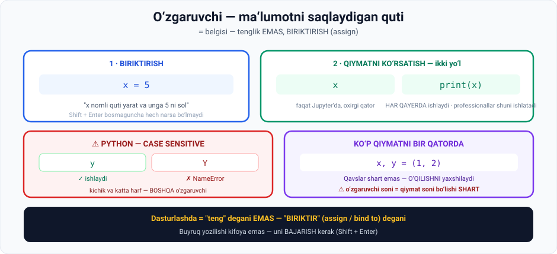

# 1-dars. Python o'zgaruvchilari

## 🎬 Boshlashdan oldin

> **"Barmoqlaringizni isiting. Bu darsda biz KOD YOZISHNI boshlaymiz."**

Bu — kursning **birinchi haqiqiy kod** darsi.

---

## 1. O'zgaruvchi nima

> **Dasturlashdagi asosiy tushunchalardan biri — O'ZGARUVCHILAR.**
>
> ## **Ular sizning eng yaxshi do'stlaringiz. Siz ular bilan DOIM ishlaysiz.**
>
> **Siz ulardan AXBOROTNI SAQLASH uchun foydalanasiz. Ular sizning MA'LUMOT KIRISHINGIZNI ifodalaydi.**



---

## 2. Birinchi o'zgaruvchi

**Vazifa:** `x` o'zgaruvchisi 5 ga teng bo'lsin, keyin kompyuterdan uning qiymatini so'raymiz.

```python
x = 5
```

### 🔑 Muhim tushuncha

> **Dasturlash jarayonidan o'tish uchun: `x = 5` deydigan qator BUYRUQ yoki DASTUR deb ataladi.**
>
> **Bu shunchaki matn qatori.**
>
> ## **Undan nimadir chiqarish uchun uni BAJARISHIMIZ kerak.**
>
> **Faqat shundan keyin kompyuter u bilan amallar bajaradi.**

**Bajarish:**

> **`Shift + Enter` bosing — faqat Enter emas** — va `x` nomli o'zgaruvchi yaratiladi hamda unga 5 qiymati biriktiriladi.

### ⚠️ `=` belgisi nimani anglatadi

> ## **Aniqroq aytganda, Python'da va dasturlashda TENGLIK — bu "BIRIKTIR" yoki "BOG'LA" (assign / bind to) degani.**

> 💡 Matematikada `x = 5` — bu **fakt**. Dasturlashda `x = 5` — bu **buyruq**: *"x nomli quti yarat va unga 5 ni sol"*.

---

## 3. Qiymatni ko'rsatish

> **Biz bu amalni bajardik, lekin hozir hech narsa ko'rmayapmiz.**
>
> **Kompyuterdan hozirgina qilgan ishimizning natijasini ko'rsatishni qanday so'raymiz?**

**Yetarli:** `x` deb yozib, `Shift + Enter` bosish.

```python
x
```

```
5
```

---

## 4. ⚠️ Python — case sensitive

Endi `y` ga 8 qiymatini beramiz:

```python
y = 8
```

Tekshiramiz — lekin **katta harf** bilan:

```python
Y
```

```
NameError: name 'Y' is not defined
```

> ## **Bu bizga Python CASE SENSITIVE ekanini ko'rsatadi.**
>
> **Shuning uchun bunga e'tibor bering. Kichik yoki katta harf ishlatishingiz MUHIM.**

| Yozuv | Natija |
|---|---|
| `y` | ✅ `8` |
| `Y` | ❌ `NameError` |

> 🧠 Python uchun `y` va `Y` — **ikkita butunlay boshqa** o'zgaruvchi.

---

## 5. `print` buyrug'i

> **`y` ga bergan qiymatimizni beradigan ko'rsatmani bajarishning MUQOBIL yo'li — `print` buyrug'idan foydalanish.**

```python
print(y)
```

```
8
```

### Nima uchun `print` kerak

> **Birinchi qarashda u ORTIQCHA tuyuladi, chunki biz shunchaki `y` yozishimiz mumkinligini ko'rsatdik.**
>
> **Shunga qaramay, bu buyruq TEZ-TEZ QO'LLANILADI.**
>
> ## **Siz uni professionallar ishlab chiqargan kodning KO'PCHILIGIDA ko'rasiz.**
>
> **U ko'rsatmalaringizning mantiqiy oqimini to'ldiradi.**

> **Masalan, `print(y)` desak, mashina bu buyruqni bajaradi va `y` qiymatini BAYONOT sifatida beradi.**
>
> **Va ba'zan dasturchi ko'rishi kerak bo'lgan narsa shu.**

### 📌 Muhim amaliy farq

| | `x` (yalang'och) | `print(x)` |
|---|---|---|
| **Jupyter yacheykasida** | ✅ Ishlaydi | ✅ Ishlaydi |
| **Yacheykada bir necha qator bo'lsa** | ❌ Faqat **oxirgisi** ko'rinadi | ✅ **Hammasi** ko'rinadi |
| **`.py` faylda** | ❌ **Hech narsa ko'rinmaydi** | ✅ Ishlaydi |
| **Professional kodda** | Kam | ✅ **Doim** |

```python
# Jupyter yacheykasida:
x = 5
y = 8
x        # ← bu KO'RINMAYDI
y        # ← faqat bu ko'rinadi  →  8

# print bilan:
print(x)  # →  5
print(y)  # →  8
```

---

## 6. Bir qatorda bir necha o'zgaruvchi

> **Bu ma'ruzada ulashmoqchi bo'lgan oxirgi narsa: siz MA'LUM SONDAGI QIYMATNI XUDDI SHUNCHA o'zgaruvchiga biriktirishingiz mumkin.**

```python
x, y = (1, 2)
```

```python
x     # → 1
y     # → 2
```

### Qavslar haqida

> **Bu yerdagi qavslar MAJBURIY EMAS, lekin biz ulardan kodimizning O'QILISHINI YAXSHILASH uchun foydalanamiz.**

```python
# Ikkalasi ham ishlaydi:
a, b, c, d = (10, 20, 30, 40)
a, b, c, d = 10, 20, 30, 40
```

### ⚠️ Muhim qoida

> ## **O'sha qatordagi O'ZGARUVCHILAR SONI QIYMATLAR SONIGA TENG bo'lishi juda muhim.**
>
> **Aks holda siz xato xabarini olasiz.**

```python
x, y = (1, 2, 3)
```

```
ValueError: too many values to unpack (expected 2)
```

---

## 7. 💻 To'liq kod — o'zingiz sinang

```python
# 1 · Oddiy biriktirish
x = 5
print(x)

# 2 · Ikkinchi o'zgaruvchi
y = 8
print(y)

# 3 · Case sensitivity — bu XATO beradi
# print(Y)      # NameError: name 'Y' is not defined

# 4 · Ko'p qiymatni bir qatorda
x, y = (1, 2)
print(x, y)

# 5 · To'rtta o'zgaruvchi
a, b, c, d = 10, 20, 30, 40
print(b, d)

# 6 · Bu XATO beradi — sonlar mos kelmaydi
# x, y = (1, 2, 3)   # ValueError
```

**Natija:**

```
5
8
1 2
20 40
```

---

## 8. 📝 Rasmiy mashqlar (kursdan)

> Bu mashqlar kursning `_Exercises.ipynb` faylidan olingan.

### Mashq 1
**`x` nomli o'zgaruvchi yarating va unga 10 qiymatini bering. Bajaring.**

<details>
<summary>✅ Yechim</summary>

```python
x = 10
```

</details>

### Mashq 2
**Kompyuterga o'sha o'zgaruvchining qiymatini ko'rsatishni ayting.**

<details>
<summary>✅ Yechim</summary>

```python
x
```
```
10
```

</details>

### Mashq 3
**Xuddi shu natijani olishning ikkinchi yo'lini o'ylab topa olasizmi?**

<details>
<summary>✅ Yechim</summary>

```python
print(x)
```
```
10
```

</details>

### Mashq 4
**Bitta qatorda to'rtta yangi o'zgaruvchi yarating: `a`, `b`, `c` va `d` — mos ravishda 10, 20, 30 va 40 ga teng.**

<details>
<summary>✅ Yechim</summary>

```python
a, b, c, d = (10, 20, 30, 40)
```

Muqobil:

```python
a, b, c, d = 10, 20, 30, 40
```

</details>

### Mashq 5
**Kompyuterga `b` o'zgaruvchisiga mos qiymatni ko'rsatishni ayting.**

<details>
<summary>✅ Yechim</summary>

```python
b        # → 20
```

Yoki:

```python
print(b)  # → 20
```

</details>

### Mashq 6
**`d` uchun ham xuddi shunday qiling.**

<details>
<summary>✅ Yechim</summary>

```python
d        # → 40
```

Yoki `print(d)`.

</details>

---

## 9. ⚡ Qo'shimcha mashqlar

### 🟢 Oson

**M1.** `ism` o'zgaruvchisiga o'z ismingizni, `yosh` ga yoshingizni bering va ikkalasini chop eting.

**M2.** Uchta o'zgaruvchini **bitta qatorda** yarating: `uzunlik`, `kenglik`, `balandlik` — mos ravishda 5, 3, 2.

**M3.** `narx` o'zgaruvchisiga 15000 bering. Keyin unga **yangi qiymat** 20000 bering. Chop eting. Nima ko'rasiz?

<details>
<summary>✅ Yechimlar</summary>

```python
# M1
ism = "Ilhom"
yosh = 25
print(ism)
print(yosh)

# M2
uzunlik, kenglik, balandlik = 5, 3, 2
print(uzunlik, kenglik, balandlik)      # 5 3 2

# M3
narx = 15000
narx = 20000
print(narx)                              # 20000
```

**M3 saboqi:** o'zgaruvchiga yangi qiymat berilsa — **eskisi yo'qoladi**. Quti bitta, ichidagi almashadi.

</details>

### 🟡 O'rta

**M4.** Ikkita o'zgaruvchi yarating: `a = 5`, `b = 10`. Endi ularning **qiymatlarini almashtiring** (a=10, b=5 bo'lsin) — **bitta qatorda**.

**M5.** Quyidagi kodda **3 ta xato** bor. Toping va tuzating:
```python
Ism = "Ali"
yosh = 20
print(ism)
print(Yosh)
x, y = (1, 2, 3)
```

<details>
<summary>✅ Yechimlar</summary>

```python
# M4 — Python'ning eng chiroyli xususiyatlaridan biri
a, b = 5, 10
a, b = b, a
print(a, b)      # 10 5
```

```python
# M5 — tuzatilgan
ism = "Ali"          # 1-xato: Ism → ism (yoki pastda Ism yozish)
yosh = 20
print(ism)
print(yosh)          # 2-xato: Yosh → yosh
x, y = (1, 2)        # 3-xato: 3 ta qiymat, 2 ta o'zgaruvchi
```

</details>

### 🔴 Qiyin

**M6.** Do'kon uchun kod yozing: 3 ta mahsulot nomi va narxi (jami 6 ta o'zgaruvchi) — **ikki qatorda** yarating. Keyin har birini alohida chop eting.

<details>
<summary>✅ Yechim</summary>

```python
m1, m2, m3 = "Non", "Sut", "Guruch"
n1, n2, n3 = 5000, 12000, 18000

print(m1, n1)
print(m2, n2)
print(m3, n3)
```

```
Non 5000
Sut 12000
Guruch 18000
```

</details>

---

## 10. 🧠 O'zini tekshirish savollari

1. O'zgaruvchilar nima uchun kerak?
2. `x = 5` qatori nima deb ataladi?
3. Uni bajarish uchun nima bosish kerak?
4. Dasturlashda `=` nimani anglatadi?
5. Qiymatni ko'rsatishning ikki yo'lini ayting.
6. Python case sensitive mi? Buni qanday isbotlash mumkin?
7. `print` nima uchun kerak, agar `x` ham ishlasa?
8. Bir qatorda bir necha o'zgaruvchi qanday yaratiladi?
9. Qavslar majburiymi?
10. Qanday qoidaga rioya qilish shart?

<details>
<summary>✅ Javoblar</summary>

1. **Axborotni saqlash** uchun; ular **ma'lumot kirishini** ifodalaydi.
2. **Buyruq (command)** yoki **dastur (program)**.
3. **`Shift + Enter`** — faqat Enter emas.
4. **"Biriktir" yoki "bog'la"** (assign / bind to) — tenglik emas.
5. (a) Shunchaki **`x`** yozish; (b) **`print(x)`**.
6. **Ha.** `y` ishlaydi, `Y` esa **NameError** beradi.
7. U **tez-tez qo'llaniladi**, professionallar kodining **ko'pchiligida** uchraydi va **ko'rsatmalar mantiqiy oqimini to'ldiradi**. Bundan tashqari, `.py` faylda **faqat u** ishlaydi.
8. O'zgaruvchilar va qiymatlarni **vergul bilan** ajratib: `x, y = (1, 2)`.
9. **Yo'q** — lekin ular kodning **o'qilishini yaxshilaydi**.
10. **O'zgaruvchilar soni qiymatlar soniga TENG** bo'lishi shart.

</details>

---

## 📌 Xulosa

```python
x = 5              # BIRIKTIRISH (assign), tenglik emas
                   # Shift + Enter bilan BAJARILADI

x                  # ko'rsatish — Jupyter'da, oxirgi qator
print(x)           # ko'rsatish — HAR QAYERDA, professional yo'l

y  ≠  Y            # ⚠️ CASE SENSITIVE

x, y = (1, 2)      # ko'p qiymat bir qatorda
                   # qavslar ixtiyoriy, o'qish uchun
                   # ⚠️ o'zgaruvchi soni = qiymat soni
```

---

## 🔖 Atamalar

| Atama | Inglizcha | Izoh |
|---|---|---|
| O'zgaruvchi | *variable* | Ma'lumot saqlaydigan nom |
| Biriktirish | *assign / bind* | Qiymat berish |
| Buyruq | *command* | Bajarilishi kerak bo'lgan qator |
| Bajarish | *execute* | Kodni ishga tushirish |
| Case sensitive | *case sensitive* | Katta-kichik harfni farqlaydigan |
| `print` | *print* | Qiymatni chop etish funksiyasi |
| Bayonot | *statement* | Chop etilgan natija |

---

🏠 [Modul boshiga](README.md) · ➡️ [Keyingi: Kodlash mashqlari haqida](02-Python-Coding-Exercises.md)
