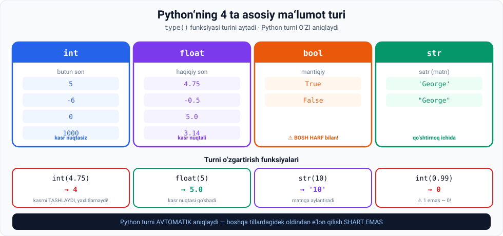

# 3-dars. Ma'lumot turlari — sonlar va Boolean qiymatlar

## 🎬 Boshlashdan oldin

> **"Faqat Python'da emas, dasturlashda umuman: agar o'zgaruvchi SONLI qiymatga ega desangiz — siz NOANIQ gapiryapsiz."**

Nima uchun? Chunki `5` va `5.0` — Python uchun **ikki xil narsa**.

---

## 1. Sonlarning ikki turi

> **Sabab shundaki, sonlar INTEGER yoki FLOATING POINT (qisqacha FLOAT) bo'lishi mumkin.**



---

## 2. `int` — butun sonlar

> **Masalan, integerlar — KASR NUQTASIZ musbat yoki manfiy BUTUN sonlar.**

```python
x1 = 5
```

> **Endi `x1` — integer. Rozimisiz?**

### `type()` funksiyasi

> **Python'dagi maxsus funksiya buning to'g'ri ekanini isbotlay oladi. U `type` deb ataladi.**
>
> **Qavslar ichiga qiymati turini tekshirmoqchi bo'lgan o'zgaruvchi nomini qo'yishimiz kerak.**

```python
type(x1)
```

```
int
```

> **Va biz olgan natija — `int`, bu qiymat integer ekanini bildiradi.**

### Qiymatga to'g'ridan-to'g'ri

> **`type` funksiyasini o'zgaruvchi o'rniga to'g'ridan-to'g'ri QIYMATGA ham qo'llash mumkin.**

```python
type(-6)
```

```
int
```

> **Python `-6` integer ekanini to'g'ri ko'rsatadi.**

---

## 3. `float` — haqiqiy sonlar

```python
x2 = 4.75
type(x2)
```

```
float
```

> **Floating point yoki ko'proq eshitadiganingizdek FLOAT lar — HAQIQIY sonlar.**
>
> **Shuning uchun ularda KASR NUQTASI bor.**
>
> **`4.75` — shunday son. Shuning uchun Python uni float deb o'qiydi.**

---

## 4. Turni o'zgartirish

> **Yana ikkita ichki funksiyani ko'raylik.**

### `int()`

> **`int` o'zgaruvchini INTEGERGA aylantiradi.**
>
> **Shuning uchun `4.75` to'rtga aylanadi.**

```python
int(4.75)
```

```
4
```

> ⚠️ **DIQQAT:** `int()` **yaxlitlamaydi** — u kasr qismini **tashlab yuboradi**.
>
> ```python
> int(4.75)   # → 4   (5 emas!)
> int(0.99)   # → 0   (1 emas!)
> int(9.99)   # → 9
> ```
>
> Bu — boshlovchilarning **eng ko'p yo'l qo'yadigan xatosi**.

### `float()`

> **`float` esa integer qiymatga KASR NUQTASINI qo'shadi va uni floatga aylantiradi.**

```python
float(5)
```

```
5.0
```

---

## 5. `bool` — mantiqiy qiymatlar

> **Barcha o'zgaruvchilar sonli qiymatlarni qabul qilishi shart emas.**
>
> **Bunday turdagi qiymatga misol — BOOLEAN turi.**

### Ma'nosi

> **Python'da bu TRUE yoki FALSE qiymatini anglatadi** — bu **mashinaning bir va nollarni tushunish mantiqiga** mos keladi:
>
> **yoqilgan yoki o'chirilgan · to'g'ri yoki noto'g'ri · rost yoki yolg'on.**

*(10-modulning 1-darsini eslang: kompyuter — yorug'lik kaliti.)*

```python
x3 = True
type(x3)
```

```
bool
```

### ⚠️ Eng muhim tafsilot

> **Eslashingiz kerak bo'lgan muhim tafsilot: siz `True` yoki `False` ni BOSH HARFLAR bilan yozishingiz kerak.**
>
> **Aks holda Python o'zgaruvchingizni boolean deb tanimaydi va xato xabarini ko'rsatadi.**

```python
x3 = True     # ✅
x3 = true     # ❌ NameError: name 'true' is not defined
```

> **Xulosa qilib aytganda: o'zgaruvchi ega bo'lishi mumkin bo'lgan ikkita boolean qiymat — `True` va `False`, va ular BOSH HARF bilan yozilishi kerak.**

---

## 6. 💻 To'liq kod — o'zingiz sinang

```python
# ===== INT =====
x1 = 5
print(type(x1))          # <class 'int'>
print(type(-6))          # <class 'int'>

# ===== FLOAT =====
x2 = 4.75
print(type(x2))          # <class 'float'>

# ===== TURNI O'ZGARTIRISH =====
print(int(x2))           # 4     ← kasr TASHLANADI
print(float(5))          # 5.0
print(int(0.99))         # 0     ← ⚠️ 1 emas!

# ===== BOOL =====
x3 = True
print(type(x3))          # <class 'bool'>
print(type(False))       # <class 'bool'>

# Bu XATO beradi:
# x3 = true              # NameError
```

### ⚠️ Jupyter va skript farqi

| Qayerda | `type(x1)` | `print(type(x1))` |
|---|---|---|
| **Jupyter** (oxirgi qator) | `int` | `<class 'int'>` |
| **`.py` skript** | hech narsa | `<class 'int'>` |

Ikkalasi ham **bir xil ma'noni** bildiradi — faqat ko'rinishi farq qiladi.

---

## 7. 📝 Rasmiy mashqlar (kursdan)

### Mashq 1
**`True` ga teng o'zgaruvchi yarating.**

<details>
<summary>✅ Yechim</summary>

```python
a = True
```

</details>

### Mashq 2
**Uning turini tekshiring.**

<details>
<summary>✅ Yechim</summary>

```python
type(a)
```
```
bool
```

</details>

### Mashq 3
**99 ga teng o'zgaruvchi yarating.**

<details>
<summary>✅ Yechim</summary>

```python
b = 99
```

</details>

### Mashq 4
**Uning turini tekshiring.**

<details>
<summary>✅ Yechim</summary>

```python
type(b)
```
```
int
```

</details>

### Mashq 5
**`0.99` qiymatining turini tekshiring.**

<details>
<summary>✅ Yechim</summary>

```python
type(0.99)
```
```
float
```

</details>

### Mashq 6
**99 ni *float* ga aylantiring.**

<details>
<summary>✅ Yechim</summary>

```python
float(b)
```
```
99.0
```

</details>

### Mashq 7
**`0.99` ni integerga aylantiring. Qanday qiymat oldingiz?**

<details>
<summary>✅ Yechim</summary>

```python
int(0.99)
```
```
0
```

⚠️ **`1` emas, `0`!** Chunki `int()` **yaxlitlamaydi** — kasr qismini **tashlab yuboradi**.

</details>

---

## 8. ⚡ Qo'shimcha mashqlar

### 🟢 Oson

**M1.** Quyidagilarning turini aniqlang (avval **o'ylab ko'ring**, keyin tekshiring):
```python
type(100)
type(100.0)
type(-3)
type(0)
type(True)
type(False)
```

**M2.** `narx = 15000` va `chegirma = 0.15` yarating. Ikkalasining turini chop eting.

**M3.** `int(7.99)`, `int(7.01)`, `int(-7.99)` natijalarini **taxmin qiling**, keyin tekshiring.

<details>
<summary>✅ Yechimlar</summary>

```python
# M1
type(100)     # int
type(100.0)   # float   ← .0 bor, demak float!
type(-3)      # int
type(0)       # int
type(True)    # bool
type(False)   # bool

# M2
narx = 15000
chegirma = 0.15
print(type(narx))       # <class 'int'>
print(type(chegirma))   # <class 'float'>

# M3
int(7.99)     # 7
int(7.01)     # 7
int(-7.99)    # -7     ← ⚠️ -8 emas! Nolga qarab qisqartiradi
```

</details>

### 🟡 O'rta

**M4.** `5 / 2` va `5 // 2` natijalarini va **turlarini** solishtiring. Farqi nima?

**M5.** Quyidagi kodda xato bor. Toping:
```python
javob = true
print(type(javob))
```

**M6.** Bir necha turni **bitta qatorda** yarating va turlarini chop eting:
```python
son, kasr, mantiq = ?, ?, ?
```

<details>
<summary>✅ Yechimlar</summary>

```python
# M4
print(5 / 2,  type(5 / 2))     # 2.5  <class 'float'>   ← oddiy bo'lish
print(5 // 2, type(5 // 2))    # 2    <class 'int'>     ← butun bo'lish
# Farq: / doim float qaytaradi, // butun qismni qaytaradi

# M5 — tuzatilgan
javob = True                   # true → True (bosh harf!)
print(type(javob))             # <class 'bool'>

# M6
son, kasr, mantiq = 42, 3.14, True
print(type(son), type(kasr), type(mantiq))
# <class 'int'> <class 'float'> <class 'bool'>
```

</details>

### 🔴 Qiyin

**M7.** `True` va `False` ni **sonlar bilan qo'shib** ko'ring:
```python
print(True + True)
print(True + 5)
print(False + 10)
```
Natijani tushuntiring.

**M8.** Do'kon uchun: narx `12500.75`. Uni **butun so'mga** aylantirishning **ikki yo'lini** toping — biri kasrni tashlaydi, biri yaxlitlaydi.

<details>
<summary>✅ Yechimlar</summary>

```python
# M7
print(True + True)     # 2
print(True + 5)        # 6
print(False + 10)      # 10
```

**Tushuntirish:** Python'da `True` = **1**, `False` = **0**. Boolean — bu aslida **int** ning maxsus turi. Bu keyingi modullarda juda foydali bo'ladi (masalan, `sum()` bilan `True` larni sanash).

```python
# M8
narx = 12500.75
print(int(narx))          # 12500   ← kasrni TASHLAYDI
print(round(narx))        # 12501   ← YAXLITLAYDI
```

**Qachon qaysi biri:** chek yozganda — `round()`. Do'konda mahsulot **sonini** hisoblaganda — `int()`.

</details>

---

## 9. 🧠 O'zini tekshirish savollari

1. Nima uchun "sonli qiymat" deyish noaniq?
2. Integer nima? Misol keltiring.
3. `type()` funksiyasi nima qiladi? Uni nimaga qo'llash mumkin?
4. Float nima? Uni integerdan qanday ajratasiz?
5. `int()` funksiyasi nima qiladi? U yaxlitlaydimi?
6. `int(4.75)` nima beradi? `int(0.99)`-chi?
7. `float()` nima qiladi?
8. Boolean nima va u nimaga mos keladi?
9. Boolean ning ikki qiymati qanday yoziladi?
10. `true` deb yozsangiz nima bo'ladi?

<details>
<summary>✅ Javoblar</summary>

1. Chunki sonlar **integer** yoki **float** bo'lishi mumkin.
2. **Kasr nuqtasiz musbat yoki manfiy butun son.** Masalan `5`, `-6`, `0`.
3. Qiymat yoki o'zgaruvchining **turini** ko'rsatadi. **O'zgaruvchiga** ham, **qiymatga** ham qo'llanadi.
4. **Haqiqiy son** — unda **kasr nuqtasi** bor. `4.75` — float, `5` — int.
5. Qiymatni **integerga aylantiradi**. **Yaxlitlamaydi** — kasrni **tashlaydi**.
6. `int(4.75)` → **4**; `int(0.99)` → **0**.
7. Integer qiymatga **kasr nuqtasi qo'shadi** va uni **floatga** aylantiradi.
8. **`True` yoki `False` qiymati** — mashinaning **1 va 0** ni tushunish mantiqiga mos: yoqilgan/o'chirilgan, to'g'ri/noto'g'ri.
9. **`True`** va **`False`** — **bosh harf** bilan.
10. **`NameError`** — Python uni boolean deb tanimaydi.

</details>

---

## 📌 Xulosa

```
int      5, -6, 0          butun son, kasr nuqtasiz
float    4.75, 5.0         haqiqiy son, kasr nuqtali
bool     True, False       ⚠️ BOSH HARF bilan!

type(x)      →  turini aytadi (o'zgaruvchiga ham, qiymatga ham)

int(4.75)    →  4      ⚠️ TASHLAYDI, yaxlitlamaydi
int(0.99)    →  0      ⚠️ 1 emas!
float(5)     →  5.0

Bonus:  True = 1,  False = 0
```

---

## 🔖 Atamalar

| Atama | Inglizcha | Izoh |
|---|---|---|
| Butun son | *integer (int)* | Kasr nuqtasiz son |
| Haqiqiy son | *float* | Kasr nuqtali son |
| Mantiqiy qiymat | *boolean (bool)* | `True` yoki `False` |
| Ichki funksiya | *built-in function* | Python'da tayyor funksiya |
| Turni o'zgartirish | *type conversion* | Bir turdan boshqasiga |
| Yaxlitlash | *rounding* | Eng yaqin butunga keltirish |
| Qisqartirish | *truncation* | Kasr qismini tashlash |

---

⬅️ [Oldingi: Kodlash mashqlari](02-Python-Coding-Exercises.md) · ➡️ [Keyingi: Satrlar](04-Strings.md)
