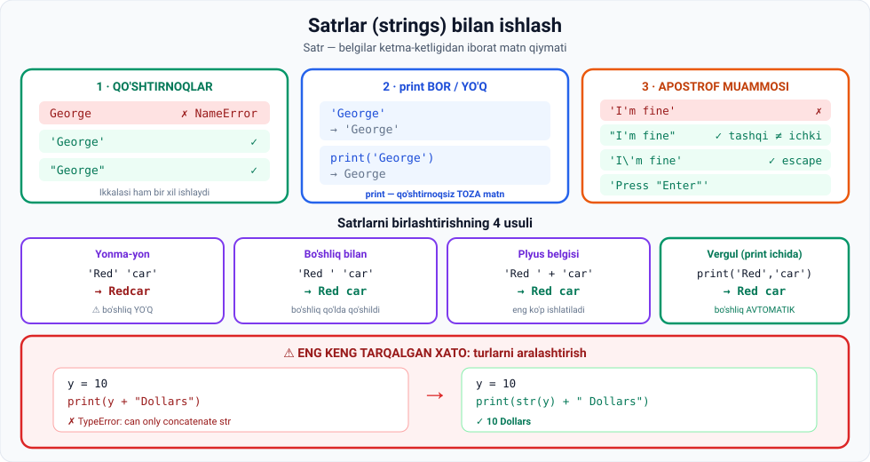

# 4-dars. Ma'lumot turlari — satrlar (Strings)

## 🎬 Boshlashdan oldin

Bu — 12-modulning **eng katta va eng amaliy** darsi.

> Sonlar bilan hisoblaysiz. **Satrlar bilan esa odamlar bilan gaplashasiz** — xabarlar, hisobotlar, chatbot javoblari. Hammasi satr.

---

## 1. Satr nima

> ## **Satrlar — BELGILAR KETMA-KETLIGIDAN iborat MATN QIYMATLARI.**



---

## 2. Qo'shtirnoqlarning ahamiyati

### ❌ Qo'shtirnoqsiz

```python
George
```

```
NameError: name 'George' is not defined
```

> **Nima uchun? Chunki Python `George` — biz hech qanday qiymat bermagan O'ZGARUVCHI nomi deb taxmin qiladi.**

### ✅ Qo'shtirnoq bilan

> **Mana xatoni tuzatadigan sehrli usul.**

```python
'George'      # bitta qo'shtirnoq
"George"      # ikkita qo'shtirnoq
```

```
'George'
'George'
```

> **Ko'ryapsizmi, bu ikki kirishning chiqish qiymatlari BIR XIL.**

---

## 3. `print` bilan va `print`siz

> **Python matn natijalarini shunday ko'rsatadi — agar siz `print` buyrug'idan foydalanmasangiz.**
>
> **`print` ishlatsangiz? Natija QO'SHTIRNOQSIZ ko'rsatiladi. Siz TOZA MATNNI ko'ra olasiz.**

| Kod | Natija |
|---|---|
| `'George'` | `'George'` — qo'shtirnoq bilan |
| `print('George')` | `George` — toza matn |

**O'zgaruvchiga biriktirish:**

```python
x4 = "George"
x4
```

```
'George'
```

> **Biz uning natijasini integer va floatlar bilan qilganimizdek olishimiz mumkin.**

---

## 4. ⚠️ Turlarni aralashtirish — eng katta xato

**Vazifa:** `y` — cho'ntagingizdagi dollar soni. `"Y Dollars"` deb chop etmoqchisiz.

### ❌ Xato yo'l

```python
y = 10
print(y + "Dollars")
```

```
TypeError: unsupported operand type(s) for +: 'int' and 'str'
```

> **Ko'rinishidan biz Python'da kodlash qoidalariga rioya qilmadik.**
>
> ## **Biz TURLI TURDAGI o'zgaruvchilarni BIR IFODAGA qo'ya olmaymiz.**
>
> **`y` — integer, `Dollars` — satr.**

### ✅ To'g'ri yo'l — `str()`

> **Biz `y` ni satrga aylantira olamiz.**
>
> **`str` — bizga kerak bo'lgan ichki funksiya, integer va floatlarga o'xshab.**
>
> **`str` bizning sonimizni matnga aylantiradi va bu natijamizni ochib beradi.**

```python
y = 10
print(str(y) + " Dollars")
```

```
10 Dollars
```

---

## 5. 🔑 Python turni o'zi biladi

> **Hozirgacha aytganlarimizni umumlashtirsak: Python siz kiritayotgan ma'lumot turini AVTOMATIK taxmin qila oladi.**
>
> **Siz integer, float, boolean yoki satr biriktirganingizni aniq bilish uning imkoniyatlari doirasida.**
>
> ## **Siz o'zgaruvchi turlarini OCHIQ-OYDIN E'LON QILISHINGIZ SHART EMAS** — ba'zi boshqa dasturlash tillarida buni qilish kerak.
>
> **Python doim o'zgaruvchi turini biladi.**

> 💡 Masalan, Java'da shunday yozish kerak: `int y = 10;`. Python'da esa faqat `y = 10`.

---

## 6. Apostrof muammosi

**Nima bo'ladi, agar `I'm fine` deb yozsangiz?**

> **Sizga ingliz sintaksisida APOSTROF kerak, lekin pythonic sintaksisda emas.**

### ❌ Xato

```python
'I'm fine'
```

```
SyntaxError
```

### ✅ Yechim 1 — turli qo'shtirnoqlar

> **Bunday vaziyatlarda siz ikki simvolni FARQLASHINGIZ mumkin.**
>
> **Matnni IKKITA qo'shtirnoq ichiga oling va `I` bilan `m` orasidagi apostrofni qoldiring** — u texnik jihatdan bitta qo'shtirnoqqa mos keladi.

```python
"I'm fine"
```

```
"I'm fine"
```

### ✅ Yechim 2 — escape belgisi

> **Buni qilishning MUQOBIL yo'li — chetlarda qo'shtirnoqlarni qoldirib, ibora ichidagi apostrof oldiga TESKARI CHIZIQ (backslash) qo'yish.**
>
> **Biz baribir xuddi shu to'g'ri natijani olamiz.**

```python
'I\'m fine'
```

```
"I'm fine"
```

### 📖 Escape belgisi nima

> ## **Bu backslash ESCAPE CHARACTER deb ataladi** — chunki u **o'zidan keyin darrov keladigan belgilarning TALQININI O'ZGARTIRADI.**

---

## 7. Teskari holat: `Press "Enter"`

> **Va nima qilamiz, agar `Press "Enter"` deb yozmoqchi bo'lsak** — bu yerda `Enter` **ikkita qo'shtirnoq** ichida?
>
> ## **Xuddi shu mantiq: TASHQI simvollar ICHKIsidan FARQ QILISHI kerak.**
>
> **Chetlarga bitta qo'shtirnoq qo'ying va kerakli natijani oldingiz.**

```python
'Press "Enter"'
```

```
'Press "Enter"'
```

### 📋 Qoida

| Ichkarida nima bor | Tashqarida nima ishlatiladi |
|---|---|
| Apostrof `'` | **Ikkita** qo'shtirnoq `"` |
| Ikkita qo'shtirnoq `"` | **Bitta** qo'shtirnoq `'` |
| Ikkalasi ham | **Escape** `\` |

---

## 8. Satrlarni birlashtirishning 4 usuli

**Vazifa:** `Red car` ni bitta qatorda chop etish.

### 1-usul — yonma-yon (bo'shliqsiz)

```python
'Red' 'car'
```

```
'Redcar'
```

> **Ikki so'z bir-birining yonida, bo'sh joy bilan ajratilgan — men ularni YOPISHGAN holda ko'raman.**

### 2-usul — bo'shliqni qo'lda qo'shish

> **Bir hiyla — birinchi so'zning ikkinchi apostrofidan oldin BO'SH JOY qo'yish.**

```python
'Red ' 'car'
```

```
'Red car'
```

### 3-usul — plyus belgisi

> **Yana bir texnika — bitta satrni boshqasiga QO'SHISH** — ikkalasi orasiga **plyus belgisini** yozish orqali, xuddi bir daqiqa oldin **10 dollar** misolida qilganimizdek.

```python
'Red ' + 'car'
```

```
'Red car'
```

**`print` bilan:**

```python
print('Red ' + 'car')
```

```
Red car
```

> **Intuitsiyangiz aytganidek, agar bu kombinatsiyani `print` qilsangiz — xuddi shu natijani olasiz, lekin ikki tomonida QO'SHTIRNOQ bo'lmaydi.**

### 4-usul — ⭐ vergul (trailing comma)

> **Va mana yangi hiyla.**
>
> **Men `print('Red')` yozib, keyin VERGUL qo'yaman** — bu **TRAILING COMMA** deb ataladi —
>
> **va Python keyingi so'z `car` ni XUDDI SHU QATORDA chop etadi, ikki so'zni BO'SH JOY bilan ajratib.**

```python
print('Red', 'car')
```

```
Red car
```

> 💡 **Bu — eng qulay usul.** Bo'shliq **avtomatik** qo'shiladi va **`str()` kerak emas**:
>
> ```python
> y = 10
> print(y, "Dollars")      # ✅ 10 Dollars  — str() SHART EMAS!
> print(str(y) + " Dollars")  # ✅ bir xil natija, lekin uzunroq
> ```

---

## 9. Sonlar bilan ham ishlaydi

```python
print(3, 5)
```

```
3 5
```

**`print`siz nima bo'ladi?**

> **Python buyruqni kutilganidek bajaradi, lekin qiymatlarni QAVSLAR ichiga joylashtiradi.**

```python
3, 5, 'salom'
```

```
(3, 5, 'salom')
```

> 📌 Bu — **tuple** (kortej). Uni **17-modulda** o'rganamiz.

---

## 10. 💻 To'liq kod

```python
# ===== QO'SHTIRNOQLAR =====
print('George')
print("George")

x4 = "George"
print(x4)

# ===== TURLARNI ARALASHTIRMASLIK =====
y = 10
# print(y + "Dollars")        # ❌ TypeError
print(str(y) + " Dollars")     # ✅ 10 Dollars
print(y, "Dollars")            # ✅ 10 Dollars — osonroq!

# ===== APOSTROF =====
print("I'm fine")              # turli qo'shtirnoqlar
print('I\'m fine')             # escape belgisi
print('Press "Enter"')         # teskari holat

# ===== BIRLASHTIRISH — 4 usul =====
print('Red' 'car')             # Redcar    ⚠️ bo'shliqsiz
print('Red ' 'car')            # Red car
print('Red ' + 'car')          # Red car
print('Red', 'car')            # Red car   ⭐ eng qulay

# ===== SONLAR =====
print(3, 5)                    # 3 5
```

**Natija:**

```
George
George
George
10 Dollars
10 Dollars
I'm fine
I'm fine
Press "Enter"
Redcar
Red car
Red car
Red car
3 5
```

---

## 11. 📝 Rasmiy mashqlar (kursdan)

### Mashq 1
**`m` o'zgaruvchisiga 100 qiymatini bering.**

<details>
<summary>✅ Yechim</summary>

```python
m = 100
```

</details>

### Mashq 2
**`m` o'zgaruvchisi yordamida bitta kod qatori yozing — bajarilgandan keyingi natija `100 days` bo'lsin.**
> *Ilgak: bu savolga TO'RTTA javob berish mumkin!*

<details>
<summary>✅ Yechim — 4 variant</summary>

```python
print(str(m), 'days')
print(str(m), "days")
print(str(m) + ' days')
print(str(m) + " days")
```

Barchasi: `100 days`

**Bonus (kursda yo'q, lekin ishlaydi):**
```python
print(m, 'days')     # str() ham kerak emas!
```

</details>

### Mashq 3
**`It's cool, isn't it?` ga teng natija chiqaring.**

<details>
<summary>✅ Yechim — 3 variant</summary>

```python
print('It\'s cool, isn\'t it?')
print("It's cool, isn't it?")
print("It\'s cool, isn\'t it?")
```

</details>

### Mashq 4
**Quyidagi satrni tuzating:**
```python
'Don't be shy
```

<details>
<summary>✅ Yechim</summary>

```python
"Don't be shy"
```

Ikki muammo bor edi: (a) apostrof ichkarida, (b) yopuvchi qo'shtirnoq yo'q.

</details>

### Mashq 5
**`Click "OK"` ga teng natija chiqaring.**

<details>
<summary>✅ Yechim</summary>

```python
print('Click "OK"')
```

</details>

### Mashq 6
**`'Big Houses'` ni chiqarish uchun kodingizga PLYUS belgisini qo'shing.**

<details>
<summary>✅ Yechim</summary>

```python
'Big ' + 'Houses'
```

Yoki:

```python
'Big' + ' Houses'
```

</details>

### Mashq 7
**`Big Houses` ni chiqarish uchun kodingizga VERGUL qo'shing.**

<details>
<summary>✅ Yechim</summary>

```python
print('Big', 'Houses')
```

</details>

---

## 12. ⚡ Qo'shimcha mashqlar

### 🟢 Oson

**M1.** `ism` va `familiya` o'zgaruvchilarini yarating. Ularni **uch xil usulda** birlashtirib chop eting.

**M2.** `yosh = 25`. `"Men 25 yoshdaman"` deb chop eting — **ikki xil usulda**.

**M3.** Quyidagi satrlarni to'g'ri yozing:
```
a) O'zbekiston — bu mening vatanim      (apostrof bor)
b) U "salom" dedi                        (qo'shtirnoq bor)
c) It's a "big" day                      (ikkalasi ham bor)
```

<details>
<summary>✅ Yechimlar</summary>

```python
# M1
ism = "Ilhom"
familiya = "Islomov"
print(ism + " " + familiya)          # plyus
print(ism, familiya)                 # vergul
print(ism + ' ' + familiya)          # bitta qo'shtirnoq

# M2
yosh = 25
print("Men " + str(yosh) + " yoshdaman")
print("Men", yosh, "yoshdaman")

# M3
print("O'zbekiston - bu mening vatanim")     # tashqarida "
print('U "salom" dedi')                       # tashqarida '
print('It\'s a "big" day')                    # escape + "
```

</details>

### 🟡 O'rta

**M4.** Xatoni toping va tuzating:
```python
narx = 5000
print("Narx: " + narx + " so'm")
```

**M5.** `print('Red' 'car')` va `print('Red', 'car')` natijalarini solishtiring. Nima uchun farq qiladi?

**M6.** Quyidagi natijani **bitta `print`** bilan chiqaring:
```
Mahsulot: Noutbuk | Narx: 8500000 so'm | Mavjud: True
```

<details>
<summary>✅ Yechimlar</summary>

```python
# M4 — narx int, qo'shib bo'lmaydi
narx = 5000
print("Narx: " + str(narx) + " so'm")     # ✅
print("Narx:", narx, "so'm")              # ✅ osonroq

# M5
print('Red' 'car')     # Redcar   — yonma-yon, bo'shliq YO'Q
print('Red', 'car')    # Red car  — vergul bo'shliqni AVTOMATIK qo'shadi

# M6
mahsulot = "Noutbuk"
narx = 8500000
mavjud = True
print("Mahsulot:", mahsulot, "| Narx:", narx, "so'm | Mavjud:", mavjud)
```

</details>

### 🔴 Qiyin

**M7.** `str()` **ishlatmasdan** quyidagi natijani chiqaring:
```
Jami: 3 ta mahsulot, 45000.5 so'm
```

**M8.** Escape belgilarini o'rganing. Quyidagilarni sinang va natijasini tushuntiring:
```python
print("Birinchi\nIkkinchi")
print("Ustun1\tUstun2")
print("Backslash: \\")
```

<details>
<summary>✅ Yechimlar</summary>

```python
# M7 — vergul har qanday turni qabul qiladi
soni = 3
summa = 45000.5
print("Jami:", soni, "ta mahsulot,", summa, "so'm")
```

```python
# M8
print("Birinchi\nIkkinchi")
# Birinchi
# Ikkinchi              ← \n = yangi qator (newline)

print("Ustun1\tUstun2")
# Ustun1	Ustun2       ← \t = tabulyatsiya (tab)

print("Backslash: \\")
# Backslash: \          ← \\ = bitta backslash
```

**Xulosa:** `\` doim **o'zidan keyingi belgining ma'nosini o'zgartiradi** — apostrofni oddiy belgiga, `n` ni yangi qatorga, `t` ni tabga.

</details>

---

## 13. 🧠 O'zini tekshirish savollari

1. Satr nima?
2. `George` ni qo'shtirnoqsiz yozsangiz nima bo'ladi? Nega?
3. Bitta va ikkita qo'shtirnoq orasida farq bormi?
4. `print` bilan va `print`siz natija qanday farq qiladi?
5. `y + "Dollars"` nima uchun xato beradi?
6. `str()` funksiyasi nima qiladi?
7. Python turlarni e'lon qilishni talab qiladimi?
8. `'I'm fine'` nima uchun ishlamaydi? Ikki yechim qanday?
9. Escape belgisi nima va u nima qiladi?
10. `Press "Enter"` ni qanday yozasiz?
11. Satrlarni birlashtirishning 4 usulini ayting.
12. `'Red' 'car'` va `print('Red', 'car')` farqi nima?
13. Trailing comma nima qiladi?

<details>
<summary>✅ Javoblar</summary>

1. **Belgilar ketma-ketligidan iborat matn qiymati.**
2. **`NameError`** — Python uni **qiymat berilmagan o'zgaruvchi nomi** deb taxmin qiladi.
3. **Yo'q** — ikkalasining natijasi bir xil.
4. `print`siz — **qo'shtirnoq bilan**; `print` bilan — **toza matn**.
5. Chunki **turli turdagi o'zgaruvchilarni bir ifodaga qo'yib bo'lmaydi** — `y` int, `"Dollars"` str.
6. Sonni **matnga aylantiradi**.
7. **Yo'q** — Python turni **avtomatik taxmin qiladi** va **doim biladi**.
8. Apostrof **satrni erta yopadi**. Yechimlar: (a) tashqarida **ikkita qo'shtirnoq** — `"I'm fine"`; (b) **escape** — `'I\'m fine'`.
9. **Backslash `\`** — u **o'zidan keyin darrov keladigan belgilarning talqinini o'zgartiradi**.
10. **`'Press "Enter"'`** — tashqarida bitta qo'shtirnoq.
11. (a) **yonma-yon** `'Red' 'car'`; (b) **bo'shliq bilan** `'Red ' 'car'`; (c) **plyus** `'Red ' + 'car'`; (d) **vergul** `print('Red', 'car')`.
12. Birinchisi — **`Redcar`** (bo'shliqsiz); ikkinchisi — **`Red car`** (bo'shliq **avtomatik**).
13. Keyingi qiymatni **xuddi shu qatorda**, **bo'sh joy bilan ajratib** chop etadi.

</details>

---

## 📌 Xulosa

```
SATR = belgilar ketma-ketligi

  'George'  =  "George"       ikkalasi bir xil
  George                       ❌ NameError

  'George'        →  'George'   (qo'shtirnoq bilan)
  print('George') →  George     (toza matn)

⚠️ TURLARNI ARALASHTIRMANG
  y + "Dollars"        ❌ TypeError
  str(y) + " Dollars"  ✅
  print(y, "Dollars")  ✅ eng oson

APOSTROF
  "I'm fine"      tashqi ≠ ichki
  'I\'m fine'     escape belgisi \
  'Press "Enter"' teskari holat

BIRLASHTIRISH — 4 usul
  'Red' 'car'          →  Redcar    ⚠️
  'Red ' 'car'         →  Red car
  'Red ' + 'car'       →  Red car
  print('Red','car')   →  Red car   ⭐ bo'shliq AVTOMATIK
```

---

## 🔖 Atamalar

| Atama | Inglizcha | Izoh |
|---|---|---|
| Satr | *string (str)* | Matn qiymati |
| Qo'shtirnoq | *quotation marks* | `'` yoki `"` |
| Escape belgisi | *escape character* | `\` — keyingi belgi talqinini o'zgartiradi |
| Birlashtirish | *concatenation* | Satrlarni qo'shish |
| Trailing comma | *trailing comma* | `print` ichidagi vergul |
| Ichki funksiya | *built-in function* | `str()`, `int()`, `float()` |
| `\n` | *newline* | Yangi qator |
| `\t` | *tab* | Tabulyatsiya |

---

⬅️ [Oldingi: Sonlar va Boolean](03-Numbers-and-Boolean-Values.md) · ➡️ [Keyingi: Anaconda AI](05-Anaconda-AI-Introduction.md)
