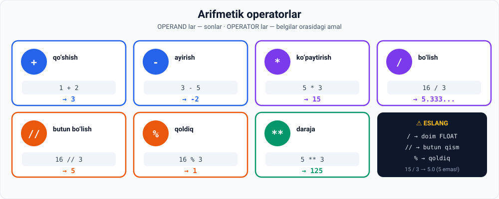

# 1-dars. Arifmetik operatorlar

## 🎬 Boshlashdan oldin

> **"Biz ajoyib natijalarga erishmoqdamiz. Biz mohiyatni qamrab olishdan BIR QADAM narida turibmiz, keyin esa qiziqarliroq dasturlash vazifalariga sho'ng'ishimiz mumkin."**

Bu modulda Python **sintaksisining asoslari** yakunlanadi.

---

## 1. Operand va operator

> **Qo'shish va ayirish belgilaridan foydalanish texnik jihatdan oddiy.**
>
> **Bu yerdagi tenglamada `1` va `2` — OPERAND lar deb ataladi, keyingisida esa operandlar `3` va `5`.**
>
> **Plyus va minus belgilari — OPERATOR lar deb ataladi.**
>
> **Va ular arifmetik amallarni ifodalagani uchun, ularni ARIFMETIK OPERATORLAR deb atash mumkin.**

```python
1 + 2       # 1 va 2 — operandlar, + — operator
3 - 5
```

```
3
-2
```



---

## 2. Bo'lish — eng qiziqarlisi

> **Bo'lish qiziqarliroq.**
>
> **Agar 15 ni 3 ga bo'lmoqchi bo'lsak, bizga OLDINGA QIYSHIQ CHIZIQ (forward slash) kerak bo'ladi.**

```python
15 / 3
```

```
5.0
```

### ⚠️ Muhim: natija `5` emas, `5.0`

> ## **Python 3 da `/` operatori DOIM FLOAT qaytaradi** — hatto bo'linish qoldiqsiz bo'lsa ham.

```python
16 / 3
```

```
5.333333333333333
```

---

## 3. 📌 Python 2 va Python 3 farqi

Ma'ruzachi bu yerda **Python 2** haqida gapiradi. Bu — **eskirgan ma'lumot**, lekin uni bilish foydali:

| | Python 2 | **Python 3** *(siz ishlatayotgan)* |
|---|---|---|
| `15 / 3` | `5` (int) | **`5.0`** (float) |
| `16 / 3` | `5` (int — qoldiq yo'qoladi!) | **`5.333...`** (float) |
| Float olish uchun | `float(16) / 3` yoki `16.0 / 3` | **kerak emas** |

> **Ma'ruzachining so'zlari:**
>
> *"Python 3 da siz darrov `5.33` javobini olasiz — yoki float — chunki dasturiy ta'minot birinchi soningizni float qiymati bilan tushunadi."*

**Kursning notebook fayli ham Python 3 da:**

```python
15 / 3        # → 5.0
16 / 3        # → 5.333333333333333
float(16) / 3 # → 5.333333333333333   (bir xil natija)
16.0 / 3      # → 5.333333333333333   (bir xil natija)
```

> 💡 **Xulosa:** siz Python 3 ishlatyapsiz, shuning uchun `float()` ni bo'lish uchun **qo'shishingiz shart emas**. Lekin uni **bilib qo'ying** — eski kodlarda uchraydi.

---

## 4. `%` — qoldiq operatori

> **Endi 16 ni 3 ga bo'lishning QOLDIG'INI olaylik.**
>
> **Python'ni bu yacheykada `1` ni natija sifatida chiqarishga qanday majburlaymiz?**
>
> ## **Bunga yordam beradigan operator — FOIZ BELGISI.**

```python
16 % 3
```

```
1
```

**Matematik izoh:**

```
16 ÷ 3  →  bo'linma (quotient) = 5,  qoldiq (remainder) = 1
          5 × 3 = 15,  16 − 15 = 1
```

---

## 5. `//` — butun bo'lish

Bu ma'ruzada aytilmagan, lekin **`%` ning jufti**:

```python
16 // 3     # → 5      butun qism
16 %  3     # → 1      qoldiq
16 /  3     # → 5.333  to'liq natija
```

**Tekshiruv:**

```python
5 * 3 + 1 == 16     # → True
```

> 💡 `//` va `%` **birga ishlatiladi** — masalan sekundni soat va daqiqaga aylantirishda. Buni **loyihalarda** ko'rasiz.

---

## 6. `*` — ko'paytirish

> **Odatdagidek, ko'paytirmoqchi bo'lganimizda YULDUZCHA belgisidan foydalanishimiz mumkin.**

```python
5 * 3
```

```
15
```

### Amalni o'zgaruvchiga biriktirish

> **Ma'lumot uchun: siz har qanday arifmetik amalni O'ZGARUVCHIGA biriktirishingiz mumkin.**
>
> **Agar `5 * 3` ni `x` o'zgaruvchisiga biriktirsak va keyin `x` ni chaqirsak — yana 15 ni olamiz.**

```python
x = 5 * 3
x
```

```
15
```

> 🔑 Bu muhim: Python avval **amalni bajaradi**, keyin **natijani** biriktiradi. `x` ichida `5 * 3` emas, **`15`** turadi.

---

## 7. `**` — daraja

> **5 ni 3-darajaga qanday ko'tarish mumkin — IKKI YULDUZCHA operatori yordamida?**
>
> **`5`, ikkita yulduzcha, `3` deb yozing.**

```python
5 ** 3
```

```
125
```

> **Oson, to'g'rimi?**

---

## 8. 💻 To'liq kod

```python
# ===== QO'SHISH VA AYIRISH =====
print(1 + 2)        # 3
print(3 - 5)        # -2

# ===== BO'LISH =====
print(15 / 3)       # 5.0    ← float!
print(16 / 3)       # 5.333333333333333
print(16 // 3)      # 5      ← butun qism
print(16 % 3)       # 1      ← qoldiq

# ===== KO'PAYTIRISH =====
print(5 * 3)        # 15
x = 5 * 3
print(x)            # 15

# ===== DARAJA =====
print(5 ** 3)       # 125

# ===== TEKSHIRUV =====
print(16 // 3 * 3 + 16 % 3)     # 16  ← qoldiq formulasi
```

**Natija:**

```
3
-2
5.0
5.333333333333333
5
1
15
15
125
16
```

---

## 9. 📊 Barcha operatorlar jadvali

| Operator | Nomi | Misol | Natija | Turi |
|---|---|---|---|---|
| `+` | Qo'shish | `1 + 2` | `3` | int |
| `-` | Ayirish | `3 - 5` | `-2` | int |
| `*` | Ko'paytirish | `5 * 3` | `15` | int |
| `/` | Bo'lish | `16 / 3` | `5.333...` | **doim float** |
| `//` | Butun bo'lish | `16 // 3` | `5` | int |
| `%` | Qoldiq | `16 % 3` | `1` | int |
| `**` | Daraja | `5 ** 3` | `125` | int |

---

## 10. 📝 Rasmiy mashqlar (kursdan)

### Mashq 1
**15 va 23 ni birlashtiring (qo'shing).**

<details>
<summary>✅ Yechim</summary>

```python
15 + 23      # → 38
```

</details>

### Mashq 2
**26 dan 50 ni ayiring.**

<details>
<summary>✅ Yechim</summary>

```python
26 - 50      # → -24
```

</details>

### Mashq 3
**20 ni 4 ga bo'ling.**

<details>
<summary>✅ Yechim</summary>

```python
20 / 4       # → 5.0
```

</details>

### Mashq 4
**22 ni 4 ga bo'ling.**

<details>
<summary>✅ Yechim</summary>

```python
22 / 4       # → 5.5
```

</details>

### Mashq 5
**22 ni 4 ga bo'lishning qoldig'ini oling.**

<details>
<summary>✅ Yechim</summary>

```python
22 % 4       # → 2
```

</details>

### Mashq 6
**Float 22 ni 4 ga bo'ling.**

<details>
<summary>✅ Yechim</summary>

```python
float(22) / 4     # → 5.5
```

Yoki:

```python
22.0 / 4          # → 5.5
```

⚠️ Python 3 da `22 / 4` ham **`5.5`** beradi — `float()` shart emas.

</details>

### Mashq 7
**6 ni 8 ga ko'paytiring.**

<details>
<summary>✅ Yechim</summary>

```python
6 * 8        # → 48
```

</details>

### Mashq 8
**15 ni 2-darajaga ko'taring.**

<details>
<summary>✅ Yechim</summary>

```python
15 ** 2      # → 225
```

</details>

---

## 11. ⚡ Qo'shimcha mashqlar

### 🟢 Oson

**M1.** Hisoblang: `100 - 37`, `12 * 12`, `2 ** 10`, `144 / 12`.

**M2.** `77` ni `6` ga bo'ling — **uch xil natija** oling: to'liq, butun qism, qoldiq.

**M3.** `narx = 45000`, `soni = 7`. Umumiy summani hisoblab, o'zgaruvchiga saqlang.

<details>
<summary>✅ Yechimlar</summary>

```python
# M1
print(100 - 37)    # 63
print(12 * 12)     # 144
print(2 ** 10)     # 1024
print(144 / 12)    # 12.0    ← float!

# M2
print(77 / 6)      # 12.833333333333334
print(77 // 6)     # 12
print(77 % 6)      # 5

# M3
narx = 45000
soni = 7
jami = narx * soni
print(jami)        # 315000
```

</details>

### 🟡 O'rta

**M4.** `100` sekundni **daqiqa va sekundga** ayiring (`//` va `%` bilan).

**M5.** Kvadrat ildizni **daraja orqali** hisoblang: `81` ning ildizi.

**M6.** `17 // 5 * 5 + 17 % 5` nimaga teng? **Avval taxmin qiling**, keyin tekshiring.

<details>
<summary>✅ Yechimlar</summary>

```python
# M4
sekund = 100
print(sekund // 60, "daqiqa", sekund % 60, "sekund")   # 1 daqiqa 40 sekund

# M5
print(81 ** 0.5)   # 9.0    ← 0.5 daraja = kvadrat ildiz

# M6
print(17 // 5 * 5 + 17 % 5)   # 17
# Bu — bo'lish formulasi: (butun qism × bo'luvchi) + qoldiq = asl son
```

</details>

### 🔴 Qiyin

**M7.** Amallar tartibini tekshiring. **Taxmin qiling**, keyin sinang:
```python
2 + 3 * 4
(2 + 3) * 4
2 ** 3 ** 2
10 - 4 - 3
```

**M8.** `1234` sonining **har bir raqamini** alohida chiqaring (`//` va `%` bilan).

<details>
<summary>✅ Yechimlar</summary>

```python
# M7
print(2 + 3 * 4)      # 14   ← * oldin bajariladi
print((2 + 3) * 4)    # 20   ← qavs birinchi
print(2 ** 3 ** 2)    # 512  ← ** O'NGDAN chapga: 2**(3**2) = 2**9
print(10 - 4 - 3)     # 3    ← - chapdan o'ngga: (10-4)-3
```

**Amallar tartibi:** `()` → `**` → `*` `/` `//` `%` → `+` `-`

```python
# M8
son = 1234
print(son // 1000)          # 1
print(son // 100 % 10)      # 2
print(son // 10 % 10)       # 3
print(son % 10)             # 4
```

</details>

---

## 12. 🧠 O'zini tekshirish savollari

1. Operand va operator nima?
2. `15 / 3` Python 3 da nima beradi? Nima uchun `5` emas?
3. Python 2 va Python 3 da bo'lish qanday farq qiladi?
4. `%` operatori nima qiladi?
5. `16 % 3` nimaga teng va nima uchun?
6. `//` operatori nima qiladi?
7. Arifmetik amalni o'zgaruvchiga biriktirish mumkinmi? Nima saqlanadi?
8. `**` operatori nima qiladi?
9. `5 ** 3` nimaga teng?

<details>
<summary>✅ Javoblar</summary>

1. **Operand** — amaldagi sonlar (`1`, `2`); **operator** — amal belgisi (`+`, `-`).
2. **`5.0`** — chunki Python 3 da `/` **doim float** qaytaradi.
3. **Python 2:** `16 / 3` → `5` (butun, qoldiq yo'qoladi). **Python 3:** `16 / 3` → `5.333...` (float).
4. **Bo'lish qoldig'ini** qaytaradi.
5. **`1`** — chunki `16 ÷ 3` da bo'linma `5`, qoldiq `1` (`5 × 3 = 15`, `16 − 15 = 1`).
6. **Butun bo'lish** — natijaning butun qismini qaytaradi.
7. **Ha.** O'zgaruvchida **amal emas, NATIJA** saqlanadi (`x = 5 * 3` → `x` ichida `15`).
8. **Darajaga ko'taradi.**
9. **`125`** (5 × 5 × 5).

</details>

---

## 📌 Xulosa

```
+   qo'shish        1 + 2    →  3
-   ayirish         3 - 5    →  -2
*   ko'paytirish    5 * 3    →  15
/   bo'lish         16 / 3   →  5.333...   ⚠️ DOIM float
//  butun bo'lish   16 // 3  →  5
%   qoldiq          16 % 3   →  1
**  daraja          5 ** 3   →  125

x = 5 * 3    →  x ichida 15 (amal emas, NATIJA)

Amallar tartibi:  ()  →  **  →  *  /  //  %  →  +  -
```

---

## 🔖 Atamalar

| Atama | Inglizcha | Izoh |
|---|---|---|
| Operand | *operand* | Amaldagi son |
| Operator | *operator* | Amal belgisi |
| Arifmetik operator | *arithmetic operator* | Matematik amal belgisi |
| Bo'linma | *quotient* | Bo'lish natijasi |
| Qoldiq | *remainder* | Bo'lishdan qolgan |
| Butun bo'lish | *floor division* | `//` — butun qism |
| Daraja | *exponentiation* | `**` |

---

🏠 [Modul boshiga](README.md) · ➡️ [Keyingi: Ikki tenglik belgisi](02-The-Double-Equality-Sign.md)
