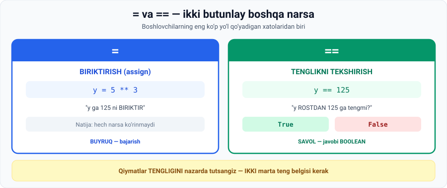

# 2-dars. Ikki tenglik belgisi `==`

## 🎬 Boshlashdan oldin

`=` va `==` — bitta belgi farq. Lekin **butunlay boshqa narsa**.

> Bu — boshlovchilarning **eng ko'p yo'l qo'yadigan** xatolaridan biri. Bu dars uni bir umrga hal qiladi.

---

## 1. Eslatma: `=` nima qiladi

> **Siz dasturlashda teng belgisini talqin qilishning to'g'ri yo'lini bilasiz — BIRIKTIRISH yoki BOG'LASH.**
>
> **Masalan: `5` ni `3`-darajaga `y` o'zgaruvchisiga biriktiring.**

```python
y = 5 ** 3
```

> **Bu shu daqiqadan boshlab kompyuter uchun `y` 125 ga teng bo'ladi degani.**

```python
y
```

```
125
```



---

## 2. `==` nima qiladi

> **Mana tenglik belgisini IKKILANTIRGANingizda nima bo'ladi.**

```python
y == 125
```

### To'g'ri o'qish

> **Bu kodni o'qishning to'g'ri yo'li: `y` 125 ga TENGMI?**
>
> **Bu buyruqni ishga tushirganingizda, kompyuter siz quyidagi SAVOLGA javob so'raganingizni taxmin qiladi:**
>
> ## **"y ROSTDAN 125 ga tengmi?"**

### Natija — Boolean

> **Aynan shuning uchun bu yacheykani bajarganingizdan so'ng mashina BOOLEAN qiymat bilan javob beradi.**
>
> **U `True` yoki `False` qaytaradi.**

```python
y == 125
```

```
True
```

**Endi noto'g'ri qiymat bilan sinaymiz:**

```python
y == 126
```

```
False
```

> **Mashina `False` deb javob berdi, chunki 125 va 126 — TURLI sonlar.**

---

## 3. 🔑 Asosiy qoida

> ## **Python'da QIYMATLAR TENGLIGINI nazarda tutsangiz — qiymatlarni BIRIKTIRISHNI emas — sizga IKKI TENGLIK BELGISI kerak.**
>
> **Uni har safar ishlatganingizda siz ikkita mumkin bo'lgan natijadan birini olasiz: `True` yoki `False`.**

---

## 4. 📊 Farqni yodda saqlash

| | `=` | `==` |
|---|---|---|
| **Nomi** | Biriktirish (assignment) | Tenglikni tekshirish (comparison) |
| **O'qilishi** | *"y ga 125 ni biriktir"* | *"y 125 ga tengmi?"* |
| **Nima qiladi** | **Buyruq** bajaradi | **Savol** beradi |
| **Natija** | Hech narsa ko'rinmaydi | **`True`** yoki **`False`** |
| **Turi** | — | `bool` |
| **Misol** | `y = 125` | `y == 125` |

> 🧠 **Yodlash usuli:**
> - `=` **bitta** belgi → **bitta** ish qiladi (biriktiradi)
> - `==` **ikkita** belgi → **ikkita** javob bo'lishi mumkin (`True` / `False`)

---

## 5. 💻 To'liq kod

```python
# ===== BIRIKTIRISH =====
y = 5 ** 3
print(y)              # 125

# ===== TEKSHIRISH =====
print(y == 125)       # True
print(y == 126)       # False

# ===== TURI =====
print(type(y == 125)) # <class 'bool'>

# ===== BOSHQA MISOLLAR =====
print(100 == 98)      # False
print(10 / 2 == 5)    # True   ← 5.0 == 5 ham True!
print("a" == "A")     # False  ← case sensitive
print(3 + 2 == 5)     # True
```

**Natija:**

```
125
True
False
<class 'bool'>
False
True
False
True
```

> 💡 **Diqqat:** `10 / 2` bu **`5.0`** (float), lekin `5.0 == 5` → **`True`**. Python sonlarning **qiymatini** solishtiradi, turini emas.

---

## 6. ⚠️ Keng tarqalgan xato

```python
# ❌ NOTO'G'RI — biriktirish o'rniga tekshirish
y == 125        # bu shunchaki savol beradi, y o'zgarmaydi

# ❌ NOTO'G'RI — tekshirish o'rniga biriktirish
if y = 125:     # SyntaxError!
```

> Shartli operatorlarda (**15-modul**) bu xato ayniqsa tez-tez uchraydi. Hozircha shuni eslab qoling:
>
> ```
> BIRIKTIRISH  →  =
> TEKSHIRISH   →  ==
> ```

---

## 7. 📝 Rasmiy mashq (kursdan)

### Mashq 1
**100 ning 98 ga teng EMASLIGINI ko'rsating.**

<details>
<summary>✅ Yechim</summary>

```python
100 == 98
```

```
False
```

`False` natijasi — bu **isbot**: ular **teng emas**.

</details>

---

## 8. ⚡ Qo'shimcha mashqlar

### 🟢 Oson

**M1.** Natijani **avval taxmin qiling**, keyin tekshiring:
```python
5 == 5
5 == 5.0
"5" == 5
"abc" == "abc"
"ABC" == "abc"
True == 1
```

**M2.** `a = 7`, `b = 7`. `a` va `b` teng ekanini isbotlang.

**M3.** `2 ** 10` ning `1024` ga tengligini tekshiring.

<details>
<summary>✅ Yechimlar</summary>

```python
# M1
print(5 == 5)          # True
print(5 == 5.0)        # True    ← qiymat bir xil
print("5" == 5)        # False   ← satr ≠ son!
print("abc" == "abc")  # True
print("ABC" == "abc")  # False   ← case sensitive
print(True == 1)       # True    ← True = 1

# M2
a = 7
b = 7
print(a == b)          # True

# M3
print(2 ** 10 == 1024) # True
```

</details>

### 🟡 O'rta

**M4.** Xatoni toping:
```python
narx = 5000
narx == 6000
print(narx)
```
Nima uchun `narx` o'zgarmadi?

**M5.** Hisoblab ko'ring: `16 // 3 == 5` va `16 / 3 == 5`. Nima uchun farq qiladi?

**M6.** `0.1 + 0.2 == 0.3` ni tekshiring. Natija sizni hayratlantiradimi?

<details>
<summary>✅ Yechimlar</summary>

```python
# M4
narx = 5000
narx == 6000     # bu SAVOL — natijasi False, lekin narx O'ZGARMAYDI
print(narx)      # 5000
# Biriktirish uchun narx = 6000 yozish kerak edi

# M5
print(16 // 3 == 5)    # True    ← 16 // 3 = 5
print(16 / 3 == 5)     # False   ← 16 / 3 = 5.333...

# M6
print(0.1 + 0.2 == 0.3)   # False !!!
print(0.1 + 0.2)          # 0.30000000000000004
```

**M6 tushuntirish:** kompyuter kasr sonlarni **ikkilik sanoq sistemasida** taxminan saqlaydi. Bu — **barcha dasturlash tillarida** bor muammo, Python'ning kamchiligi emas.

**Yechim:** kasr sonlarni solishtirganda `round()` ishlating:
```python
print(round(0.1 + 0.2, 10) == round(0.3, 10))   # True
```

</details>

### 🔴 Qiyin

**M7.** Zanjirli solishtirishni sinang:
```python
5 == 5 == 5
1 == 1 == 2
```
Nima bo'ldi?

**M8.** `==` yordamida **parol tekshiruvchi** yozing: `togri_parol` va `kiritilgan` o'zgaruvchilarini solishtiring va natijani chiroyli chiqaring.

<details>
<summary>✅ Yechimlar</summary>

```python
# M7
print(5 == 5 == 5)     # True    ← (5==5) va (5==5)
print(1 == 1 == 2)     # False   ← (1==1) True, lekin (1==2) False
# Python zanjirli solishtirishni qo'llab-quvvatlaydi

# M8
togri_parol = "Python2025"
kiritilgan = "Python2025"

print("Kiritilgan:", kiritilgan)
print("To'g'rimi? ", kiritilgan == togri_parol)
print("Uzunlik 10?", len(kiritilgan) == 10)
```

```
Kiritilgan: Python2025
To'g'rimi?  True
Uzunlik 10? True
```

</details>

---

## 9. 🧠 O'zini tekshirish savollari

1. `=` belgisini qanday o'qish kerak?
2. `==` belgisini qanday o'qish kerak?
3. `y == 125` ni bajarganda kompyuter nima deb tushunadi?
4. Natija qanday turda bo'ladi?
5. `y = 125` bo'lsa, `y == 126` nima qaytaradi va nega?
6. Qachon `==` ishlatish kerak?
7. `==` dan har safar qanday ikki natija olish mumkin?

<details>
<summary>✅ Javoblar</summary>

1. **"Biriktir"** yoki **"bog'la"** (assign / bind to).
2. **"Tengmi?"** — savol sifatida.
3. Siz **"y rostdan 125 ga tengmi?"** degan savolga javob so'radingiz.
4. **Boolean** (`bool`).
5. **`False`** — chunki **125 va 126 turli sonlar**.
6. **Qiymatlar tengligini** nazarda tutganda — biriktirishni emas.
7. **`True`** yoki **`False`**.

</details>

---

## 📌 Xulosa

```
=    BIRIKTIRISH        y = 5 ** 3      "y ga 125 ni biriktir"
                                         → natija ko'rinmaydi

==   TEKSHIRISH         y == 125        "y 125 ga tengmi?"
                                         → True yoki False (bool)

⚠️ Diqqat:
   5 == 5.0     →  True    qiymat bir xil
   "5" == 5     →  False   satr ≠ son
   "A" == "a"   →  False   case sensitive
   True == 1    →  True    True = 1

   0.1 + 0.2 == 0.3  →  False !  (kasr sonlar aniq emas)
```

---

## 🔖 Atamalar

| Atama | Inglizcha | Izoh |
|---|---|---|
| Biriktirish | *assignment* | `=` — qiymat berish |
| Tenglikni tekshirish | *equality comparison* | `==` — solishtirish |
| Boolean | *boolean* | `True` yoki `False` |
| Zanjirli solishtirish | *chained comparison* | `5 == 5 == 5` |

---

⬅️ [Oldingi: Arifmetik operatorlar](01-Arithmetic-Operators.md) · ➡️ [Keyingi: Qiymatlarni qayta biriktirish](03-Reassign-Values.md)
