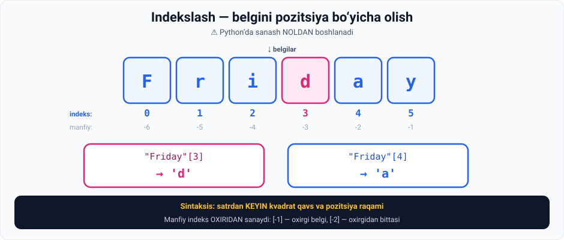

# 6-dars. Elementlarni indekslash

## 🎬 Boshlashdan oldin

> **"Bu — kursning keyingi qismlarida TEZ-TEZ ishlatadigan texnikamiz."**

Bu dars — **17-modul (Ketma-ketliklar)** ning poydevori. Uni yaxshi o'zlashtiring.

---

## 1. Muammo

> **Bu yerda `Friday` so'zi yozilgan, to'g'rimi?**
>
> **`d` harfini ajratib olish mumkinmi?**
>
> ## **Ha. Buni KVADRAT QAVSLAR yordamida qila olamiz.**
>
> **Ular ichida esa ajratib olmoqchi bo'lgan harfning POZITSIYASINI ko'rsatishimiz kerak.**



---

## 2. 🔑 Eng muhim qoida

> ## **Eslashingiz kerak bo'lgan JUDA MUHIM narsa: Python'da biz NOLDAN sanaymiz, birdan emas.**
>
> **Nol, bir, ikki, uch, to'rt va hokazo.**

```
F  r  i  d  a  y
0  1  2  3  4  5
```

---

## 3. Amalda

> **Aynan shuning uchun men to'rtinchi harf — `d` ni bu yerga `3` yozib so'rayman.**

```python
"Friday"[3]
```

```
'd'
```

> **Ko'ryapsizmi? Va biz `d` harfini oldik.**

**Agar `4` qo'yganimizda:**

```python
"Friday"[4]
```

```
'a'
```

> **Biz `a` harfini olgan bo'lardik.**

---

## 4. Sintaksis

> ## **Bu holatdagi sintaksis: so'z yoki belgilar satridan DARROV KEYIN kvadrat qavslar, va qiziqish pozitsiyasini bildiruvchi RAQAM.**
>
> **Python'da indekslash shunday ishlaydi.**

```python
satr[pozitsiya]
```

---

## 5. 💡 Manfiy indekslar

Bu ma'ruzada aytilmagan, lekin **juda foydali**:

> **Manfiy indeks OXIRIDAN sanaydi.**

```
F   r   i   d   a   y
0   1   2   3   4   5      ← musbat (boshdan)
-6  -5  -4  -3  -2  -1     ← manfiy (oxiridan)
```

```python
"Friday"[-1]     # 'y'   ← oxirgi belgi
"Friday"[-2]     # 'a'   ← oxirgidan bittasi
"Friday"[-6]     # 'F'   ← birinchi belgi
```

> 🔑 **Amaliy foyda:** satr uzunligini bilmasangiz ham, **oxirgi belgini** `[-1]` bilan olasiz.

---

## 6. 💻 To'liq kod

```python
soz = "Friday"

# ===== MUSBAT INDEKSLAR =====
print(soz[0])      # F   ← BIRINCHI belgi (0 dan!)
print(soz[1])      # r
print(soz[3])      # d
print(soz[4])      # a
print(soz[5])      # y   ← OXIRGI belgi

# ===== MANFIY INDEKSLAR =====
print(soz[-1])     # y   ← oxirgi
print(soz[-2])     # a
print(soz[-6])     # F   ← birinchi

# ===== UZUNLIK =====
print(len(soz))    # 6

# ===== TO'G'RIDAN-TO'G'RI SATRGA =====
print("Friday"[3])          # d
print('Bingo!'[0])          # B
print("Constitution"[7])    # u

# ===== O'RTADAGI BELGI =====
print(soz[len(soz) // 2])   # d

# ===== XATO =====
# print(soz[6])    # IndexError: string index out of range
```

**Natija:**

```
F
r
d
a
y
y
a
F
6
d
B
u
d
```

---

## 7. ⚠️ Keng tarqalgan xatolar

### Xato 1 — birdan sanash

```python
soz = "Friday"
soz[1]     # 'r' — bu IKKINCHI belgi, birinchisi emas!
soz[0]     # 'F' — mana BIRINCHI belgi
```

### Xato 2 — chegaradan chiqish

```python
soz = "Friday"     # 6 ta belgi, indekslar: 0..5
soz[6]             # ❌ IndexError: string index out of range
```

> 🧠 **Yodlash:** `n` ta belgili satrda **oxirgi indeks** — bu **`n - 1`**.

---

## 8. 📝 Rasmiy mashqlar (kursdan)

### Mashq 1
**`"Bingo!"` dan `B` harfini ajratib oling.**

<details>
<summary>✅ Yechim</summary>

```python
'Bingo!'[0]
```

```
'B'
```

Yoki:

```python
"Bingo!"[0]
```

</details>

### Mashq 2
**`"Constitution"` dan `u` harfini ajratib oling.**

<details>
<summary>✅ Yechim</summary>

```python
"Constitution"[7]
```

```
'u'
```

Yoki:

```python
'Constitution'[7]
```

**Sanab ko'ring:**

```
C  o  n  s  t  i  t  u  t  i  o  n
0  1  2  3  4  5  6  7  8  9  10 11
```

</details>

---

## 9. ⚡ Qo'shimcha mashqlar

### 🟢 Oson

**M1.** `"Python"` dan quyidagilarni oling: `P`, `t`, `n`.

**M2.** `"Toshkent"` so'zining **birinchi** va **oxirgi** belgisini oling — ikki xil usulda (musbat va manfiy indeks bilan).

**M3.** `"O'zbekiston"` so'zining uzunligini toping va **oxirgi indeks** nechchi ekanini ayting.

<details>
<summary>✅ Yechimlar</summary>

```python
# M1
print("Python"[0])     # P
print("Python"[2])     # t
print("Python"[5])     # n

# M2
soz = "Toshkent"
print(soz[0],  soz[7])       # T t   ← musbat
print(soz[-8], soz[-1])      # T t   ← manfiy

# M3
soz = "O'zbekiston"
print(len(soz))              # 11
print("Oxirgi indeks:", len(soz) - 1)    # 10
print(soz[10])               # n
```

</details>

### 🟡 O'rta

**M4.** Xatoni toping:
```python
soz = "Salom"
print(soz[5])
```

**M5.** `"Dasturlash"` so'zining **o'rtadagi** belgisini toping (formula bilan, qo'lda sanamasdan).

**M6.** Ism va familiyaning **bosh harflarini** oling va `A.B.` formatida chiqaring.

<details>
<summary>✅ Yechimlar</summary>

```python
# M4 — "Salom" da 5 ta belgi, indekslar 0..4
soz = "Salom"
print(soz[4])       # m   ← oxirgi
# yoki:
print(soz[-1])      # m

# M5
soz = "Dasturlash"
print(soz[len(soz) // 2])    # r    (10 // 2 = 5)

# M6
ism = "Ilhom"
familiya = "Islomov"
print(ism[0] + "." + familiya[0] + ".")     # I.I.
```

</details>

### 🔴 Qiyin

**M7.** Faqat indekslash bilan `"Python"` dan `"Pto"` ni yig'ing.

**M8.** Telefon raqamidan operator kodini oling:
```python
telefon = "+998901234567"
# Kerak: "90"
```

**M9.** So'zning birinchi va oxirgi harfi bir xilligini tekshiring (`==` bilan):
```python
soz1 = "level"      # ?
soz2 = "python"     # ?
```

<details>
<summary>✅ Yechimlar</summary>

```python
# M7
soz = "Python"
print(soz[0] + soz[2] + soz[4])     # Pto
#      P        t        o

# M8
telefon = "+998901234567"
#          0123456789...
print(telefon[4] + telefon[5])      # 90
# Yoki kesish (slicing) bilan — 17-modulda:
# print(telefon[4:6])

# M9
soz1 = "level"
soz2 = "python"
print(soz1[0] == soz1[-1])     # True   ← l va l
print(soz2[0] == soz2[-1])     # False  ← p va n
```

</details>

---

## 10. 🧠 O'zini tekshirish savollari

1. Indekslash uchun qanday belgilar ishlatiladi?
2. Qavslar ichiga nima yoziladi?
3. Python'da sanash nechchidan boshlanadi?
4. `"Friday"[3]` nima beradi va nima uchun?
5. `"Friday"[4]` nima beradi?
6. Indekslash sintaksisi qanday?
7. `n` ta belgili satrda oxirgi indeks nechchi?

<details>
<summary>✅ Javoblar</summary>

1. **Kvadrat qavslar `[ ]`.**
2. Ajratib olmoqchi bo'lgan belgining **pozitsiyasi**.
3. **Noldan** — birdan emas.
4. **`'d'`** — chunki sanash 0 dan boshlanadi: `F`=0, `r`=1, `i`=2, **`d`=3**.
5. **`'a'`**.
6. Satrdan **darrov keyin** kvadrat qavslar va **pozitsiya raqami**: `satr[pozitsiya]`.
7. **`n - 1`**.

</details>

---

## 📌 Xulosa

```
"Friday"
 F  r  i  d  a  y
 0  1  2  3  4  5      ← musbat: BOSHDAN
-6 -5 -4 -3 -2 -1      ← manfiy: OXIRIDAN

"Friday"[3]   →  'd'
"Friday"[4]   →  'a'
"Friday"[-1]  →  'y'    (oxirgi)
"Friday"[0]   →  'F'    (birinchi)

⚠️ SANASH 0 DAN BOSHLANADI
⚠️ n ta belgi  →  oxirgi indeks = n - 1
⚠️ soz[6] da 6 ta belgi bo'lsa → IndexError

Sintaksis:  satr[pozitsiya]
```

---

## 🔖 Atamalar

| Atama | Inglizcha | Izoh |
|---|---|---|
| Indekslash | *indexing* | Pozitsiya bo'yicha element olish |
| Indeks | *index* | Element pozitsiyasi |
| Kvadrat qavslar | *square brackets* | `[ ]` |
| Manfiy indeks | *negative index* | Oxiridan sanash |
| `len()` | *length* | Uzunlikni qaytaruvchi funksiya |
| IndexError | *IndexError* | Chegaradan chiqish xatosi |

---

⬅️ [Oldingi: Qator davomi](05-Line-Continuation.md) · ➡️ [Keyingi: Chekinish](07-Indentation.md)
