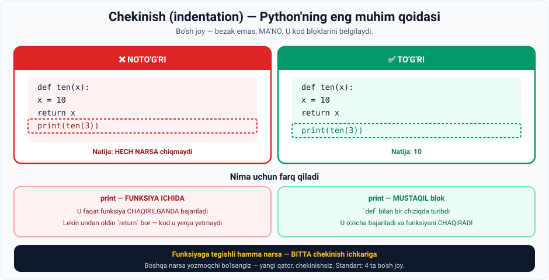

# 7-dars. Chekinish (indentation)

## 🎬 Boshlashdan oldin

> **"Python'da dasturlash uchun keyingi tushuncha FUNDAMENTAL."**
>
> **"Uni amalda qanday qo'llashingiz MUHIM, chunki bu g'oyalaringizni mashinaga to'g'ri yetkazishning YAGONA yo'li bo'ladi."**

Ko'p tillarda bo'sh joy — **bezak**. Python'da u — **ma'no**.

---

## 1. Misol: funksiya

> **Argument sifatida noma'lum `x` ni qabul qiladigan `five` funksiyasini aniqlaymiz.**
>
> **U oddiy bo'ladi: `x` ga 5 qiymati qayta biriktiriladi va funksiya biz uchun 5 qiymatini qaytaradi.**
>
> **Diqqat qiling: men CHEKINISHDAN foydalanyapman.**

```python
def five(x):
    x = 5
    return x
```

> 📌 **Funksiyalar** to'liq **16-modulda** o'rganiladi. Hozircha faqat **chekinishga** e'tibor bering.



---

## 2. ❌ Noto'g'ri variant

> **Endi biz `five` ning 3 argumenti bilan natijasini chop etishimiz mumkin.**

```python
def five(x):
    x = 5
    return x
    print(five(3))
```

**Natija:**

```
(hech narsa)
```

### Nima uchun?

> ## **Chunki `print(five(3))` FUNKSIYA ICHIDA turibdi, shuning uchun u faqat funksiya QO'LLANILGANDA bajariladi.**

> 💡 **Yana bir sabab:** `print` dan **oldin** `return x` bor. `return` funksiyani **darrov tugatadi** — undan keyingi kod **hech qachon** bajarilmaydi.

---

## 3. ✅ To'g'ri variant

> **Agar biz `print` ni YANGI QATORGA, `def` buyrug'iga TEKISLAB qo'ysak — natija boshqacha bo'ladi.**

```python
def five(x):
    x = 5
    return x

print(five(3))
```

**Natija:**

```
5
```

### Nima uchun?

> ## **`print` buyrug'i O'ZICHA bajariladi, `five` funksiyasining qismi sifatida emas.**
>
> **`def` va `print` shu tarzda yozilganda IKKITA ALOHIDA va aniq FARQLANADIGAN kod bloki (yoki buyruqlar bloki) ni hosil qiladi.**

---

## 4. 🔑 Asosiy tamoyil

> **Chekinishdan foydalanish mantiqiy, shunday emasmi?**
>
> ## **Funksiyaga tegishli HAMMA NARSA bitta chekinish bilan ICHKARIGA yoziladi.**
>
> ## **Boshqa narsa yozishga qaror qilganingizdan so'ng — YANGI QATORDAN, CHEKINISHSIZ boshlang.**

> **Kod bloklari ko'proq ko'rinadigan bo'ladi va bu muammoni yechishda qo'llayotgan MANTIQINGIZNI aniqlashtiradi.**

---

## 5. 📏 Amaliy qoidalar

Bu ma'ruzada aytilmagan, lekin **bilish shart**:

| Qoida | Izoh |
|---|---|
| **4 ta bo'sh joy** | Python'ning rasmiy standarti (PEP 8) |
| **Tab yoki bo'sh joy** | Bittasini tanlang, **aralashtirmang** |
| **Bir xil daraja** | Bitta blokdagi barcha qatorlar **bir xil** chekinishga ega bo'lishi shart |
| **Jupyter avtomatik** | `:` dan keyin Enter bosilsa, Jupyter **o'zi** chekintiradi |

### ⚠️ Xatolar

```python
# ❌ IndentationError: expected an indented block
def salom():
print("Salom")

# ❌ IndentationError: unindent does not match any outer indentation level
def salom():
    x = 1
   y = 2        # 3 ta bo'sh joy — mos kelmadi!

# ❌ TabError: inconsistent use of tabs and spaces
def salom():
    x = 1        # bo'sh joylar
	y = 2        # TAB — aralashtirilgan!
```

---

## 6. 💻 To'liq kod

```python
# ===== ❌ NOTO'G'RI =====
def five_xato(x):
    x = 5
    return x
    print(five_xato(3))     # hech qachon bajarilmaydi

five_xato(3)                # hech narsa chiqmaydi


# ===== ✅ TO'G'RI =====
def five(x):
    x = 5
    return x

print(five(3))              # 5


# ===== KO'P QATORLI BLOK =====
def hisobla(narx, soni):
    oraliq = narx * soni        # blok ichida
    qqs = oraliq * 0.12         # blok ichida
    jami = oraliq + qqs         # blok ichida
    return jami                 # blok ichida

print(hisobla(5000, 3))         # 16800.0  ← blokdan tashqarida
```

**Natija:**

```
5
16800.0
```

---

## 7. 🧠 Chekinishni tasavvur qilish

```
def five(x):          ← blok BOSHLANADI (`:` bilan)
····x = 5             ← blok ichida
····return x          ← blok ichida
                      ← bo'sh qator (ixtiyoriy)
print(five(3))        ← blokdan TASHQARIDA

···· = 4 ta bo'sh joy
```

> 🔑 **Boshqa tillarda** blok `{ }` bilan belgilanadi. **Python'da** — **chekinish bilan**. Bu Python kodini **o'qish oson** qiladi, lekin **e'tiborli** bo'lishni talab qiladi.

---

## 8. 📝 Rasmiy mashq (kursdan)

### Mashq 1
**Chekinishdan to'g'ri foydalanib, funksiyaning 3 argumenti bilan natijasini chop eting.**

**Berilgan (noto'g'ri) kod:**

```python
def ten(x):
    x = 10
    return x
    print(ten(3))
```

<details>
<summary>✅ Yechim</summary>

```python
def ten(x):
    x = 10
    return x

print(ten(3))
```

```
10
```

**Nima o'zgardi:** `print` **chekinishdan chiqarildi** — endi u funksiya ichida emas, **mustaqil blok**.

</details>

---

## 9. ⚡ Qo'shimcha mashqlar

### 🟢 Oson

**M1.** Chekinishni tuzating:
```python
def salom():
print("Salom!")
```

**M2.** Funksiya yozing: `kvadrat(n)` — sonning kvadratini qaytarsin. Keyin `kvadrat(7)` natijasini chop eting.

**M3.** Quyidagi kod nima chiqaradi? **Avval taxmin qiling:**
```python
def test(x):
    x = 100
    return x

print(test(5))
```

<details>
<summary>✅ Yechimlar</summary>

```python
# M1
def salom():
    print("Salom!")

salom()          # Salom!

# M2
def kvadrat(n):
    return n ** 2

print(kvadrat(7))    # 49

# M3
def test(x):
    x = 100          # kirish argumenti E'TIBORGA OLINMAYDI
    return x

print(test(5))       # 100  ← 5 emas!
```

**M3 saboqi:** funksiya ichida `x = 100` **argumentni ustiga yozadi** *(3-darsdagi qayta biriktirish!)*. Shuning uchun natija doim `100`.

</details>

### 🟡 O'rta

**M4.** Uch qatorli funksiya yozing va `return` dan **keyin** `print` qo'ying. Nima bo'ladi?

**M5.** Xatoni toping:
```python
def hisobla(a, b):
    yigindi = a + b
   return yigindi
```

**M6.** Ikkita funksiya yozing va ularni ketma-ket chaqiring. Chekinishga e'tibor bering.

<details>
<summary>✅ Yechimlar</summary>

```python
# M4
def sinov():
    print("Bu bajariladi")
    return 42
    print("Bu HECH QACHON bajarilmaydi")     # o'lik kod

print(sinov())
# Bu bajariladi
# 42

# M5 — `return` da 3 ta bo'sh joy, boshqasida 4 ta
def hisobla(a, b):
    yigindi = a + b
    return yigindi          # 4 ta bo'sh joy

print(hisobla(3, 5))        # 8

# M6
def salomlash():
    return "Salom"

def xayrlashuv():
    return "Xayr"

print(salomlash())          # Salom
print(xayrlashuv())         # Xayr
```

</details>

### 🔴 Qiyin

**M7.** Ichma-ich chekinish. Quyidagi kodda **nechta daraja** bor?
```python
def tashqi():
    def ichki():
        return "ichki"
    return ichki()

print(tashqi())
```

**M8.** Kodni **to'g'ri chekintiring** (barcha chekinishlar yo'q qilingan):
```python
def chek(narx, soni):
oraliq = narx * soni
qqs = oraliq * 0.12
return oraliq + qqs
print(chek(10000, 5))
```

<details>
<summary>✅ Yechimlar</summary>

```python
# M7 — 3 ta daraja
def tashqi():                    # 0-daraja
    def ichki():                 # 1-daraja
        return "ichki"           # 2-daraja
    return ichki()               # 1-daraja

print(tashqi())                  # ichki  ← 0-daraja

# M8
def chek(narx, soni):
    oraliq = narx * soni
    qqs = oraliq * 0.12
    return oraliq + qqs

print(chek(10000, 5))            # 56000.0
```

</details>

---

## 10. 🧠 O'zini tekshirish savollari

1. Chekinish nima uchun fundamental?
2. `print` funksiya ichida bo'lsa nima bo'ladi?
3. Nima uchun hech narsa chiqmaydi?
4. `print` ni `def` ga tekislasak nima bo'ladi?
5. Nima uchun natija boshqacha?
6. Kod bloki nima?
7. Funksiyaga tegishli narsalar qanday yoziladi?
8. Boshqa narsa yozmoqchi bo'lsangiz nima qilasiz?
9. Chekinishning foydasi nima?

<details>
<summary>✅ Javoblar</summary>

1. Chunki bu **g'oyalaringizni mashinaga to'g'ri yetkazishning yagona yo'li**.
2. U **faqat funksiya qo'llanilganda** bajariladi.
3. Chunki `print` **funksiya ichida** turibdi (va `return` dan keyin — u yerga kod **yetmaydi**).
4. U **o'zicha bajariladi** va natija chiqadi.
5. Chunki `print` endi **funksiyaning qismi emas** — u **mustaqil**.
6. **`def` va `print`** kabi **alohida va aniq farqlanadigan** buyruqlar guruhi.
7. **Bitta chekinish bilan ichkariga.**
8. **Yangi qatordan, chekinishsiz** boshlash.
9. Kod bloklari **ko'proq ko'rinadigan** bo'ladi va **mantiqni aniqlashtiradi**.

</details>

---

## 📌 Xulosa

```python
def five(x):          ← blok BOSHLANADI  (`:` bilan tugaydi)
    x = 5             ← 4 bo'sh joy: blok ICHIDA
    return x          ← blok ICHIDA

print(five(3))        ← chekinishsiz: blokdan TASHQARIDA
                      → 5

❌ print funksiya ICHIDA   →  hech narsa chiqmaydi
✅ print funksiya TASHQARISIDA  →  ishlaydi

⚠️ QOIDALAR:
   • 4 ta bo'sh joy (PEP 8 standarti)
   • Tab va bo'sh joyni ARALASHTIRMANG
   • Bitta blokdagi qatorlar BIR XIL chekinishda
   • `return` dan keyingi kod BAJARILMAYDI

Boshqa tillar:  { }        Python:  CHEKINISH
```

---

## 🔖 Atamalar

| Atama | Inglizcha | Izoh |
|---|---|---|
| Chekinish | *indentation* | Qator boshidagi bo'sh joy |
| Kod bloki | *block of code* | Bir guruh buyruqlar |
| Funksiya | *function* | Qayta ishlatiladigan kod bloki |
| `def` | *define* | Funksiya e'lon qilish |
| `return` | *return* | Natija qaytarish va funksiyani tugatish |
| Argument | *argument* | Funksiyaga beriladigan qiymat |
| O'lik kod | *dead code* | Hech qachon bajarilmaydigan kod |
| PEP 8 | *PEP 8* | Python kod uslubi standarti |

---

⬅️ [Oldingi: Indekslash](06-Indexing-Elements.md) · 🏠 [Modul boshiga](README.md)

🚀 **Endi amaliyot:** [Mini-loyihalar](LOYIHALAR.md) · 📝 [Barcha mashqlar](MASHQLAR.md)
