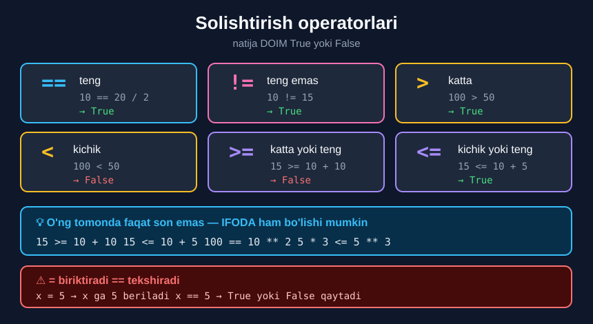

# 1-dars. Solishtirish operatorlari

## 🎬 Boshlashdan oldin

> **"Siz Python'ning asosiy sintaksisi bilan tanishsiz, va bu keyingi darslarda sizga yordam beradi."**
>
> **"Bu bo'limda biz Python'da ishlashimizga yordam beradigan operatorlar haqida ko'proq o'rganamiz."**
>
> **"Solishtirish operatorlaridan boshlaymiz."**

13-modulda `==` bilan tanishdingiz. Endi **butun oila** bilan tanishasiz.

---

## 1. `==` — teng

> **"Biz aytdikki, agar tenglik belgisini IKKI MARTA yozsak, chap va o'ng tomon teng ekanini tekshira olamiz."**

```python
10 == 20 / 2
```

```
True
```

> 🔑 O'ng tomonda **`20 / 2`** turibdi — ya'ni **ifoda**. Python avval uni hisoblaydi (`10.0`), keyin solishtiradi.

---

## 2. `!=` — teng emas

> **"Agar UNDOV BELGISI va tenglik belgisidan foydalansak, ikki tomon TENG EMASLIGINI tekshira olamiz."**

```python
10 != 10
```

```
False
```

> **"Demak, 10 o'nga teng emas deyish YOLG'ON bo'ladi."**

```python
10 != 15
```

```
True
```

> **"Va 10 o'n beshga teng emasligi ROST bo'ladi."**

### 🧠 Qanday o'qish kerak

`!=` ni **savol** deb o'qing:

| Kod | Savol | Javob |
|---|---|---|
| `10 != 10` | "10 va 10 **farq qiladimi**?" | Yo'q → `False` |
| `10 != 15` | "10 va 15 **farq qiladimi**?" | Ha → `True` |

> ⚠️ `!` belgisi Python'da **"emas"** degani. `!=` — "teng **emas**".

---

## 3. `>` va `<` — katta va kichik

> **"Qiymat boshqa qiymatdan katta yoki kichik ekanini tekshirish uchun HAMMAGA MA'LUM belgilardan foydalanishimiz mumkin."**

```python
100 > 50
```

```
True
```

> **"100 ellikdan kattami? Ha, katta."**

```python
100 < 50
```

```
False
```

> **"Kichikmi? Yo'q, kichik emas. Shuning uchun `False` olamiz."**



---

## 4. `>=` va `<=` — katta/kichik yoki teng

> **"Operand katta yoki teng, hamda kichik yoki tengligini tekshirish mantig'i AYNAN SHUNDAY."**

```
>=   katta YOKI teng
<=   kichik YOKI teng
```

### ⚠️ Belgi tartibi

```python
# ✅ TO'G'RI
x >= 5
x <= 5

# ❌ NOTO'G'RI — SyntaxError
x => 5
x =< 5
```

> 🧠 **Yodlash:** avval **taqqoslash** belgisi (`>` yoki `<`), keyin **tenglik** (`=`).

---

## 5. 💡 O'ng tomonda IFODA

> **"Unutmang: operandning o'ng tomonida biz faqat BITTA son berish bilan cheklanmaganmiz."**
>
> **"`10 + 10` kabi IFODA kiritishimiz mumkin."**

```python
15 >= 10 + 10
```

```
False
```

> **"Demak, 15 `10 + 10` dan katta yoki tengmi? Yo'q."**

```python
15 <= 10 + 5
```

```
True
```

> **"15 `10 + 5` dan kichik yoki tengmi? Bu — rost."**

### Tartib

```
1. O'ng tomondagi ifoda hisoblanadi    →  10 + 10  =  20
2. Solishtirish bajariladi              →  15 >= 20
3. Natija qaytariladi                   →  False
```

> 🔑 **Arifmetika HAR DOIM solishtirishdan oldin bajariladi.** Qavs qo'yish shart emas.

---

## 6. 💻 To'liq kod

```python
# ===== TENGLIK =====
print(10 == 20 / 2)      # True   ← 20/2 = 10.0, va 10 == 10.0
print(10 != 10)          # False
print(10 != 15)          # True

# ===== KATTA / KICHIK =====
print(100 > 50)          # True
print(100 < 50)          # False

# ===== KATTA/KICHIK YOKI TENG =====
print(10 >= 10)          # True   ← teng bo'lgani uchun
print(10 > 10)           # False  ← qat'iy katta emas
print(10 <= 10)          # True
print(10 < 10)           # False

# ===== O'NG TOMONDA IFODA =====
print(15 >= 10 + 10)     # False  ← 15 >= 20
print(15 <= 10 + 5)      # True   ← 15 <= 15
print(100 == 10 ** 2)    # True
print(5 * 3 <= 5 ** 3)   # True   ← 15 <= 125

# ===== SATRLARNI SOLISHTIRISH =====
print("abc" == "abc")    # True
print("abc" != "ABC")    # True   ← registr MUHIM
```

**Natija:**

```
True
False
True
True
False
True
False
True
False
False
True
True
True
True
True
```

---

## 7. 📋 Barcha operatorlar

| Operator | Ma'nosi | Misol | Natija |
|---|---|---|---|
| `==` | teng | `10 == 10` | `True` |
| `!=` | teng emas | `10 != 15` | `True` |
| `>` | katta | `100 > 50` | `True` |
| `<` | kichik | `100 < 50` | `False` |
| `>=` | katta yoki teng | `10 >= 10` | `True` |
| `<=` | kichik yoki teng | `15 <= 15` | `True` |

> ## 🔑 **Oltitasining ham natijasi DOIM `True` yoki `False` — ya'ni `bool` turi.**

---

## 8. ⚠️ Keng tarqalgan xatolar

### Xato 1 — `=` va `==`

```python
x = 5
# x = 10 ni "x 10 ga tengmi?" deb o'ylash — XATO
print(x == 10)     # False   ← TEKSHIRADI
print(x)           # 5       ← o'zgarmadi
```

*(13-modulning 2-darsini eslang.)*

### Xato 2 — kasr sonlar

```python
print(0.1 + 0.2 == 0.3)     # False !
print(0.1 + 0.2)            # 0.30000000000000004
```

### Xato 3 — turlarni aralashtirish

```python
print("5" == 5)     # False   ← satr va son teng emas
# print("5" > 5)    # TypeError: '>' not supported between 'str' and 'int'
```

> 🔑 **`==` va `!=`** turlar mos kelmasa **`False`/`True`** qaytaradi.
> **`>`, `<`, `>=`, `<=`** esa **`TypeError`** beradi.

---

## 9. 📝 Rasmiy mashqlar (kursdan)

### Mashq 1
**25 ning 30 dan kichik ekanini tekshiring.**

<details>
<summary>✅ Yechim</summary>

```python
25 < 30
```

```
True
```

</details>

### Mashq 2
**5 ni 3 ga ko'paytirilgani 5 ning kubidan kichik yoki tengligini tekshiring.**

<details>
<summary>✅ Yechim</summary>

```python
5 * 3 <= 5 ** 3
```

```
True
```

**Nima uchun:** `5 * 3` = `15`, `5 ** 3` = `125`. `15 <= 125` → `True`.

</details>

### Mashq 3
**100 ning 10 ning kvadratiga tengligini tekshiring.**

<details>
<summary>✅ Yechim</summary>

```python
100 == 10 ** 2
```

```
True
```

</details>

### Mashq 4
**53 ning 46 ga teng emasligini tekshiring.**

<details>
<summary>✅ Yechim</summary>

```python
53 != 46
```

```
True
```

</details>

---

## 10. ⚡ Qo'shimcha mashqlar

### 🟢 Oson

**M1.** Quyidagilarni taxmin qiling, keyin tekshiring:
```python
7 > 7
7 >= 7
7 < 7
7 <= 7
```

**M2.** `2 ** 10` ning `1000` dan katta ekanini tekshiring.

**M3.** Bir yildagi sekundlar soni (`365*24*60*60`) `30 000 000` dan kattami?

<details>
<summary>✅ Yechimlar</summary>

```python
# M1
print(7 > 7)      # False  ← qat'iy katta emas
print(7 >= 7)     # True   ← teng bo'lgani yetarli
print(7 < 7)      # False
print(7 <= 7)     # True

# M2
print(2 ** 10 > 1000)          # True   ← 1024 > 1000

# M3
print(365*24*60*60 > 30000000)  # True   ← 31536000 > 30000000
```

</details>

### 🟡 O'rta

**M4.** Yosh `18` dan katta yoki tengligini tekshiruvchi kod yozing (o'zgaruvchi bilan).

**M5.** Ikkita mahsulot narxini solishtiring va **qaysi biri qimmat** ekanini `True`/`False` bilan ko'rsating.

**M6.** `"apple" < "banana"` nima beradi? Nima uchun? *(Ilgak: alifbo tartibi)*

<details>
<summary>✅ Yechimlar</summary>

```python
# M4
yosh = 20
print(yosh >= 18)              # True

# M5
narx_a = 8500000
narx_b = 6200000
print("A qimmatroqmi?", narx_a > narx_b)      # A qimmatroqmi? True
print("Teng narxdami?", narx_a == narx_b)     # Teng narxdami? False

# M6
print("apple" < "banana")      # True
# Satrlar ALIFBO tartibida solishtiriladi: 'a' < 'b'
print("apple" < "Banana")      # False
# Katta harflar kichiklardan OLDIN keladi (ASCII kodi kichikroq)
```

</details>

### 🔴 Qiyin

**M7.** `10 < 20 < 30` — bu ishlaydimi? Sinang va tushuntiring.

**M8.** Nima uchun `0.1 + 0.2 == 0.3` → `False`? Buni **to'g'ri** tekshirish usulini toping.

**M9.** `True > False` nima beradi? Nima uchun?

<details>
<summary>✅ Yechimlar</summary>

```python
# M7 — HA, ishlaydi! Bu "zanjirli solishtirish"
print(10 < 20 < 30)      # True
# Python buni  (10 < 20) and (20 < 30)  deb o'qiydi
print(10 < 20 < 5)       # False
# Ko'p tillarda bu ishlamaydi — Python'ning maxsus imkoniyati

# M8
print(0.1 + 0.2 == 0.3)                    # False
# To'g'ri usul — FARQNI tekshirish:
print(abs(0.1 + 0.2 - 0.3) < 0.000001)     # True

# M9
print(True > False)      # True
# Python'da True = 1, False = 0.  Ya'ni 1 > 0 → True
print(True + True)       # 2
```

</details>

---

## 11. 🧠 O'zini tekshirish savollari

1. `==` nimani tekshiradi?
2. `!=` nimani tekshiradi va u qanday yoziladi?
3. `10 != 10` nima beradi? Nima uchun?
4. `100 > 50` va `100 < 50` — natijalar nima?
5. `>=` va `<=` mantig'i qanday?
6. O'ng tomonda faqat son bo'lishi shartmi?
7. `15 >= 10 + 10` nima beradi?
8. Solishtirish operatorlarining natijasi qaysi turda bo'ladi?

<details>
<summary>✅ Javoblar</summary>

1. Chap va o'ng tomon **tengligini**.
2. Ikki tomon **teng emasligini**; **undov belgisi + tenglik belgisi** — `!=`.
3. **`False`** — chunki "10 o'nga teng emas" degan gap **yolg'on**.
4. **`True`** va **`False`**.
5. **Aynan shunday** — "katta **yoki** teng", "kichik **yoki** teng".
6. **Yo'q** — `10 + 10` kabi **ifoda** ham bo'lishi mumkin.
7. **`False`** — chunki `15 >= 20` emas.
8. **`bool`** — `True` yoki `False`.

</details>

---

## 📌 Xulosa

```
==   teng               10 == 20/2     →  True
!=   teng emas          10 != 15       →  True
>    katta              100 > 50       →  True
<    kichik             100 < 50       →  False
>=   katta yoki teng    15 >= 10+10    →  False
<=   kichik yoki teng   15 <= 10+5     →  True

🔑 Natija DOIM  True  yoki  False   (bool turi)
🔑 O'ng tomonda IFODA ham bo'lishi mumkin
🔑 Arifmetika solishtirishdan OLDIN bajariladi

⚠️  =>  va  =<  YO'Q!  Faqat  >=  va  <=
⚠️  0.1 + 0.2 == 0.3  →  False
⚠️  "5" > 5  →  TypeError

💡 Zanjir:  10 < 20 < 30  →  True   (Python'ning maxsus imkoniyati)
```

---

## 🔖 Atamalar

| Atama | Inglizcha | Izoh |
|---|---|---|
| Solishtirish operatori | *comparison operator* | Ikki qiymatni taqqoslaydi |
| Operand | *operand* | Operator ishlaydigan qiymat |
| Ifoda | *expression* | Qiymat hosil qiluvchi kod |
| Mantiqiy qiymat | *boolean* | `True` / `False` |
| Zanjirli solishtirish | *chained comparison* | `10 < 20 < 30` |

---

🏠 [Modul boshiga](README.md) · ➡️ [Keyingi: Mantiqiy va ayniyat operatorlari](02-Logical-and-Identity-Operators.md)
