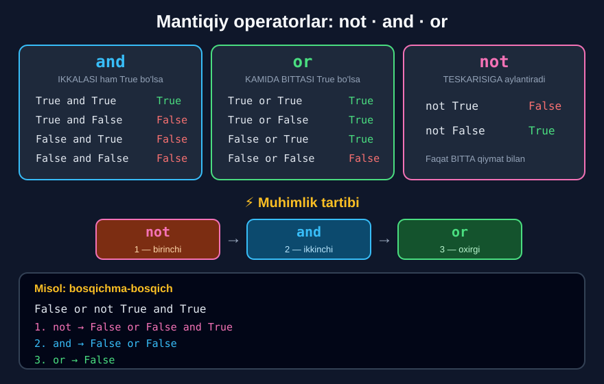
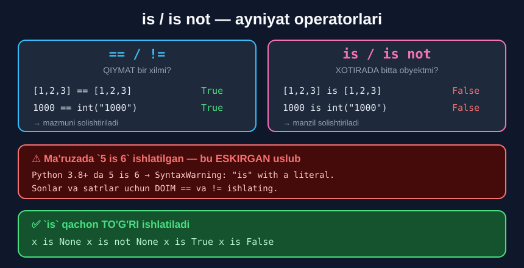

# 2-dars. Mantiqiy va ayniyat operatorlari

## 🎬 Boshlashdan oldin

> **"Qisqacha aytganda, Python'dagi mantiqiy operatorlar — bu `not`, `and` va `or` SO'ZLARI."**
>
> **"Ular ma'lum miqdordagi gaplarni solishtiradi va `True` yoki `False` MANTIQIY QIYMATLARINI qaytaradi — shuning uchun ularning ikkinchi nomi: BOOLEAN operatorlar."**

> 🔑 **Diqqat:** bular **belgi emas, SO'Z**. Boshqa tillarda `&&`, `||`, `!` bo'ladi — Python'da **inglizcha so'zlar**.

---

## 1. `and` — ikkalasi ham

> **"`and` bilan misoldan boshlaymiz. `and` o'zining ikki tomonidagi gaplar ROSTMI degan savolni tekshiradi."**
>
> **"Hozircha faqat `True` va `False` mantiqiy qiymatlaridan foydalanaylik."**

```python
True and True      # True
True and False     # False
False and False    # False
```

> **"`True and True` natijasi `True` bo'ladi, `True and False` esa `False` javobini beradi."**
>
> **"`False and False` tabiiy ravishda bizni `False` ga olib keladi."**

### 🧠 Hayotiy misol

> "Imtihondan **o'tish** uchun **nazariyani ham**, **amaliyotni ham** topshirish kerak."

```python
nazariya = True
amaliyot = False
print(nazariya and amaliyot)     # False  ← bittasi yetmaydi
```

---

## 2. `or` — kamida bittasi

> **"`or` ikki gapdan KAMIDA BITTASI rostmi degan savolni tekshiradi."**

```python
False or False     # False
True or True       # True
True or False      # True
False or True      # True
```

> **"Shu sababli `False or False` `False` bo'lib qaytadi, `True or True` esa `True` qaytaradi."**
>
> ## **"Ikki gapning TARTIBI AHAMIYATSIZ. Shuning uchun `False or True` ham `True` beradi."**

### 🧠 Hayotiy misol

> "Chegirma olish uchun **talaba** yoki **nafaqaxo'r** bo'lish yetarli."

```python
talaba = True
nafaqaxor = False
print(talaba or nafaqaxor)       # True  ← bittasi yetarli
```

---

## 3. `not` — teskarisi

> **"`not` ishlash usuli — u berilgan gapning TESKARISIGA olib keladi."**

```python
not True      # False
not False     # True
```

> **"`not True` `False` ga olib keladi. `not False` `True` ga olib keladi."**

> 🔑 `and` va `or` — **ikkita** qiymat bilan ishlaydi. `not` — **bitta** qiymat bilan.



---

## 4. Faqat `True`/`False` emas

> **"G'oya shundaki, mantiqiy operatorlarni faqat mantiqiy qiymatlarga emas, boshqa narsalarga ham qo'llash mumkin."**
>
> **"`3 > 5` gapi `False`, `10 <= 20` esa `True`."**

```python
3 > 5 and 10 <= 20
```

```
False
```

> **"`False and True` `False` ni keltirib chiqaradi. Va biz aynan shuni oldik."**

### Bosqichma-bosqich

```
3 > 5 and 10 <= 20
  ↓        ↓
False and True          ← avval solishtirishlar hisoblanadi
  ↓
False                   ← keyin `and` qo'llanadi
```

> ## 🔑 **SOLISHTIRISH operatorlari MANTIQIY operatorlardan OLDIN bajariladi.**

---

## 5. ⚡ Muhimlik tartibi

> **"Qiziq joyi — bu mantiqiy operatorlarni BIRLASHTIRGANINGIZDA boshlanadi."**
>
> ## **"Bunday holatlarda siz bu uchta operatorning MUHIMLIK TARTIBIGA rioya qilishingiz SHART: birinchi `not`, keyin `and`, va nihoyat `or`."**

```
1.  not      ← birinchi
2.  and      ← ikkinchi
3.  or       ← oxirgi
```

### Misol 1

> **"`True and not True` buyrug'ida biz avval `not` operatori nima qilishini ko'rib chiqishimiz kerak."**

```python
True and not True
```

```
False
```

```
True and not True
         ↓  1. not True  →  False
True and False
   ↓        2. and
False
```

> **"U `True` qiymatiga qo'llanadi, va `not True` `False` degani. Shuning uchun bu yacheykada yozilgan narsa `True and False` deb talqin qilinishi kerak."**

### Misol 2 — uchalasi ham

> **"Uchala Boolean operator bilan misol qilaylik."**

```python
False or not True and True
```

```
False
```

```
False or not True and True
           ↓  1. not True  →  False
False or  False   and True
             ↓  2. and (or dan MUHIMROQ)
False or      False
   ↓  3. or
False
```

> **"Keyin `and` `or` dan ustunlikka ega. Shuning uchun biz `False and True` iborasiga e'tibor qaratamiz. Uning natijasi `False`."**
>
> **"Endi bizda `False or False` qoldi. Ikkala qiymat ham `False`, bu esa doim `False` ga olib keladi."**

### Misol 3

> **"Tushunchani mustahkamlash uchun yana bir shunga o'xshash misolni ko'rib chiqaylik."**

```python
True and not True or True
```

```
True
```

```
True and not True or True
          ↓  1. not True  →  False
True and False    or True
   ↓  2. and
     False        or True
        ↓  3. or
           True
```

> **"`or` operatoriga `True` qaytarish uchun KAMIDA BITTA rost gap kerak. Bu yacheykani ishga tushirganimizdan keyingi natijamiz `True` bo'ladi."**

---

## 6. Ayniyat operatorlari: `is` va `is not`

> **"Ayniyat operatorlari — bu `is` va `is not` so'zlari."**
>
> **"Ular biz avval ko'rgan ikkilangan tenglik belgisi hamda undov+tenglik belgisiga O'XSHASH ishlaydi."**

```python
5 is 6        # False
5 == 6        # False

5 is not 6    # True
5 != 6        # True
```

> **"Agar `5 is 6` desak, buni darrov `False` ekanini tushunamiz — xuddi buni ikkilangan tenglik belgisi bilan yozganimizdek."**
>
> **"Agar `5 is not 6` desak, bu `True` bo'lardi."**

---

## 7. ⚠️ MUHIM: `is` va `==` bir xil EMAS

Ma'ruzada ular "o'xshash" deb aytilgan. Amalda esa — **jiddiy farq bor**, va buni **hozir** bilib qo'ygan ma'qul.

| Operator | Nimani tekshiradi |
|---|---|
| `==` | **QIYMAT** bir xilmi? |
| `is` | **XOTIRADAGI BITTA OBYEKT** mi? |

```python
a = 1000
b = int("1000")

print(a == b)      # True   ← qiymatlari bir xil
print(a is b)      # False  ← xotirada IKKI XIL joyda
```

```python
l1 = [1, 2, 3]
l2 = [1, 2, 3]

print(l1 == l2)    # True   ← mazmuni bir xil
print(l1 is l2)    # False  ← ikkita ALOHIDA ro'yxat
```



### Nima uchun ma'ruzada ishlagan?

Kichik sonlarni (`-5` dan `256` gacha) Python **oldindan yaratib qo'yadi** va qayta ishlatadi. Shuning uchun `5 is 5` → `True`. Lekin bu — **tasodif**, kafolat emas.

### ⚠️ Zamonaviy Python ogohlantirishi

```python
5 is 6
```

```
SyntaxWarning: "is" with a literal. Did you mean "=="?
```

> ## 🔑 **QOIDA: sonlar, satrlar va ro'yxatlar uchun DOIM `==` va `!=` ishlating.**
>
> ## **`is` ni faqat `None`, `True`, `False` bilan ishlating:**

```python
x is None          # ✅ TO'G'RI
x is not None      # ✅ TO'G'RI
x == None          # ⚠️ ishlaydi, lekin uslub yomon

soni is 5          # ❌ NOTO'G'RI
soni == 5          # ✅ TO'G'RI
```

---

## 8. 💻 To'liq kod

```python
# ===== and =====
print(True and True)       # True
print(True and False)      # False
print(False and False)     # False

# ===== or =====
print(False or False)      # False
print(True or True)        # True
print(True or False)       # True
print(False or True)       # True   ← tartib ahamiyatsiz

# ===== not =====
print(not True)            # False
print(not False)           # True

# ===== SOLISHTIRISH BILAN =====
print(3 > 5 and 10 <= 20)  # False   ← False and True

# ===== TARTIB: not → and → or =====
print(True and not True)              # False
print(False or not True and True)     # False
print(True and not True or True)      # True

# ===== AYNIYAT =====
print(5 is 6)              # False
print(5 == 6)              # False
print(5 is not 6)          # True
print(5 != 6)              # True

# ===== is va == FARQI =====
a = 1000
b = int("1000")
print(a == b)              # True
print(a is b)              # False

l1 = [1, 2, 3]
l2 = [1, 2, 3]
print(l1 == l2)            # True
print(l1 is l2)            # False
```

**Natija:**

```
True
False
False
False
True
True
True
False
True
False
False
False
True
False
False
True
True
True
False
True
False
```

---

## 9. 📊 Haqiqat jadvallari

### `and`

| A | B | `A and B` |
|---|---|---|
| `True` | `True` | **`True`** |
| `True` | `False` | `False` |
| `False` | `True` | `False` |
| `False` | `False` | `False` |

> **Faqat IKKALASI `True` bo'lganda `True`.**

### `or`

| A | B | `A or B` |
|---|---|---|
| `True` | `True` | `True` |
| `True` | `False` | `True` |
| `False` | `True` | `True` |
| `False` | `False` | **`False`** |

> **Faqat IKKALASI `False` bo'lganda `False`.**

### `not`

| A | `not A` |
|---|---|
| `True` | `False` |
| `False` | `True` |

---

## 10. 📝 Rasmiy mashqlar (kursdan)

### Mashq 1
**Quyidagi kod `True` mi yoki `False` mi — tekshiring:** `False or not True and not False`

<details>
<summary>✅ Yechim</summary>

```python
False or not True and not False
```

```
False
```

**Bosqichma-bosqich:**

```
False or not True and not False
           ↓          ↓  1. not
False or  False   and  True
             ↓  2. and
False or      False
   ↓  3. or
False
```

</details>

### Mashq 2
**`True and not False and True or not False`**

<details>
<summary>✅ Yechim</summary>

```python
True and not False and True or not False
```

```
True
```

**Bosqichma-bosqich:**

```
True and not False and True or not False
            ↓                     ↓  1. not
True and   True   and True or    True
   ↓  2. and (chapdan o'ngga)
       True       and True or    True
              ↓
              True         or    True
                     ↓  3. or
                   True
```

</details>

### Mashq 3
**`True or False and False`**

<details>
<summary>✅ Yechim</summary>

```python
True or False and False
```

```
True
```

**Bosqichma-bosqich:**

```
True or False and False
            ↓  1. and (or dan MUHIMROQ)
True or      False
   ↓  2. or
True
```

> ⚠️ **Tuzoq:** agar chapdan o'ngga o'qisangiz `(True or False) and False` = `False` chiqadi. **Noto'g'ri!** `and` birinchi.

</details>

### Mashq 4
**`False and True or False`**

<details>
<summary>✅ Yechim</summary>

```python
False and True or False
```

```
False
```

**Bosqichma-bosqich:**

```
False and True or False
   ↓  1. and
     False    or False
        ↓  2. or
      False
```

</details>

### Mashq 5
**Ayniyat operatoridan foydalanib, 10 va 12 bir xil emasligini tekshiring.**

<details>
<summary>✅ Yechim</summary>

```python
10 is not 12
```

```
True
```

> ⚠️ Zamonaviy Python `SyntaxWarning` beradi. **Tavsiya etiladigan usul:**
> ```python
> 10 != 12    # True
> ```

</details>

### Mashq 6
**Ayniyat operatoridan foydalanib, 50 va 50 bir xil ekanini tekshiring.**

<details>
<summary>✅ Yechim</summary>

```python
50 is 50
```

```
True
```

> ⚠️ **Tavsiya etiladigan usul:**
> ```python
> 50 == 50    # True
> ```

</details>

---

## 11. ⚡ Qo'shimcha mashqlar

### 🟢 Oson

**M1.** Taxmin qiling, keyin tekshiring:
```python
not (True and False)
not True and False
```

**M2.** Yosh `18` dan katta **va** talaba ekanini bir shartda tekshiring.

**M3.** `not not True` nima beradi?

<details>
<summary>✅ Yechimlar</summary>

```python
# M1
print(not (True and False))     # True   ← qavs birinchi: not False
print(not True and False)       # False  ← not birinchi: False and False

# M2
yosh = 20
talaba = True
print(yosh >= 18 and talaba)    # True

# M3
print(not not True)             # True   ← ikki marta teskari = asl holat
```

</details>

### 🟡 O'rta

**M4.** Bosqichma-bosqich yeching, keyin tekshiring:
```python
not False or False and True
```

**M5.** Parol tekshiruvi: uzunlik `>= 8` **va** birinchi harf katta bo'lsin.

**M6.** Chegirma sharti: `talaba` **yoki** `nafaqaxor` **yoki** xarid `1 000 000` dan katta.

<details>
<summary>✅ Yechimlar</summary>

```python
# M4
# not False or False and True
#   ↓ 1. not
# True     or False and True
#              ↓ 2. and
# True     or      False
#     ↓ 3. or
# True
print(not False or False and True)     # True

# M5
parol = "Python2025"
print(len(parol) >= 8 and parol[0] == parol[0].upper())    # True

# M6
talaba = False
nafaqaxor = False
xarid = 1500000
print(talaba or nafaqaxor or xarid > 1000000)              # True
```

</details>

### 🔴 Qiyin

**M7.** Qavs qo'yib, natijani **o'zgartiring**:
```python
True or False and False     # hozir True
# Qanday qilib False qilish mumkin?
```

**M8.** `is` va `==` farqini **o'zingiz isbotlang** — ikkita bir xil ro'yxat bilan.

**M9.** `1 and 2` nima beradi? `0 or 5` -chi? Nima uchun `True`/`False` emas?

<details>
<summary>✅ Yechimlar</summary>

```python
# M7
print(True or False and False)        # True
print((True or False) and False)      # False   ← qavs tartibni buzdi

# M8
l1 = [1, 2, 3]
l2 = [1, 2, 3]
print(l1 == l2)      # True   ← MAZMUNI bir xil
print(l1 is l2)      # False  ← IKKI XIL obyekt
l3 = l1
print(l3 is l1)      # True   ← bir xil obyektga IKKI NOM

# M9
print(1 and 2)       # 2
print(0 or 5)        # 5
print(0 and 5)       # 0
```

**Saboq:** Python'da `and`/`or` **`True`/`False` emas, OPERANDNING O'ZINI** qaytaradi:
- `and` — birinchi **yolg'on** qiymatni, hammasi rost bo'lsa **oxirgisini**
- `or` — birinchi **rost** qiymatni, hammasi yolg'on bo'lsa **oxirgisini**

`0`, `""`, `[]`, `None` — **yolg'on** hisoblanadi. Qolgan hamma narsa — **rost**.

</details>

---

## 12. 🧠 O'zini tekshirish savollari

1. Mantiqiy operatorlar qaysilar?
2. Ular nimani qaytaradi va ikkinchi nomi qanday?
3. `and` nimani tekshiradi?
4. `or` nimani tekshiradi?
5. `or` da gaplar tartibi muhimmi?
6. `not` nima qiladi?
7. Muhimlik tartibi qanday?
8. `3 > 5 and 10 <= 20` nima beradi va nima uchun?
9. Ayniyat operatorlari qaysilar?
10. `is` va `==` orasidagi haqiqiy farq nima?

<details>
<summary>✅ Javoblar</summary>

1. **`not`, `and`, `or`** — belgi emas, **so'zlar**.
2. **`True` yoki `False`**; ikkinchi nomi — **Boolean operatorlar**.
3. O'zining **ikki tomonidagi gaplar rostligini**.
4. **Kamida bittasi** rostligini.
5. **Yo'q, ahamiyatsiz** — `False or True` ham `True`.
6. Berilgan gapning **teskarisiga** olib keladi.
7. **`not` → `and` → `or`.**
8. **`False`** — chunki `3 > 5` `False`, `10 <= 20` `True`, va `False and True` = `False`.
9. **`is` va `is not`.**
10. **`==`** — qiymat bir xilmi; **`is`** — **xotirada bitta obyektmi**. Sonlar va satrlar uchun **`==`** ishlating.

</details>

---

## 📌 Xulosa

```
MANTIQIY OPERATORLAR (so'zlar, belgi emas!)

and   IKKALASI ham True        True  and False  →  False
or    KAMIDA BITTASI True      False or True    →  True
not   TESKARISIGA              not True         →  False

⚡ MUHIMLIK TARTIBI:     not  →  and  →  or

False or not True and True
           ↓ 1.not
False or  False   and True
             ↓ 2.and
False or      False
   ↓ 3.or
          False

🔑 Solishtirish (>, <, ==) MANTIQIYdan OLDIN bajariladi

AYNIYAT OPERATORLARI

is       ==  ga o'xshash        5 is 6      →  False
is not   !=  ga o'xshash        5 is not 6  →  True

⚠️ LEKIN:  ==  QIYMATNI tekshiradi
           is  XOTIRADAGI OBYEKTNI tekshiradi

a = 1000;  b = int("1000")
a == b  →  True        a is b  →  False

✅ Sonlar/satrlar:  ==  va  !=
✅ is  faqat:  x is None,  x is not None
```

---

## 🔖 Atamalar

| Atama | Inglizcha | Izoh |
|---|---|---|
| Mantiqiy operator | *logical operator* | `not`, `and`, `or` |
| Boolean operator | *boolean operator* | Mantiqiy operatorning ikkinchi nomi |
| Ayniyat operatori | *identity operator* | `is`, `is not` |
| Muhimlik tartibi | *order of precedence* | Qaysi operator oldin bajariladi |
| Haqiqat jadvali | *truth table* | Barcha kombinatsiyalar jadvali |
| Obyekt | *object* | Xotiradagi qiymat |
| Gap | *statement* | Rost yoki yolg'on bo'la oladigan ifoda |

---

⬅️ [Oldingi: Solishtirish operatorlari](01-Comparison-Operators.md) · 🏠 [Modul boshiga](README.md)

🚀 **Endi amaliyot:** [Mini-loyihalar](LOYIHALAR.md) · 📝 [Barcha mashqlar](MASHQLAR.md)
