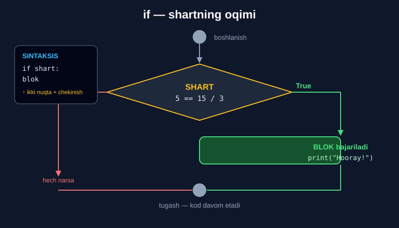

# 1-dars. `if` operatori

## 🎬 Boshlashdan oldin

> **"Python'dagi shart operatorlarining yorqin misoli — bu `if` operatori."**
>
> **"Uni nima uchun ishlatish mumkinligi INTUITIV, lekin SINTAKSISNI o'rganish juda muhim."**

Shu paytgacha kod **yuqoridan pastga** birma-bir bajarilardi. Endi u **tanlay boshlaydi**.

---

## 1. Birinchi misol

> **"Quyidagini o'ylang: AGAR 5 ga teng bo'lsa 15 bo'lingan 3 ga, U HOLDA chop et — Hooray!"**

```python
if 5 == 15 / 3:
    print("Hooray!")
```

```
Hooray!
```

---

## 2. Uchta muhim qoida

### Qoida 1 — `==`, `=` emas

> **"Birinchidan, unutmang: bu yerda IKKILANGAN tenglik belgisidan foydalanishimiz kerak, chunki biz 5 ning `15 / 3` ga tengligini TEKSHIRYAPMIZ, va `15 / 3` qiymatini 5 ga BIRIKTIRAYOTGANIMIZ YO'Q."**
>
> **"5 — o'zgaruvchi nomi emas, u — SON."**

```python
if 5 == 15 / 3:     # ✅ tekshiradi
if 5 = 15 / 3:      # ❌ SyntaxError
```

### Qoida 2 — ikki nuqta `:`

> **"Yaxshi. Endi IKKI NUQTA qo'yish HAL QILUVCHI ahamiyatga ega."**
>
> **"Ikki nuqta kompyuterga biz yozgan shart QANOATLANTIRILGAN bo'lsa nima qilishni aytadi."**

```python
if 5 == 15 / 3:
#                ↑ ikki nuqtani UNUTMANG
```

### Qoida 3 — chekinish

> **"Yaxshi o'qilishga erishish uchun `print` operatorini YANGI QATORGA yozishni tavsiya qilamiz."**
>
> **"Iltimos, eslang: u CHEKINTIRILGAN bo'lishi kerak. Aks holda XATOGA duch kelasiz."**

```python
if 5 == 15 / 3:
    print("Hooray!")
#   ↑ 4 ta bo'sh joy
```

*(13-modulning 7-darsi — chekinish — aynan shu uchun kerak edi.)*



---

## 3. Shart bajarilmasa nima bo'ladi?

> **"Agar 5 ning `18 / 3` ga tengligini tekshirsak, ishlaydimi?"**

```python
if 5 == 18 / 3:
    print("Hooray!")
```

```
(hech narsa)
```

> **"Ishlashi kerak emas, chunki 5 oltidan farq qiladi."**
>
> ## **"Biz hech narsa olmadik, chunki biz mashinaga berilgan shart QANOATLANTIRILMASA nima qilishni AYTMADIK."**
>
> **"Shuning uchun mashinaning `Hooray!` ni chop etishga hech qanday asosi yo'q."**

---

## 4. Boshqaruv oqimi

> **"Grafik sizga shartlar jarayonini tasavvur qilishga yordam beradi. Amaliyot natijasini ko'rsatishdan oldin mashina quyidagi mantiqiy qadamlarni bajaradi."**
>
> **"Agar shart rost bo'lmagani uchun shartli kod bajarilmasa — dasturimiz bizni to'g'ridan-to'g'ri boshqa natijaga, yoki bu holdagidek — HECH NARSAGA olib boradi."**
>
> **"Ikkala vaziyatdan keyin ham mashina keyingi qora nuqtaga o'tadi va u yerdan davom etadi."**

```
        shart?
       /      \
   True        False
     ↓           ↓
  blok        hech narsa
     \          /
      ↘      ↙
    tugash nuqtasi
          ↓
    kod davom etadi
```

> 🔑 **Muhim:** shart bajarilsa ham, bajarilmasa ham — dastur **to'xtamaydi**. U shunchaki `if` blokidan **keyingi** kodga o'tadi.

---

## 5. `!=` bilan

> **"Tengsizlik belgisi bilan sinab ko'raylik — u undov belgisi va tenglik belgisi bilan yoziladi."**

```python
if 5 != 3 * 6:
    print("Hooray!")
```

```
Hooray!
```

> **"5 `3 * 6` dan farq qilmaydimi? Ha, farq qiladi. Uning farq qilishi ROST. Shu sababli natijada `Hooray!` ni olamiz."**

> 🔑 `if` ichida **har qanday** solishtirish operatori ishlaydi: `==`, `!=`, `>`, `<`, `>=`, `<=`. Va **mantiqiy** operatorlar ham: `and`, `or`, `not`.

---

## 6. 💻 To'liq kod

```python
# ===== SHART BAJARILADI =====
if 5 == 15 / 3:
    print("Hooray!")            # Hooray!

# ===== SHART BAJARILMAYDI =====
if 5 == 18 / 3:
    print("Hooray!")            # (hech narsa)

# ===== TENGSIZLIK =====
if 5 != 3 * 6:
    print("Hooray!")            # Hooray!

# ===== KOD DAVOM ETADI =====
if False:
    print("Bu chiqmaydi")
print("Bu ESA chiqadi")         # Bu ESA chiqadi

# ===== KO'P QATORLI BLOK =====
narx = 5000
soni = 3
if soni > 0:
    oraliq = narx * soni        # blok ichida
    qqs = oraliq * 0.12         # blok ichida
    print("Jami:", oraliq + qqs)
print("Dastur tugadi")

# ===== MANTIQIY OPERATOR BILAN =====
x = 10
y = 25
if x > 3 and y > 13:
    print("Ikkala shart ham to'g'ri")
```

**Natija:**

```
Hooray!
Hooray!
Bu ESA chiqadi
Jami: 16800.0
Dastur tugadi
Ikkala shart ham to'g'ri
```

---

## 7. ⚠️ Keng tarqalgan xatolar

### Xato 1 — ikki nuqta yo'q

```python
if 5 > 2
    print("Salom")
```
```
SyntaxError: expected ':'
```

### Xato 2 — chekinish yo'q

```python
if 5 > 2:
print("Salom")
```
```
IndentationError: expected an indented block after 'if' statement
```

### Xato 3 — `=` va `==`

```python
if x = 5:
    print("Teng")
```
```
SyntaxError: invalid syntax. Maybe you meant '==' or ':=' instead of '='?
```

### Xato 4 — blokdan tashqarida qolish

```python
soni = 0
if soni > 0:
    print("Mahsulot bor")
print("Chek chop etildi")     # ← BU DOIM chiqadi
```

```
Chek chop etildi
```

> 🔑 Chekinish **kimga tegishli** ekanini belgilaydi. Bu `if` ni ham, funksiyani ham bir xil boshqaradi.

---

## 8. 📝 Rasmiy mashqlar (kursdan)

### Mashq 1
**Agar 5 dan 2 katta bo'lsa, "The condition has been satisfied" ni chop etadigan ikki qatorli kod yozing.**

<details>
<summary>✅ Yechim</summary>

```python
if 5 > 2:
    print("The condition has been satisfied")
```

```
The condition has been satisfied
```

</details>

### Mashq 2
**`x` ga 10, `y` ga 25 biriktiring. Bitta yacheykada 2 ta shart operatori yarating.**

**Birinchisi:** `x > 3` **va** `y > 13` bo'lsa `"Both conditions are correct"` chiqarsin.
**Ikkinchisi:** `x <= 3` **yoki** `y <= 13` bo'lsa `"At least one of the conditions is false"` chiqarsin.

**`x` va `y` qiymatlarini o'zgartirib, kod hali ham ishlashini tekshiring.**

<details>
<summary>✅ Yechim</summary>

```python
x = 10
y = 25

if x > 3 and y > 13:
    print('Both conditions are correct')
if x <= 3 or y <= 13:
    print('At least one of the conditions is false')
```

```
Both conditions are correct
```

**`x = 2`, `y = 25` bilan:**

```
At least one of the conditions is false
```

**`x = 2`, `y = 5` bilan:**

```
At least one of the conditions is false
```

> 🔑 **Diqqat:** bu **ikkita alohida** `if`. Ular bir-biriga bog'liq emas — ikkalasi ham tekshiriladi.

</details>

---

## 9. ⚡ Qo'shimcha mashqlar

### 🟢 Oson

**M1.** Yosh `18` dan katta bo'lsa `"Voyaga yetgan"` chiqaring.

**M2.** Son juft bo'lsa `"Juft son"` chiqaring. *(Ilgak: `% 2 == 0`)*

**M3.** Parol `"12345"` ga teng bo'lsa `"Kirish ruxsat etildi"` chiqaring.

<details>
<summary>✅ Yechimlar</summary>

```python
# M1
yosh = 20
if yosh > 18:
    print("Voyaga yetgan")          # Voyaga yetgan

# M2
son = 14
if son % 2 == 0:
    print("Juft son")               # Juft son

# M3
parol = "12345"
if parol == "12345":
    print("Kirish ruxsat etildi")   # Kirish ruxsat etildi
```

</details>

### 🟡 O'rta

**M4.** Xarid summasi `1 000 000` dan katta **va** mijoz doimiy bo'lsa — 15% chegirma hisoblang va chiqaring.

**M5.** Blok ichida **uchta** qator bo'lsin: hisob, tekshiruv va chiqarish.

**M6.** Ikkita alohida `if` yozing — ikkalasi ham bajariladigan qilib.

<details>
<summary>✅ Yechimlar</summary>

```python
# M4
summa = 1500000
doimiy = True
if summa > 1000000 and doimiy:
    chegirma = summa * 0.15
    print("Chegirma:", chegirma)          # Chegirma: 225000.0
    print("To'lov:", summa - chegirma)    # To'lov: 1275000.0

# M5
n = 3725
if n > 0:
    soat = n // 3600
    daqiqa = n % 3600 // 60
    print(soat, "soat", daqiqa, "daqiqa")    # 1 soat 2 daqiqa

# M6
son = 15
if son % 3 == 0:
    print("3 ga bo'linadi")     # 3 ga bo'linadi
if son % 5 == 0:
    print("5 ga bo'linadi")     # 5 ga bo'linadi
```

</details>

### 🔴 Qiyin

**M7.** Ichma-ich `if` yozing: yosh `>= 18` **va** ichida yana pasport bor-yo'qligini tekshiring.

**M8.** Xatoni toping va tuzating:
```python
x = 5
if x > 3:
print("Katta")
    print("Tugadi")
```

**M9.** `if` ichida `if` va `if` dan **keyin** kod — farqni ko'rsating.

<details>
<summary>✅ Yechimlar</summary>

```python
# M7
yosh = 20
pasport = True
if yosh >= 18:
    print("Yosh bo'yicha mos")
    if pasport:
        print("Hujjat bor — ruxsat berildi")
# Yosh bo'yicha mos
# Hujjat bor — ruxsat berildi

# M8 — ikkala print ham chekintirilishi kerak
x = 5
if x > 3:
    print("Katta")
    print("Tugadi")
# Katta
# Tugadi

# M9
x = 1
if x > 3:
    print("A")      # blok ICHIDA — bajarilmaydi
print("B")          # blok TASHQARISIDA — DOIM bajariladi
# B
```

</details>

---

## 10. 🧠 O'zini tekshirish savollari

1. `if` ichida qaysi tenglik belgisi ishlatiladi? Nima uchun?
2. `5` — o'zgaruvchimi?
3. Shartdan keyin nima qo'yiladi va u nima uchun kerak?
4. `print` qayerga yoziladi?
5. Chekinish unutilsa nima bo'ladi?
6. Shart bajarilmasa nima chiqadi va nima uchun?
7. Shart bajarilmagach dastur to'xtaydimi?
8. `if 5 != 3 * 6` nima beradi?

<details>
<summary>✅ Javoblar</summary>

1. **Ikkilangan** `==` — chunki biz **tekshiryapmiz**, biriktirmayapmiz.
2. **Yo'q** — u **son**.
3. **Ikki nuqta `:`** — u kompyuterga shart **qanoatlantirilganda** nima qilishni aytadi.
4. **Yangi qatorga** — yaxshi o'qilish uchun.
5. **Xatoga** duch kelasiz (`IndentationError`).
6. **Hech narsa** — chunki biz mashinaga shart bajarilmasa nima qilishni **aytmadik**.
7. **Yo'q** — u `if` blokidan **keyingi** kodga o'tadi.
8. **`Hooray!`** — chunki 5 va 18 **farq qiladi**, ya'ni shart **rost**.

</details>

---

## 📌 Xulosa

```python
if shart:
    blok
#  ↑    ↑
#  |    ikki nuqta MAJBURIY
#  chekinish MAJBURIY (4 bo'sh joy)


if 5 == 15 / 3:        →  Hooray!
    print("Hooray!")

if 5 == 18 / 3:        →  (hech narsa)
    print("Hooray!")

if 5 != 3 * 6:         →  Hooray!
    print("Hooray!")


OQIM:
       shart?
      /      \
   True      False
     ↓         ↓
   blok    hech narsa
     \       /
   tugash nuqtasi  →  kod DAVOM etadi


⚠️  ==  (=  EMAS!)
⚠️  :   unutilmasin
⚠️  chekinish unutilmasin
⚠️  blokdan tashqaridagi kod DOIM bajariladi
```

---

## 🔖 Atamalar

| Atama | Inglizcha | Izoh |
|---|---|---|
| Shart operatori | *conditional statement* | `if`, `elif`, `else` |
| Shart | *condition* | `True`/`False` qaytaruvchi ifoda |
| Ikki nuqta | *colon* | `:` — blok boshlanishini bildiradi |
| Chekinish | *indentation* | Blokni belgilaydigan bo'sh joy |
| Kod bloki | *block of code* | `if` ga tegishli qatorlar |
| Boshqaruv oqimi | *control flow* | Kod bajarilish tartibi |
| Shart qanoatlantirildi | *condition satisfied* | Shart `True` chiqdi |

---

🏠 [Modul boshiga](README.md) · ➡️ [Keyingi: `else` operatori](02-The-ELSE-Statement.md)
