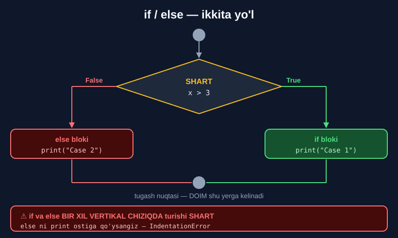

# 2-dars. `else` operatori

## 🎬 Boshlashdan oldin

1-darsda shart bajarilmaganda **hech narsa** chiqmasdi. Bu — yarim yechim.

Endi **ikkinchi yo'lni** o'rganamiz.

---

## 1. Muammo: ikkita `if`

> **"`x` ga 1 qiymatini biriktiraylik. Kompyuterdan `x` 3 dan katta bo'lsa `Case 1` ni, kichik yoki teng bo'lsa `Case 2` ni ko'rsatishini so'rashimiz mumkin."**
>
> **"Biz ketma-ket IKKITA `if` operatorini yozishimiz mumkin."**

```python
x = 1

if x > 3:
    print("Case 1")
if x <= 3:
    print("Case 2")
```

```
Case 2
```

> **"To'g'ri natija olamizmi? Ha, biz `Case 2` damiz."**

Ishlaydi — lekin **ikki marta** tekshirish bor.

---

## 2. Yechim: `else`

> **"Bu yerda o'zimizni ifodalashning QISQAROQ va YAXSHIROQ yo'li bor."**
>
> **"Ikkinchi qismda `if X 3 dan kichik yoki teng` deyish o'rniga, biz to'g'ridan-to'g'ri `else` yozib, ikki nuqta qo'yishimiz mumkin."**

```python
x = 1

if x > 3:
    print("Case 1")
else:
    print("Case 2")
```

```
Case 2
```

> ## **"`else` kompyuterga BOSHQA BARCHA HOLATLARDA keyingi buyruqni bajarishni aytadi."**
>
> **"Bizning kichik dasturimizda bu `x` 3 dan katta BO'LMAGAN barcha holatlarni bildiradi — ya'ni `x` 3 dan kichik yoki teng bo'lganda."**



---

## 3. Nima uchun `else` yaxshiroq?

| Ikkita `if` | `if` / `else` |
|---|---|
| Shart **ikki marta** tekshiriladi | **Bir marta** |
| Shartni **ikki marta** yozasiz | **Bir marta** |
| Xato qilish oson (`<` va `<=` adashtirish) | Xato qilish **mumkin emas** |
| Ikkalasi ham bajarilishi mumkin | **Faqat bittasi** bajariladi |

### ⚠️ Xavfli misol

```python
x = 3

# ❌ IKKI IF — shartlar to'g'ri qo'yilmagan
if x > 3:
    print("Katta")
if x < 3:
    print("Kichik")
# HECH NARSA chiqmaydi! x = 3 hech qaysi shartga tushmadi

# ✅ IF/ELSE — bunday bo'lishi MUMKIN EMAS
if x > 3:
    print("Katta")
else:
    print("Katta emas")     # Katta emas
```

> ## 🔑 **`else` — "qolgan HAMMA holat". Undan qochib qutilib bo'lmaydi.**

---

## 4. Boshqaruv oqimi

> **"Bu rasm oldingi darsda ko'rganimizga qo'shiladi. Shart yolg'on bo'lsa HECH QANDAY NATIJAGA olib borish o'rniga, biz `else` kodiga tushamiz."**
>
> **"Bizning holatda bu — qavs ichida `Case 2` satri argument sifatida yozilgan `print` funksiyasi."**
>
> **"Dastlabki shart QANOATLANTIRILGAN-QANOATLANTIRILMAGANIDAN QAT'I NAZAR, biz tugash nuqtasiga yetamiz."**
>
> **"Ya'ni kompyuter butun amaliyotni yakunladi va yangisini bajarishga tayyor."**

```
       shart?
      /      \
   True      False
     ↓         ↓
 if bloki   else bloki
     \        /
      ↘    ↙
   tugash nuqtasi     ← DOIM shu yerga kelinadi
```

---

## 5. ⚠️ Chekinish tuzog'i

> **"Endi menga mavzu bo'yicha ikkita eslatma ulashishga ruxsat bering."**
>
> ## **"Kodingizni O'Z BOSHIMCHALIK bilan tashkil qilish tuzog'iga tushmang. Buni qilishning QAT'IY usuli bor, va chekinish yana KALIT rol o'ynaydi."**
>
> **"`else` kalit so'zini birinchi `print` so'zining ostiga qo'yish kerakmi? Hech narsa bo'lmaydi."**

```python
x = 1

if x > 3:
    print("Case 1")
    else:
        print("Case 2")
```

```
SyntaxError: invalid syntax
```

> ## **"Esda tuting: `if` va `else` kalit so'zlarini BIR XIL VERTIKAL CHIZIQQA joylashtiring."**

```python
# ✅ TO'G'RI
if x > 3:
    print("Case 1")
else:                    # ← if bilan bir xil vertikal chiziqda
    print("Case 2")
```

```
if x > 3:
│   print("Case 1")
else:
│   print("Case 2")
↑
bir xil ustunda
```

---

## 6. Kod bloklari tushunchasi

> **"Bu — sizni KOD BLOKLARI tushunchasi bilan tanishtirish uchun to'g'ri payt."**
>
> **"`if` operatori — ya'ni shart plyus tegishli `print` funksiyasi — BIRINCHI kod blokini hosil qiladi."**
>
> **"Butun `else` operatori esa O'ZICHA boshqa kod blokini hosil qiladi."**

```python
if x > 3:              ┐
    print("Case 1")    ┘  ← 1-BLOK

else:                  ┐
    print("Case 2")    ┘  ← 2-BLOK
```

> **"Shuning uchun ko'p kodli uzun varaqda sizda JUDA KO'P bloklar bo'ladi, va KATTAROQ dasturlar BLOKMA-BLOK quriladi."**

> 🔑 **Bu — dasturlashning asosiy g'oyasi.** Katta dastur — bu bir-biriga ulangan **kichik bloklar** to'plami.

---

## 7. 💻 To'liq kod

```python
# ===== IKKITA IF (eski usul) =====
x = 1
if x > 3:
    print("Case 1")
if x <= 3:
    print("Case 2")            # Case 2

# ===== IF / ELSE (to'g'ri usul) =====
x = 1
if x > 3:
    print("Case 1")
else:
    print("Case 2")            # Case 2

# ===== ELSE HAR DOIM ISHLAYDI =====
x = 100
if x > 3:
    print("Case 1")            # Case 1
else:
    print("Case 2")

# ===== KO'P QATORLI BLOKLAR =====
summa = 1500000
if summa > 1000000:
    chegirma = summa * 0.15
    print("Chegirma bor:", chegirma)
    print("To'lov:", summa - chegirma)
else:
    print("Chegirma yo'q")
    print("To'lov:", summa)

# ===== BLOKDAN KEYIN =====
print("Dastur tugadi")
```

**Natija:**

```
Case 2
Case 2
Case 1
Chegirma bor: 225000.0
To'lov: 1275000.0
Dastur tugadi
```

---

## 8. 📝 Rasmiy mashq (kursdan)

### Mashq 1
**`x` ma'lum kunda olingan buyurtmalar sonini bildirsin.**

**`x` ga 102 biriktiring. `x` 100 dan katta bo'lsa `"A busy day"`, aks holda `"A calm day"` chiqaradigan dastur yarating. Kod to'g'ri ishlashini tekshirish uchun `x` ni 97 ga o'zgartiring.**

<details>
<summary>✅ Yechim</summary>

```python
x = 102

if x > 100:
    print("A busy day")
else:
    print("A calm day")
```

```
A busy day
```

**`x = 97` bilan:**

```python
x = 97

if x > 100:
    print("A busy day")
else:
    print("A calm day")
```

```
A calm day
```

</details>

---

## 9. ⚡ Qo'shimcha mashqlar

### 🟢 Oson

**M1.** Yosh `18` dan katta yoki teng bo'lsa `"Voyaga yetgan"`, aks holda `"Voyaga yetmagan"`.

**M2.** Son juft bo'lsa `"Juft"`, aks holda `"Toq"`.

**M3.** Parol to'g'ri bo'lsa `"Xush kelibsiz"`, aks holda `"Parol xato"`.

<details>
<summary>✅ Yechimlar</summary>

```python
# M1
yosh = 16
if yosh >= 18:
    print("Voyaga yetgan")
else:
    print("Voyaga yetmagan")        # Voyaga yetmagan

# M2
son = 7
if son % 2 == 0:
    print("Juft")
else:
    print("Toq")                    # Toq

# M3
parol = "python"
if parol == "12345":
    print("Xush kelibsiz")
else:
    print("Parol xato")             # Parol xato
```

</details>

### 🟡 O'rta

**M4.** Xarid `1 000 000` dan katta bo'lsa 15% chegirma, aks holda chegirma yo'q. Ikkala holatda ham **yakuniy summani** chiqaring.

**M5.** Yil kabisa yilmi? `if/else` bilan yozing va fevral kunlarini chiqaring.

**M6.** Ikki sondan kattasini toping (`if/else` bilan).

<details>
<summary>✅ Yechimlar</summary>

```python
# M4
summa = 800000
if summa > 1000000:
    yakuniy = summa * 0.85
    print("15% chegirma qo'llandi")
else:
    yakuniy = summa
    print("Chegirma yo'q")
print("Yakuniy summa:", yakuniy)
# Chegirma yo'q
# Yakuniy summa: 800000

# M5
yil = 2024
if yil % 4 == 0 and (yil % 100 != 0 or yil % 400 == 0):
    print("Kabisa yili — fevralda 29 kun")
else:
    print("Oddiy yil — fevralda 28 kun")
# Kabisa yili — fevralda 29 kun

# M6
a, b = 17, 42
if a > b:
    print("Kattasi:", a)
else:
    print("Kattasi:", b)            # Kattasi: 42
```

</details>

### 🔴 Qiyin

**M7.** Xatoni toping va tuzating:
```python
x = 5
if x > 3:
    print("Katta")
    else:
        print("Kichik")
```

**M8.** Ichma-ich `if/else` yozing: avval yoshni, keyin hujjatni tekshiring — **uchta** natija chiqsin.

**M9.** Bir xil natijani `if/else` **siz** oling (`bool` ni son sifatida ishlatib).

<details>
<summary>✅ Yechimlar</summary>

```python
# M7 — else if bilan BIR XIL ustunda bo'lishi kerak
x = 5
if x > 3:
    print("Katta")
else:
    print("Kichik")                 # Katta

# M8
yosh = 20
hujjat = False
if yosh >= 18:
    if hujjat:
        print("Ruxsat berildi")
    else:
        print("Hujjat kerak")       # Hujjat kerak
else:
    print("Yosh yetarli emas")

# M9
summa = 1500000
katta = summa > 1000000
yakuniy = summa * (0.85 * katta + 1 * (not katta))
print(yakuniy)                      # 1275000.0
# ⚠️ Ishlaydi, lekin if/else O'QISH OSONROQ. Amalda if/else ishlating.
```

</details>

---

## 10. 🧠 O'zini tekshirish savollari

1. Ikkita `if` o'rniga nima yozish mumkin?
2. `else` kompyuterga nima deydi?
3. `else` dan keyin nima qo'yiladi?
4. `x > 3` bo'lmagan barcha holatlar nimani anglatadi?
5. `else` ni `print` ostiga qo'ysak nima bo'ladi?
6. `if` va `else` qayerda turishi kerak?
7. Kod bloki nima?
8. Katta dasturlar qanday quriladi?
9. Tugash nuqtasiga qachon kelinadi?

<details>
<summary>✅ Javoblar</summary>

1. **`else`** — qisqaroq va yaxshiroq usul.
2. **Boshqa barcha holatlarda** keyingi buyruqni bajarishni.
3. **Ikki nuqta `:`** — shart **yo'q**.
4. `x` 3 dan **kichik yoki teng** bo'lganda.
5. **Hech narsa bo'lmaydi** — `SyntaxError`.
6. **Bir xil vertikal chiziqda.**
7. Shart plyus tegishli buyruqlar — masalan, butun `if` yoki butun `else`.
8. **Blokma-blok.**
9. Dastlabki shart bajarilgan-bajarilmaganidan **qat'i nazar** — **doim**.

</details>

---

## 📌 Xulosa

```python
if shart:
    1-blok
else:
    2-blok

⚠️  else da SHART YO'Q — faqat  else:
⚠️  if va else BIR XIL vertikal chiziqda
⚠️  else ni chekintirsangiz → SyntaxError


IKKI IF                    IF / ELSE
─────────                  ─────────
if x > 3:                  if x > 3:
    print("A")                 print("A")
if x <= 3:                 else:
    print("B")                 print("B")

shart 2 marta              shart 1 marta
ikkalasi bajarilishi       FAQAT BITTASI
  yoki hech biri             bajariladi
  bajarilmasligi mumkin


OQIM:
       shart?
      /      \
   True      False
     ↓         ↓
 if bloki  else bloki
     \       /
   tugash nuqtasi   ← DOIM

🧱 Katta dastur = ko'p BLOK. Blokma-blok quriladi.
```

---

## 🔖 Atamalar

| Atama | Inglizcha | Izoh |
|---|---|---|
| `else` | *else* | "Aks holda" — qolgan barcha holat |
| Kod bloki | *block of code* | Bir guruh bog'liq buyruqlar |
| Tugash nuqtasi | *endpoint* | Shartdan keyin kod davom etadigan joy |
| Vertikal chiziq | *vertical line* | Bir xil chekinish darajasi |

---

⬅️ [Oldingi: `if` operatori](01-The-IF-Statement.md) · ➡️ [Keyingi: `elif` operatori](03-The-ELIF-Statement.md)
