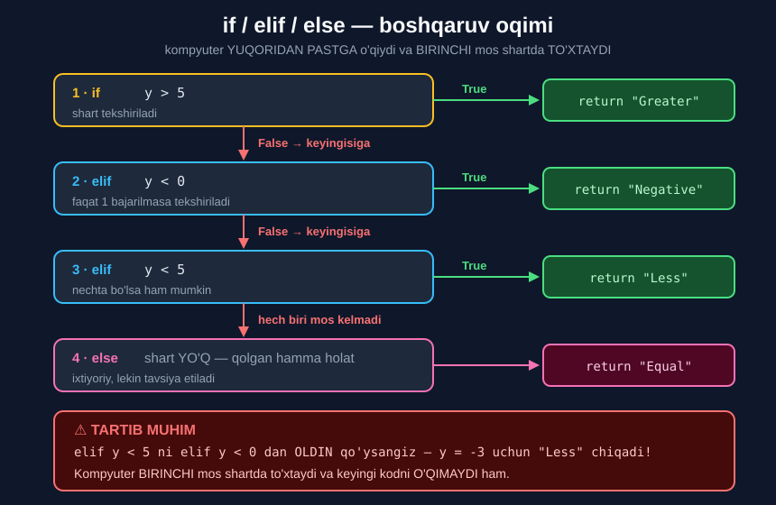

# 3-dars. `elif` operatori

## 🎬 Boshlashdan oldin

> **"Bu darsda biz ifodalarimizdan biriga ikkinchi `if` operatorini qo'shishning NAFIS usulini o'rganamiz."**
>
> **"Bu `elif` kalit so'zi yordamida amalga oshiriladi."**

`if`/`else` — **ikkita** yo'l. `elif` — **istalgancha ko'p** yo'l.

---

## 1. `elif` nima?

**`elif`** = **`el`**se + **`if`** = "aks holda, agar..."

> **"Agar `y` 5 dan katta bo'lmasa, kompyuter o'ylaydi: AKS HOLDA AGAR `y` 5 dan kichik bo'lsa — `elif y < 5` deb yozilgan — u holda men `Less` ni chop etaman."**
>
> **"Va `else` operatori tegishli blok bilan davom etadi — u `Equal` qaytaradi."**

```python
def compare_to_five(y):
    if y > 5:
        return "Greater"
    elif y < 5:
        return "Less"
    else:
        return "Equal"
```

> 📌 **Funksiyalar** to'liq **16-modulda** o'rganiladi. Hozircha `def ... return` ni shunchaki "qayta ishlatiladigan kod" deb qabul qiling.

---

## 2. Sinab ko'ramiz

> **"Kodni to'g'ri yozganimizni tasdiqlaylik."**

```python
print(compare_to_five(10))
```

```
Greater
```

> **"`Greater` deydigan javobni kutamiz, chunki 10 beshdan katta. To'g'ri."**

```python
print(compare_to_five(2))
```

```
Less
```

> **"Mashina bizga 2 beshdan kichik ekanini aytadi, va biz aynan shuni kutgan edik."**

```python
print(compare_to_five(5))
```

```
Equal
```

> **"Uchinchi natija uchun 5 sonini 5 dan katta ham, kichik ham bo'lmagan son bilan solishtirishimiz kerak. Bu faqat funksiyaning argumenti 5 bo'lganda sodir bo'ladi, to'g'rimi?"**
>
> **"Kutilganidek `Equal` ni oldik."**

---

## 3. Nechta `elif` bo'lishi mumkin?

> ## **"Bilib qo'ying: siz KERAK BO'LGANCHA `elif` operatorlarini qo'sha olasiz."**

> **"Misol keltiraylik. Agar `y` noldan kichik bo'lsa, `Negative` satri ko'rsatilishi kerak."**
>
> **"Men blokni `if` va boshqa `elif` operatori ORASIGA joylashtiraman."**

```python
def compare_to_five(y):
    if y > 5:
        return "Greater"
    elif y < 0:              # ← YANGI, o'rtaga qo'yildi
        return "Negative"
    elif y < 5:
        return "Less"
    else:
        return "Equal"
```

```python
print(compare_to_five(-3))
```

```
Negative
```

> **"−3 argumentli funksiya `Negative` ni ko'rsatadi — xuddi kerak bo'lganidek."**

```python
print(compare_to_five(3))
```

```
Less
```

> **"Kichik dasturimiz to'g'ri ishlashini nazorat qilay. Agar undan 5 bilan 0 va 5 oralig'idagi qiymatni — masalan, 3 ni — solishtirishni so'rasam..."**
>
> **"Ha, `Less` ni ko'ramiz. Demak hammasi joyida."**



---

## 4. 🔑 Boshqaruv oqimi

> **"Eslab qolishga harakat qilishingiz kerak bo'lgan JUDA MUHIM tafsilot: kompyuter buyruqlaringizni QANDAY TEZLIKDA ishlashidan QAT'I NAZAR, DOIM YUQORIDAN PASTGA o'qiydi."**
>
> ## **"U bir vaqtning o'zida FAQAT BITTA buyruqni bajaradi."**

> **"Ilmiy tilda aytganda, mashinaga beradigan ko'rsatmalarimiz BOSHQARUV OQIMI ning bir qismidir."**
>
> **"Bu — kompyuterning mantiqiy fikr oqimiga o'xshash narsa; kompyuterning bosqichma-bosqich, qadamlarni QAT'IY TARTIBDA bajarib fikrlash usuli."**

> **"Shart operatori bilan ishlaganda kompyuterning vazifasi — ma'lum shart QANOATLANTIRILGANDAN KEYIN muayyan buyruqni bajarish."**
>
> **"U buyruqlaringizni yuqoridagi `if` operatoridan, o'rtadagi `elif` operatorlari orqali, oxiridagi `else` operatorigacha o'qiydi."**

### Eng muhim jumla

> ## **"Mashina QANOATLANTIRILGAN shartni topgan BIRINCHI ONDA — u tegishli natijani chop etadi va bu shartning BOSHQA HECH QANDAY qismini BAJARMAYDI."**

> **"Bizning misolimizda, agar birinchi gap to'g'ri bo'lsa — biz 1-raqamli tegishli natijani, ya'ni `Greater` satrini chop etishni ko'ramiz."**
>
> **"Kompyuter `elif` va `else` operatorlarini E'TIBORGA OLMAYDI va kodning qolgan qismi bilan davom etadi."**

```
if     →  shart True mi?  →  HA  →  bajarish va TO'XTASH
                              YO'Q ↓
elif   →  shart True mi?  →  HA  →  bajarish va TO'XTASH
                              YO'Q ↓
elif   →  shart True mi?  →  HA  →  bajarish va TO'XTASH
                              YO'Q ↓
else   →  shartsiz        →       bajarish
```

---

## 5. ⚠️ TARTIB MUHIM — eng katta tuzoq

> **"Endi ko'rsatmalar tartibi muhim ekanini isbotlash uchun ikki `elif` operatorining o'rnini ALMASHTIRAMAN."**

```python
def compare_to_five(y):
    if y > 5:
        return "Greater"
    elif y < 5:              # ← endi BIRINCHI
        return "Less"
    elif y < 0:              # ← endi IKKINCHI
        return "Negative"
    else:
        return "Equal"
```

```python
print(compare_to_five(-3))
```

```
Less
```

> **"Ha! `Negative` o'rniga biz `Less` ni oldik."**

### Kompyuter qanday fikrlaydi

> **"Kompyuter shunday mulohaza yuritadi: faraz qilaylik `y` −3 ga teng."**
>
> **"`y` 5 dan katta bo'lsa `Greater` chop et. U 5 dan kattami? YO'Q."**
>
> **"Demak kompyuter davom etadi va kodimizda boshqa gaplar bor-yo'qligini tekshiradi. Boshqa gaplar borligini hisobga olib, u oldinga siljiydi."**
>
> **"Demak, `y` 5 dan kichikmi? HA, kichik."**
>
> ## **"Bu paytda kompyuter o'ylaydi: ajoyib, tushundim. Mening sonim 5 dan kichik. Dasturchim mendan so'ragan narsani qondirdim. Men `Less` ni chop etaman va tinchman."**
>
> **"Va mashina SHU YERDA TO'XTAYDI va bu blokda keyingi kodning BITTA HARFINI ham bajarmaydi."**

> **"Siz `y` noldan kichik yoki roppa-rosa 5 ga teng holatlarni tekshirayotganingiz HECH QANDAY AHAMIYATGA ega emas. Ular FOYDASIZ bo'lib qoladi."**
>
> **"−3 ning ham, 3 ning ham natijasini so'rasangiz — baribir `Less` yorlig'i bilan qanoatlanishingizga to'g'ri keladi."**

### 🔑 Qoida

> ## **ENG TOR shartni ENG OLDIN, ENG KENG shartni ENG OXIRIDA yozing.**

```
❌ NOTO'G'RI              ✅ TO'G'RI
y < 5    (keng)          y < 0    (tor)
y < 0    (tor)           y < 5    (keng)
```

`y = -3` uchun:
- `y < 5` ham **rost**, `y < 0` ham **rost**
- Lekin kompyuter **birinchi** rostda to'xtaydi

---

## 6. 💻 To'liq kod

```python
# ===== ASOSIY VARIANT =====
def compare_to_five(y):
    if y > 5:
        return "Greater"
    elif y < 5:
        return "Less"
    else:
        return "Equal"

print(compare_to_five(10))     # Greater
print(compare_to_five(2))      # Less
print(compare_to_five(5))      # Equal


# ===== TO'RTTA HOLAT — TO'G'RI TARTIB =====
def compare_v2(y):
    if y > 5:
        return "Greater"
    elif y < 0:                # TOR shart OLDIN
        return "Negative"
    elif y < 5:                # KENG shart KEYIN
        return "Less"
    else:
        return "Equal"

print(compare_v2(-3))          # Negative
print(compare_v2(3))           # Less


# ===== NOTO'G'RI TARTIB =====
def compare_v3(y):
    if y > 5:
        return "Greater"
    elif y < 5:                # KENG shart OLDIN — XATO!
        return "Less"
    elif y < 0:                # bu HECH QACHON bajarilmaydi
        return "Negative"
    else:
        return "Equal"

print(compare_v3(-3))          # Less    ← Negative EMAS!
print(compare_v3(3))           # Less
```

**Natija:**

```
Greater
Less
Equal
Negative
Less
Less
Less
```

---

## 7. 📝 Rasmiy mashqlar (kursdan)

### Mashq 1
**`x` ga 200 biriktiring. Quyidagi kodni yarating:**
- `x > 200` bo'lsa `"Big"`
- `x > 100` **va** `x <= 200` bo'lsa `"Average"`
- `x <= 100` bo'lsa `"Small"`

**`if`, `elif` va `else` kalit so'zlaridan foydalaning. Natija qanday o'zgarishini ko'rish uchun `x` ning boshlang'ich qiymatini o'zgartiring.**

<details>
<summary>✅ Yechim</summary>

```python
x = 200

if x > 200:
    print("Big")
elif x > 100 and x <= 200:
    print("Average")
else:
    print("Small")
```

```
Average
```

**Boshqa qiymatlar bilan:**

| `x` | Natija |
|---|---|
| `250` | `Big` |
| `200` | `Average` |
| `150` | `Average` |
| `100` | `Small` |
| `50` | `Small` |

> 💡 **Soddalashtirish:** `elif` ga yetganda `x > 200` allaqachon **yolg'on**, ya'ni `x <= 200` **avtomatik** rost. Shuning uchun `and x <= 200` **ortiqcha**:
> ```python
> elif x > 100:
>     print("Average")
> ```
> Lekin kursdagi variant ham **to'g'ri** va **aniqroq o'qiladi**.

</details>

### Mashq 2
**Oldingi koddagi birinchi ikki shartni saqlang. Yangi `elif` qo'shing — natijada dastur `x >= 0` va `x <= 100` bo'lsa `"Small"`, `x < 0` bo'lsa `"Negative"` chiqarsin.**

**Kod to'g'riligini tekshirish uchun `x` ga avval 50, keyin −50 qiymatini bering.**

<details>
<summary>✅ Yechim</summary>

```python
x = 200

if x > 200:
    print("Big")
elif x > 100 and x <= 200:
    print("Average")
elif x >= 0 and x <= 100:
    print("Small")
else:
    print("Negative")
```

```
Average
```

**`x = 50` bilan:**

```
Small
```

**`x = -50` bilan:**

```
Negative
```

> 🔑 Bu yerda **tartib to'g'ri**: `x >= 0 and x <= 100` shartida `x >= 0` bor, shuning uchun manfiy sonlar bu yerga **tushmaydi** va `else` ga yetadi.

</details>

---

## 8. ⚡ Qo'shimcha mashqlar

### 🟢 Oson

**M1.** Baho tizimi: `>= 90` → `"A'lo"`, `>= 70` → `"Yaxshi"`, `>= 50` → `"Qoniqarli"`, aks holda `"Qoniqarsiz"`.

**M2.** Yosh toifasi: `< 7` → `"Bola"`, `< 18` → `"O'smir"`, `< 60` → `"Katta"`, aks holda `"Nafaqaxo'r"`.

**M3.** Harorat: `< 0` → `"Sovuq"`, `< 15` → `"Salqin"`, `< 30` → `"Iliq"`, aks holda `"Issiq"`.

<details>
<summary>✅ Yechimlar</summary>

```python
# M1
ball = 85
if ball >= 90:
    print("A'lo")
elif ball >= 70:
    print("Yaxshi")            # Yaxshi
elif ball >= 50:
    print("Qoniqarli")
else:
    print("Qoniqarsiz")

# M2
yosh = 15
if yosh < 7:
    print("Bola")
elif yosh < 18:
    print("O'smir")            # O'smir
elif yosh < 60:
    print("Katta")
else:
    print("Nafaqaxo'r")

# M3
harorat = 22
if harorat < 0:
    print("Sovuq")
elif harorat < 15:
    print("Salqin")
elif harorat < 30:
    print("Iliq")              # Iliq
else:
    print("Issiq")
```

> 🔑 Uchalasida ham shartlar **tartib bilan** — eng kichikdan kattaga. Shuning uchun `and` **kerak emas**.

</details>

### 🟡 O'rta

**M4.** Yuqoridagi M1 ning shartlar tartibini **teskarisiga** o'zgartiring. Nima buziladi?

**M5.** Chegirma tizimi: summa `> 5 000 000` → 20%, `> 1 000 000` → 15%, `> 500 000` → 10%, aks holda 0%.

**M6.** Fasl aniqlash: oy raqami bo'yicha `12,1,2` → `"Qish"`, `3,4,5` → `"Bahor"` va h.k.

<details>
<summary>✅ Yechimlar</summary>

```python
# M4 — TESKARI TARTIB
ball = 95
if ball >= 50:
    print("Qoniqarli")         # Qoniqarli  ← XATO! A'lo bo'lishi kerak edi
elif ball >= 70:
    print("Yaxshi")            # HECH QACHON bajarilmaydi
elif ball >= 90:
    print("A'lo")              # HECH QACHON bajarilmaydi
else:
    print("Qoniqarsiz")
# Saboq: eng TOR shart eng OLDIN

# M5
summa = 2000000
if summa > 5000000:
    foiz = 20
elif summa > 1000000:
    foiz = 15                  # ← bu ishlaydi
elif summa > 500000:
    foiz = 10
else:
    foiz = 0
print("Chegirma:", foiz, "%")             # Chegirma: 15 %
print("To'lov:", summa * (100 - foiz) / 100)   # To'lov: 1700000.0

# M6
oy = 4
if oy == 12 or oy == 1 or oy == 2:
    print("Qish")
elif oy == 3 or oy == 4 or oy == 5:
    print("Bahor")             # Bahor
elif oy == 6 or oy == 7 or oy == 8:
    print("Yoz")
else:
    print("Kuz")
```

</details>

### 🔴 Qiyin

**M7.** Nima uchun bu kodda `elif y < 0` **hech qachon** bajarilmaydi? Tuzating.
```python
def f(y):
    if y > 5:
        return "Greater"
    elif y < 5:
        return "Less"
    elif y < 0:
        return "Negative"
    else:
        return "Equal"
```

**M8.** Kabisa yilini `if/elif/else` bilan **`and`/`or` siz** yozing (faqat ichma-ich shartlar).

**M9.** Uchburchak turini aniqlang: teng tomonli, teng yonli, turli tomonli — va avval **mavjudligini** tekshiring.

<details>
<summary>✅ Yechimlar</summary>

```python
# M7 — y < 0 bo'lganda y < 5 ham ROST, va kompyuter u yerda TO'XTAYDI
def f(y):
    if y > 5:
        return "Greater"
    elif y < 0:                # TOR shartni OLDIN qo'ydik
        return "Negative"
    elif y < 5:
        return "Less"
    else:
        return "Equal"

print(f(-3))       # Negative
print(f(3))        # Less

# M8 — ichma-ich shartlar bilan
yil = 2000
if yil % 4 != 0:
    print("Oddiy yil")
elif yil % 100 != 0:
    print("Kabisa yili")
elif yil % 400 != 0:
    print("Oddiy yil")
else:
    print("Kabisa yili")       # Kabisa yili

# M9
a, b, c = 5, 5, 8
if a + b <= c or a + c <= b or b + c <= a:
    print("Bunday uchburchak MAVJUD EMAS")
elif a == b and b == c:
    print("Teng tomonli")
elif a == b or b == c or a == c:
    print("Teng yonli")        # Teng yonli
else:
    print("Turli tomonli")
```

</details>

---

## 9. 🧠 O'zini tekshirish savollari

1. `elif` nima uchun kerak?
2. Nechta `elif` yozish mumkin?
3. Kompyuter buyruqlarni qaysi yo'nalishda o'qiydi?
4. Bir vaqtda nechta buyruq bajaradi?
5. Boshqaruv oqimi nima?
6. Mashina mos shartni topganda nima qiladi?
7. Nima uchun `elif y < 5` ni `elif y < 0` dan oldin qo'yish xato?
8. Shartlarni qanday tartibda yozish kerak?

<details>
<summary>✅ Javoblar</summary>

1. Ifodaga **ikkinchi (va uchinchi, to'rtinchi...) `if`** ni **nafis** qo'shish uchun.
2. **Kerak bo'lgancha** — cheklov yo'q.
3. **Yuqoridan pastga.**
4. **Faqat bittasini.**
5. Kompyuterning **bosqichma-bosqich, qat'iy tartibda** fikrlash oqimi.
6. Tegishli natijani chop etadi va **boshqa hech qanday** qismni bajarmaydi.
7. Chunki `y = -3` uchun `y < 5` **ham rost** — mashina u yerda **to'xtaydi** va `y < 0` ga **yetmaydi**.
8. **Eng tor shart eng oldin**, eng keng shart eng oxirida.

</details>

---

## 📌 Xulosa

```python
if shart_1:
    1-blok
elif shart_2:
    2-blok
elif shart_3:
    3-blok
else:
    oxirgi blok


🔑 elif = else + if = "aks holda, agar..."
🔑 elif lar soni CHEKLANMAGAN
🔑 else — ixtiyoriy, lekin tavsiya etiladi


BOSHQARUV OQIMI:

if     shart True?  →  HA  →  bajarish va TO'XTASH
          ↓ YO'Q
elif   shart True?  →  HA  →  bajarish va TO'XTASH
          ↓ YO'Q
elif   shart True?  →  HA  →  bajarish va TO'XTASH
          ↓ YO'Q
else                →       bajarish


⚠️  ENG KATTA TUZOQ — TARTIB

❌  elif y < 5      ✅  elif y < 0
    elif y < 0          elif y < 5
    (y=-3 → "Less")     (y=-3 → "Negative")

🔑 ENG TOR shart ENG OLDIN
🔑 Mashina BIRINCHI mos shartda TO'XTAYDI —
   keyingi kodni O'QIMAYDI ham
```

---

## 🔖 Atamalar

| Atama | Inglizcha | Izoh |
|---|---|---|
| `elif` | *elif (else if)* | "Aks holda, agar..." |
| Boshqaruv oqimi | *control flow* | Kod bajarilish tartibi |
| Yuqoridan pastga | *top to bottom* | Kompyuter o'qish yo'nalishi |
| Foydasiz kod | *unreachable code* | Hech qachon bajarilmaydigan shart |
| Tor shart | *narrow condition* | Kam holatni qamraydi |
| Keng shart | *broad condition* | Ko'p holatni qamraydi |

---

⬅️ [Oldingi: `else` operatori](02-The-ELSE-Statement.md) · ➡️ [Keyingi: Boolean qiymatlar haqida](04-A-Note-on-Boolean-Values.md)
