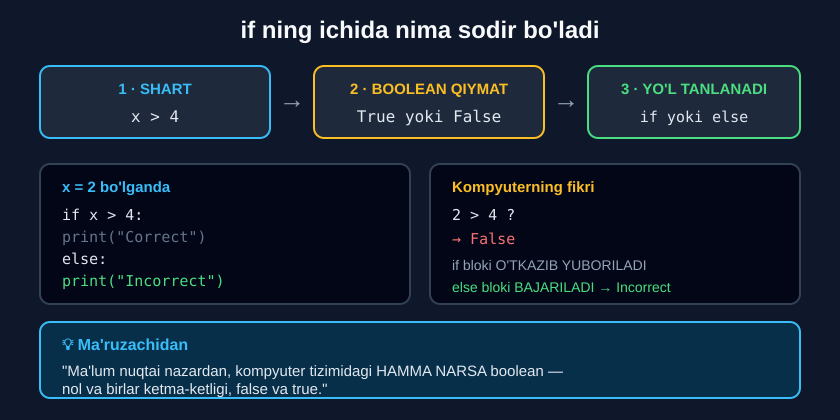

# 4-dars. Boolean qiymatlar haqida eslatma

## 🎬 Boshlashdan oldin

> **"Siz shubhasiz sezdingiz — biz bu yerda boolean qiymatlar haqida bir necha marta gapirdik."**
>
> **"Ularning qo'llanilishini tushuntirishga qaratilgan qisqa video taqdim etmoqchimiz."**

Bu — modulning **eng qisqa**, lekin **eng chuqur** darsi.

---

## 1. Misol

> **"`x` ikkiga teng bo'lsin."**
>
> **"Keyin ko'radigan narsangiz — `if else` konstruksiyasi. Agar `x` o'zgaruvchisining qiymati 4 dan katta bo'lsa — `Correct` ni chop et. Boshqa barcha holatlarda — `Incorrect` ni chop et."**

```python
x = 2

if x > 4:
    print("Correct")
else:
    print("Incorrect")
```

```
Incorrect
```

---

## 2. Boolean element qayerda?

> **"Demak, bu hisoblash mantig'idagi Boolean element qaysi?"**
>
> ## **"Asosan, siz `if` operatoringizni kiritganingizdan so'ng, kompyuter unga natijaning qiymatiga qarab BOOLEAN QIYMAT biriktiradi — `True` yoki `False` — va taklif qilingan natijalardan birini hosil qiladi: `Correct` yoki `Incorrect`."**



### Bosqichma-bosqich

```
1.  x = 2
    ↓
2.  SHART:  x > 4
    ↓
3.  HISOBLANADI:  2 > 4
    ↓
4.  BOOLEAN QIYMAT:  False        ← mana bu yerda!
    ↓
5.  YO'L TANLANADI:  else bloki
    ↓
6.  NATIJA:  Incorrect
```

---

## 3. Ikkala yo'l

> **"Agar birinchi gap ROST bo'lsa — ya'ni `x` 4 dan katta bo'lsa — mashina tegishli gapni chop etadi: `Correct`."**
>
> **"`Else` — bu `x` 4 dan katta degan gap NOROST bo'lsa, aniqrog'i FALSE bo'lsa degani — u holda `Incorrect` gapi chop etiladi."**

| `x` | `x > 4` | Boolean | Natija |
|---|---|---|---|
| `2` | `2 > 4` | **`False`** | `Incorrect` |
| `10` | `10 > 4` | **`True`** | `Correct` |
| `4` | `4 > 4` | **`False`** | `Incorrect` |
| `5` | `5 > 4` | **`True`** | `Correct` |

---

## 4. 💡 Katta g'oya

> ## **"Ma'lum nuqtai nazardan, kompyuter tizimidagi HAMMA NARSA boolean — nol va birlar, false va true ketma-ketligidan iborat."**
>
> **"Aynan shuning uchun biz Boolean qiymatga e'tibor qaratyapmiz."**
>
> **"U bizga UMUMIY HISOBLASH MANTIG'INI va Python'da shartlar QANDAY ISHLASHINI tushunishga yordam beradi."**

```
Har qanday shart  →  True yoki False  →  yo'l tanlanadi
```

Bu — **butun dasturlashning** poydevori. Qanchalik murakkab dastur bo'lmasin, u pastki qavatda **`True`/`False`** ketma-ketligiga aylanadi.

---

## 5. Buni o'zingiz ko'ring

Shartni `if` dan **tashqarida** ham hisoblash mumkin — natija **bir xil**:

```python
x = 2

# ===== ODATDAGI USUL =====
if x > 4:
    print("Correct")
else:
    print("Incorrect")

# ===== BOOLEAN QIYMATNI KO'RSATIB =====
natija = x > 4              # ← bu yerda True/False saqlanadi
print("Shart qiymati:", natija)
print("Turi:", type(natija))

if natija:                  # ← to'g'ridan-to'g'ri bool
    print("Correct")
else:
    print("Incorrect")
```

**Natija:**

```
Incorrect
Shart qiymati: False
Turi: <class 'bool'>
Incorrect
```

> 🔑 **`if` ning ichida shart emas, uning NATIJASI turadi.** Shart faqat `True`/`False` hosil qilish uchun kerak.

---

## 6. 💻 To'liq kod

```python
# ===== MA'RUZADAGI MISOL =====
x = 2
if x > 4:
    print("Correct")
else:
    print("Incorrect")           # Incorrect

# ===== BOSHQA QIYMAT BILAN =====
x = 10
if x > 4:
    print("Correct")             # Correct
else:
    print("Incorrect")

# ===== SHARTNI ALOHIDA SAQLASH =====
x = 2
shart = x > 4
print(shart)                     # False
print(type(shart))               # <class 'bool'>

if shart:
    print("Correct")
else:
    print("Incorrect")           # Incorrect

# ===== TO'G'RIDAN-TO'G'RI bool =====
if True:
    print("Bu DOIM chiqadi")     # Bu DOIM chiqadi

if False:
    print("Bu HECH QACHON chiqmaydi")

# ===== MURAKKAB SHART HAM bool =====
yosh = 20
talaba = True
natija = yosh >= 18 and talaba
print(natija)                    # True
if natija:
    print("Ruxsat berildi")      # Ruxsat berildi
```

**Natija:**

```
Incorrect
Correct
False
<class 'bool'>
Incorrect
Bu DOIM chiqadi
True
Ruxsat berildi
```

---

## 7. 💡 Truthy va Falsy

Bu ma'ruzada aytilmagan, lekin **bilish foydali**: `if` ichiga **`bool` bo'lmagan** qiymat qo'ysangiz ham ishlaydi.

```python
# ===== YOLG'ON (Falsy) hisoblanadi =====
if 0:          print("chiqmaydi")
if "":         print("chiqmaydi")
if []:         print("chiqmaydi")
if None:       print("chiqmaydi")

# ===== ROST (Truthy) hisoblanadi =====
if 1:          print("chiqadi")
if -5:         print("chiqadi")
if "salom":    print("chiqadi")
if [1, 2]:     print("chiqadi")
```

**Natija:**

```
chiqadi
chiqadi
chiqadi
chiqadi
```

### Amaliy foyda

```python
ism = ""
if ism:
    print("Salom,", ism)
else:
    print("Ism kiritilmagan")    # Ism kiritilmagan
```

> 🔑 **Qoida:** `0`, `""`, `[]`, `{}`, `None` — **yolg'on**. Qolgan hamma narsa — **rost**.

---

## 8. 📌 Modul xulosasi (ma'ruzachidan)

> **"Bu oson bo'lim emas edi, shunday emasmi? Lekin siz ko'p narsa o'rgandingiz va ZO'R muvaffaqiyatga erishyapsiz."**

> **"Endi siz Python'dagi shartlar haqida ko'proq bilasiz va `if`, `elif`, `else` operatorlarining BOSHQARUV OQIMINI tushunasiz."**

> **"Bundan tashqari, siz yana bir bor ko'rdingiz: PYTHONIC SINTAKSISGA rioya qilish kodingiz bajarilishi uchun HAL QILUVCHI ahamiyatga ega — IKKI NUQTANI qayerga yozishingiz va CHEKINISH muhim."**

> ## **"Va nihoyat, siz ko'rdingiz: buyruqlaringizni E'LON QILISH TARTIBI muayyan natijaga olib keladi."**
>
> ## **"Agar buyruqlaringiz tartibini o'zgartirsangiz, natija ham o'zgarishi mumkin va bu sizni KUTILMAGAN natijalarga olib borishi mumkin."**

---

## 9. ⚡ Qo'shimcha mashqlar

### 🟢 Oson

**M1.** `x = 5` uchun `x > 4` shartining **boolean qiymatini** chiqaring.

**M2.** Shartni alohida o'zgaruvchida saqlang va `if` ichida ishlating.

**M3.** `if True:` va `if False:` — nima chiqadi?

<details>
<summary>✅ Yechimlar</summary>

```python
# M1
x = 5
print(x > 4)               # True
print(type(x > 4))         # <class 'bool'>

# M2
x = 5
katta = x > 4
if katta:
    print("Katta")         # Katta
else:
    print("Kichik")

# M3
if True:
    print("A")             # A
if False:
    print("B")             # (chiqmaydi)
```

</details>

### 🟡 O'rta

**M4.** Uchta shartni alohida o'zgaruvchilarga yozing, keyin ularni `and`/`or` bilan birlashtiring va `if` da ishlating.

**M5.** Bo'sh satr va bo'sh bo'lmagan satrni `if` ichida sinang.

**M6.** `0` va `1` ni `if` ichida sinang. Nima farq qiladi?

<details>
<summary>✅ Yechimlar</summary>

```python
# M4
yosh = 25
talaba = True
ball = 85
yosh_ok = yosh >= 18
ball_ok = ball >= 70
natija = yosh_ok and (talaba or ball_ok)
print("Yosh OK:", yosh_ok)      # Yosh OK: True
print("Ball OK:", ball_ok)      # Ball OK: True
print("Natija:", natija)        # Natija: True
if natija:
    print("Qabul qilindi")      # Qabul qilindi

# M5
ism = ""
if ism:
    print("Salom,", ism)
else:
    print("Ism kiritilmagan")   # Ism kiritilmagan

ism = "Ilhom"
if ism:
    print("Salom,", ism)        # Salom, Ilhom

# M6
if 0:
    print("nol rost")
else:
    print("nol YOLG'ON")        # nol YOLG'ON

if 1:
    print("bir ROST")           # bir ROST
```

</details>

### 🔴 Qiyin

**M7.** Nima uchun `if x:` va `if x == True:` **har doim** bir xil natija bermaydi? Misol keltiring.

**M8.** `bool()` funksiyasi bilan turli qiymatlarni sinang: `0`, `1`, `-5`, `""`, `"a"`, `[]`, `[0]`.

<details>
<summary>✅ Yechimlar</summary>

```python
# M7
x = 5
print(bool(x))          # True   ← truthy
print(x == True)        # False  ← 5 va True (=1) TENG EMAS

if x:
    print("A")          # A      ← bajariladi
if x == True:
    print("B")          # (chiqmaydi)
# Saboq: `if x:` — TRUTHY tekshiruvi, `x == True` — TENGLIK tekshiruvi

# M8
print(bool(0))          # False
print(bool(1))          # True
print(bool(-5))         # True   ← manfiy ham ROST
print(bool(""))         # False
print(bool("a"))        # True
print(bool([]))         # False
print(bool([0]))        # True   ← ro'yxat BO'SH EMAS
```

</details>

---

## 10. 🧠 O'zini tekshirish savollari

1. `if` operatorini kiritganingizdan so'ng kompyuter nima qiladi?
2. Boolean qiymat qaysi ikkitasidan biri bo'ladi?
3. `x = 2` va `if x > 4` — qaysi blok bajariladi va nima uchun?
4. `else` qachon ishlaydi?
5. Kompyuter tizimida hamma narsa nimadan iborat?
6. Nima uchun biz Boolean qiymatga e'tibor qaratamiz?
7. Buyruqlar tartibi natijaga ta'sir qiladimi?

<details>
<summary>✅ Javoblar</summary>

1. Natijaning qiymatiga qarab unga **boolean qiymat biriktiradi**.
2. **`True`** yoki **`False`**.
3. **`else` bloki** — chunki `2 > 4` **`False`**.
4. Birinchi gap **norost**, aniqrog'i **`False`** bo'lganda.
5. **Nol va birlar**, ya'ni **`False` va `True`** ketma-ketligidan.
6. U **umumiy hisoblash mantig'ini** va shartlarning **qanday ishlashini** tushunishga yordam beradi.
7. **Ha** — tartibni o'zgartirsangiz natija ham o'zgarishi va **kutilmagan** natijalarga olib borishi mumkin.

</details>

---

## 📌 Xulosa

```
x = 2

if x > 4:              ← 1. SHART
    print("Correct")
else:
    print("Incorrect")

           ↓

     2 > 4  hisoblanadi
           ↓
      False              ← 2. BOOLEAN QIYMAT
           ↓
    else bloki tanlanadi ← 3. YO'L
           ↓
       Incorrect         ← 4. NATIJA


🔑 if ichida SHART emas, uning NATIJASI turadi

🔑 Kompyuter tizimida HAMMA NARSA boolean:
   nol va birlar, False va True

💡 TRUTHY / FALSY
   Yolg'on:  0   ""   []   {}   None
   Rost:     qolgan HAMMA narsa


⚠️  MODUL XULOSASI
   • Pythonic sintaksis SHART:  :  va chekinish
   • Buyruqlar TARTIBI natijaga TA'SIR QILADI
```

---

## 🔖 Atamalar

| Atama | Inglizcha | Izoh |
|---|---|---|
| Boolean qiymat | *boolean value* | `True` yoki `False` |
| Hisoblash mantig'i | *computational logic* | Kompyuterning fikrlash usuli |
| Truthy | *truthy* | `if` da rost hisoblanadigan qiymat |
| Falsy | *falsy* | `if` da yolg'on hisoblanadigan qiymat |
| `bool()` | *bool()* | Qiymatni boolean ga aylantiruvchi funksiya |

---

⬅️ [Oldingi: `elif` operatori](03-The-ELIF-Statement.md) · 🏠 [Modul boshiga](README.md)

🚀 **Endi amaliyot:** [Mini-loyihalar](LOYIHALAR.md) · 📝 [Barcha mashqlar](MASHQLAR.md)
