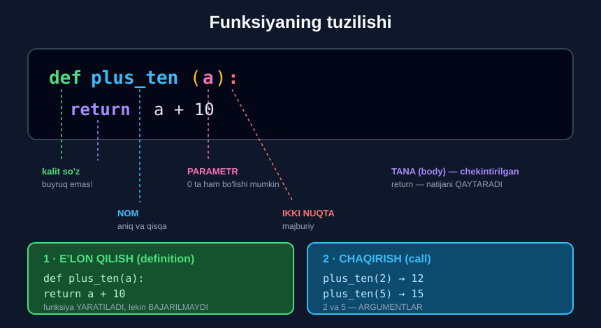

# 1-dars. Python'da funksiya e'lon qilish

## 🎬 Boshlashdan oldin

> **"Ajoyib. Keling, bir pog'ona yuqoriga ko'tarilaylik."**
>
> **"Bu darsdan boshlab biz Python funksiyalari bilan — dasturchilar uchun BEBAHO vosita bilan — shug'ullanamiz."**
>
> **"O'rganishning eng yaxshi usuli — QILISH. Shuning uchun funksiya yarataylik va uni qanday qo'llash mumkinligini ko'raylik."**

13-modulda `def` ni **chekinishni tushuntirish uchun** ko'rgan edingiz. Endi u — **asosiy mavzu**.

---

## 1. `def` kalit so'zi

> **"Kompyuterga funksiya yaratmoqchi ekaningizni aytish uchun qatorning boshiga shunchaki `def` yozing."**
>
> ## **"`def` — bu buyruq ham, funksiya ham EMAS. Bu — KALIT SO'Z."**
>
> **"Buni ko'rsatish uchun Jupyter uning shrift rangini avtomatik YASHILGA o'zgartiradi."**

```python
def
```

> 🔑 **Kalit so'z (*keyword*)** — Python tilining o'z so'zi. Uni o'zgaruvchi nomi sifatida ishlatib bo'lmaydi.

---

## 2. Nom

> **"Keyin ishlatadigan funksiyangizning nomini yozishingiz mumkin. Masalan, `simple` — chunki biz juda oddiy funksiya yaratamiz."**

```python
def simple
```

---

## 3. Qavslar

> **"Keyin bir juft QAVS qo'shishimiz mumkin."**
>
> **"Texnik jihatdan, bu qavslar ichiga funksiya PARAMETRLARINI joylashtirishingiz mumkin — agar ular kerak bo'lsa."**
>
> ## **"NOLTA parametrli funksiya bo'lishi ham muammo emas. Bizning hozir yaratayotgan funksiyamiz aynan shunday."**

```python
def simple()
```

---

## 4. Ikki nuqta va chekinish

> **"Davom etish uchun funksiya nomidan keyin IKKI NUQTA qo'yishni unutmang."**
>
> **"Chunki bir xil qatorda davom etish noqulay — funksiya uzayganda ko'rsatmalarni YANGI QATORGA, yana CHEKINISH bilan yozish odatini shakllantirish ancha yaxshi."**
>
> ## **"Yaxshi o'qilish — yaxshi kod uslubining bir qismi."**

```python
def simple():
    print("My first function")
```



---

## 5. Bajarganda nima bo'ladi?

> **"Xo'p, mashinadan jumla chop etishni so'raganimizda nima bo'lishini ko'raylik."**
>
> **"Ko'p emas. Hech bo'lmaganda hozircha."**

```python
def simple():
    print("My first function")
```

```
(hech narsa)
```

> ## **"Kompyuter `simple` funksiyasini YARATDI — u `My first function` ni chop eta oladi. Lekin bu — hammasi."**

### 🔑 E'lon qilish ≠ bajarish

```
def simple():          →  funksiya YARATILDI
    print("...")          (retsept yozildi)

                          lekin HALI BAJARILMADI
                          (ovqat pishirilmadi)
```

---

## 6. Chaqirish

> **"Funksiyani QO'LLASH uchun biz uni CHAQIRISHIMIZ kerak."**
>
> **"Biz funksiyadan o'z ishini bajarishni so'rashimiz kerak — shunda uning nomini yozganimizdan keyin natijasini olamiz: `simple` va qavslar."**

```python
simple()
```

```
My first function
```

> ## 🔑 **Qavslar `()` — bu "BAJAR!" degan buyruq.**

```python
simple      # funksiyaning O'ZI (obyekt)
simple()    # funksiyani CHAQIRISH (bajarish)
```

**Farqni ko'ring:**

```python
def simple():
    print("My first function")

print(simple)      # <function simple at 0x...>
simple()           # My first function
```

---

## 7. 💻 To'liq kod

```python
# ===== E'LON QILISH =====
def simple():
    print("My first function")
# (hech narsa chiqmaydi)

# ===== CHAQIRISH =====
simple()                    # My first function

# ===== QAYTA-QAYTA CHAQIRISH =====
simple()                    # My first function
simple()                    # My first function

# ===== KO'P QATORLI FUNKSIYA =====
def salomlash():
    print("=" * 30)
    print("   XUSH KELIBSIZ!")
    print("=" * 30)

salomlash()

# ===== QAVSSIZ =====
print(type(simple))         # <class 'function'>
```

**Natija:**

```
My first function
My first function
My first function
==============================
   XUSH KELIBSIZ!
==============================
<class 'function'>
```

---

## 8. ⚠️ Keng tarqalgan xatolar

### Xato 1 — qavslarsiz chaqirish

```python
def simple():
    print("Salom")

simple      # ❌ hech narsa bo'lmaydi
simple()    # ✅ Salom
```

### Xato 2 — ikki nuqta yo'q

```python
def simple()
    print("Salom")
```
```
SyntaxError: expected ':'
```

### Xato 3 — chekinish yo'q

```python
def simple():
print("Salom")
```
```
IndentationError: expected an indented block after function definition
```

### Xato 4 — e'lon qilishdan oldin chaqirish

```python
simple()            # ❌ NameError: name 'simple' is not defined

def simple():
    print("Salom")
```

> 🔑 Python **yuqoridan pastga** o'qiydi. Funksiya **avval e'lon qilinishi**, keyin chaqirilishi kerak.

---

## 9. ⚡ Qo'shimcha mashqlar

> 📌 Bu darsda kursning rasmiy mashqlari yo'q — ular keyingi darsdan boshlanadi.

### 🟢 Oson

**M1.** `salom()` funksiyasini yozing — u `"Salom, dunyo!"` chiqarsin. Uni chaqiring.

**M2.** `chiziq()` funksiyasini yozing — u `40` ta `-` belgisini chiqarsin.

**M3.** `logo()` funksiyasini yozing — u **uchta** qatorli logotip chiqarsin.

<details>
<summary>✅ Yechimlar</summary>

```python
# M1
def salom():
    print("Salom, dunyo!")

salom()                     # Salom, dunyo!

# M2
def chiziq():
    print("-" * 40)

chiziq()                    # ----------------------------------------

# M3
def logo():
    print("╔══════════════════╗")
    print("║   365 AI KURSI   ║")
    print("╚══════════════════╝")

logo()
```

</details>

### 🟡 O'rta

**M4.** `sarlavha()` funksiyasi yozing — u chiziq, matn, chiziq chiqarsin. Uni **uch marta** chaqiring.

**M5.** Funksiya ichida **boshqa funksiyani** chaqiring.

**M6.** `print(simple)` va `simple()` farqini ko'rsating.

<details>
<summary>✅ Yechimlar</summary>

```python
# M4
def sarlavha():
    print("=" * 25)
    print("   HISOBOT")
    print("=" * 25)

sarlavha()
sarlavha()
sarlavha()

# M5
def chiziq():
    print("-" * 25)

def hisobot():
    chiziq()
    print("  Ma'lumotlar")
    chiziq()

hisobot()
# -------------------------
#   Ma'lumotlar
# -------------------------

# M6
def simple():
    print("Salom")

print(simple)          # <function simple at 0x...>  ← obyekt
simple()               # Salom                        ← bajarish
```

</details>

### 🔴 Qiyin

**M7.** Nima uchun bu kod xato beradi? Tuzating.
```python
salom()

def salom():
    print("Salom")
```

**M8.** Funksiya ichidagi `print` bilan funksiyadan **keyingi** `print` farqini ko'rsating.

<details>
<summary>✅ Yechimlar</summary>

```python
# M7 — funksiya AVVAL e'lon qilinishi kerak
def salom():
    print("Salom")

salom()                # Salom
# NameError: name 'salom' is not defined

# M8
def test():
    print("A — funksiya ICHIDA")

print("B — funksiyadan TASHQARIDA")     # darrov chiqadi
test()                                   # faqat CHAQIRILGANDA chiqadi
# B — funksiyadan TASHQARIDA
# A — funksiya ICHIDA
```

</details>

---

## 10. 🧠 O'zini tekshirish savollari

1. Funksiya yaratayotganingizni kompyuterga qanday bildirasiz?
2. `def` — buyruqmi, funksiyami?
3. Jupyter uni qanday belgilaydi?
4. Qavslar ichiga nima yoziladi?
5. Nolta parametrli funksiya bo'lishi mumkinmi?
6. Nomdan keyin nima qo'yiladi?
7. Nima uchun ko'rsatmalarni yangi qatorga yozish kerak?
8. Funksiyani e'lon qilganda nima chiqadi?
9. Funksiyani qo'llash uchun nima qilish kerak?

<details>
<summary>✅ Javoblar</summary>

1. Qator boshiga **`def`** yozib.
2. **Ikkalasi ham emas** — bu **kalit so'z**.
3. Shrift rangini **yashilga** o'zgartirib.
4. **Parametrlar** — agar kerak bo'lsa.
5. **Ha**, muammo emas.
6. **Ikki nuqta `:`**.
7. Funksiya **uzayganda** shunday **ancha yaxshi**; yaxshi o'qilish — **yaxshi kod uslubi**.
8. **Hech narsa** — kompyuter faqat funksiyani **yaratadi**.
9. Uni **chaqirish** kerak: **nomi va qavslar**.

</details>

---

## 📌 Xulosa

```python
def simple():                  ← 1. E'LON QILISH
    print("My first function")

simple()                       ← 2. CHAQIRISH
→  My first function


TUZILISHI:

def   simple  ()    :
 ↑      ↑     ↑     ↑
 |      |     |     ikki nuqta MAJBURIY
 |      |     parametrlar (0 ta ham bo'ladi)
 |      NOM
 KALIT SO'Z (buyruq emas!)

    print(...)     ← TANA (body), CHEKINTIRILGAN


🔑 E'lon qilish  ≠  bajarish
   def ...        →  funksiya YARATILADI
   simple()       →  funksiya BAJARILADI

🔑 Qavslar ( ) — bu "BAJAR!" buyrug'i
   simple    →  obyektning o'zi
   simple()  →  chaqirish

⚠️  Funksiya AVVAL e'lon qilinsin, KEYIN chaqirilsin
```

---

## 🔖 Atamalar

| Atama | Inglizcha | Izoh |
|---|---|---|
| Funksiya | *function* | Qayta ishlatiladigan kod bloki |
| Kalit so'z | *keyword* | Python tilining o'z so'zi (`def`, `if`, `return`...) |
| E'lon qilish | *define / definition* | Funksiyani yaratish |
| Chaqirish | *call* | Funksiyani bajarish |
| Parametr | *parameter* | Qavslar ichidagi o'zgaruvchi |
| Tana | *body* | Funksiyaning chekintirilgan qismi |
| Qavslar | *parentheses* | `( )` |

---

🏠 [Modul boshiga](README.md) · ➡️ [Keyingi: Parametrli funksiya](02-Function-with-a-Parameter.md)
