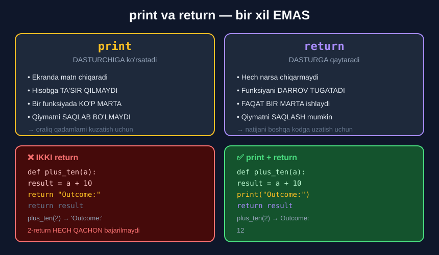

# 3-dars. Funksiyani e'lon qilishning boshqa usuli

## 🎬 Boshlashdan oldin

> **"Funksiyangiz ta'rifini tashkil qilishning YANA BIR usuli bor."**

Bu dars — **`print` va `return` farqini** bir umrga tushunish uchun.

---

## 1. Oraliq o'zgaruvchi

> **"`plus_ten` ni `a` argumenti va ikki nuqta bilan e'lon qilishdan boshlang."**
>
> **"Keyingi qatorda `a + 10` qiymatini TO'G'RIDAN-TO'G'RI qaytarish o'rniga, funksiya ICHIDA bu qiymatni saqlaydigan BOSHQA O'ZGARUVCHI yaratish mumkin."**
>
> **"Men bu yerda `result` nomidan foydalanaman. Unga kerakli `a + 10` qiymatini biriktiraman."**

```python
def plus_ten(a):
    result = a + 10
```

---

## 2. ⚠️ Lekin bu YETARLI EMAS

> **"Nima qilganimizni tekshiraylik. Agar yacheykadagi kodni bajarsam — HECH NARSA olmayman."**
>
> **"Nima uchun?"**
>
> ## **"Chunki hozircha men funksiyamizning tanasida faqat `result` o'zgaruvchisini E'LON QILDIM."**

```python
def plus_ten(a):
    result = a + 10

plus_ten(2)
```

```
(hech narsa)
```

> **"Tabiiyki, kerakli natijani olish uchun men bu o'zgaruvchini QAYTARISHIM ham kerak."**

```python
def plus_ten(a):
    result = a + 10
    return result

plus_ten(2)
```

```
12
```

> **"Ko'rdingizmi? `plus_ten` ni 2 argumenti bilan chaqirganimda, men 12 ni olaman. Yana hammasi joyida."**

### Ikkala usul ham to'g'ri

```python
# 1-usul — to'g'ridan-to'g'ri
def plus_ten(a):
    return a + 10

# 2-usul — oraliq o'zgaruvchi bilan
def plus_ten(a):
    result = a + 10
    return result
```

> 🔑 **Qachon 2-usul yaxshi?** Hisob **murakkab** bo'lganda — oraliq natijalarga **nom berish** kodni tushunarli qiladi.

```python
def chek_hisobla(narx, soni):
    oraliq   = narx * soni
    chegirma = oraliq * 0.15
    qqs      = (oraliq - chegirma) * 0.12
    jami     = oraliq - chegirma + qqs
    return jami
```

---

## 3. `print` nima qiladi

> **"`print` gapni — aniqrog'i, OBYEKTNI — qabul qiladi va uning chop etilgan ko'rinishini chiqish yacheykasida beradi."**
>
> **"U shunchaki ma'lum gapni DASTURCHIGA KO'RINADIGAN qiladi."**

> **"Buni qilishning yaxshi sababi — sizda JUDA KATTA hajmdagi kod bo'lganda va dasturingizning ORALIQ QADAMLARINI chop etilgan holda ko'rmoqchi bo'lganingizda — shunda boshqaruv oqimini kuzatib bora olasiz."**
>
> ## **"Aks holda, `print` chiqishning HISOBLANISHIGA TA'SIR QILMAYDI."**

---

## 4. `return` nima qiladi

> **"Boshqacha qilib aytganda, `return` chiqishni VIZUALLASHTIRMAYDI."**
>
> ## **"U ma'lum funksiya nimani QAYTARIB BERISHI kerakligini belgilaydi."**
>
> **"Bu ikki kalit so'zning har biri nima qilishini tushunishingiz muhim. Bu funksiyalar bilan ishlashda sizga KATTA yordam beradi."**



---

## 5. Isbot: ikkita `return`

> **"Quyidagi foydali bo'lishi mumkin. Xuddi shu funksiya `Outcome` gapini ham chop etsin."**
>
> **"Agar biz faqat `return "Outcome:"` va keyin `return result` yozsak — funksiyani chaqirganimizda nima olamiz?"**

```python
def plus_ten(a):
    result = a + 10
    return "Outcome:"
    return result

plus_ten(2)
```

```
'Outcome:'
```

> ## **"Faqat BIRINCHI obyektni — `Outcome:` gapini."**

### Nima uchun?

`return` funksiyani **darrov tugatadi**. Ikkinchi `return` — **o'lik kod** *(13-modulning 7-darsini eslang)*.

---

## 6. To'g'ri yechim: `print` + `return`

> **"Agar buning o'rniga biz gapni CHOP ETSAK va keyin `result` ni QAYTARSAK — biz xohlagan narsani olamiz: `Outcome` gapi VA hisob natijasi 12."**

```python
def plus_ten(a):
    result = a + 10
    print("Outcome:")
    return result

plus_ten(2)
```

```
Outcome:
12
```

> ## **"Bu — sizga funksiyadan FAQAT BITTA natija qaytara olishimizni ko'rsatish uchun edi."**

### Farqni tushuning

```
print("Outcome:")     →  ekranga chiqadi, funksiya DAVOM ETADI
return result         →  qiymat qaytariladi, funksiya TUGAYDI
```

---

## 7. 📊 Solishtirish jadvali

| | `print` | `return` |
|---|---|---|
| **Nima qiladi** | Ekranga chiqaradi | Qiymat qaytaradi |
| **Kimga** | Dasturchiga | Dasturga |
| **Funksiyani tugatadimi** | ❌ Yo'q | ✅ Ha |
| **Necha marta** | Cheklovsiz | Faqat **bittasi** bajariladi |
| **Natijani saqlash** | ❌ Mumkin emas (`None`) | ✅ Mumkin |
| **Hisobga ta'sir** | ❌ Yo'q | ✅ Ha |
| **Qachon kerak** | Kuzatish, hisobot | Natijani uzatish |

---

## 8. 💻 To'liq kod

```python
# ===== ORALIQ O'ZGARUVCHI BILAN =====
def plus_ten(a):
    result = a + 10
    return result

print(plus_ten(2))              # 12

# ===== return SIZ =====
def plus_ten_xato(a):
    result = a + 10             # e'lon qilindi, lekin QAYTARILMADI

print(plus_ten_xato(2))         # None

# ===== IKKITA return =====
def plus_ten_ikki(a):
    result = a + 10
    return "Outcome:"
    return result               # O'LIK KOD

print(plus_ten_ikki(2))         # Outcome:

# ===== print + return =====
def plus_ten_togri(a):
    result = a + 10
    print("Outcome:")
    return result

print(plus_ten_togri(2))
# Outcome:
# 12

# ===== ORALIQ QADAMLARNI KUZATISH =====
def chek(narx, soni):
    oraliq = narx * soni
    print("  Oraliq:", oraliq)
    chegirma = oraliq * 0.15
    print("  Chegirma:", chegirma)
    qqs = (oraliq - chegirma) * 0.12
    print("  QQS:", qqs)
    return oraliq - chegirma + qqs

print("Jami:", chek(5000, 3))
```

**Natija:**

```
12
None
Outcome:
Outcome:
12
  Oraliq: 15000
  Chegirma: 2250.0
  QQS: 1530.0
Jami: 14280.0
```

---

## 9. 📝 Rasmiy mashq (kursdan)

### Mashq 1
**Argument qiymatini `"Raised to the power of 2:"` iborasi bilan birga aytadigan va argumentining 2-darajasiga teng qiymatni qaytaradigan funksiya e'lon qiling. Bu safar funksiya tanasida `result` deb ataladigan yangi o'zgaruvchidan foydalaning.**

**Funksiyani biror argument bilan chaqirib, u to'g'ri ishlashini tekshiring.**

> *Ilgak: bir qatorda bir nechta elementni ko'rsatish haqidagi bilimingiz bu mashqni yechishda katta yordam bera oladi!*

<details>
<summary>✅ Yechim</summary>

```python
def exponentiation_exp_2(x):
    result = x ** 2
    print(x, "Raised to the power of 2:")
    return result

exponentiation_exp_2(5)
```

```
5 Raised to the power of 2:
25
```

**Ilgakning ma'nosi:** `print(x, "Raised to the power of 2:")` — `print` ichida **vergul bilan** ikkita element *(12-modulning 4-darsi)*.

</details>

---

## 10. ⚡ Qo'shimcha mashqlar

### 🟢 Oson

**M1.** `kvadrat(n)` ni **oraliq o'zgaruvchi** bilan yozing.

**M2.** `return` ni **olib tashlang**. Funksiya nima qaytaradi?

**M3.** Funksiyaga `print` **va** `return` ikkalasini ham qo'shing.

<details>
<summary>✅ Yechimlar</summary>

```python
# M1
def kvadrat(n):
    result = n ** 2
    return result

print(kvadrat(7))               # 49

# M2
def kvadrat_xato(n):
    result = n ** 2

print(kvadrat_xato(7))          # None

# M3
def kvadrat_togri(n):
    result = n ** 2
    print("Hisoblanmoqda:", n)
    return result

print(kvadrat_togri(7))
# Hisoblanmoqda: 7
# 49
```

</details>

### 🟡 O'rta

**M4.** Uchta oraliq o'zgaruvchi bilan chek hisoblovchi funksiya yozing.

**M5.** Har bir oraliq qadamni `print` bilan kuzating.

**M6.** Ikkita `return` yozing — ikkinchisi bajariladimi?

<details>
<summary>✅ Yechimlar</summary>

```python
# M4
def chek(narx, soni):
    oraliq   = narx * soni
    qqs      = oraliq * 0.12
    jami     = oraliq + qqs
    return jami

print(chek(5000, 3))            # 16800.0

# M5
def chek_batafsil(narx, soni):
    oraliq = narx * soni
    print("1. Oraliq:", oraliq)
    qqs = oraliq * 0.12
    print("2. QQS:", qqs)
    jami = oraliq + qqs
    print("3. Jami:", jami)
    return jami

natija = chek_batafsil(5000, 3)
# 1. Oraliq: 15000
# 2. QQS: 1800.0
# 3. Jami: 16800.0
print("Qaytdi:", natija)        # Qaytdi: 16800.0

# M6
def ikki_return(x):
    return "Birinchi"
    return "Ikkinchi"

print(ikki_return(5))           # Birinchi
# Ikkinchi HECH QACHON bajarilmaydi
```

</details>

### 🔴 Qiyin

**M7.** `print` li funksiya natijasini **o'zgaruvchida saqlab**, u bilan **hisob** qilib ko'ring. Nima bo'ladi?

**M8.** Funksiya `if/else` ichida **ikkita `return`** ga ega bo'lsin. Ikkalasi ham "bajariladi"mi?

**M9.** `print(print("Salom"))` nima chiqaradi? Nima uchun?

<details>
<summary>✅ Yechimlar</summary>

```python
# M7
def f_print(x):
    print(x * 2)

a = f_print(5)          # 10
print(a)                # None
# print(a + 1)
# TypeError: unsupported operand type(s) for +: 'NoneType' and 'int'

# M8 — HA, ikkalasi ham YOZILGAN, lekin FAQAT BITTASI bajariladi
def tekshir(x):
    if x > 0:
        return "Musbat"
    else:
        return "Musbat emas"

print(tekshir(5))       # Musbat
print(tekshir(-5))      # Musbat emas
# Har bir chaqiruvda FAQAT BITTA return ishlaydi

# M9
print(print("Salom"))
# Salom
# None
# Ichkaridagi print "Salom" ni chiqaradi va None QAYTARADI.
# Tashqi print o'sha None ni chiqaradi.
```

</details>

---

## 11. 🧠 O'zini tekshirish savollari

1. Funksiya ichida qiymatni saqlash uchun nima yaratish mumkin?
2. Faqat o'zgaruvchi e'lon qilsangiz nima chiqadi?
3. Nima uchun?
4. Natija olish uchun yana nima qilish kerak?
5. `print` nima qiladi?
6. `print` ni qachon ishlatish yaxshi?
7. `print` hisobga ta'sir qiladimi?
8. `return` chiqishni vizuallashtiradimi?
9. `return` nimani belgilaydi?
10. Ikkita `return` yozsangiz nima bo'ladi?
11. Funksiyadan nechta natija qaytarish mumkin?

<details>
<summary>✅ Javoblar</summary>

1. **Boshqa o'zgaruvchi** — masalan, `result`.
2. **Hech narsa.**
3. Chunki siz uni faqat **e'lon qildingiz**, **qaytarmadingiz**.
4. Bu o'zgaruvchini **`return`** qilish.
5. Obyektning **chop etilgan ko'rinishini** chiqish yacheykasida beradi — uni **dasturchiga ko'rinadigan** qiladi.
6. **Katta hajmdagi kodda** oraliq qadamlarni ko'rib, **boshqaruv oqimini** kuzatish uchun.
7. **Yo'q.**
8. **Yo'q.**
9. Funksiya nimani **qaytarib berishi** kerakligini.
10. Faqat **birinchisi** bajariladi — ikkinchisi **o'lik kod**.
11. **Faqat bitta.**

</details>

---

## 📌 Xulosa

```python
# 1-USUL — to'g'ridan-to'g'ri
def plus_ten(a):
    return a + 10

# 2-USUL — oraliq o'zgaruvchi
def plus_ten(a):
    result = a + 10
    return result          ← return SHART!


⚠️  return SIZ:
def plus_ten(a):
    result = a + 10        ← faqat E'LON QILINDI
plus_ten(2)  →  None


print  va  return

┌──────────────┬─────────────┬──────────────┐
│              │   print     │   return     │
├──────────────┼─────────────┼──────────────┤
│ Kimga        │ dasturchiga │ dasturga     │
│ Tugatadimi   │ yo'q        │ HA           │
│ Necha marta  │ cheklovsiz  │ BITTA        │
│ Saqlash      │ yo'q (None) │ HA           │
└──────────────┴─────────────┴──────────────┘


❌ IKKI return          ✅ print + return
   return "Outcome:"       print("Outcome:")
   return result           return result
   → 'Outcome:'            → Outcome:
                             12

🔑 Funksiyadan FAQAT BITTA natija qaytariladi
```

---

## 🔖 Atamalar

| Atama | Inglizcha | Izoh |
|---|---|---|
| Oraliq o'zgaruvchi | *intermediate variable* | Hisob natijasini saqlaydigan o'zgaruvchi |
| Lokal o'zgaruvchi | *local variable* | Faqat funksiya ichida mavjud |
| Obyekt | *object* | Har qanday qiymat |
| Vizuallashtirish | *visualize* | Ekranda ko'rsatish |
| O'lik kod | *dead code* | Bajarilmaydigan kod |

---

⬅️ [Oldingi: Parametrli funksiya](02-Function-with-a-Parameter.md) · ➡️ [Keyingi: Funksiya ichida funksiya](04-Using-a-Function-in-Another-Function.md)
