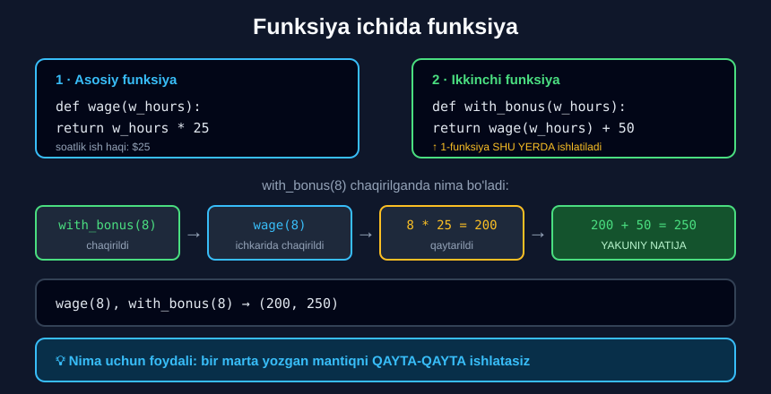

# 4-dars. Funksiya ichida funksiya

## 🎬 Boshlashdan oldin

> **"Bu sir emas: bizda funksiya ICHIDA funksiya bo'lishi mumkin."**

Bu — dasturlashning **eng kuchli g'oyalaridan biri**: bir marta yozgan mantiqni **qayta-qayta** ishlatish.

---

## 1. Birinchi funksiya: ish haqi

> **"Masalan, `wage` deb ataladigan funksiya e'lon qilaylik — u sizning KUNLIK ish haqingizni hisoblaydi."**
>
> **"Aytaylik, siz ish soatlarini parametr sifatida ishlatasiz va sizga soatiga $25 to'lanadi."**

```python
def wage(w_hours):
    return w_hours * 25
```

> **"E'tibor bering: menga bu yerda texnik jihatdan `print` buyrug'i KERAK EMAS."**
>
> **"Men ish haqini keyinroq chop etishim mumkin, lekin menga bu haqiqatan ham kerak emas — shuning uchun men shu yo'ldan boraman: shunchaki menga kerak bo'lgan qiymatni QAYTARAMAN."**

> 🔑 3-darsdagi qoida amalda: funksiya **hisoblaydi va qaytaradi**. Chiqarish — **boshqa joyning ishi**.

---

## 2. Ikkinchi funksiya: bonus bilan

> **"Kunni yaxshi o'tkazganingizda, boshlig'ingiz sizga maoshingizga qo'shimcha $50 bonus berishdan xursand bo'ladi."**
>
> **"Shu sababli, men siz uchun `with_bonus` funksiyasini e'lon qilaman."**
>
> **"Parametr sifatida yana ish soatlarini olaman."**
>
> ## **"Lekin bu safar men to'g'ridan-to'g'ri `wage` ni ish soatlari bilan chiqish sifatida qaytarishga ruxsat beraman — bu `wage` funksiyasi ishga tushirilgandan keyin olinadigan qiymat, plyus siz ishlagan qo'shimcha $50."**

```python
def wage(w_hours):
    return w_hours * 25

def with_bonus(w_hours):
    return wage(w_hours) + 50
```

> ## **"Mana shunday birinchi funksiya ikkinchisining chiqishida ishtirok etadi — FUNKSIYA ICHIDA FUNKSIYA."**



---

## 3. Sinab ko'ramiz

> **"Chiqish qanday bo'lishini ko'raylik. Agar siz bugun sakkiz soat ishlagan bo'lsangiz va boshliq sizning natijangizdan juda mamnun bo'lsa..."**

```python
wage(8), with_bonus(8)
```

```
(200, 250)
```

> **"Ajoyib. $200 asosiy kompensatsiya va bonus bilan $250."**

### Bosqichma-bosqich

```
with_bonus(8)  chaqirildi
      ↓
return wage(8) + 50
       ↓
       wage(8)  chaqirildi
            ↓
       return 8 * 25
            ↓
            200      ← qaytarildi
       ↓
return 200 + 50
      ↓
      250            ← YAKUNIY NATIJA
```

> 🔑 **`wage(w_hours)` — bu qiymat.** Python avval uni **hisoblaydi**, keyin `+ 50` qiladi.

---

## 4. 💡 Nima uchun bu foydali?

### Takrorlanishni yo'q qiladi

```python
# ❌ YOMON — mantiq TAKRORLANADI
def with_bonus(w_hours):
    return w_hours * 25 + 50

def with_double_bonus(w_hours):
    return w_hours * 25 + 100

def overtime(w_hours):
    return w_hours * 25 * 1.5
```

Agar soatlik stavka **$30 ga o'zgarsa** — **uchta** joyni tuzatish kerak.

```python
# ✅ YAXSHI — mantiq BIR JOYDA
def wage(w_hours):
    return w_hours * 25          # ← faqat SHU YERNI o'zgartirasiz

def with_bonus(w_hours):
    return wage(w_hours) + 50

def with_double_bonus(w_hours):
    return wage(w_hours) + 100

def overtime(w_hours):
    return wage(w_hours) * 1.5
```

> ## 🔑 **Dasturlashning oltin qoidasi: O'ZINGIZNI TAKRORLAMANG.**
>
> *(Inglizchada: **DRY** — Don't Repeat Yourself.)*

---

## 5. 💻 To'liq kod

```python
# ===== ASOSIY MISOL =====
def wage(w_hours):
    return w_hours * 25

def with_bonus(w_hours):
    return wage(w_hours) + 50

print(wage(8))                  # 200
print(with_bonus(8))            # 250
print((wage(8), with_bonus(8))) # (200, 250)

# ===== UCH DARAJALI ZANJIR =====
def asosiy(soat):
    return soat * 25

def bonus_bilan(soat):
    return asosiy(soat) + 50

def soliq_bilan(soat):
    return bonus_bilan(soat) * 0.88     # 12% soliq

print(asosiy(8))                # 200
print(bonus_bilan(8))           # 250
print(soliq_bilan(8))           # 220.0

# ===== BIR NECHTA FUNKSIYA BIRGA =====
def qqs(summa):
    return summa * 0.12

def chegirma(summa):
    return summa * 0.15

def yakuniy_narx(summa):
    return summa - chegirma(summa) + qqs(summa - chegirma(summa))

print(yakuniy_narx(1000000))    # 952000.0

# ===== ICHKI FUNKSIYA BILAN BIRGA =====
def uzunlik_ikki_barobar(matn):
    return len(matn) * 2

print(uzunlik_ikki_barobar("Python"))    # 12
```

**Natija:**

```
200
250
(200, 250)
200
250
220.0
952000.0
12
```

---

## 6. 📝 Rasmiy mashq (kursdan)

### Mashq 1
**Parametrga 5 qo'shadigan funksiya e'lon qiling. Keyin yangi olingan sonni 3 ga ko'paytiradigan boshqa funksiya e'lon qiling.**

**Ikkinchi funksiyani 5 argumenti bilan chaqirib, kodingiz to'g'riligini tekshiring. Chiqishingiz 30 ga teng bo'ldimi?**

<details>
<summary>✅ Yechim</summary>

```python
def plus_five(x):
    return x + 5

def m_by_3(x):
    return plus_five(x) * 3

m_by_3(5)
```

```
30
```

**Tekshiruv:**

```
m_by_3(5)
  → plus_five(5) * 3
  → (5 + 5) * 3
  → 10 * 3
  → 30   ✅
```

</details>

---

## 7. ⚡ Qo'shimcha mashqlar

### 🟢 Oson

**M1.** `kvadrat(n)` va `kvadrat_plus_bir(n)` — ikkinchisi birinchisini ishlatsin.

**M2.** `qqs(s)` va `qqs_bilan(s)` — ikkinchisi birinchisini ishlatsin.

**M3.** Uchta funksiya zanjiri yozing.

<details>
<summary>✅ Yechimlar</summary>

```python
# M1
def kvadrat(n):
    return n ** 2

def kvadrat_plus_bir(n):
    return kvadrat(n) + 1

print(kvadrat(5))               # 25
print(kvadrat_plus_bir(5))      # 26

# M2
def qqs(s):
    return s * 0.12

def qqs_bilan(s):
    return s + qqs(s)

print(qqs(100000))              # 12000.0
print(qqs_bilan(100000))        # 112000.0

# M3
def a(x):
    return x + 1

def b(x):
    return a(x) * 2

def c(x):
    return b(x) - 3

print(c(5))                     # 9    ← ((5+1)*2)-3
```

</details>

### 🟡 O'rta

**M4.** `perimetr(a, b)` va `yuza(a, b)` yozing, keyin `hisobot(a, b)` — ikkalasini ishlatsin.

**M5.** Ish haqi zanjirini yozing: asosiy → bonus → soliq → **qo'lga tegadigan**.

**M6.** Bir funksiyani **ikki marta** boshqa funksiya ichida chaqiring.

<details>
<summary>✅ Yechimlar</summary>

```python
# M4
def perimetr(a, b):
    return 2 * (a + b)

def yuza(a, b):
    return a * b

def hisobot(a, b):
    return "Perimetr: " + str(perimetr(a, b)) + ", Yuza: " + str(yuza(a, b))

print(hisobot(3, 4))            # Perimetr: 14, Yuza: 12

# M5
def asosiy(soat):
    return soat * 25

def bonus_bilan(soat):
    return asosiy(soat) + 50

def soliq(soat):
    return bonus_bilan(soat) * 0.12

def qolga_tegadi(soat):
    return bonus_bilan(soat) - soliq(soat)

print(asosiy(8))                # 200
print(bonus_bilan(8))           # 250
print(soliq(8))                 # 30.0
print(qolga_tegadi(8))          # 220.0

# M6
def kvadrat(n):
    return n ** 2

def yigindi_kvadratlari(a, b):
    return kvadrat(a) + kvadrat(b)

print(yigindi_kvadratlari(3, 4))    # 25
```

</details>

### 🔴 Qiyin

**M7.** Funksiyani **o'z ichida** chaqirib ko'ring (`n` marta cheklov bilan). Nima bo'ladi?

**M8.** Nima uchun `wage(w_hours) + 50` da qavslar **kerak emas**?

**M9.** Takrorlanuvchi kodni funksiya bilan **qayta yozing**:
```python
narx_a = 1000 * 1.12
narx_b = 2500 * 1.12
narx_c = 7300 * 1.12
```

<details>
<summary>✅ Yechimlar</summary>

```python
# M7 — bu REKURSIYA deb ataladi
def sanoq(n):
    if n <= 0:
        return "Tugadi"
    print(n)
    return sanoq(n - 1)

print(sanoq(3))
# 3
# 2
# 1
# Tugadi
# ⚠️ To'xtash sharti (n <= 0) BO'LMASA — cheksiz sikl va RecursionError

# M8 — funksiya chaqiruvi ARIFMETIKADAN OLDIN bajariladi
def wage(w):
    return w * 25
print(wage(8) + 50)             # 250
# Avval wage(8) → 200 hisoblanadi, keyin + 50

# M9
def qqs_bilan(narx):
    return narx * 1.12

narx_a = qqs_bilan(1000)
narx_b = qqs_bilan(2500)
narx_c = qqs_bilan(7300)
print(narx_a, narx_b, narx_c)
# 1120.0 2800.0000000000005 8176.000000000001
# QQS stavkasi o'zgarsa — FAQAT BIR JOYNI tuzatasiz
```

</details>

---

## 8. 🧠 O'zini tekshirish savollari

1. Funksiya ichida funksiya bo'lishi mumkinmi?
2. `wage` funksiyasi nima hisoblaydi?
3. Nima uchun `wage` da `print` kerak emas?
4. `with_bonus` qanday ishlaydi?
5. `wage(8)` va `with_bonus(8)` natijalari nima?
6. Bu naqshning asosiy foydasi nima?

<details>
<summary>✅ Javoblar</summary>

1. **Ha** — bu sir emas.
2. **Kunlik ish haqini** — soatiga $25.
3. Chunki ish haqini **keyinroq** chop etish mumkin; funksiyaga **qiymatni qaytarish** yetarli.
4. U `wage(w_hours)` ni **chaqiradi** va natijasiga **$50 qo'shadi**.
5. **200** va **250** — ya'ni `(200, 250)`.
6. Mantiq **bir joyda** saqlanadi — takrorlanish yo'q, o'zgartirish **oson**.

</details>

---

## 📌 Xulosa

```python
def wage(w_hours):
    return w_hours * 25

def with_bonus(w_hours):
    return wage(w_hours) + 50      ← FUNKSIYA ICHIDA FUNKSIYA
           ↑
        chaqiriladi va QIYMATGA aylanadi

wage(8)         →  200
with_bonus(8)   →  250


BOSQICHMA-BOSQICH

with_bonus(8)
    → wage(8) + 50
        → 8 * 25 = 200
    → 200 + 50
    → 250


🔑 NIMA UCHUN FOYDALI

❌ Takrorlash:              ✅ Qayta ishlatish:
   w * 25 + 50                 wage(w) + 50
   w * 25 + 100                wage(w) + 100
   w * 25 * 1.5                wage(w) * 1.5
   ↑ stavka o'zgarsa —         ↑ FAQAT wage ni
     3 joyni tuzatish            tuzatish

🔑 DRY — Don't Repeat Yourself (O'zingizni takrorlamang)
```

---

## 🔖 Atamalar

| Atama | Inglizcha | Izoh |
|---|---|---|
| Funksiya chaqiruvi | *function call* | Funksiyani ishga tushirish |
| Qayta ishlatish | *reusability* | Kodni bir necha joyda ishlatish |
| DRY | *Don't Repeat Yourself* | O'zingizni takrorlamang |
| Zanjir | *chaining* | Funksiyalarni ketma-ket ishlatish |
| Rekursiya | *recursion* | Funksiyaning o'zini chaqirishi |

---

⬅️ [Oldingi: Boshqa usul](03-Another-Way-to-Define-a-Function.md) · ➡️ [Keyingi: Shartlar va funksiyalar](05-Combining-Conditionals-and-Functions.md)
