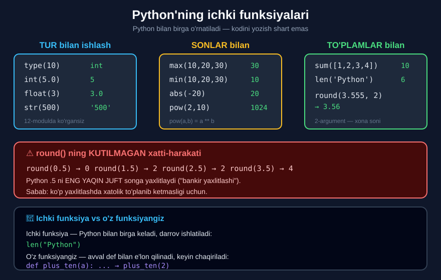

# 7-dars. Python'ning muhim ichki funksiyalari

## 🎬 Boshlashdan oldin

> **"Python'ni kompyuteringizga o'rnatganingizda siz uning ba'zi ICHKI FUNKSIYALARINI ham o'rnatasiz."**
>
> ## **"Bu shuni anglatadiki, ularni har safar ishlatganingizda kodini yozishingiz SHART EMAS."**
>
> **"Bu funksiyalar allaqachon kompyuteringizda va TO'G'RIDAN-TO'G'RI qo'llanilishi mumkin."**

---

## 1. Siz allaqachon ishlatgansiz

> **"Aslida siz ichki funksiyalarning misollarini MA'LUMOT TURLARI haqidagi darsda ko'rgansiz."**

### `type()`

> **"`type` funksiyasi argument sifatida ishlatgan o'zgaruvchingizning TURINI olish imkonini beradi."**
>
> **"Mana shu yacheykada `type(10)` — `int` (butun son uchun) beradi."**

```python
type(10)
```

```
int
```

### `int()`, `float()`, `str()`

> **"`int`, `float` va `string` funksiyalari o'z argumentlarini mos ravishda butun son, suzuvchi nuqtali son va satr ma'lumot turiga aylantiradi."**

```python
int(5.0)      # 5      ← "5.0 beshga aylantirildi"
float(3)      # 3.0    ← "3 3.0 ga aylantirildi"
str(500)      # '500'  ← "500 soni MATNGA aylandi"
```

*(12-modulning 3-darsini eslang.)*

---

## 2. `max()` va `min()`

> **"Endi men sizga juda foydali bo'lgan yana bir necha ichki funksiyani ko'rsataman."**
>
> **"`max` sonlar ketma-ketligidan ENG YUQORI qiymatni qaytaradi."**

```python
max(10, 20, 30)
```

```
30
```

> **"Shu sababli `max` yacheykada chiqish sifatida 30 qiymatini qaytardi."**

> **"`min` esa aynan TESKARISINI qiladi. U ketma-ketlikdan ENG PAST qiymatni qaytaradi."**

```python
min(10, 20, 30)
```

```
10
```

> **"Demak, o'sha yacheykada 10 ni olamiz. U 10, 20 va 30 orasida ENG KICHIGI."**

---

## 3. `abs()` — modul

> **"Yana bir ichki funksiya — `abs` — argumentining MUTLAQ QIYMATINI olish imkonini beradi."**
>
> **"`z` `-20` ga teng bo'lsin. Agar `z` ga `abs` funksiyasini qo'llasak, natija uning mutlaq qiymati — 20 bo'ladi."**

```python
z = -20
abs(z)
```

```
20
```

> 🔑 **Mutlaq qiymat** — sonning **ishorasiz** qiymati. `abs(-20)` = `abs(20)` = `20`.

---

## 4. `sum()` — yig'indi

> **"Sizga katta yordam bera oladigan muhim funksiya — `sum`."**
>
> **"U argument sifatida ko'rsatilgan RO'YXATdagi barcha elementlarning yig'indisini hisoblaydi."**

```python
list_1 = [1, 2, 3, 4]
sum(list_1)
```

```
10
```

> **"`sum(list_1)` yozganimda, chiqishim `1 + 2 + 3 + 4` ga teng bo'ladi. Bu sonlarning yig'indisi 10 ga teng."**

> 📌 **Ro'yxatlar** (`[1, 2, 3, 4]`) to'liq **17-modulda** o'rganiladi. Hozircha `sum()` ni **ro'yxat bilan ishlaydi** deb qabul qiling.

---

## 5. `round()` — yaxlitlash

> **"`round` argumentining suzuvchi nuqtali qiymatini o'nlik nuqtadan keyingi BELGILANGAN raqamlar soniga yaxlitlangan holda qaytaradi."**
>
> **"`round(3.555, 2)` — o'nlik nuqtadan keyin ikkita raqam bilan — `3.56` ga aylanadi."**

```python
round(3.555, 2)
```

```
3.56
```

> **"Agar raqamlar soni ko'rsatilmasa — u nolga sozlanadi."**
>
> **"`3.2` pastga `3.0` gacha yaxlitlanadi."**

```python
round(3.2)
```

```
3
```

> ⚠️ **Aniqlik uchun:** ma'ruzachi `3.0` deydi, lekin Python 3 da ikkinchi argumentsiz `round()` **`int`** qaytaradi — ya'ni `3`, `3.0` emas.

### ⚠️ ENG KATTA TUZOQ: `.5` ni yaxlitlash

```python
round(0.5)      # 0    ← 1 EMAS!
round(1.5)      # 2
round(2.5)      # 2    ← 3 EMAS!
round(3.5)      # 4
round(55.5)     # 56
```

> ## 🔑 **Python `.5` ni ENG YAQIN JUFT songa yaxlitlaydi.**

Bu — **"bankir yaxlitlashi"** (*banker's rounding*). Sababi: ko'p sonli yaxlitlashda xatolik **to'planib ketmasligi** uchun. Agar hamma `.5` yuqoriga yaxlitlansa — natija **muntazam ravishda oshib ketadi**.

---

## 6. `pow()` — daraja

> **"Agar 2 ni 10-darajaga ko'tarishga qiziqsangiz — `2 ** 10` yozishingiz mumkinligini bilasiz."**
>
> **"Xuddi shu natijani `pow` funksiyasidan foydalanib olishingiz mumkin — u *power* (daraja) degani."**
>
> **"`pow` yozing va qavslar ichida ASOS va DARAJANI vergul bilan ajratib ko'rsating. Bizning holatda `2, 10`."**

```python
pow(2, 10)
```

```
1024
```

> **"`Shift + Enter` bilan bajaring va mana — 1024."**

```python
2 ** 10        # 1024
pow(2, 10)     # 1024   ← bir xil
```

---

## 7. `len()` — uzunlik

> **"Va agar obyektda nechta element borligini ko'rmoqchi bo'lsangiz-chi?"**
>
> **"`len` funksiyasi — *length* (uzunlik) degani — buni qilishga yordam beradi."**
>
> **"Agar argument sifatida satrni tanlasangiz, `len` funksiyasi so'zda nechta belgi borligini aytadi."**

```python
len('Mathematics')
```

```
11
```

> **"Masalan, `mathematics` so'zida bizda 11 ta belgi bor."**

*(13-modulning 6-darsida `len()` ni ko'rgan edingiz.)*

---

## 8. Yakuniy so'z

> **"Python'da yana ko'plab ichki funksiyalar bor, lekin bular — dasturlashda TEZ-TEZ ishlatishingiz kerak bo'ladigan bir necha misol."**



---

## 9. 📋 Barcha ichki funksiyalar

| Funksiya | Nima qiladi | Misol | Natija |
|---|---|---|---|
| `type()` | Turni qaytaradi | `type(10)` | `int` |
| `int()` | Butun songa | `int(5.0)` | `5` |
| `float()` | Kasr songa | `float(3)` | `3.0` |
| `str()` | Satrga | `str(500)` | `'500'` |
| `max()` | Eng kattasi | `max(10,20,30)` | `30` |
| `min()` | Eng kichigi | `min(10,20,30)` | `10` |
| `abs()` | Mutlaq qiymat | `abs(-20)` | `20` |
| `sum()` | Yig'indi | `sum([1,2,3,4])` | `10` |
| `round()` | Yaxlitlash | `round(3.555,2)` | `3.56` |
| `pow()` | Daraja | `pow(2,10)` | `1024` |
| `len()` | Uzunlik | `len('Python')` | `6` |
| `print()` | Chiqarish | `print("Salom")` | `Salom` |

---

## 10. 💻 To'liq kod

```python
# ===== TUR =====
print(type(10))             # <class 'int'>
print(int(5.0))             # 5
print(float(3))             # 3.0
print(str(500))             # 500

# ===== SONLAR =====
print(max(10, 20, 30))      # 30
print(min(10, 20, 30))      # 10
z = -20
print(abs(z))               # 20
print(pow(2, 10))           # 1024
print(2 ** 10)              # 1024

# ===== RO'YXAT =====
list_1 = [1, 2, 3, 4]
print(sum(list_1))          # 10
print(max(list_1))          # 4
print(min(list_1))          # 1
print(len(list_1))          # 4

# ===== YAXLITLASH =====
print(round(3.555, 2))      # 3.56
print(round(3.2))           # 3

# ===== UZUNLIK =====
print(len('Mathematics'))   # 11

# ===== BIRGA ISHLATISH =====
narxlar = [15000, 42000, 8500, 31000]
print("Eng qimmat: ", max(narxlar))
print("Eng arzon:  ", min(narxlar))
print("Jami:       ", sum(narxlar))
print("O'rtacha:   ", round(sum(narxlar) / len(narxlar), 2))
```

**Natija:**

```
<class 'int'>
5
3.0
500
30
10
20
1024
1024
10
4
1
4
3.56
3
11
Eng qimmat:  42000
Eng arzon:   8500
Jami:        96500
O'rtacha:    24125.0
```

---

## 11. 📝 Rasmiy mashqlar (kursdan)

### Mashq 1
**25, 65, 890 va 15 qiymatlari orasidan eng katta sonni toping.**

<details>
<summary>✅ Yechim</summary>

```python
max(25, 65, 890, 15)
```
```
890
```

</details>

### Mashq 2
**Xuddi shu qiymatlar orasidan eng kichik sonni toping.**

<details>
<summary>✅ Yechim</summary>

```python
min(25, 65, 890, 15)
```
```
15
```

</details>

### Mashq 3
**`-100` ning mutlaq qiymatini toping.**

<details>
<summary>✅ Yechim</summary>

```python
abs(-100)
```
```
100
```

</details>

### Mashq 4
**`55.5` ni yaxlitlang. `56.0` ni oldingizmi?**

<details>
<summary>✅ Yechim</summary>

```python
round(55.5)
```
```
56
```

> ⚠️ **Diqqat:** mashqda `56.0` deyilgan, lekin Python 3 da natija **`56`** — ya'ni **`int`**, `float` emas.
>
> `56.0` olish uchun:
> ```python
> round(55.5, 1)      # 55.5
> float(round(55.5))  # 56.0
> ```
>
> 💡 **Va yana:** `round(55.5)` → `56` bo'lgani **tasodif** — 56 **juft** son. Lekin `round(56.5)` → **`56`** ham beradi! *(Bankir yaxlitlashi.)*

</details>

### Mashq 5
**`35.56789` ni uchinchi raqamgacha yaxlitlang.**

<details>
<summary>✅ Yechim</summary>

```python
round(35.56789, 3)
```
```
35.568
```

</details>

### Mashq 6
**Berilgan `Numbers` ro'yxatidagi barcha elementlar yig'indisini toping.**

<details>
<summary>✅ Yechim</summary>

```python
Numbers = [1, 5, 64, 24.5]
sum(Numbers)
```
```
94.5
```

</details>

### Mashq 7
**Ichki funksiyadan foydalanib 10 ni 3-darajaga ko'taring.**

<details>
<summary>✅ Yechim</summary>

```python
pow(10, 3)
```
```
1000
```

**Yoki (lekin bu ichki funksiya emas, operator):**

```python
10 ** 3      # 1000
```

</details>

### Mashq 8
**`"Elephant"` so'zida nechta belgi bor?**

<details>
<summary>✅ Yechim</summary>

```python
len("Elephant")
```
```
8
```

</details>

### Mashq 9
**`distance_from_zero` deb ataladigan funksiya yarating — u berilgan yagona argumentning mutlaq qiymatini qaytarsin, va agar berilgan argument son bo'lmasa `"Not Possible"` gapini chop etsin.**

**Funksiyani `-10` va `"cat"` qiymatlari bilan chaqirib, to'g'ri ishlashini tekshiring.**

<details>
<summary>✅ Yechim</summary>

```python
def distance_from_zero(x):
    if type(x) == int or type(x) == float:
        return abs(x)
    else:
        print("Not possible")

print(distance_from_zero(-10))
print(distance_from_zero("cat"))
```

```
10
Not possible
None
```

> 🔑 **Bu mashq — butun modulning jamlanmasi:**
> - **funksiya** (`def`, `return`)
> - **shart** (`if`/`else`)
> - **mantiqiy operator** (`or`)
> - **ichki funksiyalar** (`type`, `abs`, `print`)
>
> ⚠️ **`None` qayerdan?** `"cat"` holatida funksiya `print` qiladi, lekin **`return` qilmaydi** — shuning uchun `None` qaytadi *(3-darsni eslang)*.

</details>

---

## 12. ⚡ Qo'shimcha mashqlar

### 🟢 Oson

**M1.** `[15000, 42000, 8500, 31000]` ro'yxati uchun eng katta, eng kichik va yig'indini toping.

**M2.** `"O'zbekiston"` so'zida nechta belgi bor?

**M3.** `3.14159` ni 2 xonagacha yaxlitlang.

<details>
<summary>✅ Yechimlar</summary>

```python
# M1
narxlar = [15000, 42000, 8500, 31000]
print(max(narxlar))         # 42000
print(min(narxlar))         # 8500
print(sum(narxlar))         # 96500

# M2
print(len("O'zbekiston"))   # 11

# M3
print(round(3.14159, 2))    # 3.14
```

</details>

### 🟡 O'rta

**M4.** Ro'yxatning **o'rtacha qiymatini** toping va 2 xonagacha yaxlitlang.

**M5.** `farq(a, b)` — ikki son orasidagi **masofani** (ishorasiz) qaytarsin.

**M6.** `round(0.5)`, `round(1.5)`, `round(2.5)`, `round(3.5)` — natijalarni tushuntiring.

<details>
<summary>✅ Yechimlar</summary>

```python
# M4
narxlar = [15000, 42000, 8500, 31000]
print(round(sum(narxlar) / len(narxlar), 2))    # 24125.0

# M5
def farq(a, b):
    return abs(a - b)

print(farq(10, 3))          # 7
print(farq(3, 10))          # 7   ← tartib AHAMIYATSIZ

# M6
print(round(0.5))           # 0   ← 0 juft
print(round(1.5))           # 2   ← 2 juft
print(round(2.5))           # 2   ← 2 juft
print(round(3.5))           # 4   ← 4 juft
# BANKIR YAXLITLASHI: .5 ENG YAQIN JUFT songa
```

</details>

### 🔴 Qiyin

**M7.** `type()` bilan tur tekshiruvchi universal funksiya yozing.

**M8.** `round(2.675, 2)` nima beradi? Nima uchun `2.68` emas?

**M9.** Ichki funksiyalarni **birga** ishlatib, statistika chiqaruvchi funksiya yozing.

<details>
<summary>✅ Yechimlar</summary>

```python
# M7
def tur_nomi(x):
    if type(x) == int:
        return "butun son"
    elif type(x) == float:
        return "kasr son"
    elif type(x) == str:
        return "satr"
    elif type(x) == bool:
        return "mantiqiy"
    else:
        return "boshqa"

print(tur_nomi(10))         # butun son
print(tur_nomi(3.14))       # kasr son
print(tur_nomi("salom"))    # satr

# M8
print(round(2.675, 2))      # 2.67   ← 2.68 EMAS!
# Sabab: 2.675 ikkilik sanoqda ANIQ saqlanmaydi —
# u aslida 2.67499999999999982... bo'lib saqlanadi.
# Shuning uchun pastga yaxlitlanadi.
# (12-modul: 0.1 + 0.2 != 0.3 — o'sha muammo)

# M9
def statistika(sonlar):
    print("Elementlar soni:", len(sonlar))
    print("Eng katta:      ", max(sonlar))
    print("Eng kichik:     ", min(sonlar))
    print("Yig'indi:       ", sum(sonlar))
    print("O'rtacha:       ", round(sum(sonlar) / len(sonlar), 2))
    return max(sonlar) - min(sonlar)

print("Farq:", statistika([15000, 42000, 8500, 31000]))
# Elementlar soni: 4
# Eng katta:       42000
# Eng kichik:      8500
# Yig'indi:        96500
# O'rtacha:        24125.0
# Farq: 33500
```

</details>

---

## 13. 🧠 O'zini tekshirish savollari

1. Ichki funksiyalar qachon o'rnatiladi?
2. Ularni ishlatish uchun nima qilish kerak emas?
3. `type()` nima qiladi?
4. `int()`, `float()`, `str()` nima qiladi?
5. `max()` va `min()` nima qaytaradi?
6. `abs()` nima qiladi?
7. `sum()` nima bilan ishlaydi?
8. `round(3.555, 2)` nima beradi?
9. Raqamlar soni ko'rsatilmasa nima bo'ladi?
10. `pow` nimaning qisqartmasi?
11. `len` nima qiladi?

<details>
<summary>✅ Javoblar</summary>

1. Python'ni kompyuterga **o'rnatganingizda**.
2. Ularning **kodini yozish** — ular **to'g'ridan-to'g'ri** qo'llaniladi.
3. Argument sifatida ishlatilgan o'zgaruvchining **turini** qaytaradi.
4. Argumentlarini mos ravishda **butun son**, **kasr son** va **satr** turiga aylantiradi.
5. Ketma-ketlikdan **eng yuqori** va **eng past** qiymatni.
6. Argumentining **mutlaq qiymatini** beradi.
7. **Ro'yxat** bilan — undagi barcha elementlar yig'indisini hisoblaydi.
8. **`3.56`.**
9. U **nolga sozlanadi** — ya'ni butun songa yaxlitlanadi.
10. **Power** — daraja.
11. **Length** — obyektda nechta element (satrda nechta belgi) borligini aytadi.

</details>

---

## 📌 Xulosa

```
ICHKI FUNKSIYALAR — Python bilan birga keladi

TUR:      type(10)        → int
          int(5.0)        → 5
          float(3)        → 3.0
          str(500)        → '500'

SONLAR:   max(10,20,30)   → 30
          min(10,20,30)   → 10
          abs(-20)        → 20
          pow(2,10)       → 1024      (= 2 ** 10)

TO'PLAM:  sum([1,2,3,4])  → 10
          len('Python')   → 6

YAXLIT:   round(3.555, 2) → 3.56
          round(3.2)      → 3


⚠️  BANKIR YAXLITLASHI
    round(0.5) → 0     round(2.5) → 2
    round(1.5) → 2     round(3.5) → 4
    → .5  ENG YAQIN JUFT songa yaxlitlanadi

⚠️  round(2.675, 2)  →  2.67   (2.68 emas!)
    Sabab: kasr sonlar ikkilik sanoqda ANIQ saqlanmaydi


🔑 ICHKI FUNKSIYA  vs  O'Z FUNKSIYANGIZ

   len("Python")              ← darrov ishlatiladi
   def plus_ten(a): ...       ← avval e'lon, keyin chaqiruv
```

---

## 🔖 Atamalar

| Atama | Inglizcha | Izoh |
|---|---|---|
| Ichki funksiya | *built-in function* | Python bilan birga keladigan funksiya |
| Mutlaq qiymat | *absolute value* | Ishorasiz qiymat |
| Yaxlitlash | *rounding* | Eng yaqin qiymatga keltirish |
| Bankir yaxlitlashi | *banker's rounding* | `.5` ni juft songa yaxlitlash |
| Ro'yxat | *list* | `[1, 2, 3]` — 17-modulda |
| Uzunlik | *length* | Elementlar soni |

---

⬅️ [Oldingi: Bir necha argumentli funksiyalar](06-Functions-with-a-Few-Arguments.md) · 🏠 [Modul boshiga](README.md)

🚀 **Endi amaliyot:** [Mini-loyihalar](LOYIHALAR.md) · 📝 [Barcha mashqlar](MASHQLAR.md)
