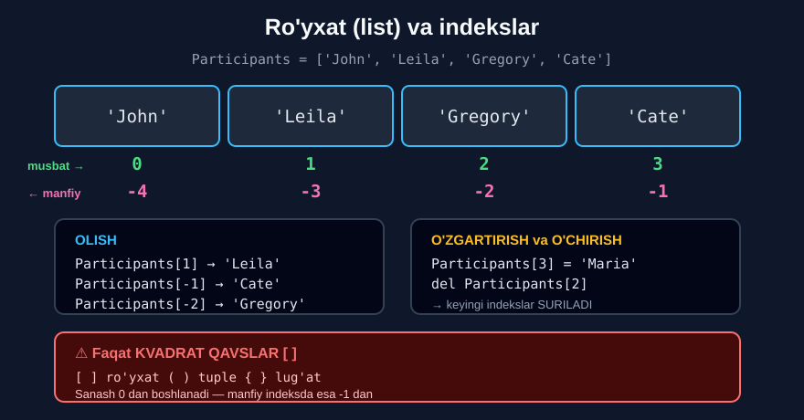

# 1-dars. Ro'yxatlar (lists)

## 🎬 Boshlashdan oldin

> **"Ajoyib. Biz shu paytgacha zo'r muvaffaqiyatga erishdik."**
>
> **"Endi siz Python sintaksisi, `if`/`elif`/`else` operatorlari va funksiyalar haqida ko'proq bilasiz."**
>
> **"Bu bo'limda biz Python dasturlash uchun muhim mavzuni qamrab olamiz — RO'YXATLAR."**

Shu paytgacha bitta o'zgaruvchi — **bitta qiymat** saqlardi. Endi u **yuzlab** qiymatni saqlaydi.

---

## 1. Ro'yxat nima?

> **"Xo'sh, ro'yxat nima?"**
>
> ## **"Ro'yxat — bu ma'lumot nuqtalarining KETMA-KETLIK turi: kasr sonlar, butun sonlar yoki satrlar."**
>
> **"Shuning uchun ro'yxatlarni tushunish sizning MA'LUMOTNI TASHKIL QILISH qobiliyatingiz bilan bog'liq — bugungi mehnat bozorida HAL QILUVCHI ko'nikma."**
>
> **"Bundan tashqari, siz Python ro'yxatlar bilan ishlash uchun DO'STONA muhit yaratishini ko'rasiz."**

---

## 2. Ro'yxat yaratish

> **"Faraz qiling, siz `participants` deb ataladigan ro'yxat yaratmoqchisiz — u John, Leila, Gregory va Kate ismlarini o'z ichiga oladi."**
>
> **"Oddiy o'zgaruvchi yaratish qoidalariga rioya qiling, lekin IKKI NARSAGA ehtiyot bo'ling."**
>
> ## **"Satrlarni KVADRAT QAVSLAR ichiga joylashtiring va QO'SHTIRNOQLARDAN to'g'ri foydalaning."**

```python
Participants = ['John', 'Leila', 'Gregory', 'Cate']
Participants
```

```
['John', 'Leila', 'Gregory', 'Cate']
```

> ## **"Aynan shu qavslar ichidagi elementlar RO'YXAT hosil qilishini bildiradi — boshqa turdagi ketma-ketlik emas."**



---

## 3. Element olish (indekslash)

> **"Guruh a'zolaridan birining ismini ajratib ola olamanmi? Albatta, ola olaman."**
>
> **"`Friday` so'zidan `d` harfini qavslar yordamida qanday ajratib olganimizni eslaysizmi?"**
>
> ## **"Bu yerdagi mantiq AYNAN SHUNDAY."**

*(13-modulning 6-darsi.)*

> **"Men ro'yxat nomini yozaman, va qavslar ichida meni qiziqtiradigan ismga mos POZITSIYANI ko'rsataman."**
>
> ## **"Men oddiy qavslar yoki figurali qavslardan foydalanmasligim MUHIM."**

```python
print(Participants[1])
```

```
Leila
```

> **"Dasturchilar sifatida biz NOLDAN sanay boshlaymiz. Demak, `0`, `1` — `1` to'g'ri pozitsiya bo'lishi kerak. Va shunday ham."**

### 🔤 Atama

> **"Bunday vaziyatda kompyuter olimi shunday deyishi mumkin: siz ro'yxatga `1` qiymatini INDEKSLASH orqali kirdingiz."**
>
> **"Bu siz ushbu ro'yxat o'zgaruvchisidagi IKKINCHI elementni ajratib olganingizni bildiradi."**

---

## 4. Manfiy indekslar

> **"Bundan tashqari, ro'yxatingizdagi OXIRGI elementga yetishning yo'li bor: oxiridan boshiga qarab sanashni boshlang."**
>
> **"Keyin raqam oldiga MINUS belgisi kerak bo'ladi."**
>
> ## **"Va tuzoqqa tushmang: biz yana NOLDAN sanashni boshlaymiz deb o'ylamang."**

```python
Participants[-1]
```

```
'Cate'
```

> **"`Cate` ni olish uchun biz `-1` yozishimiz kerak."**

```python
Participants[-2]
```

```
'Gregory'
```

> **"`Gregory` ni olish uchun bizga `-2` kerak."**

```
'John'  'Leila'  'Gregory'  'Cate'
   0       1         2        3      ← musbat: 0 dan
  -4      -3        -2       -1      ← manfiy: -1 dan
```

---

## 5. Elementni almashtirish

> **"Xo'p, endi ro'yxatlarning ASOSIY XUSUSIYATINI o'rganaylik: ro'yxatdagi elementlarni ALMASHTIRISH yoki O'CHIRISH."**
>
> **"Faraz qilaylik, Kate qandaydir sababga ko'ra ketishga majbur bo'ldi, lekin Maria uni almashtira oladi."**
>
> **"Mana nima qila olamiz: `3`-pozitsiyadagi qiymatga murojaat qilamiz — u hozir `Cate` ga tegishli — va unga `Maria` satrini biriktiramiz."**

```python
Participants[3] = 'Maria'
Participants
```

```
['John', 'Leila', 'Gregory', 'Maria']
```

> **"Sezgimiz to'g'ri bo'ldimi, tekshiraylik. 100%. Ajoyib."**

> ## 🔑 **Bu — ro'yxatning ENG MUHIM xususiyati: uni O'ZGARTIRISH mumkin.** *(Satrlarni esa — mumkin emas!)*

```python
soz = "Friday"
soz[0] = "M"        # ❌ TypeError: 'str' object does not support item assignment
```

---

## 6. Elementni o'chirish

> **"Boshqa stsenariy: afsuski, Gregory boshqa joydan yaxshiroq taklif oldi, shuning uchun u ham ketdi."**
>
> **"Uni almashtiradigan hech kim yo'q, lekin biz ro'yxatimizni mos ravishda TO'G'RILASHIMIZ kerak."**
>
> **"`del` kalit so'zi kerakli natijani bera oladi. `del` yozing. Keyin `participants[2]` yozib, Gregory'ning pozitsiyasini to'g'ri indekslang."**

```python
del Participants[2]
Participants
```

```
['John', 'Leila', 'Maria']
```

> **"Va voilà!"**

---

## 7. ⚠️ Indekslar SURILADI

> ## **"Muhim eslatma: elementni O'CHIRISH barcha KEYINGI elementlarning INDEKSLARINI o'zgartiradi."**
>
> **"Gregory'ni olib tashlagandan so'ng, Maria'ning pozitsiyasi bir joyga CHAPGA SURILDI va endi IKKINCHI pozitsiyada."**
>
> **"Uchinchi pozitsiyada element YO'Q."**

```python
Participants[2]
```

```
'Maria'
```

### Ko'rgazmali

```
O'CHIRISHDAN OLDIN:
['John', 'Leila', 'Gregory', 'Maria']
    0       1         2         3

del Participants[2]
              ↓

O'CHIRISHDAN KEYIN:
['John', 'Leila', 'Maria']
    0       1        2        ← Maria 3 dan 2 ga SURILDI
                              ← 3-pozitsiya endi YO'Q
```

> ⚠️ **Amaliy xavf:** bir necha elementni ketma-ket o'chirsangiz — indekslar har safar suriladi va **noto'g'ri elementni** o'chirib qo'yishingiz mumkin.

---

## 8. 💻 To'liq kod

```python
# ===== RO'YXAT YARATISH =====
Participants = ['John', 'Leila', 'Gregory', 'Cate']
print(Participants)

# ===== INDEKSLASH =====
print(Participants[1])          # Leila
print(Participants[0])          # John
print(Participants[-1])         # Cate
print(Participants[-2])         # Gregory

# ===== ALMASHTIRISH =====
Participants[3] = 'Maria'
print(Participants)

# ===== O'CHIRISH =====
del Participants[2]
print(Participants)
print(Participants[2])          # Maria  ← SURILDI

# ===== TURLI TURDAGI ELEMENTLAR =====
aralash = [10, 3.14, "salom", True]
print(aralash)
print(type(aralash))

# ===== BO'SH RO'YXAT =====
bosh = []
print(bosh, len(bosh))

# ===== RO'YXAT O'ZGARTIRILADI, SATR — YO'Q =====
r = ['a', 'b', 'c']
r[0] = 'X'
print(r)                        # ['X', 'b', 'c']
# s = "abc"
# s[0] = 'X'   →  TypeError
```

**Natija:**

```
['John', 'Leila', 'Gregory', 'Cate']
Leila
John
Cate
Gregory
['John', 'Leila', 'Gregory', 'Maria']
['John', 'Leila', 'Maria']
Maria
[10, 3.14, 'salom', True]
<class 'list'>
[] 0
['X', 'b', 'c']
```

---

## 9. ⚠️ Keng tarqalgan xatolar

### Xato 1 — noto'g'ri qavslar

```python
Participants = ('John', 'Leila')       # ← bu TUPLE
Participants = {'John', 'Leila'}       # ← bu SET
Participants = ['John', 'Leila']       # ✅ ro'yxat
```

### Xato 2 — chegaradan chiqish

```python
P = ['John', 'Leila', 'Maria']         # 3 element, indekslar 0..2
P[3]
```
```
IndexError: list index out of range
```

### Xato 3 — qo'shtirnoqni unutish

```python
P = [John, Leila]
```
```
NameError: name 'John' is not defined
```

---

## 10. 📝 Rasmiy mashqlar (kursdan)

### Mashq 1
**`Numbers` deb ataladigan ro'yxat yarating. Unda `10`, `25`, `40` va `50` sonlari bo'lsin.**

<details>
<summary>✅ Yechim</summary>

```python
Numbers = [10, 25, 40, 50]
```

</details>

### Mashq 2
**Ro'yxatdan `2`-indeksdagi elementni chop eting.**

<details>
<summary>✅ Yechim</summary>

```python
Numbers[2]
```
```
40
```

</details>

### Mashq 3
**`0`-elementni chop eting.**

<details>
<summary>✅ Yechim</summary>

```python
Numbers[0]
```
```
10
```

</details>

### Mashq 4
**Oxiridan uchinchi elementni qavslar ichida minus belgisi bilan chop eting.**

<details>
<summary>✅ Yechim</summary>

```python
Numbers[-3]
```
```
25
```

**Sanab ko'ring:**
```
 10   25   40   50
 -4   -3   -2   -1
```

</details>

### Mashq 5
**`10` sonini `15` bilan almashtiring.**

<details>
<summary>✅ Yechim</summary>

```python
Numbers[0] = 15
Numbers
```
```
[15, 25, 40, 50]
```

</details>

### Mashq 6
**`Numbers` ro'yxatidan `25` sonini o'chiring.**

<details>
<summary>✅ Yechim</summary>

```python
del Numbers[1]
Numbers
```
```
[15, 40, 50]
```

</details>

---

## 11. ⚡ Qo'shimcha mashqlar

### 🟢 Oson

**M1.** Beshta shahar nomidan ro'yxat yarating. Birinchi va oxirgi shaharni chiqaring.

**M2.** Ro'yxatning **o'rtadagi** elementini toping (formula bilan).

**M3.** Ikkinchi elementni almashtiring va natijani chiqaring.

<details>
<summary>✅ Yechimlar</summary>

```python
# M1
shaharlar = ["Toshkent", "Samarqand", "Buxoro", "Xiva", "Namangan"]
print(shaharlar[0])             # Toshkent
print(shaharlar[-1])            # Namangan

# M2
print(shaharlar[len(shaharlar) // 2])       # Buxoro

# M3
shaharlar[1] = "Andijon"
print(shaharlar)
# ['Toshkent', 'Andijon', 'Buxoro', 'Xiva', 'Namangan']
```

</details>

### 🟡 O'rta

**M4.** Turli turdagi elementlardan ro'yxat yarating va har birining **turini** chiqaring.

**M5.** Ro'yxatdan **ikkita** elementni ketma-ket o'chiring. Nima bo'lganini kuzating.

**M6.** Ro'yxat ichida ro'yxat yarating va ichkaridagi elementga murojaat qiling.

<details>
<summary>✅ Yechimlar</summary>

```python
# M4
aralash = [10, 3.14, "salom", True]
print(type(aralash[0]))         # <class 'int'>
print(type(aralash[1]))         # <class 'float'>
print(type(aralash[2]))         # <class 'str'>
print(type(aralash[3]))         # <class 'bool'>

# M5
r = ['a', 'b', 'c', 'd', 'e']
del r[1]
print(r)                        # ['a', 'c', 'd', 'e']
del r[1]
print(r)                        # ['a', 'd', 'e']
# ⚠️ Ikkinchi safar 'c' EMAS, 'd' ni kutgan bo'lsangiz — 'c' o'chdi!
# Indekslar SURILDI

# M6
ichma_ich = [['a', 'b'], ['c', 'd']]
print(ichma_ich[0])             # ['a', 'b']
print(ichma_ich[0][1])          # b
```

</details>

### 🔴 Qiyin

**M7.** Nima uchun satrni `s[0] = 'X'` bilan o'zgartirib bo'lmaydi, lekin ro'yxatni mumkin?

**M8.** Ro'yxatdagi barcha elementlarni o'chiring — ikki xil usulda.

**M9.** Indekslar surilishini **isbotlang**: bir ro'yxatdan barcha `'x'` larni `del` bilan o'chirishga urinib ko'ring.

<details>
<summary>✅ Yechimlar</summary>

```python
# M7
r = ['a', 'b', 'c']
r[0] = 'X'
print(r)                        # ['X', 'b', 'c']   ✅

s = "abc"
# s[0] = 'X'
# TypeError: 'str' object does not support item assignment
# SATR — IMMUTABLE (o'zgarmas), RO'YXAT — MUTABLE (o'zgaruvchan)

# M8
r1 = ['a', 'b', 'c']
del r1[0]; del r1[0]; del r1[0]
print(r1)                       # []

r2 = ['a', 'b', 'c']
del r2[:]                       # butun kesimni o'chirish
print(r2)                       # []

# M9
r = ['x', 'x', 'a', 'b']
del r[0]
print(r)                        # ['x', 'a', 'b']
del r[1]                        # 'x' ni kutgandik, lekin 'a' o'chdi!
print(r)                        # ['x', 'b']
# ⚠️ Saboq: o'chirishdan keyin INDEKSLARNI QAYTA tekshiring
```

</details>

---

## 12. 🧠 O'zini tekshirish savollari

1. Ro'yxat nima?
2. Ro'yxatni tushunish nima bilan bog'liq?
3. Ro'yxat yaratishda ikki narsaga e'tibor berish kerak — qaysilariga?
4. Kvadrat qavslar nimani bildiradi?
5. Element olish mantig'i nimaga o'xshash?
6. Qanday qavslardan foydalanmaslik kerak?
7. Sanash nechchidan boshlanadi?
8. `Participants[1]` nima beradi?
9. Oxirgi elementni qanday olish mumkin?
10. `Cate` va `Gregory` uchun qaysi manfiy indekslar kerak?
11. Elementni qanday almashtirish mumkin?
12. Elementni o'chirish uchun qaysi kalit so'z ishlatiladi?
13. O'chirish nimaga ta'sir qiladi?

<details>
<summary>✅ Javoblar</summary>

1. **Ma'lumot nuqtalarining ketma-ketlik turi** — kasr sonlar, butun sonlar yoki satrlar.
2. **Ma'lumotni tashkil qilish** qobiliyati bilan — mehnat bozorida **hal qiluvchi ko'nikma**.
3. Satrlarni **kvadrat qavslar** ichiga joylash va **qo'shtirnoqlardan** to'g'ri foydalanish.
4. Ichidagi elementlar **ro'yxat** hosil qilishini — boshqa turdagi ketma-ketlik emas.
5. `"Friday"` dan `d` ni ajratib olishga — **aynan shunday**.
6. **Oddiy qavslar `()`** yoki **figurali qavslar `{}`**.
7. **Noldan.**
8. **`Leila`** — ya'ni **ikkinchi** element.
9. **Oxiridan boshiga** sanab, raqam oldiga **minus** qo'yib: `[-1]`.
10. **`-1`** va **`-2`**.
11. Pozitsiyaga murojaat qilib, unga **yangi qiymat biriktirib**.
12. **`del`.**
13. Barcha **keyingi elementlarning indekslari** o'zgaradi — ular **chapga suriladi**.

</details>

---

## 📌 Xulosa

```python
Participants = ['John', 'Leila', 'Gregory', 'Cate']
                   0       1         2        3
                  -4      -3        -2       -1

OLISH:
Participants[1]      →  'Leila'
Participants[-1]     →  'Cate'
Participants[-2]     →  'Gregory'

ALMASHTIRISH:
Participants[3] = 'Maria'
→  ['John', 'Leila', 'Gregory', 'Maria']

O'CHIRISH:
del Participants[2]
→  ['John', 'Leila', 'Maria']


⚠️  O'CHIRISHDAN KEYIN INDEKSLAR SURILADI

    OLDIN:  ['John','Leila','Gregory','Maria']
               0      1        2        3
    KEYIN:  ['John','Leila','Maria']
               0      1        2       ← Maria 3→2


⚠️  QAVSLAR MUHIM
    [ ]  ro'yxat        ( )  tuple        { }  lug'at

🔑 RO'YXATNI o'zgartirish MUMKIN
🔑 SATRNI o'zgartirish MUMKIN EMAS
```

---

## 🔖 Atamalar

| Atama | Inglizcha | Izoh |
|---|---|---|
| Ro'yxat | *list* | `[ ]` ichidagi ketma-ketlik |
| Ketma-ketlik | *sequence* | Tartiblangan ma'lumotlar to'plami |
| Element | *element / item* | Ro'yxatning bitta a'zosi |
| Indekslash | *indexing* | Pozitsiya bo'yicha murojaat |
| Kvadrat qavslar | *square brackets* | `[ ]` |
| `del` | *delete* | Elementni o'chiruvchi kalit so'z |
| O'zgaruvchan | *mutable* | O'zgartirish mumkin (list) |
| O'zgarmas | *immutable* | O'zgartirib bo'lmaydi (str, tuple) |
| `IndexError` | *IndexError* | Chegaradan chiqish xatosi |

---

🏠 [Modul boshiga](README.md) · ➡️ [Keyingi: Metodlar](02-Using-Methods.md)
