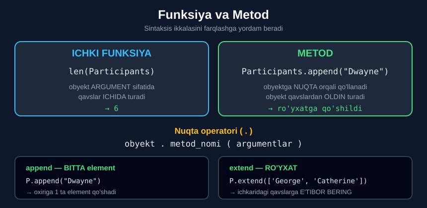

# 2-dars. Metodlardan foydalanish

## 🎬 Boshlashdan oldin

1-darsda elementni **almashtirish** va **o'chirish** ni ko'rdingiz. Endi — **qo'shish**.

> **"Demak, `participants` ro'yxatiga yangi ism — Dwayne — qo'shilishi kerak, va biz `append` deb ataladigan METODDAN foydalanamiz."**

---

## 1. Metod nima?

> **"METOD va FUNKSIYA atamalarini O'ZARO ALMASHTIRILADIGAN deb hisoblang, chunki amalda metodlar funksiyalarga juda o'xshash ishlaydi."**
>
> ## **"Biroq, bu vaziyatda texnik jihatdan to'g'ri atama — METOD."**

---

## 2. Nuqta operatori

> **"Mana o'zingiz yaratishingiz shart bo'lmagan, Python'da to'g'ridan-to'g'ri ishlatiladigan TAYYOR, ICHKI metodlarni chaqirish imkonini beruvchi sintaksis."**
>
> **"Obyekt nomidan keyin — bu holda bu `participants` ro'yxati — biz NUQTA qo'yamiz, u NUQTA OPERATORI deb ataladi."**
>
> ## **"Nuqta operatori ma'lum metodni CHAQIRISH yoki UYG'OTISH imkonini beradi."**

```
obyekt . metod_nomi ( argumentlar )
       ↑
    nuqta operatori
```

> **"`append` metodini chaqirish uchun uning nomini va qavslarni yozing."**

---

## 3. `append` — bitta element qo'shish

> **"Ro'yxatimizga `Dwayne` ismini kiritish uchun qavslar orasiga `Dwayne` satrini qo'shtirnoqlar ichida qo'yishimiz kerak."**

```python
Participants.append("Dwayne")
Participants
```

```
['John', 'Leila', 'Maria', 'Dwayne']
```

> **"Yacheykani bajarganimizdan so'ng bizning guruhimizga Dwayne qo'shilgan bo'lishi kerak. `Shift + Enter`. To'g'ri. Ajoyib."**
>
> ## **"Bu UMUMIY TUZILMANI eslab qoling, chunki Python'da mavjud har qanday metodni chaqirmoqchi bo'lsak, unga rioya qilishimiz kerak."**

---

## 4. `extend` — ro'yxat qo'shish

> **"Muqobil ravishda, xuddi shu natijaga `extend` metodidan foydalanib erishish mumkin."**
>
> **"George va Kathryn'ni guruhimizga taklif qilaylik."**
>
> **"Avval `extend` metodini chaqiraylik."**

> ## **"Bu safar qavslar ichida bizga QAVSLAR qo'shish kerak bo'ladi — chunki biz `participants` ro'yxatini aynan shu qavslar ichida ko'rsatilgan RO'YXATNI qo'shish orqali kengaytiramiz."**

```python
Participants.extend(['George', 'Catherine'])
Participants
```

```
['John', 'Leila', 'Maria', 'Dwayne', 'George', 'Catherine']
```

> **"`Shift + Enter` bilan bajaring va ikkita qism birlashtirilgan bo'ladi: dastlabki `participants` ro'yxati va kengaytma."**
>
> **"Shunday qilib, siz asl ro'yxatingizni KATTALASHTIRISHGA muvaffaq bo'ldingiz."**



---

## 5. ⚠️ `append` va `extend` farqi

| Metod | Nima qiladi | Misol | Natija |
|---|---|---|---|
| `append` | **Bitta** element qo'shadi | `P.append("X")` | `[..., "X"]` |
| `extend` | **Ro'yxatdagi hamma** elementni qo'shadi | `P.extend(["X","Y"])` | `[..., "X", "Y"]` |

### Tuzoq

```python
a = ['John', 'Leila']
a.append(['George', 'Catherine'])
print(a)
# ['John', 'Leila', ['George', 'Catherine']]     ← RO'YXAT ICHIDA RO'YXAT!

b = ['John', 'Leila']
b.extend(['George', 'Catherine'])
print(b)
# ['John', 'Leila', 'George', 'Catherine']       ✅ to'g'ri
```

> ## 🔑 **`append` — nima bersangiz, o'shani BUTUNICHA qo'shadi. `extend` — ichini OCHIB qo'shadi.**

---

## 6. Ro'yxat elementlari — satr qiymatlar

> **"Bu darsni yopishdan oldin yana bir-ikki narsa."**
>
> **"Birinchidan, sizga ro'yxat elementlari bevosita SATR QIYMATLAR sifatida qabul qilinishini ko'rsataman."**

```python
print('The first participant is ' + Participants[0] + '.')
```

```
The first participant is John.
```

> **"Bu buyruqni chop etgandan so'ng, biz ro'yxatimizdagi birinchi ishtirokchi John ekanini ko'ramiz."**
>
> **"Buni qilish uchun `participants` elementi atrofiga qo'shtirnoq qo'yish SHART EMAS edi."**

---

## 7. `len()` — elementlar soni

> **"Nihoyat, `len` ichki funksiyasi obyektdagi elementlar sonini hisoblaydi."**

```python
len('Dolphin')
```
```
7
```

> **"Masalan, so'zimiz `dolphin` bo'lsa, bu funksiya u yetti harfdan iborat ekanini aytadi."**

> **"Lekin muhimrog'i — xuddi shu funksiya RO'YXATDAGI elementlar sonini olish uchun ham qo'llanilishi mumkin."**

```python
len(Participants)
```
```
6
```

> **"Bu bizga ro'yxat olti a'zoni o'z ichiga olishini ko'rsatadi."**

---

## 8. 🔑 Funksiya va metod — sintaksis farqi

> **"Xulosa qilib aytganda, ICHKI FUNKSIYA `participants` obyektini ARGUMENT sifatida qanday qabul qilishini kuzating."**
>
> **"ICHKI METODLARNI chaqirganimizda esa — ular `participants` ro'yxatiga NUQTA OPERATORI yordamida QO'LLANADI."**
>
> ## **"Turli sintaksis sizga bu ikkalasini FARQLASHGA yordam beradi."**

```python
# FUNKSIYA — obyekt QAVSLAR ICHIDA
len(Participants)
max(Participants)
sum(Numbers)

# METOD — obyekt NUQTADAN OLDIN
Participants.append("Dwayne")
Participants.extend(['George'])
Participants.sort()
```

```
FUNKSIYA:   funksiya ( obyekt )
METOD:      obyekt . metod ( argument )
```

---

## 9. 💻 To'liq kod

```python
Participants = ['John', 'Leila', 'Maria']

# ===== APPEND — BITTA ELEMENT =====
Participants.append("Dwayne")
print(Participants)

# ===== EXTEND — RO'YXAT =====
Participants.extend(['George', 'Catherine'])
print(Participants)

# ===== SATR SIFATIDA ISHLATISH =====
print('The first participant is ' + Participants[0] + '.')

# ===== LEN =====
print(len('Dolphin'))            # 7
print(len(Participants))         # 6

# ===== APPEND va EXTEND FARQI =====
a = ['John', 'Leila']
a.append(['George', 'Catherine'])
print(a)

b = ['John', 'Leila']
b.extend(['George', 'Catherine'])
print(b)

# ===== FUNKSIYA va METOD =====
sonlar = [15, 42, 8, 31]
print(len(sonlar))               # FUNKSIYA
print(max(sonlar))               # FUNKSIYA
print(sum(sonlar))               # FUNKSIYA
sonlar.append(99)                # METOD
print(sonlar)

# ===== BOSHQA FOYDALI METODLAR =====
r = ['b', 'a', 'c']
r.insert(1, 'X')                 # 1-pozitsiyaga qo'yish
print(r)
r.remove('X')                    # QIYMAT bo'yicha o'chirish
print(r)
oxirgi = r.pop()                 # oxirgisini olib tashlash va QAYTARISH
print(oxirgi, r)
print(r.count('a'))              # nechta 'a' bor
```

**Natija:**

```
['John', 'Leila', 'Maria', 'Dwayne']
['John', 'Leila', 'Maria', 'Dwayne', 'George', 'Catherine']
The first participant is John.
7
6
['John', 'Leila', ['George', 'Catherine']]
['John', 'Leila', 'George', 'Catherine']
4
42
96
[15, 42, 8, 31, 99]
['b', 'X', 'a', 'c']
['b', 'a', 'c']
c ['b', 'a']
1
```

---

## 10. 📋 Foydali ro'yxat metodlari

| Metod | Nima qiladi | Misol |
|---|---|---|
| `.append(x)` | Oxiriga **bitta** element | `P.append("Ali")` |
| `.extend([x,y])` | Oxiriga **ro'yxat** | `P.extend(["Ali","Vali"])` |
| `.insert(i, x)` | `i`-pozitsiyaga qo'yish | `P.insert(0, "Ali")` |
| `.remove(x)` | **Qiymat** bo'yicha o'chirish | `P.remove("Ali")` |
| `.pop()` | Oxirgisini olib **qaytaradi** | `x = P.pop()` |
| `.index(x)` | Element **indeksini** topadi | `P.index("Ali")` |
| `.count(x)` | Nechta marta uchraydi | `P.count("Ali")` |
| `.sort()` | Tartiblaydi | `P.sort()` |
| `.reverse()` | Teskarisiga o'giradi | `P.reverse()` |

> 📌 `.index()` va `.sort()` — **keyingi darsda**.

---

## 11. 📝 Rasmiy mashqlar (kursdan)

### Mashq 1
**`Numbers` ro'yxatiga `100` sonini qo'shing.**

<details>
<summary>✅ Yechim</summary>

```python
Numbers = [15, 40, 50]
Numbers.append(100)
Numbers
```
```
[15, 40, 50, 100]
```

</details>

### Mashq 2
**`extend` metodi yordamida ro'yxatga `115` va `140` sonlarini qo'shing.**

<details>
<summary>✅ Yechim</summary>

```python
Numbers.extend([115, 140])
Numbers
```
```
[15, 40, 50, 100, 115, 140]
```

> ⚠️ **Diqqat:** `extend` ichida **kvadrat qavslar** shart.

</details>

### Mashq 3
**`"The fourth element of the Numbers list is:"` degan jumlani chop eting va keyin to'rtinchi elementning qiymatini ko'rsating. Verguldan foydalaning.**

<details>
<summary>✅ Yechim</summary>

```python
print('The fourth element of the Numbers list is', Numbers[3])
```
```
The fourth element of the Numbers list is 100
```

> 💡 **Nima uchun `Numbers[3]`?** To'rtinchi element — indeksi **3** *(sanash 0 dan)*.
>
> 💡 **Nima uchun vergul?** Chunki `Numbers[3]` — **son**, satrga `+` bilan qo'shib bo'lmaydi *(12-modul, `TypeError`)*.

</details>

### Mashq 4
**`Numbers` ro'yxatida nechta element bor?**

<details>
<summary>✅ Yechim</summary>

```python
len(Numbers)
```
```
6
```

</details>

---

## 12. ⚡ Qo'shimcha mashqlar

### 🟢 Oson

**M1.** Bo'sh ro'yxat yarating va `append` bilan uchta element qo'shing.

**M2.** Ikkita ro'yxatni `extend` bilan birlashtiring.

**M3.** Ro'yxat uzunligini `len()` bilan toping.

<details>
<summary>✅ Yechimlar</summary>

```python
# M1
r = []
r.append("a")
r.append("b")
r.append("c")
print(r)                        # ['a', 'b', 'c']

# M2
a = [1, 2, 3]
b = [4, 5, 6]
a.extend(b)
print(a)                        # [1, 2, 3, 4, 5, 6]

# M3
print(len(a))                   # 6
```

</details>

### 🟡 O'rta

**M4.** `append` va `extend` farqini **isbotlang**.

**M5.** `insert`, `remove` va `pop` metodlarini sinang.

**M6.** Funksiya va metod sintaksisini **yonma-yon** ko'rsating.

<details>
<summary>✅ Yechimlar</summary>

```python
# M4
a = [1, 2]
a.append([3, 4])
print(a)                        # [1, 2, [3, 4]]   ← ichma-ich!
print(len(a))                   # 3

b = [1, 2]
b.extend([3, 4])
print(b)                        # [1, 2, 3, 4]     ✅
print(len(b))                   # 4

# M5
r = ['b', 'a', 'c']
r.insert(1, 'X')
print(r)                        # ['b', 'X', 'a', 'c']
r.remove('X')
print(r)                        # ['b', 'a', 'c']
oxirgi = r.pop()
print(oxirgi)                   # c
print(r)                        # ['b', 'a']

# M6
sonlar = [15, 42, 8]
# FUNKSIYA — obyekt qavs ichida:
print(len(sonlar), max(sonlar), min(sonlar), sum(sonlar))    # 3 42 8 65
# METOD — obyekt nuqtadan oldin:
sonlar.append(99)
print(sonlar)                   # [15, 42, 8, 99]
```

</details>

### 🔴 Qiyin

**M7.** `append` bilan satr qo'shsangiz nima bo'ladi? `extend` bilan-chi?

**M8.** `remove` va `del` farqini ko'rsating.

**M9.** `pop()` va `pop(0)` farqini ko'rsating.

<details>
<summary>✅ Yechimlar</summary>

```python
# M7
a = [1, 2]
a.append("abc")
print(a)                        # [1, 2, 'abc']     ← BUTUN satr

b = [1, 2]
b.extend("abc")
print(b)                        # [1, 2, 'a', 'b', 'c']   😱
# extend satrni HARFLARGA ajratdi — chunki satr ham KETMA-KETLIK!

# M8
r = ['a', 'b', 'c']
r.remove('b')                   # QIYMAT bo'yicha
print(r)                        # ['a', 'c']

r2 = ['a', 'b', 'c']
del r2[1]                       # INDEKS bo'yicha
print(r2)                       # ['a', 'c']
# Natija bir xil, LEKIN:
# r.remove('z')  →  ValueError: list.remove(x): x not in list
# del r[5]       →  IndexError

# M9
r = ['a', 'b', 'c']
print(r.pop())                  # c   ← OXIRGISI (standart)
print(r)                        # ['a', 'b']
print(r.pop(0))                 # a   ← BIRINCHISI
print(r)                        # ['b']
```

</details>

---

## 13. 🧠 O'zini tekshirish savollari

1. Metod va funksiya atamalari qanday bog'liq?
2. Bu vaziyatda texnik to'g'ri atama qaysi?
3. Nuqta operatori nima qiladi?
4. `append` metodini qanday chaqiriladi?
5. `extend` da qavslar ichida yana nima kerak?
6. Ro'yxat elementlari qanday qabul qilinadi?
7. `len()` nima qiladi?
8. Funksiya va metodni sintaksis bo'yicha qanday farqlaysiz?

<details>
<summary>✅ Javoblar</summary>

1. Ular **o'zaro almashtiriladigan** — amalda metodlar funksiyalarga **juda o'xshash** ishlaydi.
2. **Metod.**
3. Ma'lum metodni **chaqirish** (uyg'otish) imkonini beradi.
4. **Nomi va qavslar** bilan: `obyekt.append(argument)`.
5. **Kvadrat qavslar** — chunki ro'yxatni **ro'yxat** bilan kengaytiramiz.
6. Bevosita **satr qiymatlar** sifatida — qo'shtirnoq **shart emas**.
7. **Obyektdagi elementlar sonini** hisoblaydi — satrda ham, ro'yxatda ham.
8. **Funksiya** obyektni **argument sifatida** oladi (`len(P)`); **metod** obyektga **nuqta orqali** qo'llanadi (`P.append(...)`).

</details>

---

## 📌 Xulosa

```python
UMUMIY TUZILMA

obyekt . metod ( argumentlar )
        ↑
    nuqta operatori


append  —  BITTA element
Participants.append("Dwayne")
→  ['John', 'Leila', 'Maria', 'Dwayne']

extend  —  RO'YXAT (ichkarida QAVSLAR!)
Participants.extend(['George', 'Catherine'])
→  ['John', 'Leila', 'Maria', 'Dwayne', 'George', 'Catherine']


⚠️  FARQ

a.append(['X','Y'])   →  [..., ['X','Y']]   ichma-ich!
b.extend(['X','Y'])   →  [..., 'X', 'Y']    ✅

⚠️  b.extend("abc")   →  [..., 'a','b','c']  satr HARFLARGA ajraladi!


FUNKSIYA  va  METOD

len(Participants)              ← FUNKSIYA: obyekt QAVS ICHIDA
Participants.append("X")       ← METOD:    obyekt NUQTADAN OLDIN


len()  —  satrda ham, ro'yxatda ham ishlaydi
len('Dolphin')       →  7
len(Participants)    →  6
```

---

## 🔖 Atamalar

| Atama | Inglizcha | Izoh |
|---|---|---|
| Metod | *method* | Obyektga nuqta orqali qo'llanadigan funksiya |
| Nuqta operatori | *dot operator* | `.` — metodni chaqiradi |
| Chaqirish | *call / invoke* | Metodni ishga tushirish |
| `append` | *append* | Oxiriga bitta element |
| `extend` | *extend* | Oxiriga ro'yxat |
| `insert` | *insert* | Ma'lum pozitsiyaga qo'yish |
| `remove` | *remove* | Qiymat bo'yicha o'chirish |
| `pop` | *pop* | Olib tashlab, qaytarish |
| Ichki metod | *built-in method* | Python bilan birga keladi |

---

⬅️ [Oldingi: Ro'yxatlar](01-Lists.md) · ➡️ [Keyingi: Kesish (slicing)](03-List-Slicing.md)
