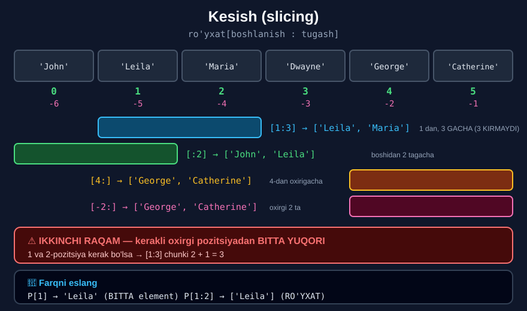

# 3-dars. Ro'yxatni kesish (slicing)

## 🎬 Boshlashdan oldin

> **"Bu darsda biz sizni yana bir JUDA MUHIM tushuncha bilan tanishtiramiz — KESISH."**
>
> **"Kelajakda Python'da ishlaganingizda siz odatda JUDA KATTA ma'lumotlar bilan ishlashga majbur bo'lasiz."**
>
> ## **"Hal qilinishi kerak bo'lgan ko'plab muammolar ma'lumotlarning JUDA KICHIK qismiga tegishli bo'ladi — va bunday hollarda siz KESISHNI qo'llashingiz mumkin."**

Indekslash **bitta** element beradi. Kesish — **butun bo'lak**.

---

## 1. Asosiy kesish

> **"Tasavvur qiling, siz avval ko'rgan `participants` ro'yxatidan faqat ikkita ismni — Leela va Maria'ni — o'z ichiga olgan ikkinchi, ancha kichik ro'yxat olmoqchisiz."**
>
> **"Pythonic tilda bu birinchi va ikkinchi pozitsiyadagi elementlarni ajratib olishni bildiradi."**

> **"Bu elementlarga kirish uchun biz kvadrat qavslarni ochamiz — xuddi indekslashda qilganimizdek — va `1 : 3` yozamiz."**

```python
Participants = ['John', 'Leila', 'Maria', 'Dwayne', 'George', 'Catherine']
Participants[1:3]
```

```
['Leila', 'Maria']
```

---

## 2. ⚠️ Ikkinchi raqamning siri

> ## **"Birinchi raqam aynan bizni qiziqtiradigan BIRINCHI POZITSIYAGA mos keladi, ikkinchi raqam esa bizga kerak bo'lgan OXIRGI POZITSIYADAN BITTA YUQORI."**
>
> **"Bizning holatda `2 + 1 = 3`. To'g'ri."**

```
Kerak:  1 va 2-pozitsiya
Yozish: [1 : 3]
              ↑
        2 + 1 = 3
```

> **"Aytishimiz mumkin: biz `participants` ro'yxatimizni KESIB, Leela va Maria ismlari bilan yangisini oldik."**

> **"Bilaman, bu sintaksis biroz g'alati ko'rinadi, lekin u unchalik mantiqsiz emas."**

### 🧠 Nima uchun shunday?

**Foyda 1 — elementlar sonini oson hisoblash:**

```
[1:3]  →  3 - 1 = 2 ta element
[0:5]  →  5 - 0 = 5 ta element
```

**Foyda 2 — kesimlarni ulash:**

```python
P[:3] + P[3:]      # butun ro'yxat — hech narsa tushmaydi, takrorlanmaydi
```



---

## 3. Boshidan kesish

> **"Ro'yxatdan birinchi ikkita ismni olaylik — John va Leela."**
>
> **"Bu holda sizga boshida raqam KERAK EMAS, va siz to'g'ridan-to'g'ri ikki nuqta yozib boshlashingiz mumkin."**

```python
Participants[:2]
```

```
['John', 'Leila']
```

> **"Xo'sh, `:2` yozib biz aynan birinchi ikkita elementni olamiz. Juda yaxshi."**

---

## 4. Oxirigacha kesish

> **"Oxirgi ikkitasini qanday olishim mumkin?"**
>
> **"Bir usul — George'ga mos keladigan TO'RTINCHI pozitsiyani ko'rsatib, ikki nuqtadan keyin HECH NARSA qoldirmaslik."**

```python
Participants[4:]
```

```
['George', 'Catherine']
```

> **"Bu biz to'rtinchi pozitsiyadan (u ham kiradi) ro'yxatimiz OXIRIGACHA barcha elementlarni ajratib olishimizni bildiradi."**

---

## 5. Oxiridan kesish

> **"Xuddi shu natijani olishning boshqa yo'li — `2` raqami oldiga MINUS belgisini qo'yish."**
>
> ## **"Shunday qilib, Python sanash yo'nalishini oxiridan boshiga qarab TESKARIGA o'giradi."**
>
> **"Biz nechta element so'rayapmiz? Ikkita."**

```python
Participants[-2:]
```

```
['George', 'Catherine']
```

> **"Bajaraylik. Va mana natija: biz yangi ro'yxatda George va Katherine'ni oldik. Ajoyib."**

### 📋 Kesish shakllari

| Yozuv | Ma'nosi | Misol |
|---|---|---|
| `[a:b]` | `a` dan `b` gacha (`b` **kirmaydi**) | `[1:3]` → 2 ta |
| `[:b]` | **Boshidan** `b` gacha | `[:2]` → dastlabki 2 ta |
| `[a:]` | `a` dan **oxirigacha** | `[4:]` → oxirgi 2 ta |
| `[-n:]` | **Oxirgi** `n` ta | `[-2:]` → oxirgi 2 ta |
| `[:-n]` | Oxirgi `n` tasidan **tashqari** | `[:-2]` → dastlabki 4 ta |
| `[:]` | **Butun** ro'yxat (nusxa) | `[:]` |

---

## 6. `index()` metodi

> **"Xo'p, ro'yxatlarga qo'llanilishi mumkin bo'lgan ba'zi qo'shimcha metodlarni ko'rib chiqaylik."**
>
> **"Faraz qiling, siz Maria ro'yxatingizda ekanini bilasiz, lekin uning POZITSIYASINI bilmaysiz."**
>
> **"Boshqacha aytganda, siz `participants` ro'yxatidan `Maria` elementining INDEKSINI olmoqchisiz."**
>
> **"Shunchaki `index` metodini chaqiring va qavslar ichida qiziqtirgan satr o'zgaruvchini ko'rsating."**

```python
Maria_ind = Participants.index("Maria")
Maria_ind
```

```
2
```

> **"Mashina bizga Maria ikkinchi pozitsiyada ekanini aytadi. Va shunday ham."**

> ⚠️ **Element yo'q bo'lsa:**
> ```python
> Participants.index("Zebra")
> # ValueError: 'Zebra' is not in list
> ```

---

## 7. Ro'yxatlar ro'yxati

> **"Keyingi funksional imkoniyat — qiziq narsa. Men sizga RO'YXATLAR RO'YXATINI yaratish mumkinligini ko'rsataman."**
>
> **"Maqsadim — `Bigger_List` deb ataladigan ro'yxat yaratish, u `participants` ro'yxatini va men `newcomers` deb ataydigan yangisini o'z ichiga oladi."**
>
> **"Ikkinchisi Joshua va Britney ismlarini o'z ichiga olsin."**

```python
Newcomers = ['Joshua', 'Brittany']
Newcomers
```

```
['Joshua', 'Brittany']
```

> **"Keyingi yacheykada qilishim kerak bo'lgan narsa — `Bigger_List` o'zgaruvchisining nomini yozish va qavslar ichida qo'shmoqchi bo'lgan ro'yxatlarning nomlarini ko'rsatish."**

```python
Bigger_List = [Participants, Newcomers]
Bigger_List
```

```
[['John', 'Leila', 'Maria', 'Dwayne', 'George', 'Catherine'], ['Joshua', 'Brittany']]
```

> **"Bu ishlashini tekshiraylik. Ha, ishlaydi. Ikki ro'yxat taklif qilingan tartibda ko'rsatilgan."**

### Ichkaridagi elementga murojaat

```python
Bigger_List[0]          # ['John', 'Leila', 'Maria', 'Dwayne', 'George', 'Catherine']
Bigger_List[1]          # ['Joshua', 'Brittany']
Bigger_List[1][0]       # 'Joshua'   ← IKKI marta indekslash
```

---

## 8. `sort()` metodi

> **"Ishtirokchilaringiz ismlarini ALIFBO TARTIBIDA tartiblaydigan muhim metod — `sort`."**

```python
Participants.sort()
Participants
```

```
['Catherine', 'Dwayne', 'George', 'John', 'Leila', 'Maria']
```

> **"Ko'rib turganingizdek, uni ro'yxatimizga qo'llaganimizdan so'ng Catherine birinchi, Peter esa oxirgi bo'ladi."**

### Teskari tartib

> **"Agar qavslar ichida ismlarni TESKARI tartibda tartiblashni xohlashimizni aytsak — `reverse = True` deb yozib — Peter birinchi, Catherine oxirgi bo'lardi."**

```python
Participants.sort(reverse=True)
Participants
```

```
['Maria', 'Leila', 'John', 'George', 'Dwayne', 'Catherine']
```

> 🔑 `reverse=True` — bu **nomli argument** *(16-modulning 6-darsi)*.

---

## 9. Sonlarni tartiblash

> **"Tabiiyki, agar elementlarimiz odamlarning ismlari o'rniga SOF SONLAR bo'lganida, bu metod hech qanday muammosiz ishlagan bo'lardi."**

```python
Numbers = [1, 2, 3, 4, 5]
Numbers.sort()
Numbers
```
```
[1, 2, 3, 4, 5]
```

> **"Kuzating: bu misolda men sonlarni 1 dan 5 gacha ENG KICHIGIDAN ENG KATTASIGACHA tartibladim."**

```python
Numbers.sort(reverse=True)
Numbers
```
```
[5, 4, 3, 2, 1]
```

> **"Va bu yerda — ENG KATTASIDAN ENG KICHIGIGACHA. Ajoyib."**

> ## ⚠️ **Muhim: `sort()` ro'yxatning O'ZINI o'zgartiradi va `None` qaytaradi.**
>
> ```python
> r = [3, 1, 2]
> yangi = r.sort()
> print(yangi)     # None !!!
> print(r)         # [1, 2, 3]
> ```
>
> **Yangi ro'yxat kerak bo'lsa** — `sorted()` **funksiyasidan** foydalaning:
> ```python
> r = [3, 1, 2]
> yangi = sorted(r)
> print(yangi)     # [1, 2, 3]
> print(r)         # [3, 1, 2]   ← O'ZGARMADI
> ```

---

## 10. 💻 To'liq kod

```python
Participants = ['John', 'Leila', 'Maria', 'Dwayne', 'George', 'Catherine']

# ===== KESISH =====
print(Participants[1:3])        # ['Leila', 'Maria']
print(Participants[:2])         # ['John', 'Leila']
print(Participants[4:])         # ['George', 'Catherine']
print(Participants[-2:])        # ['George', 'Catherine']
print(Participants[:-2])        # dastlabki 4 ta
print(Participants[:])          # butun nusxa

# ===== INDEX =====
Maria_ind = Participants.index("Maria")
print(Maria_ind)                # 2

# ===== RO'YXATLAR RO'YXATI =====
Newcomers = ['Joshua', 'Brittany']
Bigger_List = [Participants, Newcomers]
print(Bigger_List)
print(Bigger_List[1])           # ['Joshua', 'Brittany']
print(Bigger_List[1][0])        # Joshua

# ===== SORT =====
Participants.sort()
print(Participants)
Participants.sort(reverse=True)
print(Participants)

Numbers = [1, 2, 3, 4, 5]
Numbers.sort()
print(Numbers)
Numbers.sort(reverse=True)
print(Numbers)

# ===== sort() va sorted() FARQI =====
r = [3, 1, 2]
print(r.sort())                 # None !
print(r)                        # [1, 2, 3]

r2 = [3, 1, 2]
print(sorted(r2))               # [1, 2, 3]
print(r2)                       # [3, 1, 2]   ← o'zgarmadi

# ===== INDEKS va KESISH FARQI =====
P = ['a', 'b', 'c']
print(P[1])                     # b       ← ELEMENT
print(P[1:2])                   # ['b']   ← RO'YXAT
```

**Natija:**

```
['Leila', 'Maria']
['John', 'Leila']
['George', 'Catherine']
['George', 'Catherine']
['John', 'Leila', 'Maria', 'Dwayne']
['John', 'Leila', 'Maria', 'Dwayne', 'George', 'Catherine']
2
[['John', 'Leila', 'Maria', 'Dwayne', 'George', 'Catherine'], ['Joshua', 'Brittany']]
['Joshua', 'Brittany']
Joshua
['Catherine', 'Dwayne', 'George', 'John', 'Leila', 'Maria']
['Maria', 'Leila', 'John', 'George', 'Dwayne', 'Catherine']
[1, 2, 3, 4, 5]
[5, 4, 3, 2, 1]
None
[1, 2, 3]
[1, 2, 3]
[3, 1, 2]
b
['b']
```

---

## 11. 📝 Rasmiy mashqlar (kursdan)

`Numbers = [15, 40, 50, 100, 115, 140]`

### Mashq 1
**Kesish yordamida `100` va `115` sonlarini oling.**

<details>
<summary>✅ Yechim</summary>

```python
Numbers[3:5]
```
```
[100, 115]
```

**Sanash:**
```
 15  40  50  100  115  140
  0   1   2    3    4    5
```
Kerak: 3 va 4-pozitsiya → `[3 : 4+1]` = `[3:5]`

</details>

### Mashq 2
**Kesish yordamida ro'yxatdan dastlabki to'rtta elementni ajratib oling.**

<details>
<summary>✅ Yechim</summary>

```python
Numbers[:4]
```
```
[15, 40, 50, 100]
```

</details>

### Mashq 3
**Kesish yordamida ro'yxatdan 3-pozitsiyadan boshlab barcha elementlarni ajratib oling.**

<details>
<summary>✅ Yechim</summary>

```python
Numbers[3:]
```
```
[100, 115, 140]
```

</details>

### Mashq 4
**Kesish yordamida ro'yxatdan oxirgi 4 ta elementni ajratib oling.**

<details>
<summary>✅ Yechim</summary>

```python
Numbers[-4:]
```
```
[50, 100, 115, 140]
```

</details>

### Mashq 5
**`15` qiymatining pozitsiyasi qaysi?**

<details>
<summary>✅ Yechim</summary>

```python
Numbers.index(15)
```
```
0
```

</details>

### Mashq 6
**`Two_Numbers` deb ataladigan ro'yxat yarating. Uning elementlari `1` va `2` bo'lsin. Keyin `All_Numbers` deb ataladigan yangisini yarating — u `Numbers` va `Two_Numbers` ro'yxatlarini o'z ichiga olsin.**

<details>
<summary>✅ Yechim</summary>

```python
Two_Numbers = [1, 2]
All_Numbers = [Two_Numbers, Numbers]
All_Numbers
```
```
[[1, 2], [15, 40, 50, 100, 115, 140]]
```

</details>

### Mashq 7
**`Numbers` ro'yxatidagi barcha sonlarni eng kattasidan eng kichigigacha tartiblang.**

<details>
<summary>✅ Yechim</summary>

```python
Numbers.sort(reverse=True)
Numbers
```
```
[140, 115, 100, 50, 40, 15]
```

</details>

---

## 12. ⚡ Qo'shimcha mashqlar

### 🟢 Oson

**M1.** `[10, 20, 30, 40, 50]` dan o'rtadagi uchtasini oling.

**M2.** Dastlabki uchtasini va oxirgi ikkitasini oling.

**M3.** Ro'yxatni tartiblang, keyin teskarisiga.

<details>
<summary>✅ Yechimlar</summary>

```python
# M1
r = [10, 20, 30, 40, 50]
print(r[1:4])                   # [20, 30, 40]

# M2
print(r[:3])                    # [10, 20, 30]
print(r[-2:])                   # [40, 50]

# M3
s = [5, 2, 8, 1]
s.sort()
print(s)                        # [1, 2, 5, 8]
s.sort(reverse=True)
print(s)                        # [8, 5, 2, 1]
```

</details>

### 🟡 O'rta

**M4.** `P[1]` va `P[1:2]` farqini ko'rsating.

**M5.** `sort()` va `sorted()` farqini isbotlang.

**M6.** Ro'yxatlar ro'yxatidan **ichkaridagi** elementga murojaat qiling.

<details>
<summary>✅ Yechimlar</summary>

```python
# M4
P = ['a', 'b', 'c']
print(P[1])                     # b       ← str
print(type(P[1]))               # <class 'str'>
print(P[1:2])                   # ['b']   ← list
print(type(P[1:2]))             # <class 'list'>

# M5
r = [3, 1, 2]
natija = r.sort()
print(natija)                   # None    ← QAYTARMAYDI
print(r)                        # [1, 2, 3]  ← O'ZINI o'zgartirdi

r2 = [3, 1, 2]
natija2 = sorted(r2)
print(natija2)                  # [1, 2, 3]  ← YANGI ro'yxat
print(r2)                       # [3, 1, 2]  ← o'zgarmadi

# M6
guruhlar = [['Ali', 'Vali'], ['Hasan', 'Husan']]
print(guruhlar[0])              # ['Ali', 'Vali']
print(guruhlar[0][1])           # Vali
print(guruhlar[1][0])           # Hasan
print(len(guruhlar))            # 2   ← 4 emas!
```

</details>

### 🔴 Qiyin

**M7.** `P[:3] + P[3:]` nima beradi? Nima uchun bu foydali?

**M8.** `P[10:20]` — chegaradan tashqari kesish. Xato beradimi?

**M9.** Ro'yxatning **nusxasini** oling va asl nusxaga ta'sir qilmasligini isbotlang.

<details>
<summary>✅ Yechimlar</summary>

```python
# M7
P = ['a', 'b', 'c', 'd', 'e']
print(P[:3] + P[3:])            # ['a', 'b', 'c', 'd', 'e']
# BUTUN ro'yxat — hech narsa TUSHMAYDI, TAKRORLANMAYDI.
# Bu — "oxirgi kirmaydi" qoidasining go'zalligi.

# M8
print(P[10:20])                 # []
# KESISH chegaradan chiqsa — XATO YO'Q, bo'sh ro'yxat.
# INDEKSLASH esa xato beradi:
# P[10]  →  IndexError: list index out of range

# M9
asl = ['a', 'b', 'c']
nusxa = asl[:]                  # KESISH bilan nusxa
nusxa[0] = 'X'
print(asl)                      # ['a', 'b', 'c']   ← o'zgarmadi ✅
print(nusxa)                    # ['X', 'b', 'c']

# ⚠️ LEKIN oddiy biriktirish NUSXA EMAS:
asl2 = ['a', 'b', 'c']
nusxa2 = asl2                   # bir xil obyektga IKKINCHI NOM
nusxa2[0] = 'X'
print(asl2)                     # ['X', 'b', 'c']   ← O'ZGARDI! 😱
print(asl2 is nusxa2)           # True
```

</details>

---

## 13. 🧠 O'zini tekshirish savollari

1. Kesish qachon kerak bo'ladi?
2. `[1:3]` da birinchi va ikkinchi raqam nimaga mos keladi?
3. Nima uchun `3` yozildi?
4. Boshidan kesish uchun nima yoziladi?
5. Oxirigacha kesish uchun-chi?
6. `[-2:]` nima qiladi?
7. `index()` metodi nima qaytaradi?
8. Ro'yxatlar ro'yxati mumkinmi?
9. `sort()` nima qiladi?
10. Teskari tartibda tartiblash uchun nima yoziladi?
11. Sonlar bilan `sort()` ishlaydimi?

<details>
<summary>✅ Javoblar</summary>

1. **Juda katta ma'lumotlar** bilan ishlaganda, muammo ma'lumotlarning **kichik qismiga** tegishli bo'lganda.
2. Birinchisi — qiziqtiradigan **birinchi pozitsiya**; ikkinchisi — kerakli **oxirgi pozitsiyadan bitta yuqori**.
3. Chunki bizga 1 va 2-pozitsiya kerak: **`2 + 1 = 3`**.
4. Boshida raqam **yozilmaydi** — to'g'ridan-to'g'ri **ikki nuqta**: `[:2]`.
5. Ikki nuqtadan keyin **hech narsa** qoldirilmaydi: `[4:]`.
6. Sanash yo'nalishini **teskariga** o'giradi va **oxirgi 2 ta** elementni oladi.
7. Elementning **indeksini** (pozitsiyasini).
8. **Ha** — `Bigger_List = [Participants, Newcomers]`.
9. Elementlarni **alifbo tartibida** (yoki sonlarni **o'sish tartibida**) tartiblaydi.
10. **`reverse = True`.**
11. **Ha** — hech qanday muammosiz.

</details>

---

## 📌 Xulosa

```python
P = ['John','Leila','Maria','Dwayne','George','Catherine']
        0       1       2        3        4         5
       -6      -5      -4       -3       -2        -1

P[1:3]   →  ['Leila', 'Maria']          1 dan, 3 GACHA
P[:2]    →  ['John', 'Leila']           boshidan 2 tagacha
P[4:]    →  ['George', 'Catherine']     4 dan oxirigacha
P[-2:]   →  ['George', 'Catherine']     oxirgi 2 ta
P[:]     →  butun NUSXA


⚠️  IKKINCHI RAQAM — kerakli oxirgi pozitsiyadan BITTA YUQORI
    1 va 2 kerak  →  [1:3]     chunki  2 + 1 = 3


METODLAR

P.index("Maria")        →  2
P.sort()                →  alifbo tartibida
P.sort(reverse=True)    →  teskari tartibda


⚠️  sort()  RO'YXATNI o'zgartiradi va None qaytaradi
    sorted()  YANGI ro'yxat qaytaradi

    r.sort()      →  None,  r o'zgardi
    sorted(r)     →  yangi ro'yxat,  r o'zgarmadi


🔑 INDEKS va KESISH

P[1]     →  'b'      ← ELEMENT (str)
P[1:2]   →  ['b']    ← RO'YXAT (list)

P[10]    →  IndexError
P[10:20] →  []        ← kesish XATO BERMAYDI
```

---

## 🔖 Atamalar

| Atama | Inglizcha | Izoh |
|---|---|---|
| Kesish | *slicing* | Ro'yxatdan bo'lak olish |
| Kesim | *slice* | Kesish natijasi |
| `index()` | *index* | Element pozitsiyasini topadi |
| `sort()` | *sort* | Ro'yxatning **o'zini** tartiblaydi |
| `sorted()` | *sorted* | **Yangi** tartiblangan ro'yxat qaytaradi |
| `reverse=True` | *reverse* | Teskari tartib |
| Ichma-ich ro'yxat | *nested list* | Ro'yxat ichidagi ro'yxat |
| Nusxa | *copy* | `P[:]` bilan olinadi |

---

⬅️ [Oldingi: Metodlar](02-Using-Methods.md) · ➡️ [Keyingi: Tuple lar](04-Tuples.md)
