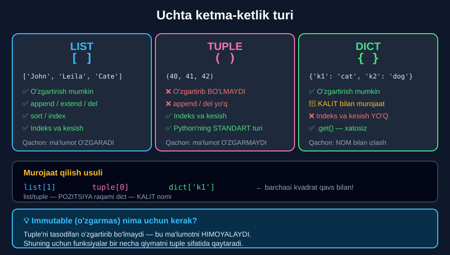

# 4-dars. Tuple lar

## 🎬 Boshlashdan oldin

> **"Tuple'lar — ma'lumot ketma-ketliklarining boshqa turi, lekin ro'yxatlardan farqli o'laroq, ular O'ZGARMAS (immutable)."**
>
> ## **"Tuple'larni O'ZGARTIRIB yoki MODIFIKATSIYA QILIB BO'LMAYDI. Siz element QO'SHA yoki O'CHIRA olmaysiz."**

Ro'yxat — **daftar** (yozib, o'chirib bo'ladi). Tuple — **bosma kitob**.

---

## 1. Sintaksis

> ## **"Sizda ro'yxat emas, TUPLE borligini bildiruvchi sintaksis shundaki, tuple elementlari KVADRAT QAVSLAR emas, ODDIY QAVSLAR ichiga joylashtiriladi."**

```python
x = (40, 41, 42)
x
```

```
(40, 41, 42)
```

---

## 2. Tuple — standart tur

> **"Aytgancha, tuple — Python'dagi STANDART ketma-ketlik turi."**
>
> **"Shuning uchun agar men bu yerda uchta qiymatni ro'yxatga olsam, kompyuter yangi o'zgaruvchini TUPLE deb qabul qiladi."**

```python
y = 50, 51, 52
y
```

```
(50, 51, 52)
```

> **"Biz shuningdek uchta qiymat tuple'ga QADOQLANADI deb ham aytishimiz mumkin."**

> 🔑 **Qavslar ham SHART EMAS!** Vergul yetarli. Python o'zi tuple yaratadi.

---

## 3. Tuple biriktirish

> **"Xuddi shu sababdan biz bir necha qiymatni xuddi shuncha o'zgaruvchiga biriktira olamiz."**
>
> **"Bir necha ma'ruza oldin buni ko'rib chiqqanimizni eslaysizmi?"**
>
> **"Tenglik belgisining chap tomonida biz o'zgaruvchilar tuple'ini, o'ng tomonida esa qiymatlar tuple'ini qo'ydik."**

```python
a, b, c = 1, 4, 6
c
```

```
6
```

> ## **"Shuning uchun bu faoliyat uchun tegishli texnik atama — TUPLE BIRIKTIRISH (tuple assignment)."**

*(12-modulning 1-darsida buni ko'rgan edingiz.)*

### 💡 Amaliy foyda: qiymatlarni almashtirish

```python
a, b = 5, 9
a, b = b, a          # ← tuple biriktirish!
print(a, b)          # 9 5
```

---

## 4. Indekslash

> **"Ro'yxatlar uchun qilganimizdek, biz qiymatlarni qavslar ichida pozitsiyalarini ko'rsatib INDEKSLASHIMIZ mumkin."**

```python
x[0]
```

```
40
```

> **"Shuning uchun biz `x` tuple'idan birinchi sonni — ya'ni 40 ni — olamiz."**

> 🔑 **Diqqat:** e'lon qilishda **oddiy** qavslar, indekslashda — **kvadrat** qavslar.

```python
x = (40, 41, 42)     # oddiy qavslar
x[0]                 # kvadrat qavslar
```

---

## 5. Tuple lar ro'yxati

> **"Bundan tashqari, biz tuple'larni RO'YXATLAR ichiga ham joylashtira olamiz — va keyin har bir tuple ro'yxat ichida ALOHIDA ELEMENT bo'ladi."**

```python
List = [x, y]
List
```

```
[(40, 41, 42), (50, 51, 52)]
```

---

## 6. CSV va `split()`

> **"Tuple'lar ro'yxatlarga o'xshaydi, lekin biz e'tibordan chetda qoldirmasligimiz kerak bo'lgan ba'zi NOZIK farqlar bor."**
>
> **"Ular VERGUL BILAN AJRATILGAN turli qiymatlar bilan ishlaganda juda foydali bo'lishi mumkin."**

> **"Masalan, agar bizda `age` va `years_of_school` o'zgaruvchilar sifatida bo'lsa, va menda tegishli sonlar SATR formatida vergul bilan ajratilgan bo'lsa — shuning uchun ham nomi COMMA SEPARATED VALUES (CSV) —"**
>
> **"`split` metodi qavslar ichida to'g'ri ko'rsatma bilan `age` uchun 30 ni, `years_of_school` uchun esa 17 ni qiymat sifatida biriktiradi."**

```python
(age, years_of_school) = "30,17".split(',')
print(age)
print(years_of_school)
```

```
30
17
```

> **"Natijani tekshirish uchun ikki o'zgaruvchini alohida chop etishimiz mumkin. Hammasi to'g'ri ko'rinadi. Ajoyib."**

### Qanday ishlaydi?

```
"30,17".split(',')
        ↓
   ['30', '17']            ← RO'YXAT qaytadi
        ↓
(age, years_of_school) = ['30', '17']
        ↓
age = '30',  years_of_school = '17'      ← SATR sifatida!
```

> ⚠️ **Muhim:** natija **satr**, son emas! Hisob uchun `int()` kerak:
> ```python
> print(int(age) + 1)      # 31
> ```

---

## 7. Funksiyalardan tuple qaytarish

> **"Nihoyat, funksiyalar tuple'larni qaytariladigan qiymat sifatida bera oladi."**
>
> ## **"Bu foydali, chunki aks holda FAQAT BITTA qiymat qaytara oladigan funksiya BIR NECHTA qiymatni ushlab turuvchi tuple hosil qila oladi."**

*(16-modulning 2-darsidagi "faqat bitta natija" qoidasini eslang — mana uni chetlab o'tish yo'li!)*

> **"Bu kodni ko'ring. Men faqat kvadratning tomon uzunligini kiritaman, va chiqish sifatida `square_info` funksiyasi tuple qaytaradi."**
>
> **"Tuple menga kvadratning YUZASI va PERIMETRINI aytadi."**

```python
def square_info(x):
    A = x ** 2
    P = 4 * x
    print("Area and Perimeter:")
    return A, P

square_info(3)
```

```
Area and Perimeter:
(9, 12)
```

### Natijani ajratib olish

```python
yuza, perimetr = square_info(3)
print(yuza)          # 9
print(perimetr)      # 12
```

> ## 🔑 **Bu — tuple'ning ENG KATTA amaliy foydasi.**

---

## 8. 📊 List va Tuple solishtirish

| | `list` `[ ]` | `tuple` `( )` |
|---|---|---|
| **O'zgartirish** | ✅ Mumkin | ❌ Mumkin emas |
| **`append` / `extend`** | ✅ | ❌ |
| **`del`** | ✅ | ❌ |
| **`sort()`** | ✅ | ❌ |
| **Indekslash** | ✅ | ✅ |
| **Kesish** | ✅ | ✅ |
| **`len()`** | ✅ | ✅ |
| **Tezlik** | Sekinroq | **Tezroq** |
| **Xotira** | Ko'proq | **Kamroq** |



### Nima uchun tuple kerak?

1. **Himoya** — tasodifan o'zgartirib bo'lmaydi
2. **Tezlik** — ro'yxatdan tezroq
3. **Bir necha qiymat qaytarish** — funksiyadan
4. **Lug'at kaliti** bo'la oladi *(ro'yxat — yo'q)*

---

## 9. 💻 To'liq kod

```python
# ===== TUPLE YARATISH =====
x = (40, 41, 42)
print(x)

y = 50, 51, 52              # qavssiz ham bo'ladi
print(y)

# ===== TUPLE BIRIKTIRISH =====
a, b, c = 1, 4, 6
print(c)                    # 6
print(a, b, c)              # 1 4 6

# ===== QIYMATLARNI ALMASHTIRISH =====
p, q = 5, 9
p, q = q, p
print(p, q)                 # 9 5

# ===== INDEKSLASH =====
print(x[0])                 # 40
print(x[-1])                # 42
print(x[0:2])               # (40, 41)   ← kesish ham ishlaydi

# ===== TUPLE LAR RO'YXATI =====
List = [x, y]
print(List)
print(List[0][1])           # 41

# ===== SPLIT =====
(age, years_of_school) = "30,17".split(',')
print(age)                  # 30
print(years_of_school)      # 17
print(type(age))            # <class 'str'>   ← SATR!
print(int(age) + 1)         # 31

# ===== FUNKSIYADAN TUPLE =====
def square_info(x):
    A = x ** 2
    P = 4 * x
    print("Area and Perimeter:")
    return A, P

print(square_info(3))

yuza, perimetr = square_info(5)
print("Yuza:", yuza, " Perimetr:", perimetr)

# ===== O'ZGARMASLIGI =====
t = (1, 2, 3)
print(len(t))               # 3
# t[0] = 99   →  TypeError: 'tuple' object does not support item assignment
# t.append(4) →  AttributeError: 'tuple' object has no attribute 'append'
```

**Natija:**

```
(40, 41, 42)
(50, 51, 52)
6
1 4 6
9 5
40
42
(40, 41)
[(40, 41, 42), (50, 51, 52)]
41
30
17
<class 'str'>
31
Area and Perimeter:
(9, 12)
Area and Perimeter:
Yuza: 25  Perimetr: 20
3
```

---

## 10. ⚠️ Bitta elementli tuple

Bu ma'ruzada aytilmagan, lekin **klassik tuzoq**:

```python
a = (5)
print(type(a))       # <class 'int'>   ← TUPLE EMAS!

b = (5,)             # ← VERGUL qo'shildi
print(type(b))       # <class 'tuple'>  ✅
```

> ## 🔑 **Bitta elementli tuple uchun VERGUL SHART: `(5,)`**

---

## 11. 📝 Rasmiy mashqlar (kursdan)

### Mashq 1
**`Cars` deb ataladigan tuple yarating — elementlari `"BMW"`, `"Dodge"` va `"Ford"` bo'lsin.**

<details>
<summary>✅ Yechim</summary>

```python
Cars = "BMW", "Dodge", "Ford"
Cars
```
```
('BMW', 'Dodge', 'Ford')
```

**Yoki qavslar bilan:**

```python
Cars = ("BMW", "Dodge", "Ford")
Cars
```
```
('BMW', 'Dodge', 'Ford')
```

</details>

### Mashq 2
**Bu tuple'ning ikkinchi elementiga murojaat qiling.**

<details>
<summary>✅ Yechim</summary>

```python
Cars[1]
```
```
'Dodge'
```

</details>

### Mashq 3
**Berilgan ism va yoshni alohida ajratib olish imkonini beruvchi metodni chaqiring. Keyin to'g'ri ishlaganingizni ko'rish uchun `name` va `age` qiymatlarini chop eting.**

<details>
<summary>✅ Yechim</summary>

```python
name, age = 'Peter,24'.split(',')
print(name)
print(age)
```
```
Peter
24
```

> ⚠️ **Xato variant:**
> ```python
> name, age = 'Peter,24'
> # ValueError: too many values to unpack (expected 2)
> ```
> Satrni `split(',')` **siz** ajratib bo'lmaydi — `'Peter,24'` da **8 ta belgi** bor, 2 ta emas.

</details>

### Mashq 4
**To'g'ri to'rtburchakning ikki qiymatini argument sifatida oladigan va uning yuzasi hamda perimetrini qaytaradigan funksiya yarating. To'g'ri ishlaganini tekshirish uchun funksiyani `2` va `10` argumentlari bilan chaqiring.**

<details>
<summary>✅ Yechim</summary>

```python
def rectangle_info(x, y):
    A = x * y
    P = 2 * (x + y)
    print("Area and Parameter:")
    return A, P

rectangle_info(2, 10)
```
```
Area and Parameter:
(20, 24)
```

**Tekshiruv:** `A = 2*10 = 20`, `P = 2*(2+10) = 24` ✅

</details>

---

## 12. ⚡ Qo'shimcha mashqlar

### 🟢 Oson

**M1.** Uchta shahar nomidan tuple yarating — ikki xil usulda.

**M2.** Tuple'ni indekslang va kesing.

**M3.** Tuple'ni o'zgartirishga urinib ko'ring. Qanday xato chiqadi?

<details>
<summary>✅ Yechimlar</summary>

```python
# M1
t1 = ("Toshkent", "Samarqand", "Buxoro")
t2 = "Toshkent", "Samarqand", "Buxoro"
print(t1)                       # ('Toshkent', 'Samarqand', 'Buxoro')
print(t2)                       # ('Toshkent', 'Samarqand', 'Buxoro')
print(t1 == t2)                 # True

# M2
print(t1[0])                    # Toshkent
print(t1[-1])                   # Buxoro
print(t1[0:2])                  # ('Toshkent', 'Samarqand')
print(len(t1))                  # 3

# M3
# t1[0] = "Xiva"
# TypeError: 'tuple' object does not support item assignment
# t1.append("Xiva")
# AttributeError: 'tuple' object has no attribute 'append'
```

</details>

### 🟡 O'rta

**M4.** Funksiya yozing — u **uchta** qiymat qaytarsin (min, max, o'rtacha).

**M5.** `split()` bilan sanani kunga, oyga va yilga ajrating.

**M6.** Tuple biriktirish bilan ikki o'zgaruvchini almashtiring.

<details>
<summary>✅ Yechimlar</summary>

```python
# M4
def statistika(sonlar):
    return min(sonlar), max(sonlar), sum(sonlar) / len(sonlar)

print(statistika([15, 42, 8, 31]))          # (8, 42, 24.0)

eng_kichik, eng_katta, ortacha = statistika([15, 42, 8, 31])
print(eng_kichik, eng_katta, ortacha)       # 8 42 24.0

# M5
kun, oy, yil = "25.08.2026".split('.')
print(kun, oy, yil)                         # 25 08 2026
print(int(yil) + 1)                         # 2027

# M6
a, b = "birinchi", "ikkinchi"
a, b = b, a
print(a, b)                                 # ikkinchi birinchi
```

</details>

### 🔴 Qiyin

**M7.** `(5)` va `(5,)` farqini ko'rsating.

**M8.** Tuple ichida ro'yxat bo'lsa — uni o'zgartirib bo'ladimi?

**M9.** Nima uchun tuple ro'yxatdan **tezroq**? Isbotlang.

<details>
<summary>✅ Yechimlar</summary>

```python
# M7
a = (5)
print(type(a))                  # <class 'int'>    ← oddiy qavs, TUPLE EMAS
b = (5,)
print(type(b))                  # <class 'tuple'>  ← VERGUL bor
print(len(b))                   # 1

# M8 — HA, chunki RO'YXAT o'zgaruvchan
t = (1, 2, [3, 4])
t[2][0] = 99
print(t)                        # (1, 2, [99, 4])
# Tuple O'ZI o'zgarmadi — u hali ham SHU ro'yxatga ishora qiladi.
# Lekin RO'YXATNING ICHI o'zgardi.
# t[0] = 99  →  TypeError

# M9
import sys
r = [1, 2, 3, 4, 5]
t = (1, 2, 3, 4, 5)
print(sys.getsizeof(r) > sys.getsizeof(t))     # True
# Tuple KAMROQ xotira egallaydi, chunki uning o'lchami O'ZGARMAYDI —
# Python unga "o'sish uchun joy" ajratmaydi.
```

</details>

---

## 13. 🧠 O'zini tekshirish savollari

1. Tuple ro'yxatdan nimasi bilan farq qiladi?
2. Tuple bilan nima qilib bo'lmaydi?
3. Sintaksis farqi qanday?
4. Python'da standart ketma-ketlik turi qaysi?
5. Uchta qiymat qavssiz yozilsa nima bo'ladi?
6. Tuple biriktirish nima?
7. Tuple'ni qanday indekslash mumkin?
8. Tuple'ni ro'yxatga joylash mumkinmi?
9. CSV nima degani?
10. `split()` nima qiladi?
11. Funksiya tuple qaytarishi nima uchun foydali?

<details>
<summary>✅ Javoblar</summary>

1. Tuple — **o'zgarmas (immutable)**.
2. **O'zgartirib** yoki **modifikatsiya qilib** bo'lmaydi; element **qo'shib** yoki **o'chirib** bo'lmaydi.
3. Tuple elementlari **oddiy qavslar** `( )` ichida, kvadrat qavslar emas.
4. **Tuple.**
5. Kompyuter uni **tuple** deb qabul qiladi — qiymatlar tuple'ga **qadoqlanadi**.
6. Tenglik belgisining chap tomonida **o'zgaruvchilar tuple'i**, o'ng tomonida **qiymatlar tuple'i**.
7. Xuddi ro'yxat kabi — **kvadrat qavslarda pozitsiyani** ko'rsatib.
8. **Ha** — har bir tuple ro'yxat ichida **alohida element** bo'ladi.
9. **Comma Separated Values** — vergul bilan ajratilgan qiymatlar.
10. Satrni ko'rsatilgan belgi bo'yicha **bo'laklarga ajratadi**.
11. Chunki aks holda **faqat bitta** qiymat qaytara oladigan funksiya **bir nechta** qiymatni qaytara oladi.

</details>

---

## 📌 Xulosa

```python
TUPLE  =  O'ZGARMAS ketma-ketlik

x = (40, 41, 42)          ← ODDIY qavslar
y = 50, 51, 52            ← qavssiz ham bo'ladi (STANDART tur)

x[0]      →  40           ← indekslashda KVADRAT qavs
x[0:2]    →  (40, 41)     ← kesish ham ishlaydi
len(x)    →  3


❌ MUMKIN EMAS
x[0] = 99      →  TypeError
x.append(43)   →  AttributeError
del x[0]       →  TypeError


TUPLE BIRIKTIRISH
a, b, c = 1, 4, 6
a, b = b, a               ← qiymatlarni ALMASHTIRISH


SPLIT
(age, school) = "30,17".split(',')
→  age = '30',  school = '17'    ← SATR sifatida!


FUNKSIYADAN BIR NECHTA QIYMAT
def square_info(x):
    return x**2, 4*x

yuza, perimetr = square_info(3)
→  9,  12


⚠️  BITTA ELEMENTLI TUPLE
(5)    →  int      ❌
(5,)   →  tuple    ✅   VERGUL SHART


LIST  va  TUPLE
[ ]  o'zgaruvchan · sekinroq · ko'proq xotira
( )  o'zgarmas    · tezroq   · kamroq xotira
```

---

## 🔖 Atamalar

| Atama | Inglizcha | Izoh |
|---|---|---|
| Tuple | *tuple* | `( )` ichidagi o'zgarmas ketma-ketlik |
| O'zgarmas | *immutable* | O'zgartirib bo'lmaydi |
| Qadoqlash | *packing* | Qiymatlarni tuple'ga yig'ish |
| Tuple biriktirish | *tuple assignment* | `a, b = 1, 2` |
| CSV | *comma separated values* | Vergul bilan ajratilgan qiymatlar |
| `split()` | *split* | Satrni bo'laklarga ajratadi |
| Standart tur | *default type* | Python o'zi tanlaydigan tur |

---

⬅️ [Oldingi: Kesish](03-List-Slicing.md) · ➡️ [Keyingi: Lug'atlar](05-Dictionaries.md)
