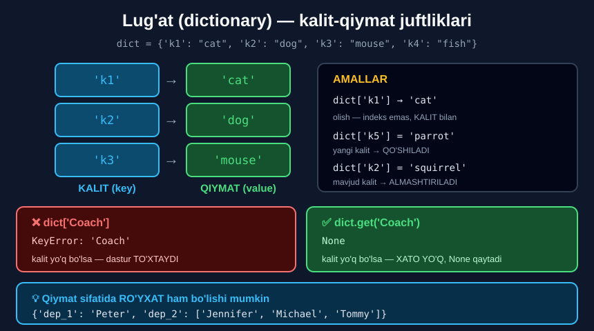

# 5-dars. Lug'atlar (dictionaries)

## 🎬 Boshlashdan oldin

> **"Endi siz ro'yxatlar va tuple'lar nima ekanini bilganingizdan so'ng, LUG'ATLAR nima ekanini tezroq tushunasiz."**
>
> **"Lug'atlar ma'lumot saqlashning YANA BIR usulini ifodalaydi."**

Ro'yxat va tuple'da element **raqam** bilan topiladi. Lug'atda — **nom** bilan.

---

## 1. Kalit-qiymat juftligi

> ## **"Har bir qiymat ma'lum KALIT bilan bog'langan."**
>
> **"Aniqrog'i, KALIT va uning tegishli QIYMATI KALIT-QIYMAT JUFTLIGINI hosil qiladi."**

> **"Bu misolda bizda TO'RTTA kalit bor. Ularning har biriga turli hayvon nomlari biriktirilgan."**

> ## **"Diqqat qiling: bu holda na ODDIY qavslar, na KVADRAT qavslar ishlaydi. Sizga FIGURALI QAVSLAR kerak."**

```python
dict = {'k1': "cat", 'k2': "dog", 'k3': "mouse", 'k4': "fish"}
dict
```

```
{'k1': 'cat', 'k2': 'dog', 'k3': 'mouse', 'k4': 'fish'}
```

> ⚠️ **Amaliy maslahat:** o'zgaruvchiga **`dict`** deb nom bermang — bu Python'ning **ichki funksiyasi**. Yaxshiroq nom: `hayvonlar`, `lugat`.



---

## 2. Qiymatga murojaat

> **"Ma'lum lug'at yaratilgandan so'ng, qiymatga uning INDEKSI o'rniga KALITI orqali murojaat qilish mumkin."**

```python
dict['k1']
```
```
'cat'
```

> **"`k1` `cat` uchun ishlatilishi mumkin."**

```python
dict["k3"]
```
```
'mouse'
```

> **"`k3` esa — `mouse`."**

> 🔑 **Kvadrat qavslar bu yerda ham ishlatiladi** — lekin ichida **raqam emas, KALIT** turadi.

---

## 3. Yangi qiymat qo'shish

> **"Ro'yxatlar bilan qila olganimizdek, biz lug'atga quyidagi tarzda yangi qiymat qo'sha olamiz."**
>
> ## **"Bu yerda qo'llaniladigan tuzilma: LUG'AT NOMI, kvadrat qavslar ichida YANGI KALIT NOMI, TENGLIK BELGISI va YANGI QIYMAT nomi."**

```
lugat [ yangi_kalit ] = yangi_qiymat
```

> **"Beshinchi kalitga biriktiradigan qiymat — `parrot`."**

```python
dict['k5'] = 'parrot'
dict
```

```
{'k1': 'cat', 'k2': 'dog', 'k3': 'mouse', 'k4': 'fish', 'k5': 'parrot'}
```

---

## 4. Qiymatni almashtirish

> **"Qiymatni ALMASHTIRISH ham xuddi shu sintaksisga amal qiladi."**
>
> **"Shunchaki yangi o'zgaruvchi MAVJUD kalitga mos kelsin."**

```python
dict['k2'] = 'squirrel'
dict
```

```
{'k1': 'cat', 'k2': 'squirrel', 'k3': 'mouse', 'k4': 'fish', 'k5': 'parrot'}
```

> **"Shu paytdan boshlab ikkinchi kalitga biriktirilgan holda biz endi `dog` ni ko'rmaymiz. Ha! Endi bu — `squirrel`."**

### 🔑 Bitta sintaksis — ikkita ma'no

```python
lugat['yangi_kalit'] = qiymat      # kalit YO'Q     →  QO'SHILADI
lugat['mavjud_kalit'] = qiymat     # kalit BOR      →  ALMASHTIRILADI
```

> ⚠️ **Xavf:** mavjud kalitni bilmasdan qayta yozib yuborishingiz mumkin. Lug'atda **takrorlanuvchi kalit bo'lmaydi**.

---

## 5. Qiymat sifatida ro'yxat

> **"Siz ro'yxat kalit-qiymat juftligida ishtirok eta olishi kerak deb o'ylaysiz. Va siz haqsiz."**

> **"Boshqa misolga o'taylik. Aytaylik, 1-bo'limda faqat Peter ishlaydi, lekin 2-bo'limda uch kishi ishlaydi: Jennifer, Michael va Tommy."**

```python
dep_workers = {'dep_1': 'Peter', 'dep_2': ['Jennifer', 'Michael', 'Tommy']}
dep_workers['dep_2']
```

```
['Jennifer', 'Michael', 'Tommy']
```

> **"Tekshiraylikmi? To'g'ri. Demak, bizning ikkinchi elementimiz — RO'YXAT."**

### Ichkaridagi elementga murojaat

```python
dep_workers['dep_2'][0]      # 'Jennifer'
len(dep_workers['dep_2'])    # 3
```

---

## 6. Bo'sh lug'atdan boshlash

> **"Lug'atni to'ldirishning YANA BIR yo'li bor."**
>
> **"Men yangi o'zgaruvchi yarataman va bu lug'at bo'lishini bildirish uchun BO'SH FIGURALI QAVSLARDAN foydalanaman."**
>
> **"Men qavslar ichiga hech qanday kalit yoki qiymat qo'ymayman. Buning o'rniga men kalitlar va qiymatlarni BIRMA-BIR biriktiraman."**

```python
Team = {}
Team['Point Guard'] = 'Dirk'
Team['Shooting Guard'] = 'Al'
Team['Small Forward'] = 'Sean'
Team['Power Forward'] = 'Alexander'
Team['Center'] = 'Hector'

print(Team)
```

```
{'Point Guard': 'Dirk', 'Shooting Guard': 'Al', 'Small Forward': 'Sean', 'Power Forward': 'Alexander', 'Center': 'Hector'}
```

> **"Va oxirida mening lug'atim to'la bo'ladi. Juda yaxshi."**

> **"Agar men `Center` ni so'rasam — men Hector'ning ismini ko'raman."**

```python
print(Team['Center'])
```
```
Hector
```

---

## 7. `get()` metodi

> **"Sizni qiziqarli Python xususiyati bilan tanishtiray."**
>
> **"`get` metodi bizga berilgan jamoaning `Small Forward` ining ismini beradi."**

```python
print(Team.get('Small Forward'))
```
```
Sean
```

> ## **"Agar biz lug'atimda ishtirok etmagan MURABBIY (`Coach`) ismini so'rasak — mashina XATO KO'RSATMAYDI."**

```python
print(Team.get('Coach'))
```
```
None
```

> ## **"`None` — Python obyekt berilgan lug'atda AMALDA MAVJUD BO'LMAGAN hollarda qaytaradigan STANDART qiymat."**

### ⚠️ `[ ]` va `.get()` farqi

```python
Team['Coach']          # ❌ KeyError: 'Coach'   ← DASTUR TO'XTAYDI
Team.get('Coach')      # ✅ None                ← xato yo'q
```

| Usul | Kalit bor | Kalit yo'q |
|---|---|---|
| `lugat['kalit']` | Qiymat | **`KeyError`** — dastur to'xtaydi |
| `lugat.get('kalit')` | Qiymat | **`None`** — xatosiz |
| `lugat.get('kalit', 'yo\'q')` | Qiymat | **`'yo'q'`** — o'z standart qiymatingiz |

> ## 🔑 **Kalit bor-yo'qligiga ishonchingiz komil bo'lmasa — DOIM `.get()` ishlating.**

---

## 8. Amaliy foyda

> **"Endi siz lug'atlar ba'zan ZO'R ish qila olishini tasavvur qila olasiz."**
>
> **"Masalan, kompaniyalarning nomlarini KALIT, bozordagi narxlarini esa QIYMAT sifatida ishlatganda."**

```python
narxlar = {'Apple': 189.5, 'Tesla': 242.8, 'Google': 141.2}
print(narxlar['Tesla'])          # 242.8
```

> **"Bravo! Siz dasturlashga chuqurroq kiryapsiz."**
>
> ## **"Esingizda bo'lsin: siz bu darslarda o'rgangan narsalarni AMALIYOTGA TATBIQ ETISHGA vaqt ajratmasangiz — hamma narsa MAVHUM bo'lib qolaveradi."**
>
> **"Shuning uchun yenglaringizni shimaring va bu darsga biriktirilgan mashqlarni bajaring."**

---

## 9. 💻 To'liq kod

```python
# ===== LUG'AT YARATISH =====
hayvonlar = {'k1': "cat", 'k2': "dog", 'k3': "mouse", 'k4': "fish"}
print(hayvonlar)

# ===== KALIT BILAN MUROJAAT =====
print(hayvonlar['k1'])           # cat
print(hayvonlar["k3"])           # mouse

# ===== QO'SHISH =====
hayvonlar['k5'] = 'parrot'
print(hayvonlar)

# ===== ALMASHTIRISH =====
hayvonlar['k2'] = 'squirrel'
print(hayvonlar)

# ===== QIYMAT SIFATIDA RO'YXAT =====
dep_workers = {'dep_1': 'Peter', 'dep_2': ['Jennifer', 'Michael', 'Tommy']}
print(dep_workers['dep_2'])
print(dep_workers['dep_2'][0])   # Jennifer
print(len(dep_workers['dep_2'])) # 3

# ===== BO'SH LUG'ATDAN =====
Team = {}
Team['Point Guard'] = 'Dirk'
Team['Shooting Guard'] = 'Al'
Team['Small Forward'] = 'Sean'
Team['Power Forward'] = 'Alexander'
Team['Center'] = 'Hector'
print(Team)
print(Team['Center'])            # Hector

# ===== GET =====
print(Team.get('Small Forward')) # Sean
print(Team.get('Coach'))         # None
print(Team.get('Coach', 'Yo\'q'))  # Yo'q

# ===== O'CHIRISH =====
del Team['Center']
print(len(Team))                 # 4

# ===== FOYDALI METODLAR =====
narxlar = {'Apple': 189.5, 'Tesla': 242.8, 'Google': 141.2}
print(len(narxlar))              # 3
print(list(narxlar.keys()))      # barcha KALITLAR
print(list(narxlar.values()))    # barcha QIYMATLAR
print('Tesla' in narxlar)        # True   ← kalit bormi?
print('Amazon' in narxlar)       # False
print(sum(narxlar.values()))     # jami narx
```

**Natija:**

```
{'k1': 'cat', 'k2': 'dog', 'k3': 'mouse', 'k4': 'fish'}
cat
mouse
{'k1': 'cat', 'k2': 'dog', 'k3': 'mouse', 'k4': 'fish', 'k5': 'parrot'}
{'k1': 'cat', 'k2': 'squirrel', 'k3': 'mouse', 'k4': 'fish', 'k5': 'parrot'}
['Jennifer', 'Michael', 'Tommy']
Jennifer
3
{'Point Guard': 'Dirk', 'Shooting Guard': 'Al', 'Small Forward': 'Sean', 'Power Forward': 'Alexander', 'Center': 'Hector'}
Hector
Sean
None
Yo'q
4
3
['Apple', 'Tesla', 'Google']
[189.5, 242.8, 141.2]
True
False
573.5
```

---

## 10. 📊 Uchta ketma-ketlikni solishtirish

| | `list` `[ ]` | `tuple` `( )` | `dict` `{ }` |
|---|---|---|---|
| **O'zgartirish** | ✅ | ❌ | ✅ |
| **Murojaat** | Indeks `[0]` | Indeks `[0]` | **Kalit** `['k1']` |
| **Tartib** | Bor | Bor | Bor *(Python 3.7+)* |
| **Kesish** | ✅ | ✅ | ❌ |
| **Takrorlanish** | ✅ | ✅ | Kalitlar — ❌ |
| **`len()`** | ✅ | ✅ | ✅ (juftliklar soni) |
| **Qachon** | Ma'lumot o'zgaradi | Ma'lumot o'zgarmaydi | **Nom bilan izlash** |

> 💡 **Python 3.7 dan boshlab** lug'atlar **qo'shilish tartibini saqlaydi**. Eski Python'da tartib **kafolatlanmagan** edi — shuning uchun kursning yechimlarida lug'at **alifbo tartibida** chiqqan.

---

## 11. 📝 Rasmiy mashqlar (kursdan)

Yaqin atrofdagi restoran menyusi:

```python
Menu = {'meal_1':'Spaghetti', 'meal_2':'Fries', 'meal_3':'Hamburger', 'meal_4':'Lasagna'}
```

### Mashq 1
**Ro'yxatdagi ikkinchi taom qaysi?**

<details>
<summary>✅ Yechim</summary>

```python
Menu['meal_2']
```
```
'Fries'
```

**Yoki:**

```python
print(Menu['meal_2'])
```
```
Fries
```

</details>

### Mashq 2
**Yangi taom qo'shing — `"Soup"`.**

<details>
<summary>✅ Yechim</summary>

```python
Menu['meal_5'] = "Soup"
Menu
```
```
{'meal_1': 'Spaghetti', 'meal_2': 'Fries', 'meal_3': 'Hamburger', 'meal_4': 'Lasagna', 'meal_5': 'Soup'}
```

</details>

### Mashq 3
**Hamburger'ni Cheeseburger bilan almashtiring.**

<details>
<summary>✅ Yechim</summary>

```python
Menu['meal_3'] = 'Cheesburger'
Menu
```
```
{'meal_1': 'Spaghetti', 'meal_2': 'Fries', 'meal_3': 'Cheesburger', 'meal_4': 'Lasagna', 'meal_5': 'Soup'}
```

</details>

### Mashq 4
**`Desserts` ro'yxatini oltinchi taom sifatida biriktiring.**

<details>
<summary>✅ Yechim</summary>

```python
Dessert = ['Pancakes', 'Ice-cream', 'Tiramisu']
Menu['meal_6'] = Dessert
Menu
```
```
{'meal_1': 'Spaghetti', 'meal_2': 'Fries', 'meal_3': 'Cheesburger', 'meal_4': 'Lasagna', 'meal_5': 'Soup', 'meal_6': ['Pancakes', 'Ice-cream', 'Tiramisu']}
```

</details>

### Mashq 5
**Yangi lug'at yarating — unda dastlabki beshta taom kalit, quyidagi besh qiymat esa narx (dollarda) bo'lsin: `10, 5, 8, 12, 5`. `Price_list = {}` dan boshlang.**

<details>
<summary>✅ Yechim</summary>

```python
Price_list = {}
Price_list['Spaghetti'] = 10
Price_list['Fries'] = 5
Price_list['Cheesburger'] = 8
Price_list['Lasagna'] = 12
Price_list['Soup'] = 5
Price_list
```
```
{'Spaghetti': 10, 'Fries': 5, 'Cheesburger': 8, 'Lasagna': 12, 'Soup': 5}
```

**Yoki `Menu` dan olib:**

```python
Price_list = {}
Price_list[Menu['meal_1']] = 10
Price_list[Menu['meal_2']] = 5
Price_list[Menu['meal_3']] = 8
Price_list[Menu['meal_4']] = 12
Price_list[Menu['meal_5']] = 5
Price_list
```

> 💡 **Diqqat:** kursning yechimida natija **alifbo tartibida** ko'rsatilgan (`Cheesburger` birinchi). Bu — **eski Python** ning xususiyati. **Python 3.7+** da lug'at **qo'shilish tartibini** saqlaydi, shuning uchun `Spaghetti` birinchi bo'ladi.

</details>

### Mashq 6
**`.get()` metodidan foydalanib Spaghetti narxini tekshiring.**

<details>
<summary>✅ Yechim</summary>

```python
Price_list.get('Spaghetti')
```
```
10
```

**Yoki:**

```python
Price_list.get(Menu['meal_1'])
```
```
10
```

</details>

---

## 12. ⚡ Qo'shimcha mashqlar

### 🟢 Oson

**M1.** Uchta mamlakat va poytaxtidan lug'at yarating. Bittasini chiqaring.

**M2.** Yangi mamlakat qo'shing va bittasining poytaxtini almashtiring.

**M3.** `len()` bilan lug'atda nechta juftlik borligini toping.

<details>
<summary>✅ Yechimlar</summary>

```python
# M1
poytaxtlar = {
    "O'zbekiston": "Toshkent",
    "Qozog'iston": "Ostona",
    "Qirg'iziston": "Bishkek"
}
print(poytaxtlar["O'zbekiston"])        # Toshkent

# M2
poytaxtlar["Tojikiston"] = "Dushanbe"
poytaxtlar["Qozog'iston"] = "Astana"
print(poytaxtlar)
# {"O'zbekiston": 'Toshkent', "Qozog'iston": 'Astana',
#  "Qirg'iziston": 'Bishkek', 'Tojikiston': 'Dushanbe'}

# M3
print(len(poytaxtlar))                  # 4
```

</details>

### 🟡 O'rta

**M4.** `[ ]` va `.get()` farqini **isbotlang** — mavjud bo'lmagan kalit bilan.

**M5.** Qiymat sifatida **ro'yxat** bo'lgan lug'at yarating va ichkaridagi elementga murojaat qiling.

**M6.** `.keys()`, `.values()` va `in` ni sinang.

<details>
<summary>✅ Yechimlar</summary>

```python
# M4
d = {'a': 1, 'b': 2}
print(d.get('z'))                       # None
print(d.get('z', 'topilmadi'))          # topilmadi
# print(d['z'])
# KeyError: 'z'

# M5
guruhlar = {
    'A-guruh': ['Ali', 'Vali', 'Hasan'],
    'B-guruh': ['Husan', 'Karim']
}
print(guruhlar['A-guruh'])              # ['Ali', 'Vali', 'Hasan']
print(guruhlar['A-guruh'][0])           # Ali
print(len(guruhlar['A-guruh']))         # 3
print(len(guruhlar))                    # 2   ← 5 emas!

# M6
narxlar = {'Apple': 189.5, 'Tesla': 242.8, 'Google': 141.2}
print(list(narxlar.keys()))             # ['Apple', 'Tesla', 'Google']
print(list(narxlar.values()))           # [189.5, 242.8, 141.2]
print('Tesla' in narxlar)               # True
print('Amazon' in narxlar)              # False
print(max(narxlar.values()))            # 242.8
print(sum(narxlar.values()))            # 573.5
```

</details>

### 🔴 Qiyin

**M7.** Bir xil kalitni **ikki marta** qo'ysangiz nima bo'ladi?

**M8.** Ro'yxatni kalit sifatida ishlatib ko'ring. Nima bo'ladi?

**M9.** Ikki lug'atni birlashtiring.

<details>
<summary>✅ Yechimlar</summary>

```python
# M7
d = {'a': 1, 'a': 2}
print(d)                                # {'a': 2}
# OXIRGISI g'olib — lug'atda TAKRORLANUVCHI KALIT BO'LMAYDI

# M8
# d = {[1, 2]: 'qiymat'}
# TypeError: unhashable type: 'list'
# RO'YXAT kalit bo'la OLMAYDI (u O'ZGARUVCHAN)
d2 = {(1, 2): 'qiymat'}                 # TUPLE esa BO'LADI ✅
print(d2)                               # {(1, 2): 'qiymat'}
print(d2[(1, 2)])                       # qiymat

# M9
a = {'x': 1, 'y': 2}
b = {'z': 3}
a.update(b)
print(a)                                # {'x': 1, 'y': 2, 'z': 3}
```

</details>

---

## 13. 🧠 O'zini tekshirish savollari

1. Lug'at nimani ifodalaydi?
2. Har bir qiymat nima bilan bog'langan?
3. Kalit va qiymat birgalikda nimani hosil qiladi?
4. Qanday qavslar kerak?
5. Qiymatga qanday murojaat qilinadi?
6. Yangi qiymat qo'shish tuzilmasi qanday?
7. Qiymatni almashtirish qanday?
8. Ro'yxat kalit-qiymat juftligida ishtirok eta oladimi?
9. Bo'sh lug'at qanday yaratiladi?
10. `get()` metodi nima qiladi?
11. Kalit mavjud bo'lmasa nima qaytadi?
12. `None` nima?

<details>
<summary>✅ Javoblar</summary>

1. Ma'lumot saqlashning **yana bir usulini**.
2. Ma'lum **kalit** bilan.
3. **Kalit-qiymat juftligini.**
4. **Figurali qavslar `{ }`** — oddiy va kvadrat qavslar **ishlamaydi**.
5. Uning **indeksi** o'rniga **kaliti** orqali.
6. **Lug'at nomi**, kvadrat qavslar ichida **yangi kalit nomi**, **tenglik belgisi**, **yangi qiymat**.
7. **Aynan shu sintaksis** — faqat kalit **mavjud** bo'lsin.
8. **Ha.**
9. **Bo'sh figurali qavslar** bilan: `Team = {}`.
10. Kalit bo'yicha qiymatni oladi — lekin kalit **yo'q bo'lsa xato bermaydi**.
11. **`None`.**
12. Python obyekt lug'atda **mavjud bo'lmagan** hollarda qaytaradigan **standart qiymat**.

</details>

---

## 📌 Xulosa

```python
LUG'AT  =  KALIT → QIYMAT

d = {'k1': "cat", 'k2': "dog", 'k3': "mouse"}
     ↑     ↑
   kalit  qiymat

⚠️  FIGURALI qavslar { }   —  ( ) va [ ] ISHLAMAYDI


MUROJAAT (indeks emas, KALIT!)
d['k1']       →  'cat'


QO'SHISH va ALMASHTIRISH — BIR XIL sintaksis
d['k5'] = 'parrot'      ← kalit YO'Q  →  QO'SHILADI
d['k2'] = 'squirrel'    ← kalit BOR   →  ALMASHTIRILADI


QIYMAT — RO'YXAT ham bo'lishi mumkin
{'dep_1': 'Peter', 'dep_2': ['Jennifer', 'Michael', 'Tommy']}


BO'SH LUG'ATDAN
Team = {}
Team['Center'] = 'Hector'


GET  —  XATOSIZ murojaat
d['Coach']         →  KeyError    ❌ dastur TO'XTAYDI
d.get('Coach')     →  None        ✅ xato yo'q
d.get('Coach','—') →  '—'         ✅ o'z standart qiymatingiz


🔑 UCHTA KETMA-KETLIK
[ ]  list   —  indeks bilan,  o'zgaruvchan
( )  tuple  —  indeks bilan,  O'ZGARMAS
{ }  dict   —  KALIT bilan,   o'zgaruvchan
```

---

## 🔖 Atamalar

| Atama | Inglizcha | Izoh |
|---|---|---|
| Lug'at | *dictionary* | `{ }` — kalit-qiymat to'plami |
| Kalit | *key* | Qiymatni topish uchun nom |
| Qiymat | *value* | Kalitga biriktirilgan ma'lumot |
| Kalit-qiymat juftligi | *key-value pair* | `'k1': 'cat'` |
| Figurali qavslar | *curly braces* | `{ }` |
| `get()` | *get* | Xatosiz murojaat metodi |
| `None` | *None* | "Hech narsa" — standart qiymat |
| `KeyError` | *KeyError* | Kalit topilmadi xatosi |
| `keys()` / `values()` | *keys / values* | Barcha kalitlar / qiymatlar |

---

⬅️ [Oldingi: Tuple lar](04-Tuples.md) · 🏠 [Modul boshiga](README.md)

🚀 **Endi amaliyot:** [Mini-loyihalar](LOYIHALAR.md) · 📝 [Barcha mashqlar](MASHQLAR.md)
