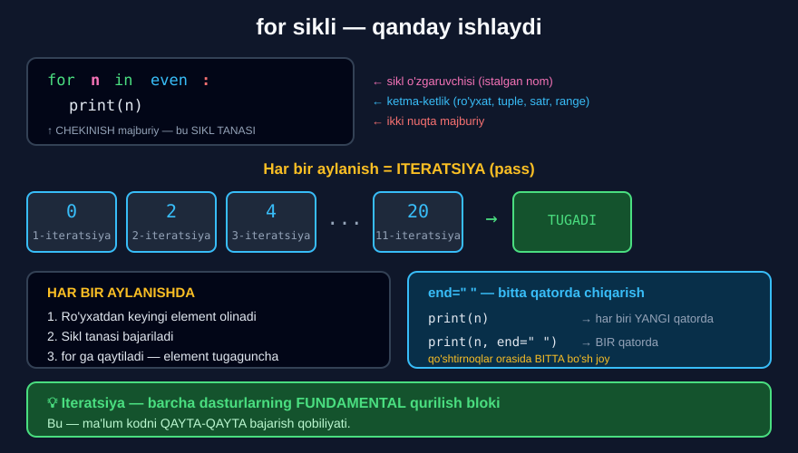

# 1-dars. `for` sikllari

## 🎬 Boshlashdan oldin

> ## **"ITERATSIYA — barcha dasturlarning FUNDAMENTAL QURILISH BLOKI."**
>
> ## **"Bu — ma'lum kodni QAYTA-QAYTA bajarish qobiliyati."**
>
> **"Bu bo'limda biz Python'dagi iteratsiya jarayonlarining bir necha misoliga e'tibor qaratamiz."**

17-modulda ro'yxatdagi har bir elementga **qo'lda** murojaat qilardingiz: `r[0]`, `r[1]`, `r[2]`... Endi buni **kompyuter** qiladi.

---

## 1. Muammo

> **"Boshlash uchun biz `even` deb ataladigan ro'yxat tayyorladik. U 0 dan 20 gacha barcha juft sonlarni o'z ichiga oladi."**

```python
even = [0, 2, 4, 6, 8, 10, 12, 14, 16, 18, 20]
```

**Qo'lda chop etish:**

```python
print(even[0])
print(even[1])
print(even[2])
# ... 11 marta!
```

> **"Tasavvur qiling, biz bu sonlarni chop etmoqchimiz — shuning uchun quyidagini yozishimiz mumkin."**

---

## 2. `for` sintaksisi

```python
for n in even:
    print(n)
```

> **"`for n in even` va IKKI NUQTA — bu `even` ro'yxatidagi HAR BIR `n` element uchun quyidagini bajar degani."**
>
> **"O'sha elementni chop et."**

```
0
2
4
6
8
10
12
14
16
18
20
```

> **"Aynan kutilganidek. Barcha sonlar USTUN ko'rinishida yozildi."**

---

## 3. Uchta qismi

### Sikl o'zgaruvchisi

> **"Bu holda `n` — SIKL O'ZGARUVCHISI deb ataladi."**
>
> ## **"Uni `n` deb atash SHART EMAS. Boshqa har qanday nom ham yaxshi ishlagan bo'lardi."**

```python
for n in even:          # ✅
for son in even:        # ✅ tushunarliroq
for element in even:    # ✅
for x in even:          # ✅
```

### Sikl tanasi

> **"Qavslar ichida `n` bilan `print` iborasi bizning siklimizning TANASI vazifasini bajaradi."**
>
> ## **"Unutmang: sikl to'g'ri ishlashi uchun u CHEKINTIRILGAN bo'lishi kerak."**
>
> **"Sikl tanasidagi amal ro'yxatdagi HAR BIR element uchun BIR MARTA bajariladi."**

### Ikki nuqta

Har doim `for ... in ...` **dan keyin**.



---

## 4. Qadamma-qadam

> **"Endi bu kod nazarda tutgan qadamlarni ko'rib chiqaylik."**

> **"Sikl ro'yxatimizdan `n` elementini olish bilan boshlanadi."**
>
> **"Keyin kompyuter sikl tanasini bajaradi. Bizning holatda u shunchaki o'sha o'zgaruvchini chop etadi."**
>
> **"Kompyuter bu amalni tugatganda — bu ITERATSIYA yoki SIKLNING O'TISHI deb ataladi —"**
>
> **"Python `for` operatoriga QAYTADI va `even` ro'yxatidagi KEYINGI `n` elementini oladi."**
>
> **"Keyin uni chop etadi va hokazo — ro'yxatdagi BARCHA mavjud elementlar uchun sikl tanasi bajarilgunicha."**

```
1. even dan element olinadi     →  n = 0
2. Sikl tanasi bajariladi       →  print(0)
3. for ga QAYTILADI
4. Keyingi element olinadi      →  n = 2
5. Sikl tanasi bajariladi       →  print(2)
   ...
   elementlar tugagunicha
```

> 🔤 **Atama:** har bir aylanish — **iteratsiya** (*iteration*) yoki **siklning o'tishi** (*pass of the loop*).

---

## 5. Bitta qatorda chiqarish

> **"Agar biz ularni BITTA QATORDA tartiblangan holda ko'rmoqchi bo'lsakchi?"**
>
> **"`print` funksiyasidan keyingi qavslar ichida `n` elementidan keyin VERGUL va bo'sh satr qiymatiga ega `end` parametri bunga erishishga yordam beradi."**

```python
for n in even:
    print(n, end=" ")
```

```
0 2 4 6 8 10 12 14 16 18 20
```

> ## **"Diqqat qiling: bo'sh satrni ko'rsatish uchun klaviaturangizdagi probel tugmasini BIR MARTA bosib, bir juft qo'shtirnoq orasiga bo'sh joy kiritishingiz kerak."**
>
> **"Shunday qilib, vergul va `end` parametri sikldan keyingi har bir element AYNI QATORDA bir bo'sh joy masofasida joylashtirilishini bildiradi."**
>
> **"Agar chop etmoqchi bo'lgan elementlaringiz juda uzun bo'lsa, ular chiqish yacheykasida bir necha qatorda ko'rsatiladi. Lekin hozircha bu haqda tashvishlanishingiz shart emas."**

### `end` nima qiladi?

`print` **standart holatda** har safar **yangi qatorga** o'tadi. Aslida u `end="\n"` bilan ishlaydi.

```python
print("A")               # end="\n"  ← yashirin
print("A", end=" ")      # bo'sh joy
print("A", end="")       # hech narsa
print("A", end=" | ")    # ajratgich
```

---

## 6. 💻 To'liq kod

```python
even = [0, 2, 4, 6, 8, 10, 12, 14, 16, 18, 20]

# ===== USTUN KO'RINISHIDA =====
for n in even:
    print(n)

# ===== BIR QATORDA =====
for n in even:
    print(n, end=" ")
print()                          # yangi qatorga o'tish

# ===== O'ZGARUVCHI NOMI ISTALGAN =====
for son in even:
    print(son * 2, end=" ")
print()

# ===== SATR BO'YLAB =====
for harf in "Python":
    print(harf, end="-")
print()

# ===== TUPLE BO'YLAB =====
for x in (10, 20, 30):
    print(x, end=" ")
print()

# ===== KO'P QATORLI TANA =====
narxlar = [15000, 42000, 8500]
for narx in narxlar:
    qqs = narx * 0.12
    jami = narx + qqs
    print(narx, "+", qqs, "=", jami)

# ===== SIKLDAN KEYIN =====
print("Sikl tugadi")
```

**Natija:**

```
0
2
4
6
8
10
12
14
16
18
20
0 2 4 6 8 10 12 14 16 18 20 
0 4 8 12 16 20 24 28 32 36 40 
P-y-t-h-o-n-
10 20 30 
15000 + 1800.0 = 16800.0
42000 + 5040.0 = 47040.0
8500 + 1020.0 = 9520.0
Sikl tugadi
```

---

## 7. ⚠️ Keng tarqalgan xatolar

### Xato 1 — chekinish yo'q

```python
for n in even:
print(n)
```
```
IndentationError: expected an indented block after 'for' statement
```

### Xato 2 — ikki nuqta yo'q

```python
for n in even
    print(n)
```
```
SyntaxError: expected ':'
```

### Xato 3 — sikl tanasidan tashqarida

```python
for n in [1, 2, 3]:
    print(n, end=" ")
print("Tugadi")          # ← sikldan TASHQARIDA — BIR MARTA
```
```
1 2 3 Tugadi
```

Agar chekintirsangiz — **har safar** chiqadi:

```python
for n in [1, 2, 3]:
    print(n, end=" ")
    print("Tugadi")      # ← sikl ICHIDA — UCH MARTA
```
```
1 Tugadi
2 Tugadi
3 Tugadi
```

### Xato 4 — ro'yxatni sikl ichida o'zgartirish

```python
r = [1, 2, 3, 4]
for x in r:
    if x % 2 == 0:
        r.remove(x)      # ⚠️ XAVFLI!
print(r)                 # [1, 3]  ← 4 o'chmadi!
```

> 🔑 **Qoida:** sikl aylanayotgan ro'yxatni **o'zgartirmang**. Kerak bo'lsa — **nusxasi** bo'ylab aylaning: `for x in r[:]`.

---

## 8. 📝 Rasmiy mashqlar (kursdan)

### Mashq 1
**Har bir raqamni yangi qatorda chop etadigan `for` sikli yarating.**

<details>
<summary>✅ Yechim</summary>

```python
digits = [0, 1, 2, 3, 4, 5, 6, 7, 8, 9]

for d in digits:
    print(d)
```

```
0
1
2
3
4
5
6
7
8
9
```

</details>

### Mashq 2
**Kodni sozlang — raqamlar hammasi bitta qatorda chop etilsin.**

<details>
<summary>✅ Yechim</summary>

```python
for d in digits:
    print(d, end=" ")
```

```
0 1 2 3 4 5 6 7 8 9
```

</details>

---

## 9. ⚡ Qo'shimcha mashqlar

### 🟢 Oson

**M1.** Beshta shahar nomini `for` bilan chiqaring.

**M2.** Ro'yxatdagi har bir sonni **ikki barobarga** oshirib chiqaring.

**M3.** Satrdagi har bir harfni alohida chiqaring.

<details>
<summary>✅ Yechimlar</summary>

```python
# M1
shaharlar = ["Toshkent", "Samarqand", "Buxoro", "Xiva", "Namangan"]
for shahar in shaharlar:
    print(shahar)

# M2
sonlar = [1, 2, 3, 4, 5]
for son in sonlar:
    print(son * 2, end=" ")     # 2 4 6 8 10
print()

# M3
for harf in "Python":
    print(harf)
# P
# y
# t
# h
# o
# n
```

</details>

### 🟡 O'rta

**M4.** Ro'yxatdagi sonlar **yig'indisini** `sum()` **siz** hisoblang.

**M5.** Eng katta sonni `max()` **siz** toping.

**M6.** Har bir mahsulot uchun QQS li narxni chiqaring.

<details>
<summary>✅ Yechimlar</summary>

```python
# M4
sonlar = [15, 42, 8, 31]
yigindi = 0
for son in sonlar:
    yigindi = yigindi + son
print(yigindi)                  # 96
print(sum(sonlar))              # 96   ← tekshiruv

# M5
sonlar = [15, 42, 8, 31]
eng_katta = sonlar[0]
for son in sonlar:
    if son > eng_katta:
        eng_katta = son
print(eng_katta)                # 42
print(max(sonlar))              # 42   ← tekshiruv

# M6
narxlar = [15000, 42000, 8500]
for narx in narxlar:
    print(narx, "→", narx * 1.12)
# 15000 → 16800.0
# 42000 → 47040.00000000001
# 8500 → 9520.0
```

</details>

### 🔴 Qiyin

**M7.** Ikkita ro'yxat bo'ylab **birga** aylaning (parallel ro'yxatlar).

**M8.** Ichma-ich sikl yozing — ko'paytirish jadvali.

**M9.** Sikl ichida ro'yxatni o'zgartiring. Nima bo'ladi?

<details>
<summary>✅ Yechimlar</summary>

```python
# M7 — indeks orqali
talabalar = ["Ali", "Vali", "Hasan"]
ballar    = [87, 65, 92]
for i in range(len(talabalar)):
    print(talabalar[i], "-", ballar[i])
# Ali - 87
# Vali - 65
# Hasan - 92

# M8
for i in [1, 2, 3]:
    for j in [1, 2, 3]:
        print(i, "x", j, "=", i * j, end="   ")
    print()
# 1 x 1 = 1   1 x 2 = 2   1 x 3 = 3   
# 2 x 1 = 2   2 x 2 = 4   2 x 3 = 6   
# 3 x 1 = 3   3 x 2 = 6   3 x 3 = 9   

# M9
r = [1, 2, 3, 4]
for x in r:
    if x % 2 == 0:
        r.remove(x)
print(r)                        # [1, 3]
# ⚠️ 4 O'CHMADI! Sikl ro'yxat qisqarganini "sezmadi".
# TO'G'RI USUL — nusxa bo'ylab aylanish:
r2 = [1, 2, 3, 4]
for x in r2[:]:
    if x % 2 == 0:
        r2.remove(x)
print(r2)                       # [1, 3]
```

</details>

---

## 10. 🧠 O'zini tekshirish savollari

1. Iteratsiya nima?
2. `for n in even:` nimani anglatadi?
3. `n` nima deb ataladi?
4. Uni `n` deb atash shartmi?
5. Sikl tanasi nima?
6. Chekinish nima uchun kerak?
7. Sikl tanasi necha marta bajariladi?
8. Bir aylanish nima deb ataladi?
9. Bitta qatorda chiqarish uchun nima kerak?
10. Bo'sh satr qanday ko'rsatiladi?

<details>
<summary>✅ Javoblar</summary>

1. **Barcha dasturlarning fundamental qurilish bloki** — ma'lum kodni **qayta-qayta** bajarish qobiliyati.
2. `even` ro'yxatidagi **har bir `n` element uchun** quyidagini bajar.
3. **Sikl o'zgaruvchisi.**
4. **Yo'q** — boshqa har qanday nom ham ishlaydi.
5. Chekintirilgan qism — masalan, `print(n)`.
6. Sikl **to'g'ri ishlashi** uchun; aks holda **xato**.
7. Ro'yxatdagi **har bir element uchun bir marta**.
8. **Iteratsiya** yoki **siklning o'tishi**.
9. `print` ichida **vergul** va **`end` parametri** bo'sh satr qiymati bilan.
10. Bir juft qo'shtirnoq orasiga **probel bir marta** bosib.

</details>

---

## 📌 Xulosa

```python
for n in even:
    print(n)
 ↑  ↑  ↑    ↑
 |  |  |    ikki nuqta MAJBURIY
 |  |  ketma-ketlik (list, tuple, str, range)
 |  sikl o'zgaruvchisi (nom ISTALGAN)
 kalit so'z

    print(n)     ← SIKL TANASI, chekintirilgan


QADAMLAR:
1. Elementni ol         →  n = 0
2. Sikl tanasini bajar  →  print(0)
3. for ga QAYT
4. Keyingi element      →  n = 2
   ... elementlar tugaguncha


BIR QATORDA CHIQARISH:
print(n, end=" ")
              ↑ qo'shtirnoq ichida BITTA bo'sh joy

for n in even: print(n)          → ustun
for n in even: print(n, end=" ") → 0 2 4 6 8 ...


⚠️  Chekinish va ikki nuqta — MAJBURIY
⚠️  Sikl aylanayotgan ro'yxatni O'ZGARTIRMANG
```

---

## 🔖 Atamalar

| Atama | Inglizcha | Izoh |
|---|---|---|
| Iteratsiya | *iteration* | Kodni qayta-qayta bajarish |
| Sikl | *loop* | Takrorlanuvchi kod bloki |
| Sikl o'zgaruvchisi | *loop variable* | Har aylanishda yangi qiymat oladi |
| Sikl tanasi | *loop body* | Takrorlanadigan chekintirilgan qism |
| Siklning o'tishi | *pass of the loop* | Bitta aylanish |
| `end` parametri | *end parameter* | `print` oxiriga qo'yiladigan belgi |

---

🏠 [Modul boshiga](README.md) · ➡️ [Keyingi: `while` sikllari](02-While-Loops.md)
