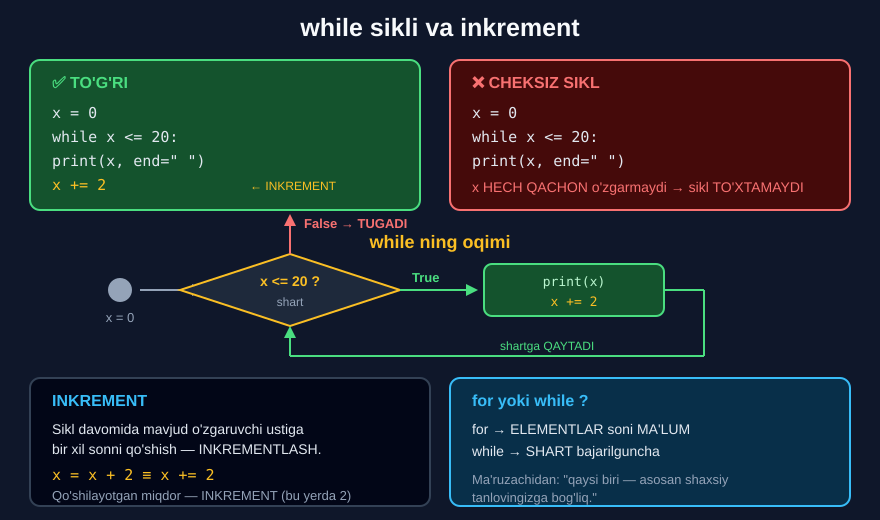

# 2-dars. `while` sikllari va inkrementlash

## 🎬 Boshlashdan oldin

> **"Oldingi darsda olgan natijamizga `for` sikl o'rniga `while` sikldan foydalanib ham erishish mumkin edi."**
>
> **"Biroq, foydalanadigan tuzilmamiz biroz BOSHQACHA bo'ladi."**

`for` — **elementlar bo'ylab** aylanadi. `while` — **shart bajarilguncha** aylanadi.

---

## 1. Boshlanish

> **"Dastlab biz `x` o'zgaruvchisini nolga teng qilib qo'yamiz, va aytamiz: bu qiymat 20 dan kichik yoki teng bo'lganda `x` ni chop et."**

```python
x = 0
while x <= 20:
    print(x, end=" ")
```

---

## 2. ⚠️ CHEKSIZ SIKL — ehtiyot bo'ling!

> ## **"Lekin iltimos, JUDA EHTIYOT BO'LING — va men buni jiddiy aytyapman."**
>
> ## **"Agar kodni shu yerda qoldirsangiz, siz CHEKSIZ SIKLGA duch kelasiz va kompyuteringiz ISHDAN CHIQADI."**
>
> **"Bu — siz qochmoqchi bo'lgan vaziyat, to'g'rimi? Shuning uchun juda ehtiyot bo'ling."**

> **"Chunki `x` DOIM kichik bo'ladi — siklingiz CHEKSIZ bo'ladi. U bir xil o'zgaruvchini QAYTA-QAYTA takrorlaydi."**
>
> **"`x = 0` bilan biz shu yerda qilgan narsamiz — va bu HAR DOIM iteratsiyada biz istagan narsa EMAS."**
>
> ## **"Biz siklning TUGASHINI xohlaymiz."**

### 🚨 Cheksiz sikl bo'lsa nima qilish kerak?

| Muhit | Nima qilish |
|---|---|
| **Jupyter** | ⏹ **Stop** tugmasi (yoki `Kernel → Interrupt`) |
| **Terminal** | `Ctrl + C` |

> 💡 **Maslahat:** `while` yozayotganda **darrov** o'zgaruvchi o'zgaradigan qatorni yozib qo'ying. Keyin unutmaysiz.

---

## 3. Yechim: o'zgarish

> **"`while` blokidagi sikl tanasidan keyin nima kelishi kerak? — `x` dagi O'ZGARISHNI ko'rsatuvchi kod qatori. Ya'ni `x` chop etilgandan keyin unga nima bo'lishi kerak."**
>
> **"Bizning holatda biz kompyuterga `x` ni `x + 2` ga teng qiymatga bog'lashni aytamiz."**

```python
x = 0
while x <= 20:
    print(x, end=" ")
    x = x + 2
```

```
0 2 4 6 8 10 12 14 16 18 20
```

> **"Ishlaydimi, ko'raylik. Ajoyib. Bu ancha yaxshi."**



---

## 4. Inkrementlash

> **"Aslida biz hozir qilgan narsamiz uchun dasturlashda ATAMA bor."**
>
> ## **"Sikl davomida mavjud o'zgaruvchi ustiga bir xil sonni qo'shish — INKREMENTLASH (incrementing) deb ataladi."**
>
> **"Bosqichma-bosqich qo'shilayotgan miqdor esa INKREMENT deb ataladi. Bizning holatda inkrementimiz — 2."**

---

## 5. `+=` — qisqa yozuv

> **"Bundan tashqari, Python sintaksisi inkrementlashni ko'rsatishning MAXSUS usulini taklif qiladi."**

```python
x = 0
while x <= 20:
    print(x, end=" ")
    x += 2
```

```
0 2 4 6 8 10 12 14 16 18 20
```

> **"`x += 2` biz `x` asosiga 2 qiymatini inkrementlayotganimizni ko'rsatadi — xuddi `x = x + 2` deb yozganimizdek."**
>
> **"Ko'rib turganingizdek, ikkala natija bir xil."**

### Barcha qisqa yozuvlar

| Qisqa | To'liq | Misol |
|---|---|---|
| `x += 2` | `x = x + 2` | `10 → 12` |
| `x -= 2` | `x = x - 2` | `10 → 8` |
| `x *= 2` | `x = x * 2` | `10 → 20` |
| `x /= 2` | `x = x / 2` | `10 → 5.0` |
| `x //= 2` | `x = x // 2` | `10 → 5` |
| `x %= 3` | `x = x % 3` | `10 → 1` |
| `x **= 2` | `x = x ** 2` | `10 → 100` |

> 🔑 Bu — **13-modulning 3-darsi** (qayta biriktirish) ning qisqa shakli.

---

## 6. `for` yoki `while`?

> **"Xulosa qilib aytganda, `for` yoki `while` siklidan foydalanishingiz asosan SHAXSIY TANLOVINGIZGA bog'liq bo'ladi."**
>
> ## **"Muhimi shundaki, kodingiz ISHDAN CHIQMASIN va TO'G'RI natijalar bersin."**

Amalda esa:

| | `for` | `while` |
|---|---|---|
| **Qachon** | Elementlar/aylanishlar soni **ma'lum** | Shart bajarilguncha, soni **noma'lum** |
| **Misol** | Ro'yxat bo'ylab | Foydalanuvchi to'g'ri parol kiritguncha |
| **Cheksiz sikl xavfi** | ❌ Yo'q | ⚠️ **Bor** |
| **Xatolik ehtimoli** | Kamroq | Ko'proq |

> 💡 **Amaliy qoida:** shubhada bo'lsangiz — **`for`** ishlating. U **xavfsizroq**.

---

## 7. 💻 To'liq kod

```python
# ===== ASOSIY MISOL =====
x = 0
while x <= 20:
    print(x, end=" ")
    x = x + 2
print()

# ===== QISQA YOZUV BILAN =====
x = 0
while x <= 20:
    print(x, end=" ")
    x += 2
print()

# ===== TOQ SONLAR =====
x = 1
while x <= 15:
    print(x, end=" ")
    x += 2
print()

# ===== TESKARI SANOQ =====
x = 10
while x > 0:
    print(x, end=" ")
    x -= 1
print("Uchdi!")

# ===== KO'PAYTIRISH =====
x = 1
while x <= 100:
    print(x, end=" ")
    x *= 2
print()

# ===== YIG'INDI =====
x = 1
yigindi = 0
while x <= 10:
    yigindi += x
    x += 1
print("1 dan 10 gacha yig'indi:", yigindi)

# ===== SHART BILAN =====
qoldiq = 1000000
oy = 0
while qoldiq > 0:
    qoldiq -= 250000
    oy += 1
print("Kredit", oy, "oyda to'landi")
```

**Natija:**

```
0 2 4 6 8 10 12 14 16 18 20 
0 2 4 6 8 10 12 14 16 18 20 
1 3 5 7 9 11 13 15 
10 9 8 7 6 5 4 3 2 1 Uchdi!
1 2 4 8 16 32 64 
1 dan 10 gacha yig'indi: 55
Kredit 4 oyda to'landi
```

---

## 8. ⚠️ Cheksiz siklning 3 ta sababi

### Sabab 1 — o'zgarish yo'q

```python
x = 0
while x <= 20:
    print(x)
    # x o'zgarmadi!  ⚠️ CHEKSIZ
```

### Sabab 2 — noto'g'ri yo'nalish

```python
x = 0
while x <= 20:
    print(x)
    x -= 1          # ⚠️ x KAMAYADI — shart hech qachon buzilmaydi
```

### Sabab 3 — o'zgarish sikl tanasidan tashqarida

```python
x = 0
while x <= 20:
    print(x)
x += 2              # ⚠️ chekintirilmagan — sikl ichida EMAS
```

> ## 🔑 **Har bir `while` yozganda o'zingizdan so'rang: "Bu sikl QANDAY tugaydi?"**

---

## 9. 📝 Rasmiy mashq (kursdan)

### Mashq 1
**0 dan 30 gacha barcha toq sonlarni bitta qatorda chop etadigan `while` sikli yarating.**

> *Ilgak: toq qiymatlarni yaratishning ikki yo'li bor!*

<details>
<summary>✅ Yechim</summary>

```python
x = 1
while x <= 30:
    print(x, end=" ")
    x = x + 2
```

```
1 3 5 7 9 11 13 15 17 19 21 23 25 27 29
```

**Yoki `+=` bilan:**

```python
x = 1
while x <= 30:
    print(x, end=" ")
    x += 2
```

```
1 3 5 7 9 11 13 15 17 19 21 23 25 27 29
```

### 💡 "Ikki yo'l" nima?

**1-yo'l** — `x = 1` dan boshlab `+2` (yuqoridagi).

**2-yo'l** — `x = 0` dan boshlab `+1`, lekin **shart bilan** faqat toqlarini chiqarish:

```python
x = 0
while x <= 30:
    if x % 2 == 1:
        print(x, end=" ")
    x += 1
```

```
1 3 5 7 9 11 13 15 17 19 21 23 25 27 29
```

Birinchi yo'l — **tezroq** (15 ta aylanish), ikkinchisi — **31 ta**.

</details>

---

## 10. ⚡ Qo'shimcha mashqlar

### 🟢 Oson

**M1.** 1 dan 10 gacha sanang.

**M2.** 10 dan 1 gacha **teskari** sanang.

**M3.** 5 ning karralilarini 50 gacha chiqaring.

<details>
<summary>✅ Yechimlar</summary>

```python
# M1
x = 1
while x <= 10:
    print(x, end=" ")
    x += 1
print()                         # 1 2 3 4 5 6 7 8 9 10

# M2
x = 10
while x >= 1:
    print(x, end=" ")
    x -= 1
print()                         # 10 9 8 7 6 5 4 3 2 1

# M3
x = 5
while x <= 50:
    print(x, end=" ")
    x += 5
print()                         # 5 10 15 20 25 30 35 40 45 50
```

</details>

### 🟡 O'rta

**M4.** 1 dan 100 gacha sonlar **yig'indisini** hisoblang.

**M5.** Sonni ikki barobarga oshirib boring — 1000 dan oshguncha. Necha qadam kerak?

**M6.** Kredit qoldig'ini har oy kamaytiring — necha oyda to'lanadi?

<details>
<summary>✅ Yechimlar</summary>

```python
# M4
x = 1
yigindi = 0
while x <= 100:
    yigindi += x
    x += 1
print(yigindi)                  # 5050

# M5
x = 1
qadam = 0
while x <= 1000:
    x *= 2
    qadam += 1
print(x, "—", qadam, "qadam")   # 1024 — 10 qadam

# M6
qoldiq = 12000000
oylik = 1500000
oy = 0
while qoldiq > 0:
    qoldiq -= oylik
    oy += 1
print(oy, "oy")                 # 8 oy
```

</details>

### 🔴 Qiyin

**M7.** `for` bilan yozilgan kodni `while` ga o'giring.

**M8.** Cheksiz siklning **uch xil** sababini ko'rsating *(faqat kodda, ishga tushirmang!)*.

**M9.** Faktorial hisoblang: `5! = 5*4*3*2*1`.

<details>
<summary>✅ Yechimlar</summary>

```python
# M7
# FOR bilan:
for n in [0, 2, 4, 6, 8]:
    print(n, end=" ")
print()
# WHILE bilan:
x = 0
while x <= 8:
    print(x, end=" ")
    x += 2
print()

# M8 — ISHGA TUSHIRMANG!
# 1. O'zgarish yo'q:
#    x = 0
#    while x <= 20:
#        print(x)
#
# 2. Noto'g'ri yo'nalish:
#    x = 0
#    while x <= 20:
#        print(x)
#        x -= 1
#
# 3. O'zgarish tashqarida:
#    x = 0
#    while x <= 20:
#        print(x)
#    x += 2

# M9
n = 5
faktorial = 1
x = 1
while x <= n:
    faktorial *= x
    x += 1
print(n, "! =", faktorial)      # 5 ! = 120
```

</details>

---

## 11. 🧠 O'zini tekshirish savollari

1. `while` va `for` tuzilmasi qanday farq qiladi?
2. `x = 0` va `while x <= 20` bilan cheklansangiz nima bo'ladi?
3. Nima uchun?
4. Buni oldini olish uchun nima kerak?
5. Inkrementlash nima?
6. Inkrement nima?
7. `x += 2` nimani anglatadi?
8. `for` yoki `while` tanlash nimaga bog'liq?
9. Eng muhimi nima?

<details>
<summary>✅ Javoblar</summary>

1. `while` da **shart** ko'rsatiladi, va o'zgaruvchi o'zgarishi **qo'lda** yoziladi.
2. **Cheksiz siklga** duch kelasiz va kompyuteringiz **ishdan chiqadi**.
3. Chunki `x` **doim kichik** bo'ladi — sikl **bir xil o'zgaruvchini qayta-qayta** takrorlaydi.
4. Sikl tanasidan keyin **`x` dagi o'zgarishni** ko'rsatuvchi qator.
5. Sikl davomida mavjud o'zgaruvchi ustiga **bir xil sonni qo'shish**.
6. **Bosqichma-bosqich qo'shilayotgan miqdor** — bu yerda 2.
7. `x` asosiga 2 ni inkrementlash — xuddi **`x = x + 2`** kabi.
8. Asosan **shaxsiy tanlovingizga**.
9. Kod **ishdan chiqmasin** va **to'g'ri natijalar** bersin.

</details>

---

## 📌 Xulosa

```python
x = 0                    ← 1. BOSHLANG'ICH qiymat
while x <= 20:           ← 2. SHART
    print(x, end=" ")    ← 3. SIKL TANASI
    x += 2               ← 4. O'ZGARISH (INKREMENT) — MAJBURIY!

→  0 2 4 6 8 10 12 14 16 18 20


⚠️  CHEKSIZ SIKL — 3 ta sabab

1. O'zgarish YO'Q           x hech qachon o'zgarmaydi
2. Noto'g'ri YO'NALISH      x -= 1  (kerak: x += 2)
3. O'zgarish TASHQARIDA     chekintirilmagan

🚨 Jupyter: ⏹ Stop      Terminal: Ctrl + C


QISQA YOZUVLAR
x += 2    ≡    x = x + 2
x -= 2    ≡    x = x - 2
x *= 2    ≡    x = x * 2
x /= 2    ≡    x = x / 2


for  yoki  while ?

for    →  elementlar/aylanishlar soni MA'LUM
while  →  shart bajarilguncha, soni NOMA'LUM

💡 Shubhada bo'lsangiz — for  (xavfsizroq)
```

---

## 🔖 Atamalar

| Atama | Inglizcha | Izoh |
|---|---|---|
| `while` sikli | *while loop* | Shart bajarilguncha takrorlanadi |
| Cheksiz sikl | *infinite loop* | Hech qachon tugamaydigan sikl |
| Inkrementlash | *incrementing* | O'zgaruvchini bosqichma-bosqich oshirish |
| Inkrement | *increment* | Qo'shilayotgan miqdor |
| `+=` | *augmented assignment* | Qisqartirilgan biriktirish |
| Dekrementlash | *decrementing* | Kamaytirish (`-=`) |

---

⬅️ [Oldingi: `for` sikllari](01-For-Loops.md) · ➡️ [Keyingi: `range()` funksiyasi](03-The-range-Function.md)
