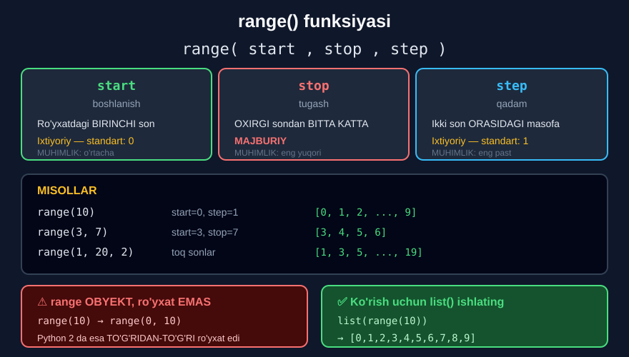

# 3-dars. `range()` funksiyasi bilan ro'yxat yaratish

## 🎬 Boshlashdan oldin

> **"Kursning keyingi qismlarida bizga ma'lumot nuqtalari bo'lgan ro'yxatlardagi ma'lumotlarni tasodifiylashtirish kerak bo'ladi — va o'shanda biz Python'ning ichki `range` funksiyasidan foydalana olamiz."**
>
> **"U bizga Python RANGE OBYEKTINI yaratish orqali yordam beradi — bu aslida shunchaki BUTUN SONLAR KETMA-KETLIGI."**

`[0, 1, 2, 3, ..., 99]` ni **qo'lda** yozmang. `range(100)` yozing.

---

## 1. Sintaksis

> **"Funksiya sintaksisi quyidagicha: `range` yozing va qavslar ichida `start`, `stop` va `step` qiymatlarini belgilang."**

```python
range(start, stop, step)
```



---

## 2. Uchta parametr

### `start` — boshlanish

> **"`start` qiymati ro'yxatdagi BIRINCHI son bo'ladi."**

### `stop` — tugash

> ## **"`stop` qiymati ro'yxatdagi OXIRGI qiymatdan KATTA bo'ladi. U OXIRGI SON PLYUS BIR ga teng bo'ladi."**
>
> **"Shunchaki klassik pythonic mantiq, to'g'rimi?"**

*(17-modulning kesish darsidagi "oxirgi kirmaydi" qoidasi — **aynan o'sha**.)*

### `step` — qadam

> **"Deb ataladigan `step` qiymati ro'yxatdagi har ikki KETMA-KET qiymat orasidagi MASOFANI ifodalaydi."**

---

## 3. Qaysi biri majburiy?

> ## **"`stop` qiymati — MAJBURIY kirish, `start` va `step` qiymatlari esa IXTIYORIY."**
>
> **"Agar berilmasa, `start` qiymati avtomatik ravishda NOL bilan almashtiriladi, va `step` qiymati BIRGA teng deb qabul qilinadi."**

> **"Siz shuningdek shunday eslab qolishingiz mumkin: `stop` — ENG MUHIM, `start` — KAMROQ MUHIM, `step` — ENG KAM MUHIM."**

| Parametr | Majburiymi | Standart | Muhimlik |
|---|---|---|---|
| `stop` | ✅ **Ha** | — | Eng yuqori |
| `start` | ❌ Yo'q | `0` | O'rtacha |
| `step` | ❌ Yo'q | `1` | Eng past |

---

## 4. `range(10)` — bitta argument

> **"Shu sababli `range(10)` NOLDAN boshlanadigan o'nta elementli ketma-ketlikni beradi — `start` qiymati ko'rsatilmagani uchun nol nazarda tutiladi — va O'NINCHI ketma-ket sonda, ya'ni TO'QQIZDA tugaydi."**

```python
range(10)
```

```
range(0, 10)
```

> ## **"Biroq, Python ketma-ketlikni RO'YXAT ko'rinishida KO'RSATMAYDI. Buning o'rniga u buni `range(0, 10)` deb ko'rsatadi — bu `start` qiymati 0 va `stop` qiymati 10 bo'lgan RANGE OBYEKTINI bildiradi."**

---

## 5. `list()` bilan ko'rish

> **"Ketma-ketlikni ro'yxat ko'rinishida ko'rsatish uchun biz Python'ning ichki `list` funksiyasidan foydalanishimiz mumkin — xuddi shu `range` funksiyasini ARGUMENT sifatida ishlatib."**
>
> **"Bu holda biz 0 dan 9 gacha barcha butun sonlarni o'z ichiga olgan ro'yxat olamiz."**

```python
list(range(10))
```

```
[0, 1, 2, 3, 4, 5, 6, 7, 8, 9]
```

> ## **"Sizga endigina taqdim etilgan hiyla — Python 3 dan foydalanayotgan bo'lsangiz va berilgan `range` funksiyasi hosil qilgan qiymatlarni tekshirmoqchi bo'lsangiz — yodda saqlashingiz kerak bo'lgan narsa."**

### 📌 Python 2 va Python 3 farqi

> **"Shuningdek, esda tuting: Python 2 vaziyatni BOSHQACHA hal qiladi. U ketma-ketlikni range obyekti o'rniga TO'G'RIDAN-TO'G'RI ro'yxat sifatida yaratadi va ko'rsatadi."**

| | Python 2 | Python 3 |
|---|---|---|
| `range(10)` | `[0, 1, ..., 9]` — **ro'yxat** | `range(0, 10)` — **obyekt** |
| Ko'rish uchun | To'g'ridan-to'g'ri | `list(range(10))` |

> 🔑 **Nima uchun Python 3 shunday qildi?** `range(1000000)` **ro'yxat** bo'lsa — **xotirada 1 million son** saqlanadi. **Obyekt** bo'lsa — faqat `start`, `stop`, `step` saqlanadi va sonlar **kerak bo'lganda** hosil qilinadi. Bu — **juda tejamli**.

---

## 6. `range(3, 7)` — ikkita argument

> **"Aytilganidek, boshqa yacheykada yana ikkita misolni ko'rib chiqaylik."**
>
> **"Masalan, `range` funksiyasida argument sifatida 3 va 7 ni e'lon qilsak — Python 3 ni `start`, 7 ni esa `stop` qiymati sifatida qabul qiladi."**

```python
range(3, 7)
```
```
range(3, 7)
```

```python
list(range(3, 7))
```
```
[3, 4, 5, 6]
```

> **"Demak, biz bu `range` funksiyasidan ro'yxat olamiz va bizda TO'RTTA element borligini ko'ramiz: uch, to'rt, besh va olti."**

> 🧠 **Elementlar soni** = `stop - start` = `7 - 3` = **4**

---

## 7. `range(1, 20, 2)` — uchta argument

> **"Boshqa misolda biz `range` da `step` qiymatini ko'rsatmoqchi bo'lishimiz mumkin."**
>
> ## **"Buni qilish uchun biz dastlabki IKKI argumentni ham tanlashimiz kerak."**

> **"Keling, 1 dan 19 gacha (19 ham kiradi) barcha TOQ sonlar bo'lgan ro'yxat olaylik."**
>
> **"Men 1 sonidan boshlayman va ro'yxat 19 soni bilan tugaydi — u `stop` qiymati 20 minus bir ga teng."**
>
> **"Faqat toq sonlarni ko'rsatish uchun biz `step` qiymatini 2 qilib belgilashimiz kerak."**

```python
range(1, 20, 2)
```
```
range(1, 20, 2)
```

```python
list(range(1, 20, 2))
```
```
[1, 3, 5, 7, 9, 11, 13, 15, 17, 19]
```

> **"Bu yacheykani bajarganimizda tegishli range obyektini olamiz. Qiymatlarni ro'yxatda ko'rish uchun xuddi shu `range` funksiyasini `list` funksiyasining argumenti sifatida ishlatishimiz mumkin. Shunday qilib biz kerakli natijani olamiz — bu biz TO'G'RI ishlaganimizni bildiradi."**

---

## 8. 💻 To'liq kod

```python
# ===== RANGE OBYEKTI =====
print(range(10))                    # range(0, 10)
print(range(3, 7))                  # range(3, 7)
print(range(1, 20, 2))              # range(1, 20, 2)
print(type(range(10)))              # <class 'range'>

# ===== LIST BILAN KO'RISH =====
print(list(range(10)))              # 0..9
print(list(range(3, 7)))            # 3,4,5,6
print(list(range(1, 20, 2)))        # toq sonlar

# ===== AMALIY MISOLLAR =====
print(list(range(1, 11)))           # 1 dan 10 gacha
print(list(range(0, 31, 2)))        # juft sonlar 0-30
print(list(range(0, 101, 10)))      # 10 lik qadam

# ===== MANFIY QADAM (teskari) =====
print(list(range(10, 0, -1)))       # 10 dan 1 gacha
print(list(range(20, 0, -2)))       # teskari juft

# ===== BO'SH RANGE =====
print(list(range(5, 1)))            # []  ← start > stop
print(list(range(0)))               # []

# ===== FOR BILAN =====
for i in range(5):
    print(i, end=" ")
print()

# ===== len() =====
print(len(range(10)))               # 10
print(len(range(3, 7)))             # 4
print(len(range(1, 20, 2)))         # 10
```

**Natija:**

```
range(0, 10)
range(3, 7)
range(1, 20, 2)
<class 'range'>
[0, 1, 2, 3, 4, 5, 6, 7, 8, 9]
[3, 4, 5, 6]
[1, 3, 5, 7, 9, 11, 13, 15, 17, 19]
[1, 2, 3, 4, 5, 6, 7, 8, 9, 10]
[0, 2, 4, 6, 8, 10, 12, 14, 16, 18, 20, 22, 24, 26, 28, 30]
[0, 10, 20, 30, 40, 50, 60, 70, 80, 90, 100]
[10, 9, 8, 7, 6, 5, 4, 3, 2, 1]
[20, 18, 16, 14, 12, 10, 8, 6, 4, 2]
[]
[]
0 1 2 3 4 
10
4
10
```

---

## 9. ⚠️ Keng tarqalgan xatolar

### Xato 1 — `stop` kiradi deb o'ylash

```python
list(range(1, 10))       # [1, ..., 9]   ← 10 YO'Q!
list(range(1, 11))       # [1, ..., 10]  ✅
```

### Xato 2 — `step` ni ikkinchi argument deb o'ylash

```python
range(1, 2)              # ❌ start=1, stop=2  →  [1]
range(1, 20, 2)          # ✅ step ni berish uchun UCHTA argument kerak
```

### Xato 3 — range ni ro'yxat deb o'ylash

```python
r = range(5)
# r.append(5)            # AttributeError: 'range' object has no attribute 'append'
r = list(range(5))       # ✅ endi ro'yxat
r.append(5)
print(r)                 # [0, 1, 2, 3, 4, 5]
```

### Xato 4 — teskari sanashda `step` ni unutish

```python
list(range(10, 0))       # []   ← bo'sh! step=1, lekin 10 > 0
list(range(10, 0, -1))   # ✅ [10, 9, ..., 1]
```

---

## 10. 📝 Rasmiy mashqlar (kursdan)

### Mashq 1
**`range()` funksiyasidan foydalanib 1 dan 10 gacha barcha sonlar bo'lgan ro'yxat yarating.**

<details>
<summary>✅ Yechim</summary>

```python
list(range(1, 11))
```
```
[1, 2, 3, 4, 5, 6, 7, 8, 9, 10]
```

> 💡 `11` — chunki `stop` **kirmaydi**: `10 + 1 = 11`.

</details>

### Mashq 2
**`range()` funksiyasidan foydalanib 0 dan 19 gacha barcha sonlar bo'lgan ro'yxat yarating.**

<details>
<summary>✅ Yechim</summary>

```python
list(range(20))
```
```
[0, 1, 2, 3, 4, 5, 6, 7, 8, 9, 10, 11, 12, 13, 14, 15, 16, 17, 18, 19]
```

> 💡 `start=0` — **standart**, yozish shart emas.

</details>

### Mashq 3
**`range` funksiyasidan foydalanib 0 dan 30 gacha (30 ham kiradi) barcha juft sonlar bo'lgan ro'yxat yarating.**

<details>
<summary>✅ Yechim</summary>

```python
list(range(0, 31, 2))
```
```
[0, 2, 4, 6, 8, 10, 12, 14, 16, 18, 20, 22, 24, 26, 28, 30]
```

> 💡 **Uchta narsa:**
> - `0` — start (bu yerda yozish **shart**, chunki step berilyapti)
> - `31` — stop (`30 + 1`, chunki 30 **kirishi** kerak)
> - `2` — step (juft sonlar)

</details>

---

## 11. ⚡ Qo'shimcha mashqlar

### 🟢 Oson

**M1.** 1 dan 5 gacha ro'yxat yarating.

**M2.** 100 dan 110 gacha ro'yxat yarating.

**M3.** 5 ning karralilarini 50 gacha chiqaring.

<details>
<summary>✅ Yechimlar</summary>

```python
# M1
print(list(range(1, 6)))            # [1, 2, 3, 4, 5]

# M2
print(list(range(100, 111)))        # [100, 101, ..., 110]

# M3
print(list(range(5, 51, 5)))        # [5, 10, 15, ..., 50]
```

</details>

### 🟡 O'rta

**M4.** 10 dan 1 gacha **teskari** ro'yxat yarating.

**M5.** `range()` bilan ro'yxatdagi **elementlar sonini** hisoblang: `range(3, 20, 4)`.

**M6.** `range()` ni `for` bilan birga ishlating.

<details>
<summary>✅ Yechimlar</summary>

```python
# M4
print(list(range(10, 0, -1)))       # [10, 9, 8, ..., 1]

# M5
print(list(range(3, 20, 4)))        # [3, 7, 11, 15, 19]
print(len(range(3, 20, 4)))         # 5

# M6
for i in range(1, 6):
    print(i, "x 5 =", i * 5)
# 1 x 5 = 5
# 2 x 5 = 10
# 3 x 5 = 15
# 4 x 5 = 20
# 5 x 5 = 25
```

</details>

### 🔴 Qiyin

**M7.** `range(10)` ga `append` qilib ko'ring. Nima bo'ladi?

**M8.** `range(10, 0)` va `range(10, 0, -1)` farqini ko'rsating.

**M9.** `range` obyekti **xotirada kam joy** egallashini isbotlang.

<details>
<summary>✅ Yechimlar</summary>

```python
# M7
r = range(5)
# r.append(5)
# AttributeError: 'range' object has no attribute 'append'
# range — O'ZGARMAS obyekt. Avval list() ga aylantiring:
r = list(range(5))
r.append(5)
print(r)                            # [0, 1, 2, 3, 4, 5]

# M8
print(list(range(10, 0)))           # []   ← BO'SH!
# step=1 (standart), lekin 10 dan 0 gacha OSHIB borib bo'lmaydi
print(list(range(10, 0, -1)))       # [10, 9, ..., 1]
# step=-1 — KAMAYIB boradi

# M9
import sys
r_obj = range(1000000)
r_list = list(range(1000000))
print(sys.getsizeof(r_obj))         # 48
print(sys.getsizeof(r_list))        # 8000056
print(sys.getsizeof(r_list) // sys.getsizeof(r_obj), "barobar katta")
# range obyekti faqat start/stop/step ni saqlaydi —
# sonlar KERAK BO'LGANDA hosil qilinadi.
```

</details>

---

## 12. 🧠 O'zini tekshirish savollari

1. `range` nima yaratadi?
2. Sintaksisi qanday?
3. `start` nima?
4. `stop` nima? U oxirgi songa tengmi?
5. `step` nima?
6. Qaysi biri majburiy?
7. Berilmasa `start` va `step` nimaga teng bo'ladi?
8. Muhimlik tartibi qanday?
9. `range(10)` nima beradi?
10. Python uni qanday ko'rsatadi?
11. Ro'yxat ko'rinishida ko'rish uchun nima kerak?
12. Python 2 vaziyatni qanday hal qiladi?
13. `range(1, 20, 2)` nima beradi?

<details>
<summary>✅ Javoblar</summary>

1. **Range obyektini** — bu aslida **butun sonlar ketma-ketligi**.
2. **`range(start, stop, step)`.**
3. Ro'yxatdagi **birinchi son**.
4. Ro'yxatdagi **oxirgi qiymatdan katta** — **oxirgi son plyus bir**. **Yo'q**, teng emas.
5. Har **ikki ketma-ket qiymat orasidagi masofa**.
6. **`stop`.**
7. `start` → **0**, `step` → **1**.
8. `stop` — **eng muhim**, `start` — **kamroq muhim**, `step` — **eng kam muhim**.
9. **0 dan 9 gacha** o'nta elementli ketma-ketlik.
10. **`range(0, 10)`** — range obyekti sifatida.
11. Ichki **`list()`** funksiyasi: `list(range(10))`.
12. Ketma-ketlikni **to'g'ridan-to'g'ri ro'yxat** sifatida yaratadi va ko'rsatadi.
13. **`[1, 3, 5, ..., 19]`** — 1 dan 19 gacha toq sonlar.

</details>

---

## 📌 Xulosa

```python
range(start, stop, step)
       ↑      ↑      ↑
       |      |      qadam  (ixtiyoriy, standart 1)
       |      TUGASH (MAJBURIY) — oxirgi son + 1
       BOSHLANISH (ixtiyoriy, standart 0)


range(10)          →  0 dan 9 gacha
range(3, 7)        →  3, 4, 5, 6
range(1, 20, 2)    →  1, 3, 5, ..., 19


⚠️  range OBYEKT qaytaradi, RO'YXAT emas

    range(10)          →  range(0, 10)
    list(range(10))    →  [0,1,2,3,4,5,6,7,8,9]  ✅

    Python 2 da esa TO'G'RIDAN-TO'G'RI ro'yxat edi


MUHIMLIK TARTIBI
stop   → ENG MUHIM (majburiy)
start  → KAMROQ muhim (standart 0)
step   → ENG KAM muhim (standart 1)


⚠️  step berish uchun DASTLABKI IKKALASI ham kerak
    range(0, 31, 2)   ✅
    range(31, 2)      ❌  bu start=31, stop=2 → []


TESKARI SANOQ
range(10, 0)       →  []            ← bo'sh!
range(10, 0, -1)   →  [10,9,...,1]  ✅
```

---

## 🔖 Atamalar

| Atama | Inglizcha | Izoh |
|---|---|---|
| `range()` | *range* | Butun sonlar ketma-ketligini yaratadi |
| Range obyekti | *range object* | Ro'yxat emas — tejamli tuzilma |
| `start` | *start* | Boshlang'ich qiymat |
| `stop` | *stop* | Tugash chegarasi (kirmaydi) |
| `step` | *step* | Qadam — qiymatlar orasidagi masofa |
| `list()` | *list* | Range ni ro'yxatga aylantiradi |

---

⬅️ [Oldingi: `while` sikllari](02-While-Loops.md) · ➡️ [Keyingi: Shartlar va sikllar birga](04-Conditionals-and-Loops.md)
