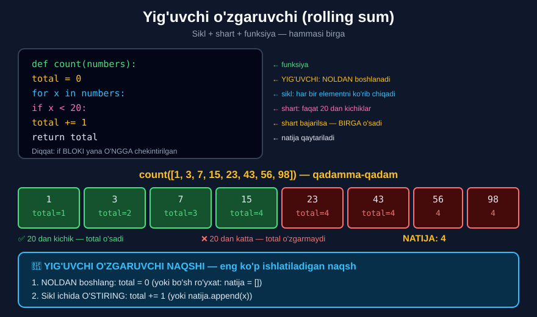

# 5-dars. Shartlar, funksiyalar va sikllar

## 🎬 Boshlashdan oldin

> **"Biz iteratsiyalarni ro'yxatning bir qismi bo'lgan o'zgaruvchilar bo'ylab o'tishimiz kerak bo'lganda ishlatamiz."**
>
> **"Bu darsda men sizga ro'yxatdagi qiymati 20 dan kichik bo'lgan elementlar SONINI qanday hisoblashni ko'rsataman."**

Bu dars — **butun Python bo'limining cho'qqisi**: funksiya + sikl + shart **birgalikda**.

---

## 1. Funksiyani e'lon qilamiz

> **"Birinchidan, argument sifatida `numbers` ni qabul qiladigan funksiya e'lon qiling — bu yerda `numbers` ma'lum ro'yxat o'zgaruvchisi bo'ladi."**

```python
def count(numbers):
```

---

## 2. Yig'uvchi o'zgaruvchi

> ## **"Hiyla shundaki, aytish mumkinki, NOLDAN JO'NAYDIGAN o'zgaruvchi yaratish kerak."**
>
> **"Uni `total` deb ataylik."**

```python
def count(numbers):
    total = 0
```

> **"G'oya shundaki, ma'lum shartlar tasdiqlanganda `total` o'z qiymatini o'zgartiradi."**
>
> ## **"Aynan shuning uchun bunday vaziyatda bu o'zgaruvchini YIG'UVCHI SUMMA (rolling sum) deb atash o'rinli."**



---

## 3. Sikl va shart

> **"Texnikroq aytganda: biz `numbers` ro'yxatidagi `x` ni ko'rib chiqqanimizda..."**
>
> **"Agar u 20 dan kichik bo'lsa..."**
>
> **"Biz `total` ni BIRGA oshiramiz."**
>
> **"Va nihoyat, `total` qiymatini qaytaramiz."**

```python
def count(numbers):
    total = 0
    for x in numbers:
        if x < 20:
            total += 1
    return total
```

> **"Bu shuni anglatadiki, agar `x` 20 dan kichik bo'lsa — `total` BIRGA o'sadi; va agar `x` 20 dan katta yoki teng bo'lsa — `total` O'SMAYDI."**
>
> **"Demak, berilgan ro'yxat uchun bu `count` funksiyasi 20 dan kichik sonlar MIQDORINI qaytaradi."**

---

## 4. Sinab ko'ramiz

> **"Bu funksiya to'g'ri ishlashini tekshiraylik."**

```python
list_1 = [1, 3, 7, 15, 23, 43, 56, 98]
count(list_1)
```

```
4
```

> **"Bu ro'yxatda 20 dan kichik TO'RTTA son bor, to'g'rimi? Tekshirib ko'raylik. Ajoyib."**

**Qaysilari?** `1`, `3`, `7`, `15` — **4 ta** ✅

> **"Endi agar men ro'yxatning biror joyiga, masalan, 17 ni qo'shsam — natija mos ravishda moslashadi."**

```python
list_2 = [1, 3, 7, 15, 23, 43, 56, 98, 17]
count(list_2)
```

```
5
```

> **"Besh. Aynan. Ajoyib."**

---

## 5. Chekinish darajalari

> **"Aytgancha, butun `if` operatori qanday yanada O'NGGA chekintirilganiga qarang."**
>
> ## **"Bu bizga uni bu funksiyaga tegishli yacheykadagi kodning qolgan qismidan MANTIQIY AJRATISH imkonini beradi."**

```python
def count(numbers):          ← 0-daraja
    total = 0                ← 1-daraja  (funksiya ichida)
    for x in numbers:        ← 1-daraja  (funksiya ichida)
        if x < 20:           ← 2-daraja  (sikl ichida)
            total += 1       ← 3-daraja  (shart ichida)
    return total             ← 1-daraja  (funksiya ichida)
```

> ⚠️ **`return total` qayerda?** **Sikldan TASHQARIDA!** Agar uni sikl ichiga qo'ysangiz — funksiya **birinchi aylanishda** to'xtaydi:

```python
def count_xato(numbers):
    total = 0
    for x in numbers:
        if x < 20:
            total += 1
        return total          # ❌ SIKL ICHIDA — 1-aylanishda tugaydi

print(count_xato([1, 3, 7, 15, 23]))     # 1   ← 4 emas!
```

---

## 6. 🔑 Yig'uvchi o'zgaruvchi naqshi

Bu — dasturlashdagi **eng ko'p ishlatiladigan naqsh**:

```
1. NOLDAN (yoki bo'shdan) boshlang
2. Sikl bilan aylaning
3. Shart bajarilsa — O'STIRING
4. Sikldan KEYIN qaytaring
```

### Uch xil ko'rinishi

```python
# ===== SANOQ =====
total = 0
for x in numbers:
    if shart:
        total += 1

# ===== YIG'INDI =====
jami = 0
for x in numbers:
    jami += x

# ===== YIG'ISH (ro'yxatga) =====
natija = []
for x in numbers:
    if shart:
        natija.append(x)
```

---

## 7. 💻 To'liq kod

```python
# ===== ASOSIY MISOL =====
def count(numbers):
    total = 0
    for x in numbers:
        if x < 20:
            total += 1
    return total

list_1 = [1, 3, 7, 15, 23, 43, 56, 98]
print(count(list_1))                # 4

list_2 = [1, 3, 7, 15, 23, 43, 56, 98, 17]
print(count(list_2))                # 5

# ===== UNIVERSAL VARIANT =====
def count_kichik(numbers, chegara):
    total = 0
    for x in numbers:
        if x < chegara:
            total += 1
    return total

print(count_kichik(list_1, 20))     # 4
print(count_kichik(list_1, 50))     # 6
print(count_kichik(list_1, 100))    # 8

# ===== YIG'INDI =====
def yigindi(numbers):
    jami = 0
    for x in numbers:
        jami += x
    return jami

print(yigindi(list_1))              # 246
print(sum(list_1))                  # 246   ← tekshiruv

# ===== FILTRLASH (yangi ro'yxat) =====
def kichiklar(numbers, chegara):
    natija = []
    for x in numbers:
        if x < chegara:
            natija.append(x)
    return natija

print(kichiklar(list_1, 20))        # [1, 3, 7, 15]

# ===== O'RTACHA =====
def ortacha(numbers):
    return yigindi(numbers) / len(numbers)

print(round(ortacha(list_1), 2))    # 30.75

# ===== ENG KATTA =====
def eng_katta(numbers):
    natija = numbers[0]
    for x in numbers:
        if x > natija:
            natija = x
    return natija

print(eng_katta(list_1))            # 98
print(max(list_1))                  # 98   ← tekshiruv

# ===== return SIKL ICHIDA — XATO =====
def count_xato(numbers):
    total = 0
    for x in numbers:
        if x < 20:
            total += 1
        return total                # ❌ 1-aylanishda tugaydi

print(count_xato(list_1))           # 1
```

**Natija:**

```
4
5
4
6
8
246
246
[1, 3, 7, 15]
30.75
98
98
1
```

---

## 8. 📝 Rasmiy mashq (kursdan)

### Mashq 1
**Sizga `nums` ro'yxati berilgan. Keyingi yacheykadagi kodni to'ldiring. 20 dan past qiymatlar sonini hisoblash uchun `while` siklidan foydalaning.**

> *Ilgak: bu mashq video darsda qilganimizga o'xshaydi. Siz ro'yxat elementining qiymatini ko'rsatish uchun `x[item]` tuzilmasini afzal ko'rishingiz mumkin.*

```python
nums = [1, 35, 12, 24, 31, 51, 70, 100]
```

<details>
<summary>✅ Yechim</summary>

```python
def count(numbers):
    numbers = sorted(numbers)
    tot = 0

    while numbers[tot] < 20:
        tot += 1
    return tot

count(nums)
```

```
2
```

### 💡 Bu yechim qanday ishlaydi?

**Hiyla:** avval ro'yxat **tartiblanadi**:

```
nums          = [1, 35, 12, 24, 31, 51, 70, 100]
sorted(nums)  = [1, 12, 24, 31, 35, 51, 70, 100]
                 ↑   ↑   ↑
              tot=0 tot=1 tot=2 → 24 >= 20 → TO'XTAYDI
```

Tartiblangandan keyin **20 dan kichiklar boshida** turadi. `while` ular tugaguncha aylanadi va `tot` — **aynan ularning soni**.

**Qaysilari?** `1`, `12` — **2 ta** ✅

### ⚠️ Bu yechimning ZAIF joyi

Agar **barcha** sonlar 20 dan kichik bo'lsa — `IndexError`:

```python
# count([1, 2, 3])
# IndexError: list index out of range
# tot 3 ga yetadi, lekin numbers[3] YO'Q
```

**Xavfsizroq variant:**

```python
def count_xavfsiz(numbers):
    numbers = sorted(numbers)
    tot = 0
    while tot < len(numbers) and numbers[tot] < 20:
        tot += 1
    return tot

print(count_xavfsiz([1, 2, 3]))     # 3   ✅
print(count_xavfsiz(nums))          # 2   ✅
```

**Yoki `for` bilan — eng oddiy:**

```python
def count_for(numbers):
    tot = 0
    for x in numbers:
        if x < 20:
            tot += 1
    return tot

print(count_for(nums))              # 2
```

</details>

---

## 9. ⚡ Qo'shimcha mashqlar

### 🟢 Oson

**M1.** Ro'yxatdagi **musbat** sonlar sonini hisoblang.

**M2.** Ro'yxatdagi **juft** sonlar sonini hisoblang.

**M3.** Ro'yxatdagi sonlar **yig'indisini** funksiya bilan hisoblang.

<details>
<summary>✅ Yechimlar</summary>

```python
# M1
def musbatlar_soni(sonlar):
    total = 0
    for x in sonlar:
        if x > 0:
            total += 1
    return total

print(musbatlar_soni([5, -3, 12, -8, 0, 7]))    # 3

# M2
def juftlar_soni(sonlar):
    total = 0
    for x in sonlar:
        if x % 2 == 0:
            total += 1
    return total

print(juftlar_soni([1, 2, 3, 4, 5, 6]))         # 3

# M3
def yigindi(sonlar):
    jami = 0
    for x in sonlar:
        jami += x
    return jami

print(yigindi([15, 42, 8, 31]))                 # 96
```

</details>

### 🟡 O'rta

**M4.** Chegarani **parametr** qilib bering.

**M5.** Shartga mos elementlardan **yangi ro'yxat** yasang.

**M6.** `min()`, `max()`, `sum()` ni funksiya bilan qayta yozing.

<details>
<summary>✅ Yechimlar</summary>

```python
# M4
def count_kichik(sonlar, chegara):
    total = 0
    for x in sonlar:
        if x < chegara:
            total += 1
    return total

s = [1, 3, 7, 15, 23, 43, 56, 98]
print(count_kichik(s, 20))          # 4
print(count_kichik(s, 50))          # 6

# M5
def filtrla(sonlar, chegara):
    natija = []
    for x in sonlar:
        if x < chegara:
            natija.append(x)
    return natija

print(filtrla(s, 20))               # [1, 3, 7, 15]

# M6
def mening_min(sonlar):
    natija = sonlar[0]
    for x in sonlar:
        if x < natija:
            natija = x
    return natija

def mening_max(sonlar):
    natija = sonlar[0]
    for x in sonlar:
        if x > natija:
            natija = x
    return natija

def mening_sum(sonlar):
    jami = 0
    for x in sonlar:
        jami += x
    return jami

print(mening_min(s), min(s))        # 1 1
print(mening_max(s), max(s))        # 98 98
print(mening_sum(s), sum(s))        # 246 246
```

</details>

### 🔴 Qiyin

**M7.** `return` ni sikl **ichiga** qo'ying. Nima buziladi?

**M8.** Ikkita shartli sanoqchi yozing (`>= 20` **va** `< 50`).

**M9.** Ro'yxatdagi **eng uzun satrni** toping.

<details>
<summary>✅ Yechimlar</summary>

```python
# M7
def count_xato(sonlar):
    total = 0
    for x in sonlar:
        if x < 20:
            total += 1
        return total                # ❌ SIKL ICHIDA

print(count_xato([1, 3, 7, 15, 23]))    # 1
# Funksiya BIRINCHI aylanishda tugaydi.
# return sikldan TASHQARIDA bo'lishi kerak.

# M8
def oraliqda(sonlar, past, yuqori):
    total = 0
    for x in sonlar:
        if x >= past and x < yuqori:
            total += 1
    return total

s = [1, 3, 7, 15, 23, 43, 56, 98]
print(oraliqda(s, 20, 50))          # 2   ← 23 va 43

# M9
def eng_uzun(sozlar):
    natija = sozlar[0]
    for soz in sozlar:
        if len(soz) > len(natija):
            natija = soz
    return natija

print(eng_uzun(["Python", "dasturlash", "tili"]))    # dasturlash
```

</details>

---

## 10. 🧠 O'zini tekshirish savollari

1. Iteratsiya qachon ishlatiladi?
2. Funksiya nimani argument sifatida oladi?
3. "Hiyla" nima?
4. Bu o'zgaruvchi qanday ataladi?
5. Nima uchun?
6. Shart nima tekshiradi?
7. Shart bajarilsa nima bo'ladi?
8. `x >= 20` bo'lsa-chi?
9. Funksiya nima qaytaradi?
10. `if` nima uchun yanada o'ngga chekintirilgan?

<details>
<summary>✅ Javoblar</summary>

1. **Ro'yxatning bir qismi** bo'lgan o'zgaruvchilar bo'ylab o'tish kerak bo'lganda.
2. **`numbers`** — ma'lum ro'yxat o'zgaruvchisi.
3. **Noldan jo'naydigan** o'zgaruvchi yaratish.
4. **Yig'uvchi summa** (*rolling sum*).
5. Chunki ma'lum shartlar tasdiqlanganda u **o'z qiymatini o'zgartiradi**.
6. `x` **20 dan kichikligini**.
7. `total` **birga o'sadi**.
8. `total` **o'smaydi**.
9. 20 dan kichik sonlar **miqdorini**.
10. Uni yacheykadagi qolgan koddan **mantiqiy ajratish** uchun.

</details>

---

## 📌 Xulosa

```python
def count(numbers):          ← FUNKSIYA
    total = 0                ← YIG'UVCHI (rolling sum) — NOLDAN
    for x in numbers:        ← SIKL
        if x < 20:           ← SHART
            total += 1       ← O'STIRISH
    return total             ← QAYTARISH (sikldan TASHQARIDA!)

count([1,3,7,15,23,43,56,98])   →  4
count([1,3,7,15,23,43,56,98,17]) →  5


CHEKINISH DARAJALARI
def count(numbers):          0
    total = 0                1
    for x in numbers:        1
        if x < 20:           2
            total += 1       3
    return total             1   ← SIKLDAN TASHQARIDA


⚠️  return SIKL ICHIDA BO'LSA:
    → funksiya BIRINCHI aylanishda TUGAYDI


🔑 YIG'UVCHI NAQSHNING 3 KO'RINISHI

SANOQ:      total = 0    →  total += 1
YIG'INDI:   jami  = 0    →  jami += x
YIG'ISH:    natija = []  →  natija.append(x)
```

---

## 🔖 Atamalar

| Atama | Inglizcha | Izoh |
|---|---|---|
| Yig'uvchi summa | *rolling sum* | Sikl davomida o'sib boruvchi o'zgaruvchi |
| Sanoqchi | *counter* | Nechta marta sodir bo'lganini sanaydi |
| Akkumulyator | *accumulator* | Natijani to'plovchi o'zgaruvchi |
| Filtrlash | *filtering* | Shartga mos elementlarni tanlash |
| Chekinish darajasi | *indentation level* | Ichma-ich bloklar chuqurligi |

---

⬅️ [Oldingi: Shartlar va sikllar](04-Conditionals-and-Loops.md) · ➡️ [Keyingi: Anaconda Assistant — Python vositalari](06-Anaconda-Assistant-Python-Tools.md)
