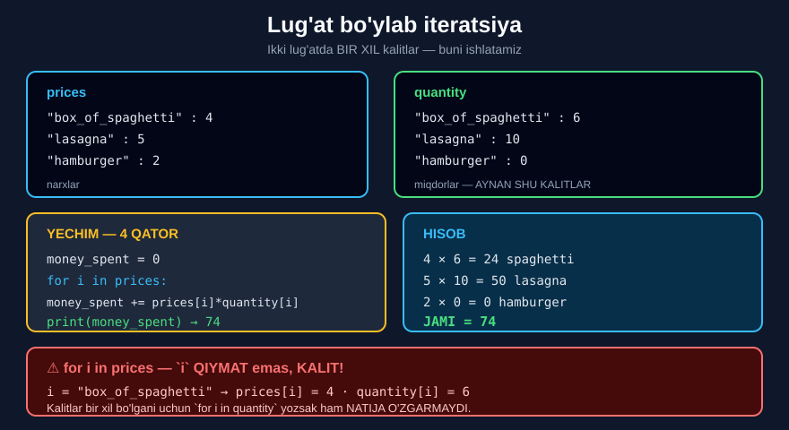

# 7-dars. Lug'atlar bo'ylab iteratsiya

## 🎬 Boshlashdan oldin

> **"Biroz QIYINROQ narsani ko'raylik — lug'at bo'ylab iteratsiya."**

Bu — modulning **eng qiyin** darsi, lekin natijada kod **atigi 4 qator**.

---

## 1. Vazifa

> **"Bizda bir necha misol bor. Bir quti spagetti, bir porsiya lazanya va gamburgerning narxlari `prices` deb ataladigan lug'atda saqlangan."**

```python
prices = {
    "box_of_spaghetti" : 4,
    "lasagna"          : 5,
    "hamburger"        : 2
}
```

> **"Jan supermarketga bordi va olti quti spagetti, o'nta porsiya lazanya va NOLTA gamburger sotib oldi. Bu ma'lumot `quantity` deb nomlangan lug'atda saqlangan."**

```python
quantity = {
    "box_of_spaghetti" : 6,
    "lasagna"          : 10,
    "hamburger"        : 0
}
```

> ## **"Bizning muammomiz: Jan supermarketda QANCHA pul sarfladi?"**

---

## 2. Mantiq

> **"Xo'sh, har bir oziq-ovqat MIQDORINI uning NARXIGA ko'paytirish kerakligi aniq."**

> ## **"Siz payqagan bo'lsangiz kerak — lug'atlarimizda AYNAN BIR XIL KALITLAR bor. Buni ISHLATISHIMIZ kerak."**

> **"Tartib shunday: birinchi lug'atdagi `box_of_spaghetti` ga borib, 4 qiymatini olish. Keyin `quantity` lug'atidan 6 qiymatini olish. Va keyin ko'paytirish."**
>
> **"Bularni HAR BIR oziq-ovqat mahsuloti uchun TAKRORLASH kerak."**



---

## 3. Sikl kerak

> **"Bu bir narsani eslatishi kerak. Ishonchim komilki, siz ham xuddi shunday o'ylaysiz."**
>
> ## **"Bizga SIKL kerak."**

> **"Yaxshi, bu aniq. Lekin biz u bilan nima qilamiz? Siklning tanasi nimani o'z ichiga oladi?"**

---

## 4. Yig'uvchi o'zgaruvchi

> **"Hamma narsadan oldin, qaysidir o'zgaruvchi sarflangan pul MIQDORINI hisobga olishi kerak, to'g'rimi?"**
>
> **"Keling, TANISH HIYLANI qo'llaymiz. Men `money_spent` deb ataladigan YIG'UVCHI SUMMA yarataman — u dastlab NOL qiymatini oladi."**

```python
money_spent = 0
```

*(5-darsdagi `total = 0` bilan **aynan bir xil** naqsh!)*

---

## 5. Sikl

> **"Demak, biz `prices` dagi har bir element bo'ylab iteratsiya qilishdan boshlashimiz mumkin — qisqacha `i in prices`."**

```python
for i in prices:
```

> ## ⚠️ **DIQQAT: `i` bu yerda QIYMAT emas, KALIT!**

```python
for i in prices:
    print(i)
```
```
box_of_spaghetti
lasagna
hamburger
```

> **"Siklning har bir qadamida men `money_spent` o'zgaruvchisi ma'lum `i` mahsulotning NARXI va MIQDORI ko'paytmasiga o'sishini xohlayman."**

```python
money_spent = money_spent + (prices[i] * quantity[i])
```

---

## 6. To'liq yechim

> **"Va bu yetarli bo'lishi kerak."**

```python
prices = {
    "box_of_spaghetti" : 4,
    "lasagna"          : 5,
    "hamburger"        : 2
}
quantity = {
    "box_of_spaghetti" : 6,
    "lasagna"          : 10,
    "hamburger"        : 0
}

money_spent = 0

for i in prices:
    money_spent = money_spent + (prices[i] * quantity[i])

print(money_spent)
```

```
74
```

> **"Natijani chop etib, to'g'ri ishlayotganimizni tekshiraylik. Aftidan, ha. Voy!"**

### Tekshiruv

```
box_of_spaghetti:   4 × 6  = 24
lasagna:            5 × 10 = 50
hamburger:          2 × 0  =  0
                    ───────────
                    JAMI   = 74   ✅
```

---

## 7. 💡 Katta g'oya

> **"Matematika nuqtai nazaridan SHUNCHALIK ODDIY muammo — LUG'ATLAR, ITERATSIYA va INKREMENT bilan o'zgaruvchi yaratish haqidagi bilimlarni BOG'LASHNI talab qildi."**
>
> ## **"Demak, dasturchi nuqtai nazaridan muammo BOSHQACHA ko'rinadi."**
>
> ## **"Yaxshi tomoni shundaki, oxir-oqibat bu butun narsa ATIGI TO'RT QATOR kodga aylandi."**

```python
money_spent = 0                                    # 1
for i in prices:                                   # 2
    money_spent = money_spent + prices[i]*quantity[i]   # 3
print(money_spent)                                 # 4
```

---

## 8. Nozik kuzatuv

> **"Yon eslatma sifatida: bilasizmi, agar biz bu yerga `prices` o'rniga `quantity` qo'ysak — natija O'ZGARMAYDI?"**

```python
for i in quantity:              # prices o'rniga quantity
    money_spent += prices[i] * quantity[i]
```

```
74
```

> ## **"Xulosa nima?"**
>
> ## **"`prices` bo'ylab sikl yuritasizmi yoki `quantity` bo'ylabmi — AHAMIYATI YO'Q, chunki ikkala lug'at BIR XIL KALITLARNI o'z ichiga oladi."**
>
> ## **"Va aynan shu sababdan bu sikl ham TO'G'RI ishlaydi."**

> ⚠️ **Lekin ehtiyot bo'ling:** agar kalitlar **bir xil bo'lmasa** — `KeyError`:
> ```python
> prices2 = {"a": 1, "b": 2}
> quantity2 = {"a": 5}
> for i in prices2:
>     print(quantity2[i])       # KeyError: 'b'
> ```

---

## 9. 💻 To'liq kod

```python
prices = {
    "box_of_spaghetti" : 4,
    "lasagna"          : 5,
    "hamburger"        : 2
}
quantity = {
    "box_of_spaghetti" : 6,
    "lasagna"          : 10,
    "hamburger"        : 0
}

# ===== ASOSIY YECHIM =====
money_spent = 0
for i in prices:
    money_spent = money_spent + (prices[i] * quantity[i])
print(money_spent)                  # 74

# ===== QISQA YOZUV =====
money_spent = 0
for i in prices:
    money_spent += prices[i] * quantity[i]
print(money_spent)                  # 74

# ===== quantity BO'YLAB — BIR XIL NATIJA =====
money_spent = 0
for i in quantity:
    money_spent += prices[i] * quantity[i]
print(money_spent)                  # 74

# ===== `i` — KALIT =====
for i in prices:
    print(i, end=" | ")
print()

# ===== BATAFSIL CHEK =====
money_spent = 0
for i in prices:
    summa = prices[i] * quantity[i]
    money_spent += summa
    print(i, ":", prices[i], "x", quantity[i], "=", summa)
print("JAMI:", money_spent)

# ===== .items() — KALIT VA QIYMAT BIRGA =====
for kalit, narx in prices.items():
    print(kalit, "→", narx)

# ===== .values() — FAQAT QIYMATLAR =====
for narx in prices.values():
    print(narx, end=" ")
print()

# ===== .keys() — FAQAT KALITLAR (for i in prices bilan bir xil) =====
for kalit in prices.keys():
    print(kalit, end=" ")
print()
```

**Natija:**

```
74
74
74
box_of_spaghetti | lasagna | hamburger | 
box_of_spaghetti : 4 x 6 = 24
lasagna : 5 x 10 = 50
hamburger : 2 x 0 = 0
JAMI: 74
box_of_spaghetti → 4
lasagna → 5
hamburger → 2
4 5 2 
box_of_spaghetti lasagna hamburger 
```

---

## 10. 📋 Lug'at bo'ylab aylanishning 3 usuli

| Usul | Nima beradi | Misol |
|---|---|---|
| `for i in d:` | **Kalitlar** | `i = 'lasagna'` |
| `for v in d.values():` | **Qiymatlar** | `v = 5` |
| `for k, v in d.items():` | **Ikkalasi** | `k='lasagna', v=5` |

```python
d = {'a': 1, 'b': 2}

for i in d:                 # a, b            ← KALITLAR
for v in d.values():        # 1, 2            ← QIYMATLAR
for k, v in d.items():      # ('a',1),('b',2) ← IKKALASI
```

> 🔑 **`for i in d:`** — **`for i in d.keys():`** bilan **bir xil**. Qisqarog'i afzal.

---

## 11. 📝 Rasmiy mashqlar (kursdan)

Xuddi shu `prices` va `quantity` lug'atlari ishlatiladi.

### Mashq 1
**Bu safar Jan sarflagan BARCHA pulni emas — narxi 5 dollar yoki undan YUQORI bo'lgan mahsulotlarga qancha sarflaganini hisoblang.**

<details>
<summary>✅ Yechim</summary>

```python
money_spent = 0

for i in quantity:
    if prices[i] >= 5:
        money_spent += prices[i] * quantity[i]
    else:
        money_spent = money_spent

print(money_spent)
```

```
50
```

**Tekshiruv:**

| Mahsulot | Narx | `>= 5` ? | Hisob |
|---|---|---|---|
| `box_of_spaghetti` | 4 | ❌ | — |
| `lasagna` | **5** | ✅ | `5 × 10 = 50` |
| `hamburger` | 2 | ❌ | — |
| | | | **50** |

> 💡 **`else: money_spent = money_spent` — bu ORTIQCHA.** U "hech narsa qilma" degani. Uni **butunlay olib tashlash** mumkin:
> ```python
> money_spent = 0
> for i in quantity:
>     if prices[i] >= 5:
>         money_spent += prices[i] * quantity[i]
> print(money_spent)      # 50
> ```

</details>

### Mashq 2
**Va Jan 5 dollardan ARZON mahsulotlarga qancha sarfladi?**

<details>
<summary>✅ Yechim</summary>

```python
money_spent = 0

for i in quantity:
    if prices[i] < 5:
        money_spent += prices[i] * quantity[i]
    else:
        money_spent = money_spent

print(money_spent)
```

```
24
```

**Tekshiruv:**

| Mahsulot | Narx | `< 5` ? | Hisob |
|---|---|---|---|
| `box_of_spaghetti` | **4** | ✅ | `4 × 6 = 24` |
| `lasagna` | 5 | ❌ | — |
| `hamburger` | **2** | ✅ | `2 × 0 = 0` |
| | | | **24** |

> ✅ **Tekshiruv:** `50 + 24 = 74` — birinchi darsdagi **jami summa**!

</details>

---

## 12. ⚡ Qo'shimcha mashqlar

### 🟢 Oson

**M1.** Lug'atdagi barcha **kalitlarni** chiqaring.

**M2.** Lug'atdagi barcha **qiymatlarni** chiqaring.

**M3.** `.items()` bilan kalit va qiymatni **birga** chiqaring.

<details>
<summary>✅ Yechimlar</summary>

```python
narxlar = {"Non": 4000, "Sut": 12000, "Choy": 8000}

# M1
for kalit in narxlar:
    print(kalit, end=" ")
print()                             # Non Sut Choy

# M2
for qiymat in narxlar.values():
    print(qiymat, end=" ")
print()                             # 4000 12000 8000

# M3
for k, v in narxlar.items():
    print(k, "→", v)
# Non → 4000
# Sut → 12000
# Choy → 8000
```

</details>

### 🟡 O'rta

**M4.** Barcha narxlar **yig'indisini** hisoblang.

**M5.** Eng **qimmat** mahsulotni toping.

**M6.** Narxi `5000` dan yuqori bo'lganlarni chiqaring.

<details>
<summary>✅ Yechimlar</summary>

```python
narxlar = {"Non": 4000, "Sut": 12000, "Choy": 8000}

# M4
jami = 0
for k in narxlar:
    jami += narxlar[k]
print(jami)                         # 24000
print(sum(narxlar.values()))        # 24000   ← tekshiruv

# M5
eng_qimmat = ""
eng_narx = 0
for k in narxlar:
    if narxlar[k] > eng_narx:
        eng_narx = narxlar[k]
        eng_qimmat = k
print(eng_qimmat, eng_narx)         # Sut 12000

# M6
for k in narxlar:
    if narxlar[k] > 5000:
        print(k, "-", narxlar[k])
# Sut - 12000
# Choy - 8000
```

</details>

### 🔴 Qiyin

**M7.** Ikkita lug'atni birga ishlatib **chek** yasang.

**M8.** Kalitlar **mos kelmasa** nima bo'ladi?

**M9.** Lug'atdagi qiymatlarni **ikki barobarga** oshiring.

<details>
<summary>✅ Yechimlar</summary>

```python
# M7
narxlar = {"Non": 4000, "Sut": 12000, "Choy": 8000}
sonlar  = {"Non": 3, "Sut": 2, "Choy": 4}

jami = 0
print("CHEK")
print("-" * 32)
for k in narxlar:
    summa = narxlar[k] * sonlar[k]
    jami += summa
    print(k, "x", sonlar[k], "=", summa)
print("-" * 32)
print("JAMI:", jami)
# CHEK
# --------------------------------
# Non x 3 = 12000
# Sut x 2 = 24000
# Choy x 4 = 32000
# --------------------------------
# JAMI: 68000

# M8
p2 = {"a": 1, "b": 2}
q2 = {"a": 5}
# for i in p2:
#     print(q2[i])
# KeyError: 'b'
# ✅ XAVFSIZ USUL — .get() bilan:
for i in p2:
    print(i, q2.get(i, 0))
# a 5
# b 0

# M9
narxlar2 = {"Non": 4000, "Sut": 12000}
for k in narxlar2:
    narxlar2[k] = narxlar2[k] * 2
print(narxlar2)                     # {'Non': 8000, 'Sut': 24000}
# ⚠️ QIYMATNI o'zgartirish MUMKIN,
#    lekin sikl ichida KALIT qo'shish/o'chirish — MUMKIN EMAS:
# for k in narxlar2:
#     narxlar2["Yangi"] = 1
# RuntimeError: dictionary changed size during iteration
```

</details>

---

## 13. 🧠 O'zini tekshirish savollari

1. Muammo nima edi?
2. Nima qilish kerak edi?
3. Lug'atlarda nima payqaladi?
4. Bizga nima kerak edi?
5. Qanday o'zgaruvchi yaratildi?
6. U qanday qiymatdan boshlaydi?
7. `for i in prices` da `i` — kalitmi yoki qiymatmi?
8. Sikl tanasida nima bo'ladi?
9. Natija nima?
10. `prices` o'rniga `quantity` qo'ysak nima bo'ladi?
11. Nima uchun?
12. Kod necha qatorga aylandi?

<details>
<summary>✅ Javoblar</summary>

1. Jan supermarketda **qancha pul sarfladi**?
2. Har bir oziq-ovqat **miqdorini narxiga ko'paytirish**.
3. Ular **aynan bir xil kalitlarga** ega.
4. **Sikl.**
5. **Yig'uvchi summa** — `money_spent`.
6. **Noldan.**
7. **Kalit.**
8. `money_spent` narx va miqdor **ko'paytmasiga o'sadi**.
9. **74.**
10. **Natija o'zgarmaydi** — 74.
11. Chunki ikkala lug'at **bir xil kalitlarni** o'z ichiga oladi.
12. **Atigi to'rt qator.**

</details>

---

## 📌 Xulosa

```python
prices   = {"box_of_spaghetti": 4,  "lasagna": 5,  "hamburger": 2}
quantity = {"box_of_spaghetti": 6,  "lasagna": 10, "hamburger": 0}
            ↑ AYNAN BIR XIL KALITLAR — buni ISHLATAMIZ

money_spent = 0                                     ← 1. YIG'UVCHI
for i in prices:                                    ← 2. SIKL
    money_spent += prices[i] * quantity[i]          ← 3. O'STIRISH
print(money_spent)                                  ← 4. NATIJA

→  74      (4×6 + 5×10 + 2×0)


⚠️  for i in prices:   →  `i` = KALIT, qiymat EMAS!
    prices[i]   →  narx
    quantity[i] →  miqdor


💡 for i in quantity:  →  BIR XIL NATIJA
   chunki kalitlar bir xil


LUG'AT BO'YLAB AYLANISHNING 3 USULI
for i in d:              →  KALITLAR
for v in d.values():     →  QIYMATLAR
for k, v in d.items():   →  IKKALASI


🔑 "Matematika nuqtai nazaridan SHUNCHALIK ODDIY muammo
    lug'atlar + iteratsiya + inkrement bilangina yechildi.
    Dasturchi nuqtai nazaridan muammo BOSHQACHA ko'rinadi."
```

---

## 🔖 Atamalar

| Atama | Inglizcha | Izoh |
|---|---|---|
| Lug'at iteratsiyasi | *dictionary iteration* | Lug'at bo'ylab aylanish |
| `.keys()` | *keys* | Barcha kalitlar |
| `.values()` | *values* | Barcha qiymatlar |
| `.items()` | *items* | Kalit-qiymat juftliklari |
| Yig'uvchi summa | *rolling sum* | O'sib boruvchi o'zgaruvchi |
| `KeyError` | *KeyError* | Kalit topilmadi |

---

⬅️ [Oldingi: Anaconda Assistant](06-Anaconda-Assistant-Python-Tools.md) · ➡️ [Keyingi: Anaconda Assistant — lug'atlar](08-Anaconda-Assistant-Dictionaries.md)
