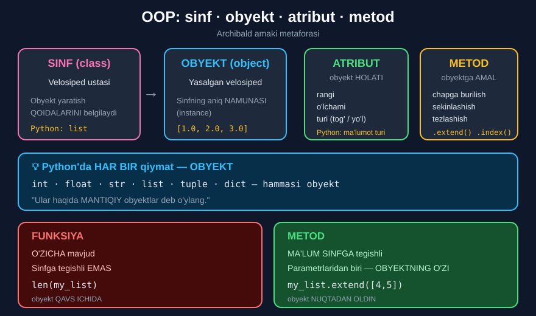

# 1-dars. Obyektga yo'naltirilgan dasturlashga kirish (OOP)

## 🎬 Boshlashdan oldin

> **"Obyektga yo'naltirilgan dasturlash haqida eshitganmisiz? U qisqacha OOP deb ham ataladi."**
>
> **"Bu darsda biz uning nima ekanini tushuntiramiz — va bu sizga yanada ILG'OR dasturlash tushunchalarini o'zlashtirish imkonini beradi."**
>
> **"Bundan tashqari, OOP — MODULLARNI tushuntirish uchun POG'ONA. Buni keyingi darsda qilamiz."**

Siz allaqachon `.append()`, `.sort()`, `.get()` ishlatgansiz. Endi **nima uchun ular nuqta bilan yoziladi** — buni tushunasiz.

---

## 1. Hamma narsa — obyekt

> ## **"Aytishimiz mumkinki, Python'dagi HAR BIR QIYMAT — OBYEKT."**
>
> **"Butun sonlar. Kasr sonlar. Satrlar. Ro'yxatlar. Ularning hammasi — obyekt."**
>
> **"Ular haqida MANTIQIY obyektlar deb o'ylang."**

> ## **"Shuning uchun OBYEKTGA YO'NALTIRILGAN DASTURLASH bir yoki bir nechta obyekt bilan O'ZARO TA'SIRLASHISH tushunchasiga ishora qiladi."**

```python
print(type(10))         # <class 'int'>
print(type(3.14))       # <class 'float'>
print(type("a"))        # <class 'str'>
print(type([1]))        # <class 'list'>
```

> 🔑 `<class '...'>` — mana bu **`class`** so'zi. U bejizga emas!

---

## 2. OOP ni qo'llab-quvvatlaydigan tillar

> **"Bugungi kunda OOP ni qo'llab-quvvatlaydigan bir necha til bor: masalan, Java, PHP, Python va C++."**

---

## 3. Nima uchun OOP paydo bo'ldi?

> ## **"Dasturlashning bu darajaga rivojlanishiga sabab — KONSEPTUAL obyektlar bizga HAQIQIY DUNYO tushunchalarini modellashtirish imkonini berishi."**

> **"Masalan, bizda mart oyi uchun galereyadagi tashrif buyuruvchilarning ANIQ sonini o'z ichiga olgan ro'yxat bo'lishi mumkin."**
>
> **"Bu — 31 ta ma'lumot nuqtasini o'z ichiga olgan ro'yxat, chunki martda 31 kun bor."**

```python
tashrif = [120, 95, 143, 87, 210, ...]      # 31 ta son
```

> **"Yoki biz galereyalarning nomlarini `galleries` deb ataladigan lug'atga satr qiymatlari sifatida kiritishimiz mumkin."**

```python
galleries = {"g1": "Milliy galereya", "g2": "Zamonaviy san'at"}
```

> ## **"OBYEKT ma'lumotni — son yoki satr kabi — PLYUS ma'lumotni boshqarish imkonini beruvchi AMALLARNI o'z ichiga oladi."**

```
OBYEKT  =  MA'LUMOT  +  AMALLAR
           [1, 2, 3]    .append() .sort() .index()
```

---

## 4. Sinf, atribut va metod

> **"Keyingi qiladigan ishimiz — SINF, ATRIBUT va METOD tushunchalarini tanishtirish."**
>
> ## **"Har bir obyekt qaysidir SINFGA tegishli — u shu obyektni yaratish QOIDALARINI belgilaydi. Va biz unga ma'lum miqdordagi ATRIBUTLARNI biriktira olamiz."**

### 🚲 Archibald amaki metaforasi

> **"Vaziyatni ancha aniqroq qiladigan metaforik misoldan foydalanaylik."**

> **"Archibald amaki velosiped yasay oladi, shuning uchun u VELOSIPED USTALARI SINFIGA tegishli. U velosiped yasash qoidalarini biladi."**

> **"Bu — u yasagan velosiped. Shuning uchun bu — velosiped ustalari sinfining OBYEKTI."**

> **"Obyekt sifatida u ma'lum ATRIBUTLARGA ega — ular o'sha obyektning HOLATIGA ishora qiladi."**
>
> **"Uning RANGI, O'LCHAMI va TURI — tog' velosipedimi yoki yo'l velosipedimi — unga biriktirilishi mumkin bo'lgan atributlar."**



---

## 5. Metod nima?

> **"METOD — boshqa narsa."**
>
> ## **"Bu — obyektga qo'llanilishi mumkin bo'lgan MANTIQIY KETMA-KETLIK."**
>
> **"Bu chapga burilish, o'ngga burilish, sekinlashish yoki tezlashish kabi amal bo'lishi mumkin."**

> ## **"Bu harakatlar obyektga qo'llanilishi mumkin — lekin MUHIMI shundaki, dasturlash paytida E'TIBOR OBYEKTGA qaratiladi, HARAKATGA emas — boshqa turdagi dasturlashdagi kabi."**

---

## 6. Amaliy misol

> **"Bu tushunchalarni yanada yaxshiroq tasavvur qilishga yordam beradigan amaliy misol keltiraylik."**
>
> **"Biz uchta kasr sondan ro'yxat yarata olamiz — va u bizning OBYEKTIMIZ bo'ladi."**

```python
my_list = [1.0, 2.0, 3.0]
print(type(my_list))        # <class 'list'>
```

### 🔤 Atamalar sinonimlari

> **"Ba'zan odamlar obyektlarga NAMUNA (instance) so'zi bilan ishora qilishadi, yoki atributlar o'rniga XOSSALAR (properties) deyishadi."**
>
> **"Bu normal — chunki bu atamalar O'ZARO ALMASHTIRILADI."**

| Asosiy atama | Sinonimi |
|---|---|
| Obyekt (*object*) | Namuna (*instance*) |
| Atribut (*attribute*) | Xossa (*property*) |
| Paket (*package*) | Kutubxona (*library*) |

### Sinf, atribut, metod — amalda

> **"Biz yaratgan obyekt Python'ning `list` SINFIGA tegishli."**

> **"Bu ro'yxatning bitta ATRIBUTI — undagi MA'LUMOT TURI."**
>
> **"Texnik jihatdan ro'yxat turli xil ma'lumotlarni — butun sonlar va satrlarni — o'z ichiga olishi mumkin, shuning uchun bu yerda ishlatilgan ma'lumot turini aniqlash muhim. Bular — kasr sonlar."**

> **"Bu obyektga qo'llay oladigan METOD — `extend` yoki `index`, ketma-ketliklar bo'limida ko'rganimizdek."**

> ## **"Va iltimos, diqqat qiling: bu amallarni faqat OBYEKTNI YARATGANIMIZDAN KEYIN bajarish mumkin."**

```python
# Avval OBYEKT yaratiladi
my_list = [1.0, 2.0, 3.0]

# Keyin unga METOD qo'llanadi
my_list.extend([4.0, 5.0])
print(my_list)              # [1.0, 2.0, 3.0, 4.0, 5.0]
print(my_list.index(3.0))   # 2
```

---

## 7. 🔑 Funksiya va metod farqi

> **"Funksiya va metod orasidagi farq NOZIK va chalkash bo'lishi mumkin."**
>
> ## **"Eslab qolishga harakat qiling: METOD — MAXSUS funksiya."**

> **"Har qanday boshqa funksiya kabi, metod turli ma'lumot turidagi ko'plab parametrga ega bo'lishi mumkin — LEKIN u albatta O'ZI QO'LLANILAYOTGAN OBYEKTNI ulardan biri sifatida o'z ichiga oladi."**

> ## **"METOD ma'lum SINFGA tegishli, FUNKSIYA esa O'ZICHA mavjud."**

> **"Velosiped ustasi misolimizga qaytsak: agar yasalgan velosiped BO'LMASA — `chapga burilish` metodini qo'llashning IMKONI YO'Q."**
>
> **"`Chapga burilish` metodining parametrlaridan biri VELOSIPED OBYEKTI bo'lishi SHART."**

### Sintaksis farqi

> **"Metod va funksiya atamalari orasidagi chalkashlikni oldini olish uchun pythonic sintaksis ikki vaziyatda BOSHQACHA."**
>
> ## **"Oldingi darslarimizda ko'rganimizdek, metod nomidan keyin shunchaki qavslar QO'YILMAYDI. U O'ZI QO'LLANILAYOTGAN OBYEKT NOMIDAN va NUQTA OPERATORIDAN keyin yoziladi."**

```python
# FUNKSIYA — obyekt QAVS ICHIDA
len(my_list)
max(my_list)
sum(my_list)

# METOD — obyekt NUQTADAN OLDIN
my_list.extend([4.0])
my_list.index(3.0)
my_list.sort()
```

*(17-modulning 2-darsida buni ko'rgan edingiz — endi NIMA UCHUN shunday ekanini bilasiz.)*

---

## 8. 💻 To'liq kod

```python
# ===== HAMMA NARSA — OBYEKT =====
print(type(10))                 # <class 'int'>
print(type(3.14))               # <class 'float'>
print(type("a"))                # <class 'str'>
print(type([1]))                # <class 'list'>

# ===== OBYEKT YARATISH =====
my_list = [1.0, 2.0, 3.0]
print(type(my_list))            # <class 'list'>

# ===== METODLARNI QO'LLASH =====
my_list.extend([4.0, 5.0])
print(my_list)                  # [1.0, 2.0, 3.0, 4.0, 5.0]
print(my_list.index(3.0))       # 2

# ===== HAQIQIY DUNYO MODELI =====
tashrif = [120, 95, 143, 87, 210]
galleries = {"g1": "Milliy galereya", "g2": "Zamonaviy san'at"}
print(len(tashrif))             # 5
print(galleries["g1"])          # Milliy galereya

# ===== FUNKSIYA va METOD =====
print(len(my_list))             # 5    ← FUNKSIYA
my_list.sort()                  #      ← METOD
print(my_list)                  # [1.0, 2.0, 3.0, 4.0, 5.0]

# ===== HAR BIR SINFNING O'Z METODLARI BOR =====
matn = "Python"
print(matn.upper())             # PYTHON     ← str metodi
print(matn.lower())             # python     ← str metodi
# my_list.upper()               # AttributeError — list da bunday metod YO'Q

# ===== METOD OBYEKTSIZ ISHLAMAYDI =====
# extend([1,2])                 # NameError: name 'extend' is not defined
```

**Natija:**

```
<class 'int'>
<class 'float'>
<class 'str'>
<class 'list'>
<class 'list'>
[1.0, 2.0, 3.0, 4.0, 5.0]
2
5
Milliy galereya
5
[1.0, 2.0, 3.0, 4.0, 5.0]
PYTHON
python
```

---

## 9. 📊 Metafora va Python — yonma-yon

| Metafora | Python |
|---|---|
| **Velosiped ustalari sinfi** | `list` sinfi |
| **Yasalgan velosiped** | `[1.0, 2.0, 3.0]` — obyekt |
| **Rangi, o'lchami, turi** | Ma'lumot turi — atribut |
| **Chapga burilish, tezlashish** | `.extend()`, `.index()` — metodlar |
| **Velosiped bo'lmasa — burilib bo'lmaydi** | Obyekt bo'lmasa — metod ishlamaydi |

---

## 10. ⚡ Qo'shimcha mashqlar

> 📌 Bu darsda kursning rasmiy mashqlari yo'q — bu **nazariy** dars.

### 🟢 Oson

**M1.** `type()` bilan 5 xil obyektning sinfini aniqlang.

**M2.** Ro'yxat yarating va unga **3 xil metod** qo'llang.

**M3.** Satrga `str` sinfining metodlarini qo'llang.

<details>
<summary>✅ Yechimlar</summary>

```python
# M1
print(type(10))                 # <class 'int'>
print(type(3.14))               # <class 'float'>
print(type("salom"))            # <class 'str'>
print(type([1, 2]))             # <class 'list'>
print(type({"a": 1}))           # <class 'dict'>

# M2
r = [3, 1, 2]
r.append(4)
print(r)                        # [3, 1, 2, 4]
r.sort()
print(r)                        # [1, 2, 3, 4]
print(r.index(3))               # 2

# M3
matn = "Python"
print(matn.upper())             # PYTHON
print(matn.lower())             # python
print(matn.replace("P", "J"))   # Jython
```

</details>

### 🟡 O'rta

**M4.** `list` metodini `str` ga qo'llab ko'ring. Nima bo'ladi?

**M5.** Funksiya va metodni **yonma-yon** ko'rsating.

**M6.** Metodni obyektsiz chaqirib ko'ring.

<details>
<summary>✅ Yechimlar</summary>

```python
# M4
matn = "Python"
# matn.append("!")
# AttributeError: 'str' object has no attribute 'append'
# `append` — `list` SINFINING metodi, `str` da u YO'Q

# M5
r = [3, 1, 2]
print(len(r))                   # 3     ← FUNKSIYA: obyekt qavs ichida
r.sort()                        #       ← METOD: obyekt nuqtadan oldin
print(r)                        # [1, 2, 3]

# M6
# sort()
# NameError: name 'sort' is not defined
# METOD OBYEKTSIZ mavjud emas —
# "velosiped bo'lmasa, chapga burilib bo'lmaydi"
```

</details>

### 🔴 Qiyin

**M7.** `dir()` bilan `list` sinfining barcha metodlarini ko'ring.

**M8.** Ikki xil sinfda **bir xil nomli** metod bo'lishi mumkinmi?

**M9.** `int` obyektining ham metodlari bormi?

<details>
<summary>✅ Yechimlar</summary>

```python
# M7
r = [1, 2, 3]
metodlar = []
for m in dir(r):
    if not m.startswith("_"):
        metodlar.append(m)
print(metodlar)
# ['append', 'clear', 'copy', 'count', 'extend', 'index',
#  'insert', 'pop', 'remove', 'reverse', 'sort']

# M8 — HA, mumkin
r = [1, 2, 2, 3]
matn = "hello"
print(r.count(2))               # 2   ← list.count
print(matn.count("l"))          # 2   ← str.count
# Bir xil NOM, LEKIN turli SINFLARGA tegishli.
# Aynan shuning uchun metod NUQTA bilan yoziladi —
# qaysi sinfga tegishli ekani ANIQ bo'ladi.

# M9 — HA, bor
son = 10
print(son.bit_length())         # 4    ← 10 ikkilikda 1010, 4 bit
print((255).bit_length())       # 8
print((3.7).is_integer())       # False
print((4.0).is_integer())       # True
```

</details>

---

## 11. 🧠 O'zini tekshirish savollari

1. OOP nima?
2. Python'da har bir qiymat nima?
3. Qaysi tillar OOP ni qo'llab-quvvatlaydi?
4. OOP nima uchun paydo bo'ldi?
5. Obyekt nimadan iborat?
6. Sinf nima qiladi?
7. Atribut nima?
8. Metod nima?
9. Dasturlashda e'tibor nimaga qaratiladi?
10. Obyektning sinonimlari qaysilar?
11. Metod qachon qo'llanilishi mumkin?
12. Metod va funksiya farqi nima?
13. Sintaksis qanday farq qiladi?

<details>
<summary>✅ Javoblar</summary>

1. Bir yoki bir nechta obyekt bilan **o'zaro ta'sirlashish** tushunchasi.
2. **Obyekt** — butun son, kasr son, satr, ro'yxat — hammasi.
3. **Java, PHP, Python, C++.**
4. Chunki konseptual obyektlar **haqiqiy dunyo tushunchalarini modellashtirish** imkonini beradi.
5. **Ma'lumot** (son yoki satr) **plyus amallar** — ma'lumotni boshqarish imkonini beruvchi.
6. Obyektni yaratish **qoidalarini** belgilaydi.
7. Obyektning **holatiga** ishora qiluvchi xususiyat — rangi, o'lchami, turi.
8. Obyektga qo'llanilishi mumkin bo'lgan **mantiqiy ketma-ketlik**.
9. **Obyektga** — harakatga emas.
10. **Namuna** (*instance*); atribut o'rniga — **xossa** (*property*).
11. Faqat **obyekt yaratilgandan keyin**.
12. Metod — **maxsus funksiya**; u **ma'lum sinfga tegishli** va parametrlaridan biri — **obyektning o'zi**. Funksiya esa **o'zicha mavjud**.
13. Metod obyekt nomidan va **nuqta operatoridan** keyin yoziladi: `obyekt.metod()`.

</details>

---

## 📌 Xulosa

```
OOP  =  Obyektga Yo'naltirilgan Dasturlash
        (Object-Oriented Programming)

Python'da HAR BIR QIYMAT — OBYEKT
int · float · str · list · tuple · dict


OBYEKT  =  MA'LUMOT  +  AMALLAR
           [1.0,2.0]    .extend() .index()


🚲 ARCHIBALD AMAKI METAFORASI

SINF     →  velosiped ustalari    →  list
            (yaratish QOIDALARI)

OBYEKT   →  yasalgan velosiped    →  [1.0, 2.0, 3.0]
            (aniq NAMUNA)

ATRIBUT  →  rangi, o'lchami        →  ma'lumot turi
            (obyekt HOLATI)

METOD    →  chapga burilish        →  .extend()  .index()
            (obyektga AMAL)


🔑 FUNKSIYA  va  METOD

FUNKSIYA:  O'ZICHA mavjud       len(my_list)
METOD:     SINFGA tegishli      my_list.extend([4])
           parametrlaridan biri — OBYEKTNING O'ZI

⚠️  Velosiped bo'lmasa — chapga burilib bo'lmaydi.
    Obyekt bo'lmasa — metod ishlamaydi.


ATAMALAR SINONIMLARI
obyekt   ≡  namuna (instance)
atribut  ≡  xossa (property)
paket    ≡  kutubxona (library)
```

---

## 🔖 Atamalar

| Atama | Inglizcha | Izoh |
|---|---|---|
| OOP | *object-oriented programming* | Obyektga yo'naltirilgan dasturlash |
| Obyekt | *object* | Ma'lumot + amallar |
| Namuna | *instance* | Obyektning sinonimi |
| Sinf | *class* | Obyekt yaratish qoidalari |
| Atribut | *attribute* | Obyekt holatiga oid xususiyat |
| Xossa | *property* | Atributning sinonimi |
| Metod | *method* | Sinfga tegishli maxsus funksiya |
| Nuqta operatori | *dot operator* | `.` |
| Modellashtirish | *modeling* | Haqiqiy dunyoni kodda ifodalash |

---

🏠 [Modul boshiga](README.md) · ➡️ [Keyingi: Modullar va paketlar](02-Modules-Packages-Standard-Library.md)
