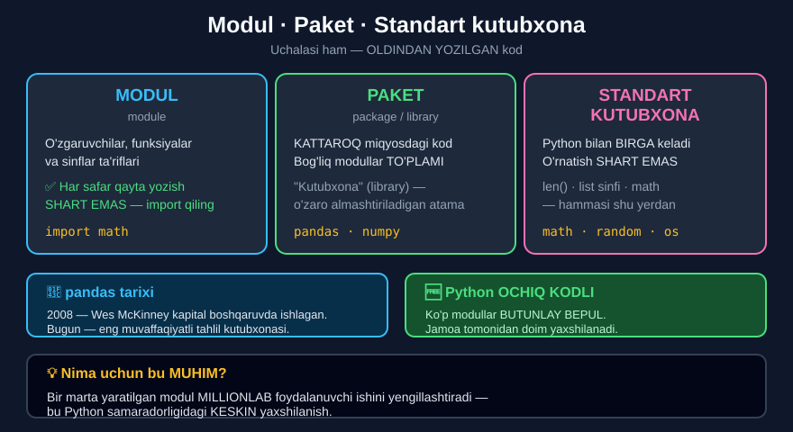

# 2-dars. Modullar, paketlar va Python standart kutubxonasi

## 🎬 Boshlashdan oldin

> **"Salom va xush kelibsiz. Bu darsda biz MODULLAR, PAKETLAR va PYTHON STANDART KUTUBXONASI haqida o'rganamiz."**
>
> ## **"Uchala atamaning umumiy jihati shundaki, ularning hammasi OLDINDAN YOZILGAN kodning turli turini ifodalaydi."**
>
> ## **"G'oya shundaki, bu kodni ish paytida bajarish orqali siz JUDA KATTA VAQTNI TEJAYSIZ."**

Siz `pandas`, `numpy`, `sklearn` haqida eshitgansiz. Mana ular **nima**.

---

## 1. Modul

> ## **"MODUL — o'zgaruvchilar, funksiyalar va sinflar TA'RIFLARINI o'z ichiga olgan oldindan yozilgan kod."**
>
> **"Uning JOZIBASI shundaki, u BARCHA yangi dasturlarga yuklanishi mumkin — va biz yangi dastur boshida kodni QO'LDA QAYTA YOZISHIMIZ shart emas."**
>
> ## **"Bizga shunchaki bu modulni IMPORT QILISH kifoya."**

```python
import math          # ← butun modul yuklandi
print(math.sqrt(16)) # 4.0
```

---

## 2. Paket

> ## **"PAKET — KATTAROQ MIQYOSDAGI oldindan yozilgan kod. Bu — bog'liq Python modullarining TO'PLAMI yoki KATALOGI."**

```
PAKET (pandas)
├── modul_1
├── modul_2
├── modul_3
└── ...
```

> **"Texnik jihatdan siz o'z modullaringiz va paketlaringizni yarata olasiz — lekin bu odatda YUQORI DARAJADAGI dasturlash ko'nikmalari va KO'P VAQT talab qiladi."**
>
> **"Yaxshiyamki, ishlar bundan ancha oson."**

> ## **"Dasturlash hamjamiyatidagi odamlar yuklab olish uchun TAYYOR bo'lgan va turli kasb va ixtisosliklar uchun MOSLASHTIRILGAN o'sib borayotgan paketlar to'plamini ishlab chiqishdi."**

### 🔤 Atama

> **"Ba'zan odamlar paketga ishora qilganda KUTUBXONA (library) atamasini ishlatishadi — shuning uchun bilib qo'ying: bu ikkalasi O'ZARO ALMASHTIRILADI."**



---

## 3. Python standart kutubxonasi

> **"Ajoyib. PYTHON STANDART KUTUBXONASI — biroz boshqacha narsa."**
>
> ## **"Bu — siz Python'ni O'RNATGANINGIZ BILANOQ mavjud bo'ladigan modullar to'plami."**

> **"Kursda avval ishlatgan `len` ichki funksiyasini eslaysizmi? Biz uni TO'G'RIDAN-TO'G'RI ishlatdik va obyektdagi elementlar sonini sanaydigan kodni QO'LDA yozishimiz shart emas edi, to'g'rimi?"**
>
> **"Xuddi shunday, biz ro'yxatni kengaytirish uchun `list` sinfining metodlaridan foydalandik — va metodni qo'llashdan oldin uni o'zimiz aniqlashimiz shart emas edi."**

> ## **"Buning sababi — Python ishlab chiquvchilari sizning ishingizga OSONGINA qo'shishingiz mumkin bo'lgan ma'lum miqdordagi oldindan yozilgan kodni tayyorlab qo'yishgan."**

> **"Dasturingiz boshida siz KO'RA OLMAYDIGAN modullar to'plami bor — lekin u `len` funksiyasi yoki `list` sinfi kabi barcha ICHKI xususiyatlarni o'z ichiga oladi."**
>
> ## **"Aynan shu modullar STANDART KUTUBXONANI tashkil qiladi."**

```
SIZNING KODINGIZ
      ↑
[ko'rinmas: standart kutubxona modullari]
      ↓
len()  ·  list  ·  print()  ·  type()  ·  max()  ...
```

---

## 4. Modullarga kirish

> **"Modullar, paketlar va standart kutubxona nima ekanini bilgan holda — ularning oldindan yozilgan kodiga qanday kirishimiz mumkin?"**

> **"Yaxshiyamki, Python KENG amaliy qo'llanilishga ega. Tilni ishlatish uchun dunyodagi BARCHA modullarni o'rnatish SHART EMAS."**
>
> ## **"Odamlar o'zlariga KERAK bo'lgan modullar va paketlarni yuklab olishadi."**

> **"Statistiklar katta to'plamdagi statistik funksiyalar va metodlarni o'z ichiga olgan modulni o'rnatishga moyil bo'lishadi, ma'lumot tahlilchisi esa ehtimol ma'lumotlarini jadvallarga tashkil qilishga yordam beradigan paketdan foydalanadi — va hokazo."**

| Kasb | Odatiy paketlar |
|---|---|
| **Ma'lumot tahlilchisi** | `pandas`, `numpy` |
| **ML muhandisi** | `scikit-learn`, `tensorflow`, `pytorch` |
| **AI muhandisi** | `openai`, `langchain`, `transformers` |
| **Veb-dasturchi** | `django`, `flask`, `fastapi` |
| **Statistik** | `scipy`, `statsmodels` |

---

## 5. O'z modulingizni yozish

> **"Tayyor modullardan foydalanishdan tashqari, siz O'Z modullaringizni ham yozishingiz mumkin."**
>
> ## **"Bu haqiqatan ham Python'ning ENG YAXSHI xususiyatlaridan biri."**
>
> **"Biroq, buni odatda YUQORI IXTISOSLASHGAN mutaxassislar amalga oshiradi."**

> **"Masalan, ba'zi ishlab chiquvchilar HAR KIM import qilib ishlatishi mumkin bo'lgan ma'lum statistik modulni yaratadi."**

> ## **"Python OCHIQ KODLI bo'lgani uchun, ko'p modullar BUTUNLAY BEPUL — va har kim ularni yuklab olib, o'z hisob-kitoblari uchun ishlatishi mumkin."**
>
> **"Modul chiqarilgandan so'ng u odatda YAXSHILANADI va YANGILANADI."**

---

## 6. 🐼 pandas tarixi

> **"Aytib o'tganimizdek, paketlar — modullar to'plami. Shuning uchun paketlar modullar kabi ishlab chiqiladi, lekin ANCHA KO'P ish talab qiladi."**
>
> ## **"Eng keng qo'llaniladigan paketlarning ba'zilari odatda BITTA SHAXSNING loyihasi sifatida boshlanadi — lekin keyin butun Python hamjamiyati tomonidan ko'tarib ketiladi."**

> **"Masalan, 2008-yilda kapital boshqaruv sohasida ishlayotgan dasturchi Wes McKinney miqdoriy tahlil uchun YUQORI UNUMDORLIKDAGI vosita kerak edi."**
>
> ## **"U yaratgan paket — PANDAS — bugungi kunda mavjud eng muvaffaqiyatli ma'lumot tahlili kutubxonalaridan biri."**
>
> **"U nafaqat BEPUL, balki hamjamiyat tomonidan DOIM YAXSHILANADI."**

> ## **"Bu — modullar va paketlarni Python samaradorligidagi KESKIN YAXSHILANISH qiladigan narsa."**
>
> **"Bir marta o'rnatilgan va ishlashi isbotlangan modul yoki paketni OSONGINA rivojlantirish va KO'P MARTA ishlatish mumkin — bu ba'zan MILLIONLAB foydalanuvchining ishini yengillashtiradi."**

---

## 7. Xulosa

> **"Ajoyib. Xulosa qilib aytganda, iltimos, esda tuting: PYTHON STANDART KUTUBXONASI — keyinchalik ishingizda ishlatishingiz mumkin bo'lgan ma'lum modullar to'plami."**
>
> ## **"Amalda texnik tomondan o'rganishingiz kerak bo'lgan qism — faylingizga MODUL VA PAKETLARNI QANDAY IMPORT QILISH — va biz buni keyingi darsda qilamiz."**

---

## 8. 📊 Uchtasini solishtirish

| | **Modul** | **Paket** | **Standart kutubxona** |
|---|---|---|---|
| **Nima** | Bitta fayl | Modullar to'plami | Python bilan keladigan modullar |
| **Hajmi** | Kichik | Katta | Katta |
| **O'rnatish** | Kerak *(agar standart bo'lmasa)* | **Kerak** | **Kerak emas** |
| **Sinonimi** | — | Kutubxona *(library)* | — |
| **Misol** | `math`, `random` | `pandas`, `numpy` | `len()`, `list`, `print()` |
| **Import** | `import math` | `import pandas` | Kerak emas |

---

## 9. 💻 Amaliy misollar

```python
# ===== STANDART KUTUBXONA — IMPORTSIZ =====
print(len([1, 2, 3]))           # 3
print(max(10, 20))              # 20
print(type(3.14))               # <class 'float'>

# ===== STANDART KUTUBXONA — IMPORT BILAN =====
import math
print(math.sqrt(16))            # 4.0
print(math.pi)                  # 3.141592653589793
print(math.floor(3.7))          # 3
print(math.ceil(3.2))           # 4

import random
# random.random()  →  har safar BOSHQA son

# ===== MODULDA NIMA BOR? =====
funksiyalar = []
for nom in dir(math):
    if not nom.startswith("_"):
        funksiyalar.append(nom)
print(len(funksiyalar), "ta funksiya/doimiy")
print(funksiyalar[:8])

# ===== YORDAM =====
# help(math)          →  butun modul haqida
# help(math.sqrt)     →  bitta funksiya haqida
```

**Natija:**

```
3
20
<class 'float'>
4.0
3.141592653589793
3
4
62 ta funksiya/doimiy
['acos', 'acosh', 'asin', 'asinh', 'atan', 'atan2', 'atanh', 'cbrt']
```

> ⚠️ **Diqqat:** `math` dagi funksiyalar soni Python versiyasiga qarab **farq qilishi mumkin**.

---

## 10. ⚡ Qo'shimcha mashqlar

> 📌 Bu darsda kursning rasmiy mashqlari yo'q — bu **nazariy** dars.

### 🟢 Oson

**M1.** `math` modulini import qiling va uch xil funksiyasini sinang.

**M2.** `math.pi` va `math.e` qiymatlarini chiqaring.

**M3.** Standart kutubxonaning **importsiz** ishlaydigan 5 ta funksiyasini yozing.

<details>
<summary>✅ Yechimlar</summary>

```python
# M1
import math
print(math.sqrt(25))            # 5.0
print(math.floor(7.9))          # 7
print(math.ceil(7.1))           # 8

# M2
print(math.pi)                  # 3.141592653589793
print(math.e)                   # 2.718281828459045

# M3 — ICHKI funksiyalar, import KERAK EMAS:
print(len("Python"))            # 6
print(max(3, 7))                # 7
print(min(3, 7))                # 3
print(sum([1, 2, 3]))           # 6
print(round(3.7))               # 4
```

</details>

### 🟡 O'rta

**M4.** `dir()` bilan `math` modulida nima borligini ko'ring.

**M5.** `help()` bilan bitta funksiya haqida ma'lumot oling.

**M6.** `math.pi` bilan doira yuzasini hisoblaydigan funksiya yozing.

<details>
<summary>✅ Yechimlar</summary>

```python
# M4
import math
f = []
for nom in dir(math):
    if not nom.startswith("_"):
        f.append(nom)
print(len(f))
print(f[:10])

# M5
# help(math.sqrt)
# Return the square root of x.

# M6
import math
def doira_yuzasi(r):
    return math.pi * r ** 2

print(round(doira_yuzasi(5), 2))        # 78.54
print(round(doira_yuzasi(1), 4))        # 3.1416
```

</details>

### 🔴 Qiyin

**M7.** `random` modulidan foydalanib **tasodifiy** son oling.

**M8.** Ikkita modulni import qilib, ularni birga ishlating.

**M9.** Standart kutubxonaning yana **3 ta modulini** toping va sinang.

<details>
<summary>✅ Yechimlar</summary>

```python
# M7
import random
print(type(random.random()))            # <class 'float'>   ← 0.0 dan 1.0 gacha
# random.randint(1, 6)                  ← 1 dan 6 gacha butun son
# random.choice(["a","b","c"])          ← ro'yxatdan tasodifiy element

# M8
import math
import random
tasodifiy = random.randint(1, 100)
print(type(math.sqrt(tasodifiy)))       # <class 'float'>

# M9
import statistics
print(statistics.mean([1, 2, 3, 4]))    # 2.5
print(statistics.median([1, 2, 3, 4]))  # 2.5

import string
print(string.ascii_lowercase)           # abcdefghijklmnopqrstuvwxyz
print(string.digits)                    # 0123456789

import datetime
# datetime.date.today()  →  bugungi sana
print(datetime.date(2026, 8, 25))       # 2026-08-25
```

</details>

---

## 11. 🧠 O'zini tekshirish savollari

1. Uchala atamaning umumiy jihati nima?
2. G'oya nima?
3. Modul nima?
4. Uning jozibasi nimada?
5. Paket nima?
6. Paketning sinonimi qaysi?
7. Standart kutubxona nima?
8. `len` va `list` metodlari qayerdan keladi?
9. Barcha modullarni o'rnatish shartmi?
10. O'z modulingizni yozish mumkinmi?
11. Modullar bepulmi?
12. pandas kim tomonidan va qachon yaratilgan?
13. Nima uchun modullar Python samaradorligini oshiradi?

<details>
<summary>✅ Javoblar</summary>

1. Ularning hammasi **oldindan yozilgan kodning** turli turini ifodalaydi.
2. Bu kodni ish paytida bajarish orqali **juda katta vaqtni tejash**.
3. **O'zgaruvchilar, funksiyalar va sinflar ta'riflarini** o'z ichiga olgan oldindan yozilgan kod.
4. U **barcha yangi dasturlarga yuklanishi** mumkin — kodni **qayta yozish shart emas**.
5. **Kattaroq miqyosdagi** oldindan yozilgan kod — bog'liq Python modullarining **to'plami**.
6. **Kutubxona** (*library*).
7. Python'ni **o'rnatganingiz bilanoq** mavjud bo'ladigan modullar to'plami.
8. **Standart kutubxonadan** — dastur boshidagi **ko'rinmas** modullardan.
9. **Yo'q** — odamlar **kerak bo'lganlarini** yuklab olishadi.
10. **Ha** — bu Python'ning eng yaxshi xususiyatlaridan biri, lekin odatda **yuqori ixtisoslashgan mutaxassislar** qiladi.
11. **Ha** — Python **ochiq kodli**, ko'p modullar **butunlay bepul**.
12. **Wes McKinney**, **2008-yilda** kapital boshqaruv sohasida ishlayotganida.
13. Bir marta yaratilgan modulni **ko'p marta** ishlatish mumkin — bu **millionlab** foydalanuvchi ishini yengillashtiradi.

</details>

---

## 📌 Xulosa

```
UCHALASI HAM — OLDINDAN YOZILGAN KOD


MODUL
• O'zgaruvchilar, funksiyalar, sinflar TA'RIFLARI
• Bitta fayl
• import math

PAKET  (=  KUTUBXONA / library)
• Bog'liq modullar TO'PLAMI
• Kattaroq miqyos
• pandas · numpy · scikit-learn

STANDART KUTUBXONA
• Python bilan BIRGA keladi
• O'rnatish SHART EMAS
• len() · list · print() · math · random


🐼 PANDAS TARIXI
2008 — Wes McKinney, kapital boshqaruv sohasi
Bugun — eng muvaffaqiyatli tahlil kutubxonalaridan biri
Bepul · hamjamiyat tomonidan doim yaxshilanadi


💡 NIMA UCHUN MUHIM
"Bir marta o'rnatilgan va ishlashi isbotlangan modulni
 KO'P MARTA ishlatish mumkin — bu ba'zan MILLIONLAB
 foydalanuvchining ishini yengillashtiradi."


KASBGA QARAB
Ma'lumot tahlilchisi  →  pandas, numpy
ML muhandisi          →  scikit-learn, tensorflow
AI muhandisi          →  openai, langchain
Veb-dasturchi         →  django, flask
```

---

## 🔖 Atamalar

| Atama | Inglizcha | Izoh |
|---|---|---|
| Modul | *module* | Oldindan yozilgan kod fayli |
| Paket | *package* | Modullar to'plami |
| Kutubxona | *library* | Paketning sinonimi |
| Standart kutubxona | *standard library* | Python bilan keladigan modullar |
| Import qilish | *import* | Modulni dasturga yuklash |
| Ochiq kodli | *open source* | Kodi ochiq va bepul |
| Ichki funksiya | *built-in function* | Standart kutubxonadan keladi |

---

⬅️ [Oldingi: OOP ga kirish](01-Introduction-to-OOP.md) · ➡️ [Keyingi: Modullarni import qilish](03-Importing-Modules.md)
