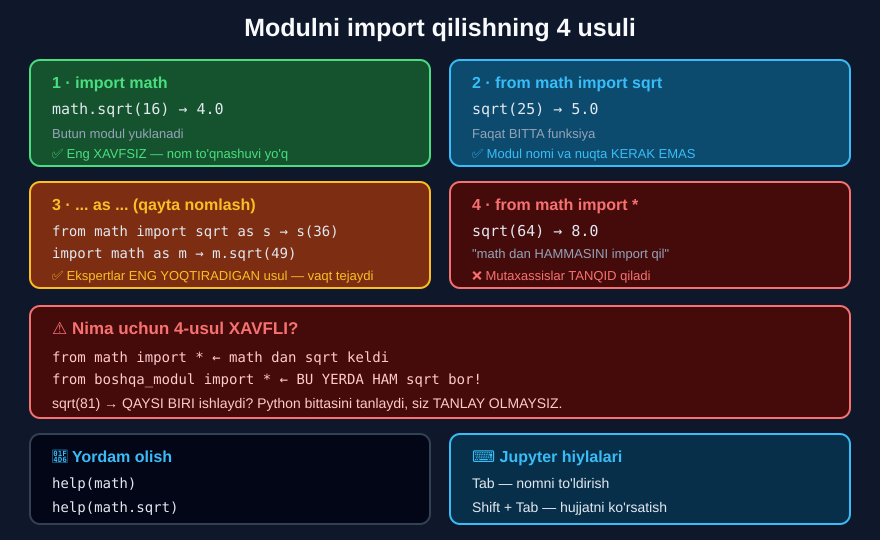

# 3-dars. Modullarni import qilish

## 🎬 Boshlashdan oldin

> ## **"Modulni import qilishning TO'RTTA usuli bor. Bu darsda biz to'rttasini ham ko'rsatamiz."**
>
> **"Va ularni ko'rganingizdan so'ng — o'z ishingizda qaysi birini ishlatishni O'ZINGIZ hal qilasiz."**

> **"Paketlar va modullar amalda qanday ishlashini ko'rish uchun Python standart kutubxonasidagi `math` moduli bilan ishlaylik."**
>
> **"Birinchidan, `math` moduli KO'PLAB matematik funksiyalarni o'z ichiga oladi. Ular orasida `sqrt` funksiyasi bor — u argumentning KVADRAT ILDIZINI hisoblaydi."**
>
> **"Uning imkoniyatlaridan foydalanish uchun uni IMPORT QILISHINGIZ kerak."**



---

## 1-usul: `import math`

> **"Buni qilish uchun `import math` deb yozishingiz mumkin. Endi `math` modulining kodi ishga tushiriladi."**
>
> **"`sqrt` funksiyasini to'g'ri qo'llash uchun quyidagi sintaksisga rioya qilishimiz kerak:"**
>
> ## **"MODUL NOMI — `math`, NUQTA OPERATORI, qiziqtirgan FUNKSIYA NOMI — `sqrt`, va qavslar ichida ARGUMENT."**

```python
import math
math.sqrt(16)
```

```
4.0
```

> **"Va biz kasr son 4 ni olamiz. Ajoyib!"**

```
math . sqrt ( 16 )
 ↑    ↑   ↑     ↑
 |    |   |     argument
 |    |   funksiya nomi
 |    nuqta operatori
 modul nomi
```

---

## 2-usul: `from math import sqrt`

> **"Agar `math` modulida taqdim etilgan BARCHA funksiya va sinflar sizga kerak emasligini oldindan bilsangiz, va `sqrt` — siz ishlatadigan YAGONA funksiya bo'lsa — siz `from math import sqrt` deb yozishingiz mumkin."**
>
> ## **"Bu sintaksis bu funksiyani chaqirganda MODUL NOMINI va NUQTA OPERATORINI TASHLAB KETISH imkonini beradi."**

```python
from math import sqrt
sqrt(25)
```

```
5.0
```

> **"`sqrt` to'g'ridan-to'g'ri, aytaylik, 25 argumentiga qo'llanilishi mumkin — va siz kerakli natijani olasiz."**

---

## 3-usul: `as` bilan qayta nomlash

> ## **"Ko'radigan uchinchi variant — ehtimol EKSPERTLAR ENG KO'P YOQTIRADIGANI."**
>
> **"Ilg'or kod bo'laklarida siz modullar yoki ularning funksiyalari QANDAY QAYTA NOMLANISHINI ko'rasiz — shunchaki QISQAROQ nomlardan foydalanish VAQT TEJAY olgani uchun."**

### Funksiyani qayta nomlash

> **"Agar `from math import sqrt as s` deb yozsak, biz 36 ga qo'llaniladigan `sqrt` o'rniga `s` dan foydalanishimiz mumkin. Bu funksiya 6 qiymatini qaytaradi."**

```python
from math import sqrt as s
s(36)
```

```
6.0
```

### Modulni qayta nomlash

> **"Ajoyib. Modullarni ham qayta nomlash mumkin."**
>
> **"Birinchi variantni qaytaraylik: yana `import math` yozing va `as m` qo'shing."**
>
> **"Shunga ko'ra, `m.sqrt(49)` natijasi 7.0 bo'ladi. Ko'ryapsizmi."**

```python
import math as m
m.sqrt(49)
```

```
7.0
```

### 🌍 Amaliyotdagi standart qisqartmalar

```python
import pandas as pd
import numpy as np
import matplotlib.pyplot as plt
import seaborn as sns
import tensorflow as tf
```

> 🔑 Bular — **butun dunyoda qabul qilingan** qisqartmalar. Ularni **o'zgartirmang** — hamma `pd.DataFrame` ni tushunadi.

---

## 4-usul: `from math import *`

> ## **"To'rtinchi variant odatda mutaxassislar tomonidan TANQID QILINADI. Shunga qaramay, u interaktiv sessiyalar uchun MOS bo'lishi mumkin."**
>
> **"`from math import *` deb yozing — va `math` dan barcha xususiyatlar — funksiyalar, sinflar yoki metodlar — import qilinadi."**
>
> **"Bu `math` dan HAMMASINI import qil deb talqin qilinadi."**

```python
from math import *
sqrt(64)
```

```
8.0
```

> **"To'g'ri qilganimizni tekshirish uchun `sqrt` ni 64 ga qo'llaylik. Mana natijamiz."**

---

## ⚠️ Nima uchun 4-usul xavfli?

> **"Muammo shundaki, bu variant ba'zi vaziyatlarda Python uchun MUAMMOLI bo'lishi mumkin."**

> ## **"Faraz qiling, siz `math` dan hamma narsani import qildingiz — va keyin `sqrt` funksiyasini o'z ichiga olgan IKKINCHI modulni import qildingiz."**
>
> ## **"Va agar ikkinchi modul funksiyani BOSHQACHA ishlatsachi?"**
>
> ## **"`sqrt(81)` deb yozganingizda dastur ikkalasidan QAYSI BIRINI qo'llashi kerak?"**

> ## **"Python ikki variantdan birini TANLAYDI — lekin siz qo'llanilishi kerak bo'lganini TANLAY OLMAYSIZ."**
>
> ## **"Bu — NOPROFESSIONAL kodlash belgisi, shuning uchun ekspertlar uzun fayllarda bundan QOCHISHADI."**

```python
from math import *              # sqrt keldi
from boshqa_modul import *      # bu yerda HAM sqrt bor!

sqrt(81)      # ← QAYSI BIRI?  Siz TANLAY OLMAYSIZ.
```

---

## 5. Yordam olish

> **"Bundan tashqari, keyingi ma'lumot uchun siz `math` moduliga tegishli xususiyatlar haqida o'qishingiz mumkin: `help` yozing va qavslar ichiga `math` qo'ying. Barcha funksiyalarning tavsifi chiqadi."**

```python
help(math)
```

> **"Agar `sqrt` ma'nosi bilan qiziqsangiz, unda siz shunchaki `help(math.sqrt)` deb yozishingiz mumkin. Yaxshi."**

```python
help(math.sqrt)
```

```
Help on built-in function sqrt in module math:

sqrt(x, /)
    Return the square root of x.
```

---

## 6. 📊 To'rt usulni solishtirish

| № | Usul | Chaqirish | Qachon ishlatish | Baho |
|---|---|---|---|---|
| 1 | `import math` | `math.sqrt(16)` | **Deyarli doim** | ✅ Eng xavfsiz |
| 2 | `from math import sqrt` | `sqrt(25)` | Faqat 1-2 funksiya kerak | ✅ Yaxshi |
| 3 | `import math as m` | `m.sqrt(49)` | Uzun nomli paketlar | ✅ Standart |
| 4 | `from math import *` | `sqrt(64)` | Faqat **interaktiv** sessiya | ❌ Qochish kerak |

---

## 7. 💻 To'liq kod

```python
# ===== 1-USUL =====
import math
print(math.sqrt(16))            # 4.0

# ===== 2-USUL =====
from math import sqrt
print(sqrt(25))                 # 5.0

# ===== 3-USUL: funksiyani qayta nomlash =====
from math import sqrt as s
print(s(36))                    # 6.0

# ===== 3-USUL: modulni qayta nomlash =====
import math as m
print(m.sqrt(49))               # 7.0

# ===== 4-USUL =====
from math import *
print(sqrt(64))                 # 8.0

# ===== BIR NECHTA FUNKSIYANI IMPORT =====
from math import sqrt, floor, ceil
print(sqrt(100), floor(3.7), ceil(3.2))

# ===== MODUL DOIMIYLARI =====
import math
print(math.pi)                  # 3.141592653589793
print(math.e)                   # 2.718281828459045

# ===== AMALIY MISOL =====
import math

def doira(r):
    yuza = math.pi * r ** 2
    uzunlik = 2 * math.pi * r
    return round(yuza, 2), round(uzunlik, 2)

print(doira(5))                 # (78.54, 31.42)

def gipotenuza(a, b):
    return math.sqrt(a**2 + b**2)

print(gipotenuza(3, 4))         # 5.0
```

**Natija:**

```
4.0
5.0
6.0
7.0
8.0
10.0 3 4
3.141592653589793
2.718281828459045
(78.54, 31.42)
5.0
```

---

## 8. ⚠️ Keng tarqalgan xatolar

### Xato 1 — importsiz ishlatish

```python
sqrt(16)
```
```
NameError: name 'sqrt' is not defined
```

### Xato 2 — nuqtani unutish

```python
import math
sqrt(16)         # ❌ NameError
math.sqrt(16)    # ✅ 4.0
```

### Xato 3 — `from` bilan nuqta ishlatish

```python
from math import sqrt
math.sqrt(16)    # ❌ NameError: name 'math' is not defined
sqrt(16)         # ✅ 4.0
```

### Xato 4 — mavjud bo'lmagan modul

```python
import matematika
```
```
ModuleNotFoundError: No module named 'matematika'
```

> 💡 Agar bu **haqiqiy paket** bo'lsa (masalan `pandas`), uni **o'rnatish** kerak:
> ```
> pip install pandas
> ```

---

## 9. ⚡ Qo'shimcha mashqlar

> 📌 Bu darsda kursning rasmiy mashqlari yo'q.

### 🟢 Oson

**M1.** `math` ni **to'rt xil** usulda import qilib, `sqrt(81)` ni hisoblang.

**M2.** `math.pi` bilan doira uzunligini hisoblang.

**M3.** `floor` va `ceil` ni import qilib sinang.

<details>
<summary>✅ Yechimlar</summary>

```python
# M1
import math
print(math.sqrt(81))                    # 9.0

from math import sqrt
print(sqrt(81))                         # 9.0

import math as m
print(m.sqrt(81))                       # 9.0

from math import sqrt as s
print(s(81))                            # 9.0

# M2
import math
r = 7
print(round(2 * math.pi * r, 2))        # 43.98

# M3
from math import floor, ceil
print(floor(3.7))                       # 3
print(ceil(3.2))                        # 4
print(floor(-3.7))                      # -4   ← PASTGA
print(ceil(-3.2))                       # -3   ← YUQORIGA
```

</details>

### 🟡 O'rta

**M4.** `math.sqrt` va `** 0.5` ni solishtiring.

**M5.** Gipotenuzani ikki xil usulda hisoblang.

**M6.** `random` modulidan uch xil funksiyani sinang.

<details>
<summary>✅ Yechimlar</summary>

```python
# M4
import math
print(math.sqrt(16))                    # 4.0
print(16 ** 0.5)                        # 4.0
print(math.sqrt(16) == 16 ** 0.5)       # True
# Natija bir xil. `**` — import KERAK EMAS.
# `math.sqrt` esa katta sonlarda ANIQROQ.

# M5
def gip1(a, b):
    return math.sqrt(a**2 + b**2)

def gip2(a, b):
    return math.hypot(a, b)             # math ning MAXSUS funksiyasi

print(gip1(3, 4))                       # 5.0
print(gip2(3, 4))                       # 5.0

# M6
import random
print(type(random.random()))            # <class 'float'>  0.0–1.0
print(type(random.randint(1, 6)))       # <class 'int'>    1–6
print(type(random.choice(["a","b"])))   # <class 'str'>
```

</details>

### 🔴 Qiyin

**M7.** `from math import *` va boshqa import to'qnashuvini **isbotlang**.

**M8.** `help()` bilan uch xil funksiya haqida ma'lumot oling.

**M9.** O'z modulingizni yozing va import qiling.

<details>
<summary>✅ Yechimlar</summary>

```python
# M7 — TO'QNASHUV
from math import sqrt           # math ning sqrt i
print(sqrt(16))                 # 4.0

def sqrt(x):                    # O'ZIMIZNING sqrt
    return "Men boshqa sqrt man!"

print(sqrt(16))                 # Men boshqa sqrt man!
# ← math ning sqrt i YO'QOLDI!
# Aynan shu — `import *` ning xavfi.
# `import math` bo'lganda esa `math.sqrt` XAVFSIZ qolardi.

# M8
# help(math.sqrt)   →  Return the square root of x.
# help(math.floor)  →  Return the floor of x as an Integral.
# help(len)         →  Return the number of items in a container.

# M9 — O'Z MODULINGIZ
# 1. `mening_modulim.py` faylini yarating:
#
#    def salom(ism):
#        return "Salom, " + ism + "!"
#
#    PI = 3.14159
#
# 2. Xuddi shu papkadagi boshqa fayldan:
#
#    import mening_modulim
#    print(mening_modulim.salom("Ilhom"))    # Salom, Ilhom!
#    print(mening_modulim.PI)                # 3.14159
#
#    yoki:
#    from mening_modulim import salom
#    print(salom("Ilhom"))                   # Salom, Ilhom!
```

</details>

---

## 10. 🧠 O'zini tekshirish savollari

1. Modulni import qilishning nechta usuli bor?
2. `math` moduli nimani o'z ichiga oladi?
3. `sqrt` nima qiladi?
4. 1-usul sintaksisi qanday?
5. 2-usul qachon qulay?
6. U nimani tashlab ketish imkonini beradi?
7. 3-usulni kim yoqtiradi va nima uchun?
8. Funksiya va modulni qayta nomlash mumkinmi?
9. 4-usul qanday?
10. U nima uchun tanqid qilinadi?
11. Muammo qanday yuzaga keladi?
12. Yordam qanday olinadi?

<details>
<summary>✅ Javoblar</summary>

1. **To'rtta.**
2. **Ko'plab matematik funksiyalarni.**
3. Argumentning **kvadrat ildizini** hisoblaydi.
4. **Modul nomi + nuqta operatori + funksiya nomi + argument**: `math.sqrt(16)`.
5. Modulda taqdim etilgan **barcha funksiya va sinflar kerak emas** bo'lganda.
6. **Modul nomini** va **nuqta operatorini**.
7. **Ekspertlar** — chunki **qisqaroq nomlar vaqt tejaydi**.
8. **Ha** — ikkalasini ham.
9. **`from math import *`** — "math dan hammasini import qil".
10. Chunki bu **noprofessional kodlash belgisi**.
11. Ikkinchi modulda **bir xil nomli** funksiya bo'lsa — Python **birini tanlaydi**, siz **tanlay olmaysiz**.
12. **`help(math)`** yoki **`help(math.sqrt)`**.

</details>

---

## 📌 Xulosa

```python
# 1 ·  import math                    ✅ ENG XAVFSIZ
math.sqrt(16)      →  4.0

# 2 ·  from math import sqrt          ✅ 1-2 funksiya kerak bo'lsa
sqrt(25)           →  5.0

# 3 ·  ... as ...                     ✅ EKSPERTLAR yoqtiradi
from math import sqrt as s   →  s(36)     →  6.0
import math as m             →  m.sqrt(49) →  7.0

# 4 ·  from math import *             ❌ QOCHISH kerak
sqrt(64)           →  8.0


⚠️  4-USULNING XAVFI

from math import *              ← sqrt keldi
from boshqa_modul import *      ← bu yerda HAM sqrt bor!

sqrt(81)   →   QAYSI BIRI?
Python bittasini tanlaydi, SIZ TANLAY OLMAYSIZ.
→ NOPROFESSIONAL kodlash belgisi


🌍 AMALIYOTDAGI STANDART QISQARTMALAR
import pandas as pd
import numpy as np
import matplotlib.pyplot as plt


📖 YORDAM
help(math)          →  butun modul
help(math.sqrt)     →  bitta funksiya


⚠️  XATOLAR
sqrt(16)                    →  NameError (import yo'q)
import math;  sqrt(16)      →  NameError (nuqta yo'q)
from math import sqrt;  math.sqrt(16)  →  NameError
import matematika           →  ModuleNotFoundError
```

---

## 🔖 Atamalar

| Atama | Inglizcha | Izoh |
|---|---|---|
| Import | *import* | Modulni dasturga yuklash |
| `as` | *alias* | Qayta nomlash |
| Taxallus | *alias* | Qisqartirilgan nom |
| Nom to'qnashuvi | *name collision* | Ikki funksiya bir xil nomda |
| `help()` | *help* | Hujjatni ko'rsatish |
| `pip install` | *pip install* | Paketni o'rnatish |
| `ModuleNotFoundError` | *ModuleNotFoundError* | Modul topilmadi |

---

⬅️ [Oldingi: Modullar va paketlar](02-Modules-Packages-Standard-Library.md) · ➡️ [Keyingi: Dasturiy ta'minot hujjatlari](04-What-is-Software-Documentation.md)
