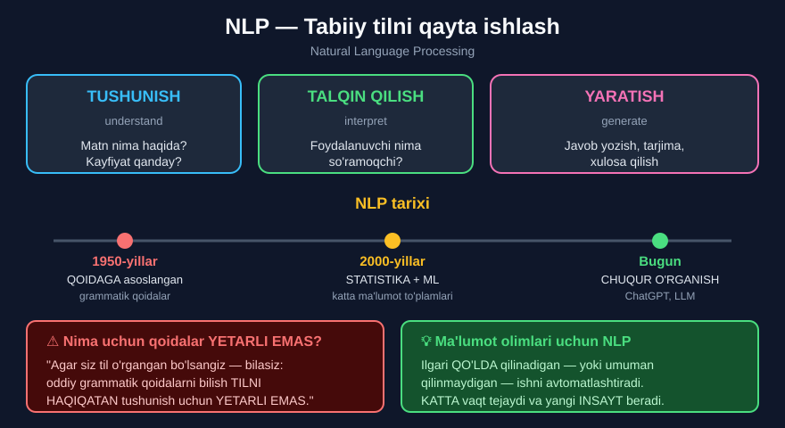

# 2-dars. NLP ga kirish

## 🎬 Boshlashdan oldin

> ## **"Tabiiy Tilni Qayta Ishlash — ko'pincha shunchaki NLP deb qisqartiriladi — bu AI ning sohasi bo'lib, u kompyuterlarga inson tili ma'lumotlarini TUSHUNISH, TALQIN QILISH va YARATISH imkonini beradi — biz bir-birimiz bilan qanday muloqot qilsak, shunga o'xshash tarzda."**

---

## 1. NLP nima?

```
NLP  =  Natural Language Processing
     =  Tabiiy Tilni Qayta Ishlash
```

**Uchta imkoniyat:**

| Imkoniyat | Inglizcha | Misol |
|---|---|---|
| **Tushunish** | *understand* | Sharh ijobiymi yoki salbiymi? |
| **Talqin qilish** | *interpret* | Foydalanuvchi nima so'ramoqchi? |
| **Yaratish** | *generate* | Javob yozish, tarjima qilish |



---

## 2. Qanday texnikalar ishlatiladi?

> **"Bu ma'lumotlarni qayta ishlash va tahlil qilish uchun KENG DOIRADAGI texnikalar ishlatiladi — statistika, mashinali o'rganish va chuqur o'rganishni o'z ichiga oladi."**

```
         NLP
          |
  ┌───────┼───────┐
  ↓       ↓       ↓
Statistika  ML   Chuqur
                 o'rganish
```

*(03-modulda bu uchtasi bilan tanishgan edingiz.)*

---

## 3. NLP tarixi

> **"NLP taxminan 1950-YILLARDA hayotga keldi — lekin dastlabki metodlar QOIDAGA ASOSLANGAN tizimlarga qaratilgan edi: tilning grammatik qoidalarini olib, matnni qayta ishlashga urinish."**

### ⚠️ Nima uchun qoidalar yetarli emas?

> ## **"Biroq, agar siz avval til o'rgangan bo'lsangiz — bilasiz: shunchaki oddiy grammatik qoidalarni o'rganishga urinish siz bu tilni HAQIQATAN tushunadigan darajada gapirish va suhbatlashish uchun YETARLI EMAS."**

**Misol — qoidalar nima uchun ishlamaydi:**

```
"Bank" so'zi:
  1. Moliya muassasasi     →  "Men bankka bordim"
  2. Daryo qirg'og'i        →  "Daryo bankida o'tirdim"

Grammatik qoida ikkalasini FARQLAY OLMAYDI.
Kontekst kerak — buni faqat ML o'rganadi.
```

---

## 4. Zamonaviy davr

> **"Yaqinda bizda texnologiyada JUDA KATTA yutuqlar va NLP modellarimizni o'rgatish uchun KATTA MA'LUMOT TO'PLAMLARINING mavjudligi bo'ldi."**
>
> ## **"Bu endi ChatGPT kabi narsalarga olib keldi — u inson kabi til bilan HAQIQATAN SAMARALI tushunadi va muloqot qiladi."**

### Uch davr

| Davr | Yondashuv | Cheklov |
|---|---|---|
| **1950–1990** | Qoidaga asoslangan | Kontekstni tushunmaydi |
| **1990–2015** | Statistika + ML | Ko'p ma'lumot kerak |
| **2015–bugun** | Chuqur o'rganish | Katta hisoblash quvvati kerak |

> 💡 **Diqqat qiling:** 05-modulda **Transformer** va **LLM** ni ko'rgan edingiz. Ular — aynan shu **uchinchi davrning** mahsuli.

---

## 5. Ma'lumot olimlari uchun NLP

> ## **"Ma'lumot olimlari uchun NLP matn ma'lumotlaridan INSAYT olish uchun SHUNCHALIK KUCHLI vositalar to'plamini beradi."**
>
> **"Bu ilgari QO'LDA qilinishi kerak bo'lgan — yoki umuman qilinmagan bo'lishi mumkin."**

> ## **"Shunday qilib, NLP texnikalaridan foydalanib siz JUDA KATTA vaqtni tejaysiz va ilgari ochilmagan bo'lishi mumkin bo'lgan INSAYTLARNI ochasiz."**

### Amaliy misol

```
10 000 ta mijoz sharhi

❌ QO'LDA:  1 sharh × 30 soniya = 83 SOAT
✅ NLP:     10 000 sharh       = 5 SONIYA
```

---

## 6. 💻 Amaliy: qoidaga asoslangan vs ma'lumotga asoslangan

```python
# ===== 1-DAVR: QOIDAGA ASOSLANGAN =====
def sentiment_qoida(matn):
    """Oddiy qoida: ijobiy so'zlarni sanaydi."""
    ijobiy = ["yaxshi", "ajoyib", "zo'r", "a'lo"]
    salbiy = ["yomon", "past", "sifatsiz", "isrof"]

    matn = matn.lower()
    ball = 0
    for soz in matn.split():
        if soz in ijobiy:
            ball += 1
        if soz in salbiy:
            ball -= 1

    if ball > 0:
        return "IJOBIY"
    elif ball < 0:
        return "SALBIY"
    return "NEYTRAL"


sharhlar = [
    "Juda yaxshi mahsulot",
    "Yomon sifat",
    "Mahsulot yaxshi emas",           # ⚠️ TUZOQ!
    "Kutganimdan ancha ustun chiqdi"  # ⚠️ TUZOQ!
]

for s in sharhlar:
    print(sentiment_qoida(s), "|", s)
```

**Natija:**

```
IJOBIY | Juda yaxshi mahsulot
SALBIY | Yomon sifat
IJOBIY | Mahsulot yaxshi emas
NEYTRAL | Kutganimdan ancha ustun chiqdi
```

### ⚠️ Ikki xato ko'rdingizmi?

| Sharh | Qoida aytdi | Aslida |
|---|---|---|
| `"Mahsulot yaxshi emas"` | **IJOBIY** ❌ | **SALBIY** |
| `"Kutganimdan ancha ustun chiqdi"` | **NEYTRAL** ❌ | **IJOBIY** |

> ## 🔑 **Mana nima uchun qoidalar YETARLI EMAS:**
>
> - **`"emas"`** so'zi ma'noni **teskarisiga** o'giradi — qoida buni bilmaydi
> - **`"ustun chiqdi"`** ijobiy — lekin ro'yxatda **yo'q**
>
> **ML** esa bularni **misollardan o'rganadi** — hech kim qoida yozmaydi.

---

## 7. ⚡ Qo'shimcha mashqlar

### 🟢 Oson

**M1.** `sentiment_qoida()` ga yana 3 ta ijobiy va 3 ta salbiy so'z qo'shing.

**M2.** O'zingizning 5 ta sharhingiz bilan sinang.

**M3.** NLP ning uchta imkoniyatini misol bilan tushuntiring.

<details>
<summary>✅ Yechimlar</summary>

```python
# M1
def sentiment_v2(matn):
    ijobiy = ["yaxshi", "ajoyib", "zo'r", "a'lo", "mukammal", "tavsiya", "mamnun"]
    salbiy = ["yomon", "past", "sifatsiz", "isrof", "afsus", "buzuq", "sekin"]
    matn = matn.lower()
    ball = 0
    for soz in matn.split():
        if soz in ijobiy: ball += 1
        if soz in salbiy: ball -= 1
    if ball > 0:   return "IJOBIY"
    elif ball < 0: return "SALBIY"
    return "NEYTRAL"

print(sentiment_v2("Mukammal xizmat, tavsiya qilaman"))     # IJOBIY
print(sentiment_v2("Afsus, juda sekin yetkazildi"))          # SALBIY

# M2
mening = [
    "Ajoyib mahsulot",
    "Buzuq keldi",
    "Narxi past lekin sifati zo'r",     # ⚠️ ikkalasi ham bor!
    "Oddiy",
    "Mamnun qoldim"
]
for s in mening:
    print(sentiment_v2(s), "|", s)
# IJOBIY | Ajoyib mahsulot
# SALBIY | Buzuq keldi
# NEYTRAL | Narxi past lekin sifati zo'r
# NEYTRAL | Oddiy
# IJOBIY | Mamnun qoldim

# M3
# TUSHUNISH  →  "Bu sharh ijobiymi?"      →  sentiment tahlili
# TALQIN     →  "Toshkent ob-havosi"      →  qidiruv tizimi so'rovni tushunadi
# YARATISH   →  "Xulosa yozib ber"        →  ChatGPT javob yozadi
```

</details>

### 🟡 O'rta

**M4.** `"emas"` so'zini hisobga oluvchi qoida qo'shing.

**M5.** Ball o'rniga **foizda** ishonchni chiqaring.

**M6.** Ikki xil ma'noli so'zga misol toping.

<details>
<summary>✅ Yechimlar</summary>

```python
# M4
def sentiment_v3(matn):
    ijobiy = ["yaxshi", "ajoyib", "zo'r", "a'lo"]
    salbiy = ["yomon", "past", "sifatsiz"]
    sozlar = matn.lower().split()
    ball = 0
    for i in range(len(sozlar)):
        s = sozlar[i]
        qiymat = 0
        if s in ijobiy: qiymat = 1
        if s in salbiy: qiymat = -1
        # KEYINGI so'z "emas" bo'lsa — TESKARISIGA
        if i + 1 < len(sozlar) and sozlar[i+1] == "emas":
            qiymat = -qiymat
        ball += qiymat
    if ball > 0:   return "IJOBIY"
    elif ball < 0: return "SALBIY"
    return "NEYTRAL"

print(sentiment_v3("Mahsulot yaxshi"))          # IJOBIY
print(sentiment_v3("Mahsulot yaxshi emas"))     # SALBIY   ✅ tuzatildi!
print(sentiment_v3("Mahsulot yomon emas"))      # IJOBIY   ✅

# M5
def sentiment_foiz(matn):
    ijobiy = ["yaxshi", "ajoyib", "zo'r", "a'lo"]
    salbiy = ["yomon", "past", "sifatsiz"]
    sozlar = matn.lower().split()
    ij, sal = 0, 0
    for s in sozlar:
        if s in ijobiy: ij += 1
        if s in salbiy: sal += 1
    jami = ij + sal
    if jami == 0:
        return "NEYTRAL (0% ishonch)"
    foiz = max(ij, sal) / jami * 100
    if ij > sal: return "IJOBIY (" + str(round(foiz)) + "% ishonch)"
    return "SALBIY (" + str(round(foiz)) + "% ishonch)"

print(sentiment_foiz("Yaxshi va ajoyib"))                # IJOBIY (100% ishonch)
print(sentiment_foiz("Yaxshi lekin yomon va sifatsiz"))  # SALBIY (67% ishonch)

# M6 — KO'P MA'NOLI SO'ZLAR
# "yosh"  →  1. yil (yoshim 25)   2. suyuqlik (ko'z yoshi)
# "olma"  →  1. meva              2. "olma" (buyruq)
# "bor"   →  1. mavjud            2. "bor" (buyruq)
# Grammatik qoida FARQLAY OLMAYDI — KONTEKST kerak.
```

</details>

### 🔴 Qiyin

**M7.** Nima uchun ML qoidalardan yaxshiroq? Uch sabab yozing.

**M8.** 10 000 sharhni qo'lda va NLP bilan qayta ishlash vaqtini hisoblang.

**M9.** ChatGPT nima uchun 1950-yillarda mumkin emas edi?

<details>
<summary>✅ Yechimlar</summary>

```python
# M7 — UCH SABAB
# 1. KONTEKST — ML so'zning atrofidagi so'zlarni hisobga oladi
#    ("bank" = moliya yoki qirg'oq?)
# 2. YANGI SO'ZLAR — qoidaga har bir yangi so'zni QO'LDA qo'shish kerak,
#    ML esa misollardan O'ZI o'rganadi
# 3. NOZIKLIK — istehzo, ko'chma ma'no, inkor —
#    qoidalar bilan ifodalab bo'lmaydi

# M8
sharhlar = 10000
qolda_soniya = sharhlar * 30
print("Qo'lda:", qolda_soniya, "soniya =", round(qolda_soniya/3600, 1), "soat")
nlp_soniya = 5
print("NLP:   ", nlp_soniya, "soniya")
print("Tezlik:", round(qolda_soniya / nlp_soniya), "barobar")
# Qo'lda: 300000 soniya = 83.3 soat
# NLP:    5 soniya
# Tezlik: 60000 barobar

# M9 — UCH SABAB
# 1. MA'LUMOT — internet yo'q edi, katta matn to'plamlari mavjud emas
# 2. HISOBLASH QUVVATI — GPU yo'q edi; ChatGPT ni o'rgatish
#    minglab GPU va oylab vaqt talab qiladi
# 3. ALGORITMLAR — Transformer arxitekturasi FAQAT 2017-yilda ixtiro qilingan
#    (05-modulni eslang)
```

</details>

---

## 8. 🧠 O'zini tekshirish savollari

1. NLP nima va u nima imkonini beradi?
2. Qanday texnikalar ishlatiladi?
3. NLP qachon paydo bo'ldi?
4. Dastlabki metodlar qanday edi?
5. Nima uchun grammatik qoidalar yetarli emas?
6. Yaqinda nima o'zgardi?
7. Bu nimaga olib keldi?
8. Ma'lumot olimlari uchun NLP nima beradi?
9. Bu ilgari qanday qilinardi?

<details>
<summary>✅ Javoblar</summary>

1. **AI ning sohasi** — kompyuterlarga inson tili ma'lumotlarini **tushunish, talqin qilish va yaratish** imkonini beradi.
2. **Statistika, mashinali o'rganish va chuqur o'rganish.**
3. Taxminan **1950-yillarda**.
4. **Qoidaga asoslangan** tizimlar — tilning **grammatik qoidalari**.
5. Chunki **oddiy grammatik qoidalarni** o'rganish tilni **haqiqatan tushunish** uchun yetarli emas.
6. **Texnologiyada juda katta yutuqlar** va o'rgatish uchun **katta ma'lumot to'plamlari**.
7. **ChatGPT** kabi narsalarga — u inson kabi til bilan **samarali** muloqot qiladi.
8. Matn ma'lumotlaridan **insayt olish** uchun **kuchli vositalar to'plamini**.
9. **Qo'lda** — yoki **umuman qilinmagan** bo'lishi mumkin.

</details>

---

## 📌 Xulosa

```
NLP  =  Natural Language Processing
        Tabiiy Tilni Qayta Ishlash

AI ning sohasi — inson tilini:
  TUSHUNISH  ·  TALQIN QILISH  ·  YARATISH


TEXNIKALAR
Statistika  +  Mashinali o'rganish  +  Chuqur o'rganish


TARIX
1950-yillar   →  QOIDAGA asoslangan     ❌ kontekstni tushunmaydi
2000-yillar   →  Statistika + ML
Bugun         →  Chuqur o'rganish       ✅ ChatGPT


⚠️  NIMA UCHUN QOIDALAR YETARLI EMAS?
"Til o'rgangan bo'lsangiz bilasiz: oddiy grammatik
 qoidalarni o'rganish tilni HAQIQATAN tushunish
 uchun YETARLI EMAS."

Misol:  "Mahsulot yaxshi EMAS"
        Qoida:  IJOBIY  ❌   (yaxshi so'zi bor)
        Aslida: SALBIY  ✅   ("emas" ma'noni o'giradi)


💡 MA'LUMOT OLIMLARI UCHUN
10 000 sharh:
  Qo'lda  →  83 SOAT
  NLP     →  5 SONIYA
```

---

## 🔖 Atamalar

| Atama | Inglizcha | Izoh |
|---|---|---|
| NLP | *natural language processing* | Tabiiy tilni qayta ishlash |
| Qoidaga asoslangan | *rule-based* | Qo'lda yozilgan qoidalar |
| Insayt | *insight* | Ma'lumotdan olingan bilim |
| Kontekst | *context* | So'zning atrofidagi ma'no |
| Ko'p ma'nolilik | *ambiguity* | So'zning bir necha ma'nosi |
| Inkor | *negation* | "emas" — ma'noni o'giradi |

---

⬅️ [Oldingi: Kursga kirish](01-Introduction-to-the-Course.md) · ➡️ [Keyingi: NLP kundalik hayotda](03-NLP-in-Everyday-Life.md)
