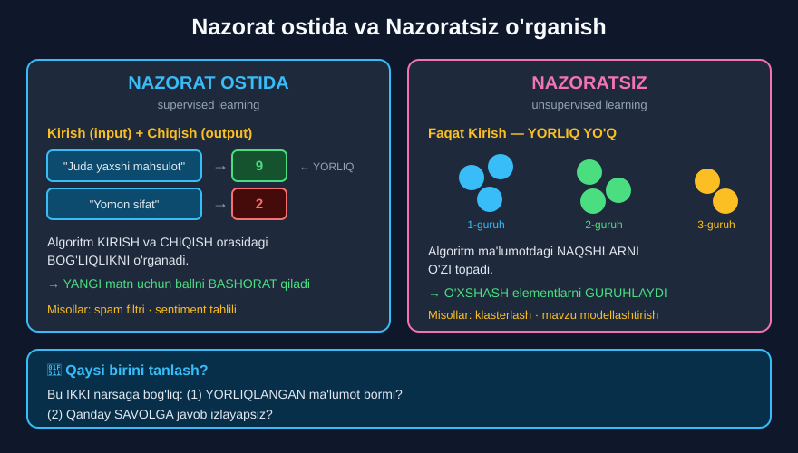

# 4-dars. Nazorat ostida va nazoratsiz NLP

## 🎬 Boshlashdan oldin

> ## **"NAZORAT OSTIDA va NAZORATSIZ o'rganish — turli xil NLP muammolarini hal qilishning IKKI FUNDAMENTAL yondashuvi."**
>
> **"Qaysi birini ishlatishingiz sizda mavjud MA'LUMOTGA va javob izlayotgan SAVOLLARINGIZGA bog'liq bo'ladi."**

*(03-modulda bu ikkitani ko'rgan edingiz. Endi ularni **NLP kontekstida** ko'rasiz.)*

---

## 1. Kursda ikkalasi ham bor

> **"Kursning bo'limlari NLP uchun ham nazorat ostida, ham nazoratsiz mashinali o'rganish yechimlarini ko'rib chiqadi."**
>
> **"Shuning uchun buni qilishdan oldin, nazorat ostida va nazoratsiz o'rganish deganda nimani nazarda tutishimizni tushunib olaylik."**

| Modul | Yondashuv |
|---|---|
| **25** · Mavzu modellashtirish | **Nazoratsiz** |
| **26** · O'z tasniflagichingiz | **Nazorat ostida** |
| **27** · Soxta yangiliklar keys | **Nazorat ostida** |

---

## 2. Nazorat ostida o'rganish

> ## **"NAZORAT OSTIDA o'rganish algoritmni KIRISH — bizning matn ma'lumotimiz — va biz ham TAQDIM ETADIGAN CHIQISH orasidagi bog'liqlikni o'rganishga o'rgatishni o'z ichiga oladi."**

### Misol — ma'ruzadan

> **"Aytaylik, sizda SHARHLAR ma'lumot to'plami bor. Sizda sharh MATNI bor, va keyin har bir sharhlovchi o'ntadan SHARH BALLINI ham beradi."**

```
KIRISH (input)              CHIQISH (output)
──────────────────          ────────────────
"Juda yaxshi mahsulot"  →   9
"Yomon sifat"           →   2
"Ajoyib xizmat"         →   10
"Pul isrofi"            →   1
                             ↑
                          YORLIQ (label)
```

> **"Siz buni nazorat ostidagi mashinali o'rganish algoritmiga bera olasiz — u kirish matni va ball orasidagi bog'liqlikni o'rganadi."**
>
> ## **"Shunda u YANGI matn ma'lumotlari uchun ball haqida BASHORAT qila oladi."**



---

## 3. Nazoratsiz o'rganish

> ## **"Boshqa tomondan, NAZORATSIZ o'rganish YORLIQLARGA MUHTOJ EMAS. U ularsiz ham ma'lumotdagi naqshlarni topa oladi."**

> **"Masalan, agar siz avval KLASTERLASH qilgan bo'lsangiz yoki klasterlash haqida eshitgan bo'lsangiz — bu nazoratsiz mashinali o'rganish texnikasining ajoyib misoli."**

*(03-modulda klasterlashni ko'rgan edingiz.)*

> ## **"Nazoratsiz o'rganish sizda YORLIQLANMAGAN ma'lumot bo'lganda, lekin baribir NAQSHLARNI aniqlash yoki o'xshash elementlarni GURUHLASH imkoniga ega bo'lishni xohlaganingizda ajoyib."**

```
KIRISH (yorliqsiz)                     CHIQISH
─────────────────────                  ───────────
"Yetkazib berish sekin"          ┐
"Kuryer kech keldi"              ├─→  1-GURUH: yetkazib berish
"Buyurtma 3 kun kutdim"          ┘

"Narxi juda qimmat"              ┐
"Bunday pulga arzimaydi"         ├─→  2-GURUH: narx
"Boshqa joyda arzonroq"          ┘

"Mahsulot buzuq keldi"           ┐
"Sifat past ekan"                ├─→  3-GURUH: sifat
"Bir haftada sindi"              ┘

⚠️ Guruh NOMLARINI algoritm bermaydi — ODAM beradi!
```

---

## 4. Qaysi birini tanlash?

> ## **"Ikki yondashuv orasidagi tanlov YORLIQLANGAN MA'LUMOTNING MAVJUDLIGIGA va siz javob izlayotgan MUAYYAN INSAYT va SAVOLLARGA bog'liq."**

### Qaror daraxti

```
Sizda YORLIQLANGAN ma'lumot bormi?
              |
      ┌───────┴───────┐
     HA              YO'Q
      ↓                ↓
NAZORAT OSTIDA    NAZORATSIZ
      ↓                ↓
"Bu sharh nechchi   "Sharhlarda qanday
 ball oladi?"        MAVZULAR bor?"
```

### Solishtirish

| | **Nazorat ostida** | **Nazoratsiz** |
|---|---|---|
| **Yorliq** | ✅ Kerak | ❌ Kerak emas |
| **Savol** | "Bu NIMA?" | "Bu yerda QANDAY naqshlar bor?" |
| **Natija** | Aniq bashorat | Guruhlar / mavzular |
| **Baholash** | Oson (to'g'ri/noto'g'ri) | Qiyin (odam baholaydi) |
| **NLP misoli** | Spam filtri, sentiment | Mavzu modellashtirish |
| **Xarajat** | **Yuqori** (yorliqlash qimmat) | **Past** |

---

## 5. ⚠️ Yorliqlash — eng qimmat qism

Bu ma'ruzada aytilmagan, lekin **amalda eng muhim**:

```
10 000 ta sharhni yorliqlash:
  1 sharh × 20 soniya = 55 SOAT odam ishi
  yoki  $500–2000  (autsorsing)
```

> ## 🔑 **Shuning uchun ko'p loyihalar NAZORATSIZ dan boshlanadi** — u **bepul** va **darrov** natija beradi.

---

## 6. 💻 Amaliy: ikkala yondashuv

```python
# ============================================
#   1 · NAZORAT OSTIDA — yorliqlar BOR
# ============================================
sharhlar = ["Juda yaxshi mahsulot", "Yomon sifat",
            "Ajoyib xizmat", "Pul isrofi"]
baholar  = [9, 2, 10, 1]

print("NAZORAT OSTIDA — o'rgatish ma'lumoti")
print("-" * 44)
for i in range(len(sharhlar)):
    if baholar[i] >= 5:
        print(sharhlar[i], "->", baholar[i], "IJOBIY")
    else:
        print(sharhlar[i], "->", baholar[i], "SALBIY")

# ===== SODDA MODEL: so'zlarga ball biriktirish =====
soz_ballari = {}
soz_soni = {}
for i in range(len(sharhlar)):
    for soz in sharhlar[i].lower().split():
        soz_ballari[soz] = soz_ballari.get(soz, 0) + baholar[i]
        soz_soni[soz] = soz_soni.get(soz, 0) + 1

# har bir so'zning O'RTACHA balli
ortacha = {}
for s in soz_ballari:
    ortacha[s] = soz_ballari[s] / soz_soni[s]

print()
print("O'rganilgan so'z ballari:")
for s in ortacha:
    print("  ", s, "->", ortacha[s])

# ===== BASHORAT (yangi matn) =====
def ball_bashorat(matn):
    jami = 0
    topilgan = 0
    for soz in matn.lower().split():
        if soz in ortacha:
            jami += ortacha[soz]
            topilgan += 1
    if topilgan == 0:
        return "Noma'lum"
    return round(jami / topilgan, 1)

print()
print("BASHORAT (yangi matn):")
print("  'Ajoyib mahsulot'   ->", ball_bashorat("Ajoyib mahsulot"))
print("  'Yomon xizmat'      ->", ball_bashorat("Yomon xizmat"))
print("  'Salom dunyo'       ->", ball_bashorat("Salom dunyo"))
```

**Natija:**

```
NAZORAT OSTIDA — o'rgatish ma'lumoti
--------------------------------------------
Juda yaxshi mahsulot -> 9 IJOBIY
Yomon sifat -> 2 SALBIY
Ajoyib xizmat -> 10 IJOBIY
Pul isrofi -> 1 SALBIY

O'rganilgan so'z ballari:
   juda -> 9.0
   yaxshi -> 9.0
   mahsulot -> 9.0
   yomon -> 2.0
   sifat -> 2.0
   ajoyib -> 10.0
   xizmat -> 10.0
   pul -> 1.0
   isrofi -> 1.0

BASHORAT (yangi matn):
  'Ajoyib mahsulot'   -> 9.5
  'Yomon xizmat'      -> 6.0
  'Salom dunyo'       -> Noma'lum
```

### ⚠️ Ikkinchi bashorat — muammoli

`"Yomon xizmat"` → **6.0** (o'rtacha) — lekin bu **salbiy** sharh bo'lishi kerak!

**Sabab:** `"yomon"` = 2.0, `"xizmat"` = 10.0 → o'rtacha **6.0**.

`"xizmat"` so'zi faqat **bitta** (ijobiy) sharhda uchragan, shuning uchun model uni **ijobiy belgi** deb o'ylaydi.

> ## 🔑 **Bu — nazorat ostida o'rganishning asosiy talabi: KO'P va XILMA-XIL yorliqlangan ma'lumot.**

---

```python
# ============================================
#   2 · NAZORATSIZ — yorliqlar YO'Q
# ============================================
sharhlar2 = [
    "Yetkazib berish sekin bo'ldi",
    "Kuryer kech keldi juda",
    "Narxi juda qimmat ekan",
    "Bunday pulga arzimaydi qimmat",
    "Buyurtma uch kun kutdim sekin",
    "Boshqa joyda arzonroq narxi",
]

print()
print("NAZORATSIZ — yorliqlar YO'Q")
print("-" * 44)

# ===== SODDA KLASTERLASH: umumiy so'z bo'yicha =====
def umumiy_sozlar(a, b):
    """Ikki matnda nechta umumiy so'z bor?"""
    A = set(a.lower().split())
    B = set(b.lower().split())
    return len(A & B)          # kesishma

# Har bir juftlik uchun o'xshashlikni hisoblash
print("O'xshashlik matritsasi (umumiy so'zlar soni):")
print("    ", end="")
for j in range(len(sharhlar2)):
    print(j, " ", end="")
print()
for i in range(len(sharhlar2)):
    print(i, " | ", end="")
    for j in range(len(sharhlar2)):
        print(umumiy_sozlar(sharhlar2[i], sharhlar2[j]), " ", end="")
    print()
```

**Natija:**

```
NAZORATSIZ — yorliqlar YO'Q
--------------------------------------------
O'xshashlik matritsasi (umumiy so'zlar soni):
    0  1  2  3  4  5  
0  | 4  0  0  0  1  0  
1  | 0  4  1  0  0  0  
2  | 0  1  4  1  0  1  
3  | 0  0  1  4  0  0  
4  | 1  0  0  0  5  0  
5  | 0  0  1  0  0  4  
```

### 🔑 Matritsani o'qish

Diagonal (`4, 4, 4, 4, 5, 4`) — har bir sharh **o'zi bilan** to'liq mos *(4-sharhda 5 ta turli so'z bor)*.

**Qiziqarli juftliklar** (`1` yoki undan katta):

| Juftlik | Umumiy so'z | Nima haqida |
|---|---|---|
| `0` va `4` | `sekin` | **Yetkazib berish** ✅ |
| `2` va `3` | `qimmat` | **Narx** ✅ |
| `2` va `5` | `narxi` | **Narx** ✅ |
| `1` va `2` | `juda` | *(tasodifiy — mavzuga aloqasi yo'q)* |

> ## 💡 **Algoritm YORLIQSIZ ham GURUHLARNI topdi!**
>
> Lekin u guruhlarga **nom bermadi** — `"yetkazib berish"` va `"narx"` deb **biz** atadik.
>
> **25-modulda** buni **haqiqiy** algoritm bilan qilasiz (LDA — mavzu modellashtirish).

---

## 7. ⚡ Qo'shimcha mashqlar

### 🟢 Oson

**M1.** 5 ta sharh va ball bilan nazorat ostida misol yozing.

**M2.** Yorliqsiz 6 ta matndan guruh topishga urinib ko'ring.

**M3.** Uchta NLP vazifasini toifalarga ajrating.

<details>
<summary>✅ Yechimlar</summary>

```python
# M1
sharhlar = ["Zo'r ishlaydi", "Sekin va noqulay", "Tavsiya qilaman",
            "Pulini bermaydi", "Mukammal sifat"]
baholar  = [10, 3, 9, 2, 10]
for i in range(len(sharhlar)):
    holat = "IJOBIY" if baholar[i] >= 5 else "SALBIY"
    print(sharhlar[i], "->", baholar[i], holat)

# M2
matnlar = ["Telefon batareyasi tez tugaydi",
           "Batareya bir kun ham chidamaydi",
           "Ekrani juda chiroyli",
           "Displey sifati zo'r ekrani",
           "Zaryad tez tugaydi batareya",
           "Kamera yaxshi rasm oladi"]
def umumiy(a, b):
    return len(set(a.lower().split()) & set(b.lower().split()))
for i in range(len(matnlar)):
    for j in range(i+1, len(matnlar)):
        u = umumiy(matnlar[i], matnlar[j])
        if u > 0:
            print(i, "va", j, "->", u, "umumiy so'z")
# 0 va 4 -> 2 umumiy so'z    ← batareya mavzusi
# 1 va 4 -> 1 umumiy so'z    ← batareya mavzusi
# 2 va 3 -> 1 umumiy so'z    ← ekran mavzusi

# M3
# Spam filtri            →  NAZORAT OSTIDA (spam/normal yorliqlari bor)
# Yangiliklarni guruhlash →  NAZORATSIZ (yorliq yo'q)
# Sentiment tahlili      →  NAZORAT OSTIDA (ijobiy/salbiy yorliqlari bor)
```

</details>

### 🟡 O'rta

**M4.** `"Yomon xizmat"` muammosini tuzatishga urinib ko'ring.

**M5.** Yorliqlash **narxini** hisoblang.

**M6.** Qaysi vazifa uchun qaysi yondashuv? 6 ta misol.

<details>
<summary>✅ Yechimlar</summary>

```python
# M4 — KO'PROQ MA'LUMOT qo'shish
sharhlar = ["Juda yaxshi mahsulot", "Yomon sifat", "Ajoyib xizmat",
            "Pul isrofi", "Xizmat juda yomon", "Xizmat o'rtacha"]
baholar  = [9, 2, 10, 1, 2, 5]
sb = {}; ss = {}
for i in range(len(sharhlar)):
    for s in sharhlar[i].lower().split():
        sb[s] = sb.get(s, 0) + baholar[i]
        ss[s] = ss.get(s, 0) + 1
ort = {}
for s in sb:
    ort[s] = sb[s] / ss[s]
print("xizmat ->", round(ort["xizmat"], 2))     # xizmat -> 5.67
# Endi "xizmat" NEYTRALROQ — 10.0 emas, 5.67
# Chunki u ijobiy VA salbiy sharhlarda uchradi

# M5
sharhlar_soni = 10000
soniya = sharhlar_soni * 20
print("Vaqt:", round(soniya/3600, 1), "soat")           # 55.6 soat
print("Narx ($15/soat):", round(soniya/3600 * 15), "$") # 833 $

# M6
# 1. Sharhga ball berish       →  NAZORAT OSTIDA
# 2. Mijoz shikoyatlari mavzusi →  NAZORATSIZ
# 3. Tilni aniqlash            →  NAZORAT OSTIDA
# 4. Hujjatlarni guruhlash     →  NAZORATSIZ
# 5. Soxta yangilik aniqlash   →  NAZORAT OSTIDA
# 6. So'zlar o'xshashligi      →  NAZORATSIZ
```

</details>

### 🔴 Qiyin

**M7.** Nazoratsiz natijani **qanday baholash** mumkin?

**M8.** **Yarim nazorat ostida** (*semi-supervised*) o'rganish nima?

**M9.** Nazoratsiz natijadan nazorat ostida modelga o'tish yo'lini yozing.

<details>
<summary>✅ Yechimlar</summary>

```python
# M7 — UCH YO'L
# 1. ODAM BAHOSI — mutaxassis guruhlarni ko'rib "mantiqlimi?" deb baholaydi
# 2. IChKI METRIKA — guruh ichidagi o'xshashlik YUQORI,
#    guruhlar orasidagi o'xshashlik PAST bo'lishi kerak
# 3. AMALIY FOYDA — natija biznesga yordam berdimi?
#
# ⚠️ "To'g'ri javob" YO'Q — shuning uchun baholash QIYIN.

# M8 — YARIM NAZORAT OSTIDA
# Sizda 10 000 ta matn bor, lekin faqat 200 tasi yorliqlangan.
#
# 1. 200 ta yorliqlangan bilan model o'rgating
# 2. Model qolgan 9800 ta uchun bashorat qilsin
# 3. Model ISHONCHLI bo'lgan bashoratlarni yorliq deb qabul qiling
# 4. Kengaytirilgan ma'lumot bilan QAYTA o'rgating
#
# Foyda: yorliqlash xarajati 50 barobar kam

# M9 — AMALIY YO'L (ko'p loyihalar shunday boshlanadi)
#
# 1-BOSQICH — NAZORATSIZ
#    10 000 sharhni klasterlash  →  5 ta guruh topildi
#
# 2-BOSQICH — ODAM
#    Har bir guruhga NOM berish:
#    "yetkazib berish", "narx", "sifat", "xizmat", "boshqa"
#
# 3-BOSQICH — YORLIQLASH
#    Har bir guruhdan 100 ta sharhni QO'LDA tekshirish
#    (10 000 emas — atigi 500 ta!)
#
# 4-BOSQICH — NAZORAT OSTIDA
#    500 ta yorliq bilan tasniflagich o'rgatish
#
# ✅ Natija: 55 soat o'rniga 3 soat yorliqlash
```

</details>

---

## 8. 🧠 O'zini tekshirish savollari

1. Ikki fundamental yondashuv qaysilar?
2. Qaysi birini ishlatish nimaga bog'liq?
3. Nazorat ostida o'rganish nimani o'z ichiga oladi?
4. Sharhlar misolida kirish va chiqish nima?
5. Algoritm nimani o'rganadi?
6. U keyin nima qila oladi?
7. Nazoratsiz o'rganishga nima kerak emas?
8. U nima topa oladi?
9. Klasterlash qaysi turga kiradi?
10. Nazoratsiz qachon ajoyib?
11. Tanlov nimaga bog'liq?

<details>
<summary>✅ Javoblar</summary>

1. **Nazorat ostida** (*supervised*) va **nazoratsiz** (*unsupervised*) o'rganish.
2. Sizda mavjud **ma'lumotga** va javob izlayotgan **savollaringizga**.
3. Algoritmni **kirish** (matn) va **taqdim etilgan chiqish** orasidagi **bog'liqlikni** o'rganishga o'rgatishni.
4. **Kirish** — sharh matni; **chiqish** — o'ntadan sharh balli.
5. Kirish matni va **ball orasidagi bog'liqlikni**.
6. **Yangi matn** ma'lumotlari uchun ball haqida **bashorat** qilish.
7. **Yorliqlar.**
8. Ma'lumotdagi **naqshlarni** — yorliqlarsiz ham.
9. **Nazoratsiz.**
10. Sizda **yorliqlanmagan** ma'lumot bo'lganda, lekin baribir **naqshlarni aniqlash** yoki o'xshash elementlarni **guruhlash** kerak bo'lganda.
11. **Yorliqlangan ma'lumotning mavjudligiga** va izlayotgan **insayt/savollaringizga**.

</details>

---

## 📌 Xulosa

```
IKKI FUNDAMENTAL YONDASHUV


NAZORAT OSTIDA (supervised)
KIRISH  +  CHIQISH (yorliq)

"Juda yaxshi mahsulot"  →  9
"Yomon sifat"           →  2
         ↓
Algoritm BOG'LIQLIKNI o'rganadi
         ↓
YANGI matn uchun BASHORAT qiladi

Misollar: spam filtri · sentiment · soxta yangilik


NAZORATSIZ (unsupervised)
Faqat KIRISH  —  YORLIQ YO'Q

Algoritm NAQSHLARNI O'ZI topadi
         ↓
O'XSHASH elementlarni GURUHLAYDI

Misollar: klasterlash · mavzu modellashtirish


🔑 QAYSI BIRINI TANLASH?

Yorliqlangan ma'lumot bormi?
   HA   →  NAZORAT OSTIDA   "Bu NIMA?"
   YO'Q →  NAZORATSIZ       "Qanday NAQSHLAR bor?"


⚠️  YORLIQLASH — ENG QIMMAT QISM
10 000 sharh = 55 soat = ~$830

💡 Shuning uchun ko'p loyiha NAZORATSIZ dan boshlanadi:
   1. Klasterlash (bepul)
   2. Guruhlarga NOM berish (odam)
   3. Har guruhdan 100 ta yorliqlash
   4. Nazorat ostida model o'rgatish
   → 55 soat o'rniga 3 SOAT
```

---

## 🔖 Atamalar

| Atama | Inglizcha | Izoh |
|---|---|---|
| Nazorat ostida o'rganish | *supervised learning* | Yorliqlar bilan |
| Nazoratsiz o'rganish | *unsupervised learning* | Yorliqlarsiz |
| Yorliq | *label* | To'g'ri javob |
| Kirish / Chiqish | *input / output* | Matn / bashorat |
| Bashorat | *prediction* | Model javobi |
| Klasterlash | *clustering* | Guruhlarga ajratish |
| Yarim nazorat ostida | *semi-supervised* | Qisman yorliqlangan |
| Kesishma | *intersection* | Umumiy elementlar (`&`) |

---

⬅️ [Oldingi: NLP kundalik hayotda](03-NLP-in-Everyday-Life.md) · 🏠 [Modul boshiga](README.md)

📝 **Endi amaliyot:** [Barcha mashqlar](MASHQLAR.md) · 🚀 [Mini-loyihalar](LOYIHALAR.md)
