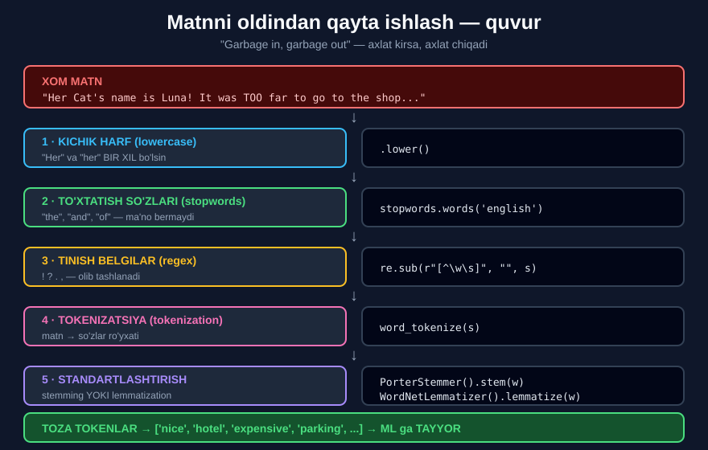
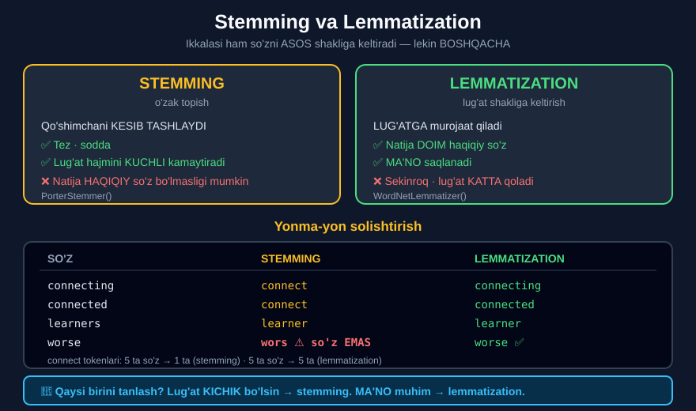
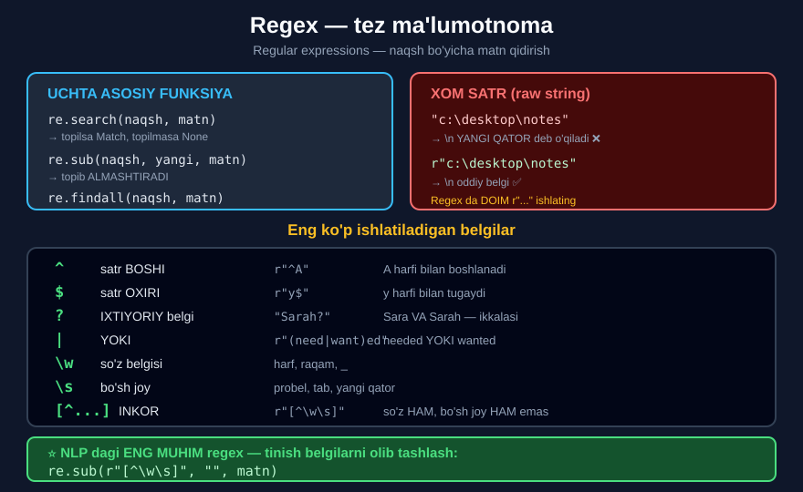

# 🧹 21-modul. Matnni oldindan qayta ishlash

> **Text Preprocessing** — NLP'ning eng muhim moduli.
> Bu yerda o'rganganingiz **butun kursning qolgan qismida** ishlatiladi.

---

## 🎯 Nima uchun bu modul MUHIM?

```
        ❌ IFLOS MATN                    ✅ TOZA MATN
   "The ROOMS were NOT clean!!!"    ['room','not','clean','2star']
    Only a 2* experience."
             │                                  │
             ▼                                  ▼
      ┌─────────────┐                    ┌─────────────┐
      │   MODEL     │                    │   MODEL     │
      └─────────────┘                    └─────────────┘
             │                                  │
             ▼                                  ▼
        😵 CHALKASHLIK                     🎯 ANIQ NATIJA
```

> ## 💡 **Ma'lumot olimlarining 80% vaqti — MA'LUMOTNI TOZALASHGA ketadi.** Model qurish — atigi 20%.



---

## 📚 Darslar

| # | Dars | Nima o'rganasiz |
|---|---|---|
| 1 | [Ma'lumotni tayyorlashning ahamiyati](01-The-Importance-of-Data-Preparation.md) | Nima uchun tozalash kerak |
| 2 | [Kichik harf](02-Lowercase.md) | `Hotel` va `hotel` — bir xil so'z |
| 3 | [To'xtatish so'zlarini olib tashlash](03-Removing-Stop-Words.md) | `the`, `is`, `a`... va ⚠️ `not` tuzog'i |
| 4 | [Regular expressions](04-Regular-Expressions.md) | Matn ichida naqsh qidirish |
| 5 | [Tokenizatsiya](05-Tokenization.md) | Matnni bo'laklarga ajratish |
| 6 | [Stemming](06-Stemming.md) | So'z **o'zagini** kesib olish |
| 7 | [Lemmatization](07-Lemmatization.md) | So'zning **lug'aviy shakli** |
| 8 | [N-grammalar](08-N-grams.md) | Yonma-yon so'zlar — `great location` |
| 9 | [🏆 Amaliy vazifa](09-Practical-Task.md) | **109 ta haqiqiy sharh** — to'liq quvur |

---

## 📝 Amaliyot

| | |
|---|---|
| 📝 [**48 ta mashq**](MASHQLAR.md) | 🟢 Oson · 🟡 O'rta · 🔴 Qiyin — barcha yechimlar tekshirilgan |
| 🚀 [**6 ta mini-loyiha**](LOYIHALAR.md) | Tozalash mashinasi · Tahlilchi · Taqqoslash · Qidiruv · Tarozi · Mavzu detektori |

---

## 🔧 O'rnatish

```bash
pip install nltk pandas
```

```python
import nltk
nltk.download('stopwords')
nltk.download('punkt_tab')
nltk.download('wordnet')
```

📁 **Ma'lumot:** [`data/tripadvisor_hotel_reviews.csv`](data/tripadvisor_hotel_reviews.csv) — 109 ta haqiqiy mehmonxona sharhi *(Sietl, AQSh)*.

---

## 🗺️ To'liq quvur — bir qarashda

```python
# 1 · KICHIK HARF
matn = matn.lower()

# 2 · TO'XTATISH SO'ZLARI          ⚠️ "not" ni SAQLANG!
en_stopwords = stopwords.words('english')
en_stopwords.remove("not")
matn = " ".join([w for w in matn.split() if w not in en_stopwords])

# 3a · YULDUZCHANI SAQLASH          4*  →  4star
matn = re.sub(r"\*", "star", matn)

# 3b · QOLGAN TINISH BELGILAR
matn = re.sub(r"[^\w\s]", "", matn)

# 4 · TOKENIZATSIYA
tokens = word_tokenize(matn)

# 5a · STEMMING  (tez, agressiv)
tokens = [PorterStemmer().stem(t) for t in tokens]

# 5b · LEMMATIZATION  (sekin, aniq)
tokens = [WordNetLemmatizer().lemmatize(t) for t in tokens]
```

---

## ⚔️ Stemming vs Lemmatization



| | **Stemming** | **Lemmatization** |
|---|---|---|
| **Qanday ishlaydi** | Oxirini **kesadi** | **Lug'atdan** qidiradi |
| **Tezlik** | ⚡ Juda tez | 🐢 Sekinroq |
| **Natija** | Haqiqiy so'z **bo'lmasligi** mumkin | **Doim** haqiqiy so'z |
| `studies` | `studi` ❌ | `study` ✅ |
| `feet` | `feet` ❌ | `foot` ✅ |
| `running` | `run` ✅ | `running` ❌ *(pos kerak)* |
| **Lug'atni kamaytirish** | **18%** | **6%** |
| **Qachon** | Qidiruv, katta hajm | Chatbot, tarjima, tahlil |

---

## 🔍 Regex shpargalkasi



---

## ⚠️ Bu modulning 5 ta TUZOG'I

| № | Tuzoq | Nima bo'ladi | Yechim |
|---|---|---|---|
| 1 | **`not` ni o'chirish** | `"not clean"` → `"clean"` — **ma'no teskari!** | `en_stopwords.remove("not")` |
| 2 | **Yulduzchani o'chirish** | `4*` → `4` — reyting **yo'qoladi** | `re.sub(r"\*","star",m)` |
| 3 | **`don't` → `nt`** | Ma'nosiz token, **81 marta!** | `"nt"` ni to'xtatish so'zlariga qo'shing |
| 4 | **Stemming yolg'on birlashtiradi** | `universe` va `university` → `univers` | Kerak bo'lsa lemmatization |
| 5 | **Ma'lumotga qaramaslik** | Tozalash **noto'g'ri** bo'ladi | **Har qadamda yangi ustun** yarating |

> ## 💡 **ENG MUHIM MASLAHAT (o'qituvchidan):** *"Har bir qadam uchun YANGI USTUN yarating — shunda yo'l davomida TEKSHIRA olasiz."*

---

## 🏆 109 ta sharhdan chiqqan natija

```
JAMI: 9407 token · 2589 noyob so'z

ENG KO'P SO'Z          ENG KO'P BIGRAMMA
hotel     292          great location   24   ⭐
room      275          space needle     21
great     126          hotel monaco     16
not       122  ⭐      staff friendly   12
stay       95          pike place       12
```

**Reyting bo'yicha mavzular:**

```
⭐         smoking room · called desk      →  😠 chekish hidi, resepshin
⭐⭐⭐      street parking · desk clerk      →  😐 parkovka
⭐⭐⭐⭐⭐   great location · hotel monaco    →  😀 joylashuv
```

> 🎯 **Bir soatlik ish emas — atigi bir necha qator kod.** Va mehmonxona egasi allaqachon biladi: **chekish xonalari** va **parkovka** — muammo, **joylashuv** — kuchli tomon.

---

## ✅ O'zingizni tekshiring

Bu modulni tugatgach, siz quyidagilarni **kodsiz** ayta olishingiz kerak:

- [ ] Nima uchun matn tozalanadi?
- [ ] To'xtatish so'zi nima va qaysi birini **SAQLASH** kerak?
- [ ] `.split()` va `word_tokenize()` farqi nimada?
- [ ] Stemming va lemmatization qachon ishlatiladi?
- [ ] N-gramma nima uchun kerak?
- [ ] Nima uchun har bir qadamga **yangi ustun**?

---

## ➡️ Keyingi qadam

**22-modul — Sentiment Analysis**: endi toza matnimiz bor, uni **his-tuyg'u** bo'yicha tahlil qilamiz. Sharh **ijobiymi** yoki **salbiymi** — buni model qanday aniqlaydi?

---

⬅️ [20-modul — NLP'ga kirish](../20-NLP-Introduction/README.md) · 🏠 [Bosh sahifa](../README.md)
