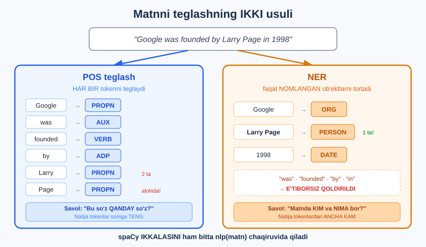

# 1-dars. Matnni teglash

## 🎬 Boshlashdan oldin

> **"Demak, biz ma'lumotimizni ODDIY O'RGANISHNI qildik. N-grammalar yordamida oldindan qayta ishlashdan so'ng, endi matnimizga TEGLAR qo'shib buni yanada KENGAYTIRISHIMIZ mumkin."**

21-modulda biz matnni **tozaladik**. Endi unga **ma'no qatlamini** qo'shamiz.

```
21-MODUL                            22-MODUL
"The ROOMS were NOT clean!"    →    ['room', 'not', 'clean']
        ↓ tozalash                          ↓ TEGLASH
['room', 'not', 'clean']            room  → OT
                                    not   → YUKLAMA
                                    clean → SIFAT
```

---

## 1. Ikki xil teglash

> **"Bugun ko'rib chiqadigan ikki xil teglash bor: NUTQ QISMLARI teglash va NOMLANGAN OB'EKTLARNI TANIB OLISH."**



---

## 2. Birinchi usul — POS teglash

> **"Birinchi sinab ko'radigan usulimiz — NUTQ QISMLARI (parts of speech) teglash."**
>
> **"Bu yerda biz har bir tokenimizni olib, unga tegishli nutq qismi bilan teglaymiz."**
>
> **"Va 'nutq qismlari' deganda men shunchaki o'sha token FE'LMI, OTMI, SIFATMI va hokazoni nazarda tutaman."**

```
"Emma yugurdi tez"
   │      │      │
   ▼      ▼      ▼
 PROPN   VERB   ADV
 (atoqli ot) (fe'l) (ravish)
```

### 🇺🇿 O'zbek tilida nutq qismlari

| Inglizcha teg | To'liq nomi | O'zbekcha | Misol |
|---|---|---|---|
| `NOUN` | *noun* | **Ot** | `xona`, `mehmonxona` |
| `PROPN` | *proper noun* | **Atoqli ot** | `Emma`, `Toshkent` |
| `VERB` | *verb* | **Fe'l** | `yugurdi`, `keldi` |
| `ADJ` | *adjective* | **Sifat** | `chiroyli`, `toza` |
| `ADV` | *adverb* | **Ravish** | `tez`, `juda` |
| `PRON` | *pronoun* | **Olmosh** | `u`, `men` |
| `NUM` | *numeral* | **Son** | `uch`, `1998` |
| `ADP` | *adposition* | **Ko'makchi** | `in`, `of`, `da` |
| `DET` | *determiner* | **Aniqlovchi** | `the`, `a`, `bu` |
| `CCONJ` | *coordinating conjunction* | **Teng bog'lovchi** | `and`, `va` |
| `AUX` | *auxiliary* | **Yordamchi fe'l** | `is`, `had` |
| `PART` | *particle* | **Yuklama** | `to`, `not` |
| `PUNCT` | *punctuation* | **Tinish belgisi** | `.`, `,`, `!` |

---

## 3. Ikkinchi usul — NER

> **"Ikkinchi usul — NOMLANGAN OB'EKTLARNI TANIB OLISH (named entity recognition)."**
>
> ## **"Demak, har bir tokendan o'tib teglash o'rniga, bu usul matnimiz ichida QIDIRADI va NOMLANGAN OB'EKTLARNI TORTIB OLADI."**
>
> **"Bu deganda ODAMLAR, JOYLAR, TASHKILOTLAR, SAN'AT ASARLARI — ko'pchilik osongina tanib oladigan har qanday nomlangan ob'ekt."**

```
"Google 1998-yilda Larry Page tomonidan Kaliforniyada asos solingan."

    ▼           ▼            ▼                ▼
 Google      1998      Larry Page      Kaliforniya
   ORG       DATE        PERSON            GPE
(tashkilot) (sana)      (odam)          (joy)
```

### 🔑 Asosiy farq

| | **POS teglash** | **NER** |
|---|---|---|
| **Nima qiladi** | **HAR BIR** tokenni teglaydi | Faqat **NOMLANGAN** ob'ektlarni **tortib oladi** |
| **Natija hajmi** | Tokenlar soniga **teng** | Tokenlardan **ancha kam** |
| **`"the"` bilan** | `DET` deb teglanadi | **E'tiborsiz qoldiriladi** |
| **`"Larry Page"` bilan** | 2 ta alohida `PROPN` | **1 ta** `PERSON` ⭐ |
| **Savol** | *"Bu so'z qanday so'z?"* | *"Matnda KIM va NIMA bor?"* |

> ## 💡 **NER bir necha so'zni BITTA ob'ekt qilib birlashtiradi.** `"Larry"` + `"Page"` → `"Larry Page"` = bitta PERSON.

---

## 4. Bu nimaga kerak?

> **"Matnimizni teglashning bu usullari matnimizni O'RGANISH va u yerda NIMA BORLIGINI TUSHUNISH uchun juda foydali bo'lishi mumkin."**
>
> **"Ular shuningdek MASHINALI O'QITISH algoritmlari uchun QO'SHIMCHA XUSUSIYATLAR yaratish uchun ishlatilishi mumkin."**
>
> **"Yoki ular o'z-o'zidan juda qiziqarli MUSTAQIL TAHLIL bo'lishi mumkin."**

### Uchta foydalanish yo'li

```
┌────────────────────────────────────────────────────┐
│  1 · MA'LUMOTNI O'RGANISH                          │
│     "Bu 1000 ta yangilikda KIM haqida yozilgan?"    │
│     → Putin 8, Queen 8, Liz Truss 6                │
├────────────────────────────────────────────────────┤
│  2 · MODEL UCHUN XUSUSIYAT (feature)               │
│     "Bu matnda nechta SIFAT bor?"                  │
│     → ko'p sifat = hissiyotli matn                 │
├────────────────────────────────────────────────────┤
│  3 · MUSTAQIL TAHLIL                               │
│     "Qaysi davlatlar eng ko'p tilga olinadi?"      │
│     → Ukraine 47, UK 36, England 32                │
└────────────────────────────────────────────────────┘
```

### 🎯 Haqiqiy hayotdagi misollar

| Vazifa | Qaysi usul | Nima uchun |
|---|---|---|
| **CV dan ism va kompaniyani olish** | NER | `PERSON`, `ORG` |
| **Chatbot:** *"Toshkentga chipta"* | NER | `GPE` = Toshkent |
| **Yangiliklarni avtomatik teglash** | NER | Kim, qayerda, qachon |
| **Grammatik tekshirgich** | POS | Fe'l va ot mosligini tekshirish |
| **Faqat otlarni ajratib olish** | POS | Mavzuni aniqlash |
| **Tarjima** | POS + NER | Ismlarni **tarjima qilmaslik** ⭐ |

> 💡 **Tarjimon misoli:** `"Larry Page"` ni `"Larri Sahifa"` deb tarjima qilmaslik uchun NER kerak!

---

## 5. Qaysi kutubxona?

21-modulda `nltk` ishlatdik. Bu modulda — **`spaCy`**.

| | **NLTK** | **spaCy** |
|---|---|---|
| **Falsafa** | O'qitish, tadqiqot | **Ishlab chiqarish** |
| **Tezlik** | Sekinroq | ⚡ **Juda tez** |
| **POS teglash** | Bor | ✅ **Yaxshiroq** |
| **NER** | Sodda | ✅ **Ancha kuchli** |
| **Model** | Alohida yuklanadi | Bitta model — **hammasi** |

```bash
pip install spacy
python -m spacy download en_core_web_sm
```

```python
import spacy
nlp = spacy.load("en_core_web_sm")

doc = nlp("Google was founded by Larry Page in 1998 in California.")

print([(t.text, t.pos_) for t in doc][:6])
print([(e.text, e.label_) for e in doc.ents])
```

```
[('Google', 'PROPN'), ('was', 'AUX'), ('founded', 'VERB'), ('by', 'ADP'), ('Larry', 'PROPN'), ('Page', 'PROPN')]
[('Google', 'ORG'), ('Larry Page', 'PERSON'), ('1998', 'DATE'), ('California', 'GPE')]
```

> ## 🔑 **BITTA `nlp()` chaqiruvi — POS ham, NER ham tayyor.** spaCy hammasini bir yo'la qiladi.

### `en_core_web_sm` nomi nimani anglatadi?

```
en_core_web_sm
│  │    │   │
│  │    │   └── small (kichik) — 12 MB, tez
│  │    └────── web — internet matnlarida o'qitilgan
│  └─────────── core — asosiy vazifalar (POS, NER, sintaksis)
└────────────── en — English (ingliz tili)
```

Kattaroq modellar ham bor: `en_core_web_md` *(o'rta)*, `en_core_web_lg` *(katta)* — **aniqroq**, lekin **sekinroq** va **kattaroq**.

---

## 6. ⚡ Mashqlar

### 🟢 Oson

**M1.** spaCy'ni o'rnating va modelni yuklang.

**M2.** Bitta jumladagi barcha tokenlarning POS teglarini chiqaring.

**M3.** Bitta jumladagi barcha nomlangan ob'ektlarni chiqaring.

<details>
<summary>✅ Yechimlar</summary>

```python
# M1
# bash: pip install spacy
# bash: python -m spacy download en_core_web_sm
import spacy
nlp = spacy.load("en_core_web_sm")
print("Model yuklandi ✅")

# M2
doc = nlp("Emma quickly read three interesting books.")
for t in doc:
    print(f"{t.text:12s} {t.pos_}")
# Emma         PROPN
# quickly      ADV
# read         VERB
# three        NUM
# interesting  ADJ
# books        NOUN
# .            PUNCT

# M3
doc = nlp("Apple bought a startup in Tashkent for 50 million dollars in 2024.")
for e in doc.ents:
    print(f"{e.text:20s} {e.label_}")
# Apple                ORG
# Tashkent             GPE
# 50 million dollars   MONEY
# 2024                 DATE
```

</details>

### 🟡 O'rta

**M4.** `spacy.explain()` bilan teg ma'nosini bilib oling.

**M5.** POS va NER natijalarini **bir jadvalda** ko'rsating.

<details>
<summary>✅ Yechimlar</summary>

```python
# M4
for teg in ["PROPN", "AUX", "ADP", "ORG", "GPE", "NORP"]:
    print(f"{teg:8s} {spacy.explain(teg)}")
# PROPN    proper noun
# AUX      auxiliary
# ADP      adposition
# ORG      Companies, agencies, institutions, etc.
# GPE      Countries, cities, states
# NORP     Nationalities or religious or political groups

# M5
doc = nlp("Google was founded by Larry Page in 1998 in California.")
print(f"{'TOKEN':12s} {'POS':8s} {'ENTITY':10s}")
print("-" * 32)
for t in doc:
    print(f"{t.text:12s} {t.pos_:8s} {t.ent_type_ or '—':10s}")
# TOKEN        POS      ENTITY
# --------------------------------
# Google       PROPN    ORG
# was          AUX      —
# founded      VERB     —
# by           ADP      —
# Larry        PROPN    PERSON
# Page         PROPN    PERSON
# in           ADP      —
# 1998         NUM      DATE
# in           ADP      —
# California   PROPN    GPE
# .            PUNCT    —
```

</details>

---

## 🧠 O'zini tekshirish savollari

1. Bu modulda o'rganiladigan ikkita teglash usuli qaysi?
2. POS teglash nima qiladi?
3. NER nima qiladi?
4. Ikkalasining asosiy farqi nimada?
5. Teglashning 3 ta foydalanish yo'lini ayting.
6. `"Larry Page"` — POS uchun nechta element, NER uchun nechta?

<details>
<summary>✅ Javoblar</summary>

1. **POS teglash** *(nutq qismlari)* va **NER** *(nomlangan ob'ektlarni tanib olish)*.
2. **Har bir tokenni** olib, unga tegishli **nutq qismini** *(ot, fe'l, sifat...)* qo'yadi.
3. Matn ichini **qidiradi** va **nomlangan ob'ektlarni** *(odamlar, joylar, tashkilotlar)* **tortib oladi**.
4. POS **hamma** tokenni teglaydi; NER faqat **nomlangan** ob'ektlarni **tortib oladi** va bir necha so'zni **birlashtiradi**.
5. ① Ma'lumotni **o'rganish** ② Model uchun **qo'shimcha xususiyat** ③ **Mustaqil tahlil**.
6. POS — **2 ta** token *(`Larry`=PROPN, `Page`=PROPN)*. NER — **1 ta** ob'ekt *(`Larry Page`=PERSON)*.

</details>

---

## 📌 Xulosa

```
                    TEGLASH
                       │
        ┌──────────────┴──────────────┐
        ▼                             ▼
  POS TEGLASH                       NER
  (2-dars)                       (3-dars)

 HAR BIR token             Faqat NOMLANGAN ob'ekt
       ↓                             ↓
  ot / fe'l / sifat          odam / joy / tashkilot

 "the" → DET               "the" → e'tiborsiz
 "Larry"+"Page"            "Larry Page"
  = 2 ta PROPN              = 1 ta PERSON ⭐


NIMAGA KERAK?
  1 · Ma'lumotni O'RGANISH
  2 · Model uchun XUSUSIYAT
  3 · MUSTAQIL tahlil


KUTUBXONA: spaCy
  pip install spacy
  python -m spacy download en_core_web_sm

  nlp = spacy.load("en_core_web_sm")
  doc = nlp(matn)

  doc[i].pos_      →  POS teg
  doc.ents         →  nomlangan ob'ektlar
```

> **"Keyingi ikkita darsimiz bu usullarning har birini olib, ularni Python'da qanday amalga oshirishimizni ko'rib chiqadi."**

---

## 🔖 Atamalar

| Atama | Inglizcha | Izoh |
|---|---|---|
| Teglash | *tagging* | Matn elementlariga yorliq qo'yish |
| Nutq qismlari | *parts of speech (POS)* | Ot, fe'l, sifat... |
| Nomlangan ob'ekt | *named entity* | Odam, joy, tashkilot nomi |
| Ob'ektni tanib olish | *named entity recognition (NER)* | Ob'ektlarni topish |
| Model | *model* | O'qitilgan til modeli |
| Xususiyat | *feature* | Model uchun kirish belgisi |

---

🏠 [Modul boshiga](README.md) · ➡️ [Keyingi: POS teglash](02-POS-Tagging.md)
