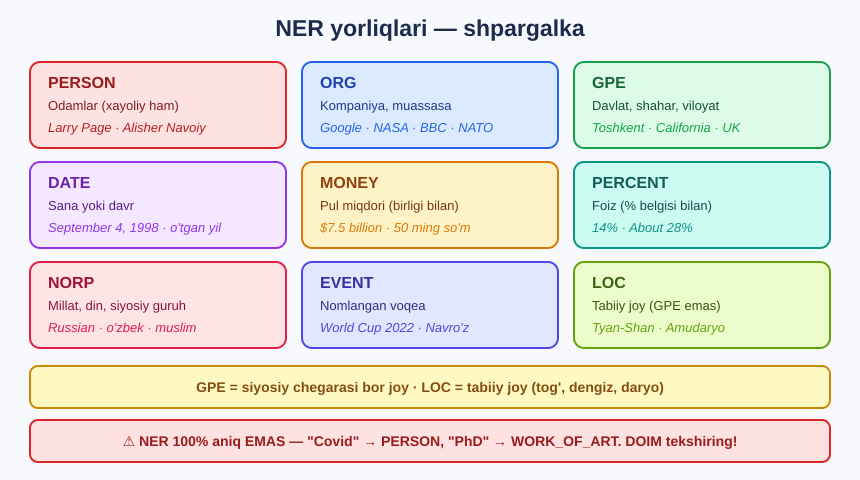
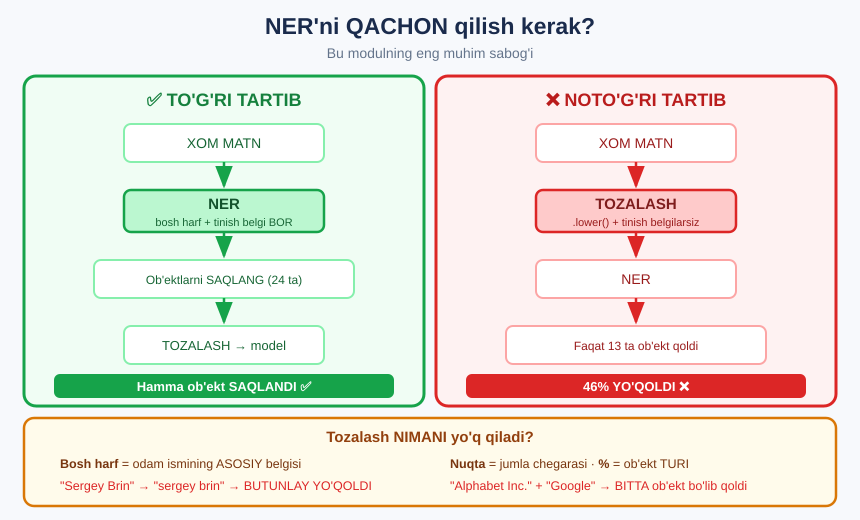

# 🏷️ 22-modul. POS teglash va NER

> **Parts of Speech tagging & Named Entity Recognition** — matnga **ma'no qatlamini** qo'shish.

21-modulda matnni **tozaladik**. Endi u haqida **savol berishni** o'rganamiz:
*"Bu so'z qanday so'z?"* va *"Matnda KIM va NIMA bor?"*

---

## 🎯 Bir qarashda


---

## 📚 Darslar

| # | Dars | Nima o'rganasiz |
|---|---|---|
| 1 | [Matnni teglash](01-Text-Tagging.md) | Ikki usul, nima uchun kerak, spaCy |
| 2 | [POS teglash](02-POS-Tagging.md) | Ot, fe'l, sifat — **"Emma"** romani ustida |
| 3 | [NER](03-Named-Entity-Recognition.md) ⭐ | Odam, joy, tashkilot — **va tozalash tuzog'i** |
| 4 | [🏆 Amaliy vazifa](04-Practical-Task.md) | **1000 ta BBC yangiligi** |

---

## 📝 Amaliyot

| | |
|---|---|
| 📝 [**42 ta mashq**](MASHQLAR.md) | 🟢 Oson · 🟡 O'rta · 🔴 Qiyin |
| 🚀 [**6 ta mini-loyiha**](LOYIHALAR.md) | Teglovchi · Kim/Qayer/Qachon · Janr detektori · Rezyume tahlili · Zarar o'lchagich · Qidiruv |

---

## 🔧 O'rnatish

```bash
pip install spacy pandas
python -m spacy download en_core_web_sm
```

```python
import spacy
nlp = spacy.load("en_core_web_sm")
doc = nlp("Google was founded by Larry Page in 1998 in California.")

print([(t.text, t.pos_) for t in doc][:6])
print([(e.text, e.label_) for e in doc.ents])
```

```
[('Google', 'PROPN'), ('was', 'AUX'), ('founded', 'VERB'), ('by', 'ADP'), ('Larry', 'PROPN'), ('Page', 'PROPN')]
[('Google', 'ORG'), ('Larry Page', 'PERSON'), ('1998', 'DATE'), ('California', 'GPE')]
```

> ## 🔑 **Bitta `nlp()` chaqiruvi** — POS ham, NER ham, lemma ham tayyor.

### 📁 Ma'lumotlar

| Fayl | Nima |
|---|---|
| [`data/emma.txt`](data/emma.txt) | Jeyn Ostin, **"Emma"** *(1815)* — POS uchun |
| [`data/google.txt`](data/google.txt) | Google Vikipediya parchasi — NER uchun |
| [`data/bbc_news.csv`](data/bbc_news.csv) | **1000 ta** BBC yangilik sarlavhasi |

---

## 🏷️ NER yorliqlari



---

## ⭐⭐ Bu modulning ENG MUHIM sabog'i



```
XOM matn        →  24 ta ob'ekt
TOZALANGAN      →  13 ta ob'ekt        46% YO'QOLDI
```

> ## 💡 **NER — BIRINCHI, tozalash — KEYIN.** Chunki NER aynan siz o'chirmoqchi bo'lgan narsalarga *(bosh harf, tinish belgi)* **tayanadi**.

**Aksincha, POS teglash uchun:**

> ## ⚠️ **To'xtatish so'zlarni OLDINDAN o'chirmang.** POS teglash **grammatikaga** tayanadi. Ularsiz `affectionate` → **VERB**, `governess` → **ADJ** kabi ma'nosiz teglar chiqadi.

---

## 📖 Asosiy sintaksis

```python
# ===== POS =====
token.text       # 'Google'   token matni
token.pos_       # 'PROPN'    umumiy teg (17 ta)
token.tag_       # 'NNP'      batafsil teg (50+ ta) — fe'l zamonini ham
token.lemma_     # 'Google'   lemma
token.is_stop    # False      to'xtatish so'zimi?
token.ent_type_  # 'ORG'      token darajasidagi NER

# ===== NER (⭐ YAXSHIROQ) =====
for e in doc.ents:
    e.text        # 'Larry Page'   TO'LIQ ob'ekt
    e.label_      # 'PERSON'
    e.start_char  # matndagi o'rni

# ===== VIZUAL =====
from spacy import displacy
displacy.render(doc, style="ent", jupyter=True)
```

### ⚠️ `token.ent_type_` vs `doc.ents`

| | `token.ent_type_` | `doc.ents` ⭐ |
|---|---|---|
| `"Larry Page"` | 2 ta alohida token | **1 ta** ob'ekt |
| `"World Cup 2022"` | 3 ta alohida | **1 ta** ob'ekt |
| `"'s"`, `"-"` | ❌ PERSON deb chiqadi | ✅ **chiqmaydi** |

> 💡 **Har doim `doc.ents` ishlating** — agar sizga token darajasi kerak bo'lmasa.

---

## 🏆 1000 ta BBC yangiligidan chiqqan natija

```
OTLAR:     war 34 · record 15 · win 15 · year 14 · police 14
FE'LLAR:   says 30 · found 13 · win 11 · dies 9
SIFATLAR:  new 28 · Russian 21 · final 16

DAVLATLAR: Ukraine 47 · UK 36 · England 32 · US 19 · France 12
ODAMLAR:   Queen 8 · Putin 8 · Liz Truss 6 · Boris Johnson 6 · Rishi Sunak 5

→ 🇺🇦 URUSH   💷 IQTISOD   ⚽ SPORT   👑 QIROLICHA
```

> 🎯 **Uchta bosh vazir bitta yilda** — 2022-yil Britaniya siyosatidagi notinchlik **NER natijasidan** ko'rinib turibdi.

**Yana bir topilma** — bir xil usul, ikki boshqa hikoya:

```
Ukraine (54 sarlavha) →  killed · lost   😔  URUSH
England (47 sarlavha) →  win · lead      ⚽  SPORT
```

---

## ⚠️ Bu modulning 5 ta TUZOG'I

| № | Tuzoq | Nima bo'ladi | Yechim |
|---|---|---|---|
| 1 | **NER'ni tozalashdan keyin qilish** | Ob'ektlarning **46%** yo'qoladi | NER'ni **birinchi** qiling |
| 2 | **POS uchun to'xtatish so'zlarni o'chirish** | Grammatika buziladi, teglar **ma'nosiz** | Ularni **qoldiring** |
| 3 | **`token.ent_type_` ishlatish** | `"Liz Truss"` **ikkiga** bo'linadi, `'s` PERSON bo'ladi | **`doc.ents`** ishlating |
| 4 | **Xom tokenlarda top-10 ga qarash** | Faqat `:` `'` `the` `of` — **axlat** | **Teg bo'yicha filtrlang** |
| 5 | **spaCy'ga ko'r-ko'rona ishonish** | `Covid` → PERSON, `PhD` → WORK_OF_ART | Natijani **ko'z bilan tekshiring** |

---

## ✅ O'zingizni tekshiring

- [ ] POS teglash va NER farqini tushuntira olasizmi?
- [ ] `pos_` va `tag_` farqi nimada?
- [ ] Nima uchun POS uchun to'xtatish so'zlar **kerak**?
- [ ] Nima uchun NER uchun tozalash **zararli**?
- [ ] `token.ent_type_` va `doc.ents` — qaysi biri, qachon?
- [ ] 8 ta NER yorliqni yoddan ayta olasizmi?

---

## ➡️ Keyingi qadam

**23-modul — Sentiment Analysis**: 2-darsda `"Emma"` matnidagi sifatlar **hammasi ijobiy** ekanini ko'rdik. Endi buni **avtomatik** o'lchashni o'rganamiz: matn **ijobiymi** yoki **salbiymi**?

---

⬅️ [21-modul — Matnni oldindan qayta ishlash](../21-Text-Preprocessing/README.md) · 🏠 [Bosh sahifa](../README.md)
