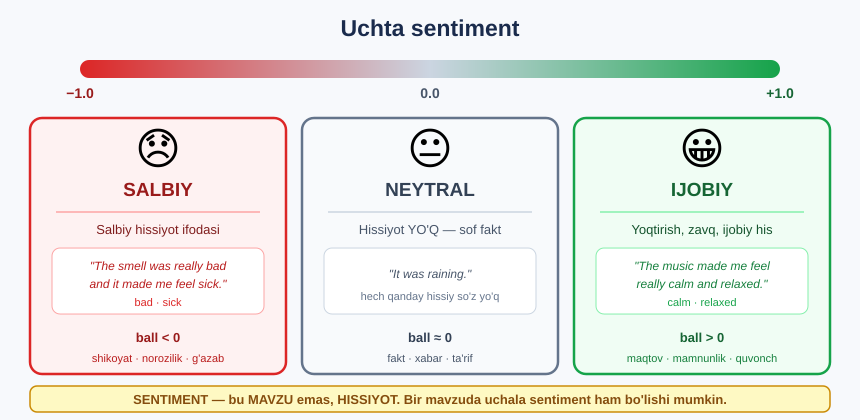
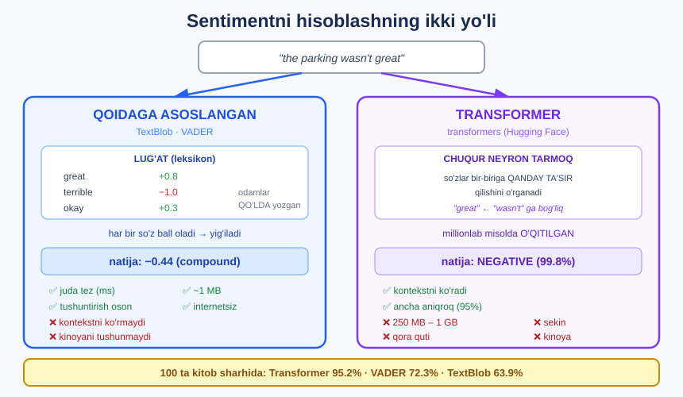

# 😀 23-modul. Sentiment tahlili

> **Sentiment Analysis** — matnning **hissiy ohangini** aniqlash: ijobiy, salbiy yoki neytral.

22-modulda matnda **KIM** va **NIMA** borligini bildik. Endi so'raymiz: **QANDAY his-tuyg'u** bilan yozilgan?

---

## 🎯 Uchta sentiment



---

## 📚 Darslar

| # | Dars | Nima o'rganasiz |
|---|---|---|
| 1 | [Sentiment tahlili nima?](01-What-is-Sentiment-Analysis.md) | Ta'riflar, cheklovlar |
| 2 | [Qoidaga asoslangan sentiment](02-Rule-Based-Sentiment.md) ⭐ | `TextBlob` va `VADER` |
| 3 | [Transformer modellari](03-Pre-trained-Transformer-Models.md) ⭐ | **Birinchi chuqur o'qitish modeli** |
| 4 | [🏆 Amaliy vazifa](04-Practical-Task.md) | **100 ta kitob sharhi** — aniqlikni o'lchaymiz |

---

## 📝 Amaliyot

| | |
|---|---|
| 📝 [**44 ta mashq**](MASHQLAR.md) | 🟢 Oson · 🟡 O'rta · 🔴 Qiyin |
| 🚀 [**6 ta mini-loyiha**](LOYIHALAR.md) | Tekshirgich · Panel · Inkor testi · Model tanlash · Fikr tizimi · Ansambl |

---

## ⚔️ Ikki yondashuv



---

## 🔧 O'rnatish

```bash
pip install textblob vaderSentiment
pip install transformers torch          # ⚠️ katta yuklab olish
```

```python
from textblob import TextBlob
from vaderSentiment.vaderSentiment import SentimentIntensityAnalyzer
from transformers import pipeline

matn = "The parking wasn't great."

print(TextBlob(matn).sentiment.polarity)                        # 0.8   ❌
print(SentimentIntensityAnalyzer().polarity_scores(matn))       # -0.51 ✅
print(pipeline("sentiment-analysis")(matn))                     # NEGATIVE ✅
```

📁 **Ma'lumot:** [`data/book_reviews_sample.csv`](data/book_reviews_sample.csv) — **100 ta** kitob sharhi **haqiqiy reytingi bilan** *(1–5 ⭐)*.

---

## 🏆 Natija — qaysi usul yutdi?

100 ta kitob sharhida, **haqiqiy reyting** bilan solishtirilgan:

```
NEYTRAL SHARHLARSIZ (faqat aniq ijobiy/salbiy)

Transformer  ███████████████████████████████████████  95.2%   🥇
VADER        ██████████████████████████████  72.3%            🥈
TextBlob     ██████████████████████████  63.9%                🥉
```

**Transformer × haqiqiy reyting:**

```
1 ⭐  →  26 NEGATIVE,  1 POSITIVE     ✅
2 ⭐  →   9 NEGATIVE,  1 POSITIVE     ✅
3 ⭐  →   9 NEGATIVE,  8 POSITIVE     ⚠️ teng bo'lindi
4 ⭐  →   2 NEGATIVE, 23 POSITIVE     ✅
5 ⭐  →   0 NEGATIVE, 21 POSITIVE     ✅ 100%!
```

> ## 💡 **3 ⭐ nima uchun teng bo'lindi?** Standart transformer modelida **NEYTRAL yorlig'i YO'Q**. U har bir sharh uchun **majburan** ijobiy yoki salbiyni tanlaydi — bu deyarli **tanga tashlash**.

---

## 📖 Asosiy sintaksis

```python
# ===== TEXTBLOB — 2 ta ball =====
from textblob import TextBlob
b = TextBlob(matn)
b.sentiment.polarity        # −1 … +1   (sentiment)
b.sentiment.subjectivity    #  0 … 1    (fakt ↔ fikr)

# ===== VADER — 4 ta ball =====
from vaderSentiment.vaderSentiment import SentimentIntensityAnalyzer
vader = SentimentIntensityAnalyzer()
vader.polarity_scores(matn)
# {'neg':.., 'neu':.., 'pos':.., 'compound':..}
#  └──── ulushlar, jami 1.0 ───┘   └─ UMUMIY, −1…+1

# ===== TRANSFORMER — yorliq + ishonch =====
from transformers import pipeline
p = pipeline("sentiment-analysis")
p(matn)                     # [{'label':'NEGATIVE', 'score':0.998}]
#                                        ↑ javob        ↑ ISHONCH

p = pipeline(model="cardiffnlp/twitter-roberta-base-sentiment-latest")  # neytralli
p = pipeline("sentiment-analysis", model="...", top_k=None)             # barcha ballar

# ===== BALLNI YORLIQQA =====
pd.cut(ballar, bins=[-1, -0.1, 0.1, 1],
       labels=["negative", "neutral", "positive"])
```

---

## ⚠️ Bu modulning 6 ta TUZOG'I

| № | Tuzoq | Nima bo'ladi | Yechim |
|---|---|---|---|
| 1 | **To'xtatish so'zlarni o'chirish** | `"not good"` → `"good"` — **teskari!** | Sentiment uchun ularni **qoldiring** |
| 2 | **Lemmatizatsiya / stemming** | `"terrible"` → `"terribl"` — **lug'atda yo'q** → 0 ball | **Qilmang** |
| 3 | **`score` ni qutblilik deb o'ylash** | `0.998` = *ishonch*, ijobiylik **emas** | `label` ni o'qing |
| 4 | **Neytral kutish** | Standart transformerda **neytral yo'q** | Boshqa **model** tanlang |
| 5 | **Uzun matn berish** | Transformer **xato** beradi *(512 token)* | `matn[:512]` |
| 6 | **Kinoyaga ishonish** | **Hech bir** usul kinoyani topmaydi | Muhim bo'lsa — **odam** tekshirsin |

---

## 🎯 Qaysi usulni tanlash?

```
Millionlab tvit, real vaqt, arzon    →   VADER       (1 MB, <1 ms)
Muhim qaror, aniqlik kerak           →   Transformer (95%)
Neytral ham kerak                    →   twitter-roberta modeli
Natijani tushuntirish kerak          →   VADER       (qaysi so'z qancha ball berdi)
Internet yo'q                        →   VADER / TextBlob
Eng yaxshisi                         →   IKKALASI: VADER filtrlaydi,
                                          shubhalilarni Transformer hal qiladi
```

---

## ✅ O'zingizni tekshiring

- [ ] Uchta sentiment turini ta'riflay olasizmi?
- [ ] Sentiment — mavzumi yoki hissiyot?
- [ ] TextBlob nechta, VADER nechta ball qaytaradi?
- [ ] `compound` nima?
- [ ] Transformer'dagi `score` nimani anglatadi?
- [ ] Nima uchun sentiment uchun to'xtatish so'zlar **kerak**?
- [ ] Standart transformerda nima uchun neytral yo'q?
- [ ] Kinoyani qaysi usul topa oladi? *(hech qaysi!)*

---

## ➡️ Keyingi qadam

**[24-modul — Matnni vektorlashtirish](../24-Vectorizing-Text/README.md)**: shu paytgacha biz **tayyor** modellardan foydalandik. Endi **o'z modelimizni** qurishga tayyorlanamiz — buning uchun matnni **raqamlarga** aylantirishni o'rganamiz.

---

⬅️ [22-modul — POS teglash va NER](../22-POS-and-NER/README.md) · 🏠 [Bosh sahifa](../README.md) · ➡️ [24-modul](../24-Vectorizing-Text/README.md)
