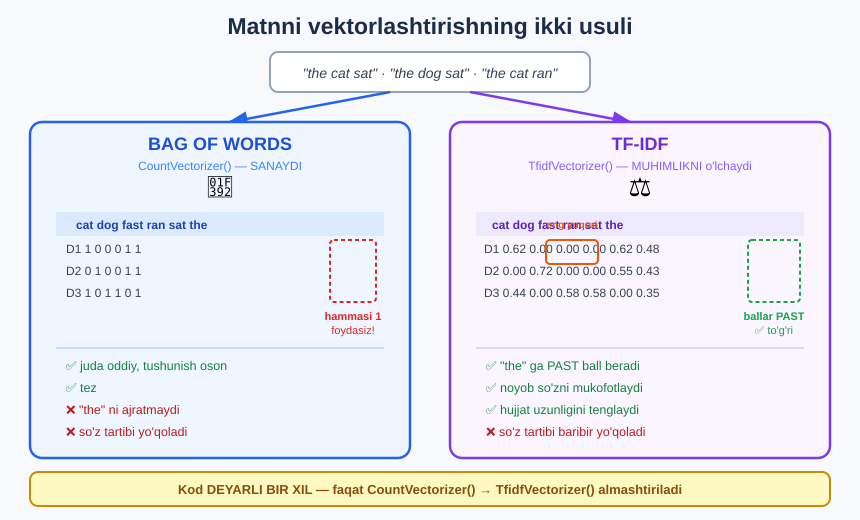

# 1-dars. Matnning raqamli tasviri

## 🎬 Boshlashdan oldin

> **"Umid qilamanki, sentiment tahlili yordamida NLP bilan shug'ullanish sizga yoqdi. Davom etishdan oldin biz matnimizni VEKTORLASHTIRISHNI ko'rib chiqishimiz kerak."**

---

## 1. Yo'qolgan uchinchi qadam

> **"Agar 2-bo'limga qaytib o'ylasangiz, biz matnni oldindan qayta ishlashni ko'rib chiqdik va u yerda MEN UNING UCHTA QADAMI borligini aytgandim."**
>
> ## **"UCHINCHI qadam — ma'lumotni MASHINALI O'QITISH UCHUN TO'G'RI FORMATGA keltirish edi. Mana shu yerda matnni vektorlashtirish paydo bo'ladi."**

```
┌──────────────────────────────────────────────────────┐
│  1 · MA'LUMOTNI YIG'ISH                              │
│      sharhlar, tvitlar, hujjatlar                    │
├──────────────────────────────────────────────────────┤
│  2 · TOZALASH             ← 21-MODUL ✅               │
│      kichik harf · to'xtatish so'zlar · tokenizatsiya │
│      stemming · lemmatizatsiya                        │
├──────────────────────────────────────────────────────┤
│  3 · VEKTORLASHTIRISH     ← BU MODUL ⭐               │
│      matn  →  RAQAMLAR                                │
└──────────────────────────────────────────────────────┘
                        ↓
                MASHINALI O'QITISH
```

---

## 2. Nima uchun bu kerak?

> ## **"Toza matnni algoritmga uzatishning O'ZI YETARLI EMAS. Biz buni mashinali o'qitish algoritmi TUSHUNA OLADIGAN RAQAMLI TASVIRGA aylantirishimiz kerak."**

```
        SIZ KO'RASIZ                    MASHINA KO'RADI

    "This movie is great"          ❌  ????????????

                                   ✅  [0, 1, 0, 1, 1, 0, 0, 1]
```

### 🔑 Kompyuter matnni TUSHUNMAYDI

```
Kompyuter faqat SONLAR bilan ishlaydi:
   qo'shish · ko'paytirish · taqqoslash

"great" so'zini ko'paytirib bo'ladimi?   ❌ YO'Q
0.847 ni ko'paytirib bo'ladimi?          ✅ HA
```

> ## 💡 **Har qanday mashinali o'qitish modeli — bu MATEMATIK funksiya.** Unga matn emas, **raqamlar** kerak.

### 🎯 Vektor nima?

```
VEKTOR = raqamlar RO'YXATI

"This movie is great"   →   [0, 1, 0, 1, 1, 0, 0, 1]
                             ↑
                        Bu — 8 o'lchovli vektor
```

Har bir **hujjat** *(jumla, sharh, maqola)* bitta **vektorga** aylanadi. Barcha vektorlar birgalikda — **jadval** *(matritsa)*.

```
              so'z1  so'z2  so'z3  so'z4  ...
hujjat 0  →  [  1  ,  0  ,  1  ,  0  , ...]
hujjat 1  →  [  0  ,  1  ,  1  ,  0  , ...]
hujjat 2  →  [  1  ,  1  ,  0  ,  1  , ...]
                ↑
        Endi bu — MATEMATIKA. Model buni tushunadi.
```

---

## 3. Ikki usul

> **"Buni qilishning bir necha xil yo'li bor, va biz eng keng tarqalgan IKKITASINI ko'rib chiqamiz: SO'ZLAR XALTASI (bag of words) modeli va TERM FREQUENCY–INVERSE DOCUMENT FREQUENCY — ko'pincha shunchaki TF-IDF deb qisqartiriladi."**



---

## 4. So'zlar xaltasi (Bag of Words)

> ## **"So'zlar xaltasi modeli — bu haqiqatan ODDIY usul. U shunchaki qaysi so'zlarimiz qaysi hujjatlarimizda paydo bo'lishini SANAYDI."**
>
> **"Bu oddiy va tushunish oson — lekin siz ANCHA KO'P KONTEKSTNI YO'QOTASIZ."**

```
"the cat sat on the mat"
            ↓
   ┌─────────────────┐
   │   🎒 XALTA      │
   │  the  cat  sat  │     ← so'zlar ARALASHIB ketdi
   │   on  the  mat  │        TARTIB YO'Q!
   └─────────────────┘
            ↓
   the:2  cat:1  sat:1  on:1  mat:1
```

### ⚠️ Nima yo'qoladi?

> **"U so'zlarning TARTIBINI hisobga olmaydi."**

```
"Sobir Aliyni urdi"      →  {Sobir:1, Aliyni:1, urdi:1}
"Ali Sobirni urdi"       →  {Ali:1, Sobirni:1, urdi:1}
                                    ↑
      Deyarli BIR XIL xalta — lekin ma'no BUTUNLAY TESKARI!
```

```
"yaxshi emas"    →  {yaxshi:1, emas:1}
"emas yaxshi"    →  {yaxshi:1, emas:1}
                          ↑
              AYNAN BIR XIL. Model farqni ko'rmaydi.
```

> ## 🔑 **"Bag of words" nomi shundan:** so'zlarni **xaltaga** solib **silkitasiz** — tartib **yo'qoladi**, faqat **nima borligi** qoladi.

---

## 5. TF-IDF

> **"TF-IDF biroz KO'PROQ kontekstni ushlab qoladi."**
>
> ## **"U o'sha so'zning AYNAN SHU HUJJAT uchun MUHIMLIGINI hisoblaydi va o'sha so'z ma'lumotimizdagi BOSHQA hujjatlarda ham qanday paydo bo'lishini HISOBGA OLADI."**

### 🔑 Asosiy g'oya

```
Savol:  "Bu so'z bu hujjat uchun QANCHALIK MUHIM?"

Javob:  ① Bu hujjatda TEZ-TEZ uchraydimi?      → muhim  ⬆
        ② BOSHQA hujjatlarda ham bormi?        → muhim EMAS  ⬇
```

### Misol bilan

```
6 ta mehmonxona sharhi:

"the"     →  HAMMA sharhda bor      →  MUHIM EMAS      ball ⬇
"parking" →  faqat 2 ta sharhda     →  MUHIM           ball ⬆
"cockroach" → faqat 1 ta sharhda    →  JUDA MUHIM! 🪳   ball ⬆⬆
```

> ## 💡 **Mana g'oyaning butun mohiyati:** *hamma joyda uchraydigan so'z* — **hech narsa aytmaydi**. *Faqat bitta joyda uchraydigan so'z* — **ana shu hujjatni AJRATIB turadi**.

---

## 6. Ikkalasini solishtiramiz

| | **Bag of Words** | **TF-IDF** |
|---|---|---|
| **Nima qiladi** | So'zlarni **sanaydi** | So'zning **muhimligini** o'lchaydi |
| **Qiymatlar** | Butun sonlar *(0, 1, 2, 3...)* | Kasr sonlar *(0.0 – 1.0)* |
| **`"the"` uchun** | **Katta** son *(ko'p uchraydi)* | **Kichik** ball *(muhim emas)* ⭐ |
| **Boshqa hujjatlar** | ❌ Hisobga olinmaydi | ✅ **Hisobga olinadi** |
| **Tushunish** | ✅ **Juda oson** | ⚠️ Biroz murakkab |
| **Tezlik** | ⚡ Tez | ⚡ Tez |
| **So'z tartibi** | ❌ Yo'qoladi | ❌ **Yo'qoladi** |
| **Qachon** | Tez prototip, o'rganish | **Deyarli har doim yaxshiroq** ⭐ |

> ⚠️ **Ikkalasi ham so'z tartibini yo'qotadi.** Tartibni saqlash uchun **word embeddings** va **transformerlar** kerak — bular kursda keyinroq.

---

## 7. Sonlar bilan ko'ramiz

Uchta qisqa hujjat:

```
D1: "the cat sat"
D2: "the dog sat"
D3: "the cat ran fast"
```

### Bag of Words

| | `cat` | `dog` | `fast` | `ran` | `sat` | `the` |
|---|---|---|---|---|---|---|
| **D1** | 1 | 0 | 0 | 0 | 1 | **1** |
| **D2** | 0 | 1 | 0 | 0 | 1 | **1** |
| **D3** | 1 | 0 | 1 | 1 | 0 | **1** |

`the` — hamma joyda **1**. Hech qanday ma'lumot **bermaydi**, lekin **joy egallaydi**.

### TF-IDF

| | `cat` | `dog` | `fast` | `ran` | `sat` | `the` |
|---|---|---|---|---|---|---|
| **D1** | 0.62 | 0 | 0 | 0 | 0.62 | **0.48** |
| **D2** | 0 | **0.72** | 0 | 0 | 0.55 | **0.43** |
| **D3** | 0.44 | 0 | 0.58 | 0.58 | 0 | **0.35** |

### 🔑 Uchta kuzatuv

**① `the` ballari eng past** — 0.35, 0.43, 0.48. Chunki u **hamma** hujjatda bor, ya'ni **hech narsani ajratmaydi**.

**② `dog` — 0.72, eng yuqori.** Chunki u **faqat D2** da bor. Aynan u D2 ni boshqalardan **ajratib turadi**.

**③ D3 da `the` ballari eng past (0.35)** — chunki D3 **eng uzun** hujjat *(4 ta so'z)*. Uzun hujjatda har bir so'zning ulushi **kichrayadi**.

> ## 💡 **TF-IDF NOYOBLIKNI mukofotlaydi.** `dog` (0.72) > `cat` (0.44–0.62) > `the` (0.35–0.48).

---

## 8. ⚡ Mashqlar

### 🟢 Oson

**M1.** Nima uchun matnni raqamga aylantirish kerak?

**M2.** Bag of Words nimani yo'qotadi?

**M3.** TF-IDF nimani qo'shimcha hisobga oladi?

<details>
<summary>✅ Javoblar</summary>

**M1.** Chunki mashinali o'qitish algoritmlari — **matematik funksiyalar**. Ular faqat **raqamlar** bilan ishlaydi. `"great"` so'zini ko'paytirib bo'lmaydi, `0.847` ni esa — **bo'ladi**.

**M2.** ## **SO'Z TARTIBINI** *(va shu bilan birga kontekstni)*.

```
"yaxshi emas"  va  "emas yaxshi"  →  AYNAN BIR XIL xalta
```

**M3.** So'z **boshqa hujjatlarda** qanchalik uchrashini. Hamma joyda bo'lsa — **ball past**, kam joyda bo'lsa — **ball yuqori**.

</details>

### 🟡 O'rta

**M4.** Quyidagi ikki jumlaning **xaltasi** bir xilmi?

```
A: "Ali Vali dan yaxshi ishlaydi"
B: "Vali Ali dan yaxshi ishlaydi"
```

**M5.** Qaysi so'z TF-IDF'da **yuqori** ball oladi?

<details>
<summary>✅ Javoblar</summary>

**M4.** ## **HA, AYNAN BIR XIL!**

```
A:  {Ali:1, Vali:1, dan:1, yaxshi:1, ishlaydi:1}
B:  {Vali:1, Ali:1, dan:1, yaxshi:1, ishlaydi:1}
```

Lekin **ma'no butunlay teskari** — A da Ali yaxshiroq, B da Vali. **Bag of Words bu farqni KO'RMAYDI.**

**M5.**

```
100 ta mehmonxona sharhi:

"hotel"      →  100 tasida bor   →  ball JUDA PAST   (hech narsa aytmaydi)
"clean"      →   40 tasida bor   →  ball O'RTA
"cockroach"  →    2 tasida bor   →  ball JUDA YUQORI 🪳  ⭐
```

**Kam uchraydigan** so'z — **yuqori** ball. Chunki aynan u **hujjatni ajratib** turadi.

</details>

---

## 🧠 O'zini tekshirish savollari

1. Oldindan qayta ishlashning **uchinchi** qadami nima?
2. Nima uchun toza matnning o'zi yetarli emas?
3. Vektor nima?
4. Bag of Words qanday ishlaydi?
5. TF-IDF nimasi bilan farq qiladi?
6. Ikkala usul ham nimani yo'qotadi?

<details>
<summary>✅ Javoblar</summary>

1. Ma'lumotni **mashinali o'qitish uchun to'g'ri formatga** keltirish — ya'ni **vektorlashtirish**.
2. Chunki algoritm **matnni tushunmaydi** — unga **raqamli tasvir** kerak.
3. **Raqamlar ro'yxati.** Har bir hujjat bitta vektorga aylanadi.
4. Qaysi so'z qaysi hujjatda uchrashini **sanaydi**.
5. So'zning **muhimligini** hisoblaydi va **boshqa hujjatlarni** ham hisobga oladi.
6. ## **SO'Z TARTIBINI.** Ikkalasi ham kontekstning bu qismini yo'qotadi.

</details>

---

## 📌 Xulosa

```
OLDINDAN QAYTA ISHLASHNING 3 QADAMI

 1 · Ma'lumot yig'ish
 2 · Tozalash              ← 21-modul
 3 · VEKTORLASHTIRISH      ← BU MODUL ⭐
         ↓
   MASHINALI O'QITISH


NIMA UCHUN?
  Model = MATEMATIK funksiya
  Unga MATN emas, RAQAM kerak

  "This movie is great"  →  [0, 1, 0, 1, 1, 0, 0, 1]


IKKI USUL

┌────────────────────┬─────────────────────┐
│  BAG OF WORDS      │      TF-IDF         │
│    (2-dars)        │      (3-dars)       │
├────────────────────┼─────────────────────┤
│ so'zlarni SANAYDI  │ MUHIMLIKNI o'lchaydi│
│ 0, 1, 2, 3...      │ 0.0 – 1.0           │
│ "the" = katta son  │ "the" = past ball ⭐ │
│ boshqa hujjatlar ❌ │ boshqa hujjatlar ✅  │
│ juda oddiy         │ ko'proq kontekst    │
└────────────────────┴─────────────────────┘


⚠️ IKKALASI HAM SO'Z TARTIBINI YO'QOTADI
   "yaxshi emas"  =  "emas yaxshi"   ❌

   Tartibni saqlash uchun → word embeddings,
   transformerlar (kursda keyinroq)
```

---

## 🔖 Atamalar

| Atama | Inglizcha | Izoh |
|---|---|---|
| Vektorlashtirish | *vectorization* | Matnni raqamga aylantirish |
| Vektor | *vector* | Raqamlar ro'yxati |
| Hujjat | *document* | Bitta matn birligi *(jumla, sharh)* |
| Korpus | *corpus* | Barcha hujjatlar to'plami |
| So'zlar xaltasi | *bag of words* | Sanashga asoslangan usul |
| Term chastotasi | *term frequency (TF)* | So'z hujjatda necha marta |
| Teskari hujjat chastotasi | *inverse document frequency (IDF)* | So'z nechta hujjatda |
| Lug'at | *vocabulary* | Barcha noyob so'zlar |

---

🏠 [Modul boshiga](README.md) · ➡️ [Keyingi: Bag of Words](02-Bag-of-Words.md)
