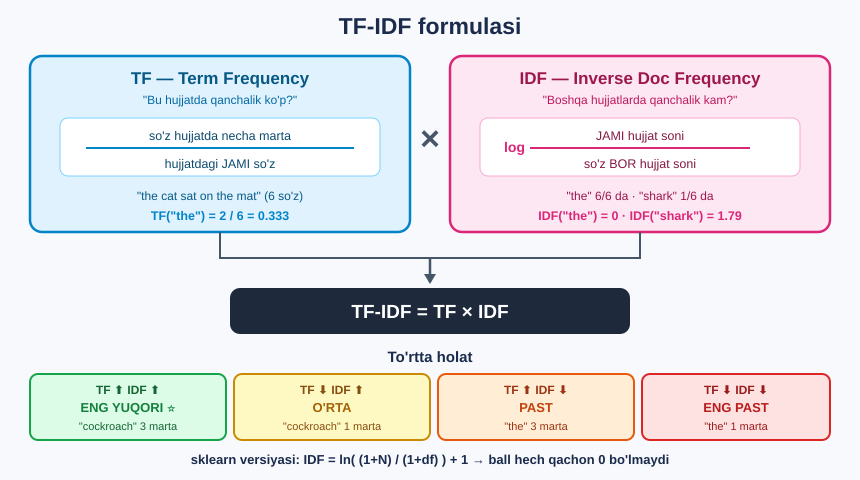

# 🔢 24-modul. Matnni vektorlashtirish

> **Vectorizing Text** — matnni **raqamlarga** aylantirish.
> Bu — mashinali o'qitishga o'tishdan oldingi **oxirgi ko'prik**.

Shu paytgacha biz **tayyor** modellardan foydalandik. Endi **o'z modelimizni** qurishga tayyorlanamiz — buning uchun matn **raqam** bo'lishi kerak.

---

## 🎯 Yo'qolgan uchinchi qadam

```
1 · Ma'lumot yig'ish
2 · TOZALASH               ← 21-modul ✅
3 · VEKTORLASHTIRISH       ← BU MODUL ⭐
        ↓
  MASHINALI O'QITISH       ← 26-modul
```

> ## 💡 **Model — bu MATEMATIK funksiya.** Unga `"great"` so'zini berib bo'lmaydi. `0.847` ni — bo'ladi.


---

## 📚 Darslar

| # | Dars | Nima o'rganasiz |
|---|---|---|
| 1 | [Matnning raqamli tasviri](01-Numerical-Representation-of-Text.md) | Nima uchun kerak, ikki usul |
| 2 | [Bag of Words](02-Bag-of-Words.md) ⭐ | `CountVectorizer` — sanash |
| 3 | [TF-IDF](03-TF-IDF.md) ⭐ | `TfidfVectorizer` — muhimlikni o'lchash |

---

## 📝 Amaliyot

| | |
|---|---|
| 📝 [**40 ta mashq**](MASHQLAR.md) | 🟢 Oson · 🟡 O'rta · 🔴 Qiyin |
| 🚀 [**6 ta mini-loyiha**](LOYIHALAR.md) | Tekshirgich · Qidiruv tizimi · Kalit so'zlar · Sentiment so'zlari · Takroriylar · Parametrlar |

---

## 🔧 O'rnatish

```bash
pip install scikit-learn pandas numpy
```

```python
import pandas as pd
from sklearn.feature_extraction.text import CountVectorizer, TfidfVectorizer

# ===== BAG OF WORDS =====
count_vec = CountVectorizer()
count_vec_fit = count_vec.fit_transform(data)
bag_of_words = pd.DataFrame(count_vec_fit.toarray(),
                            columns=count_vec.get_feature_names_out())

# ===== TF-IDF  (faqat NOM o'zgardi!) =====
tfidf_vec = TfidfVectorizer()
tfidf_vec_fit = tfidf_vec.fit_transform(data)
tfidf = pd.DataFrame(tfidf_vec_fit.toarray(),
                     columns=tfidf_vec.get_feature_names_out())
```

### 📁 Ma'lumotlar

| Fayl | Nima |
|---|---|
| [`data/sentences.txt`](data/sentences.txt) | 6 ta tasodifiy jumla *(darslar uchun)* |
| [`data/book_reviews_sample.csv`](data/book_reviews_sample.csv) | 100 ta kitob sharhi *(loyihalar uchun)* |

---

## 📐 TF-IDF formulasi



**sklearn versiyasi** *(silliqlangan)*:

```
IDF = ln( (1 + N) / (1 + df) ) + 1
```

**Tekshirilgan:**

```
"the"   6/6 hujjatda  →  ln(7/7)+1 = 1.0000   ✅
"he"    3/6 hujjatda  →  ln(7/4)+1 = 1.5596   ✅
"worms" 1/6 hujjatda  →  ln(7/2)+1 = 2.2528   ✅
```

> ## 🎯 **Formula ISHLAYDI** — bu modulda siz TF-IDF'ni **qo'lda** ham hisoblay olasiz.

---

## 🏆 Nima o'rganasiz — natijalarda

### `the` ustuni: BOW vs TF-IDF

| Hujjat | **BOW** | **TF-IDF** | Uzunlik |
|---|---|---|---|
| 0 | 2 | 0.2282 | 17 |
| 1 | **3** | **0.3910** | 14 |
| 2 | 1 | 0.1582 | 9 |
| 5 | **3** | 0.2901 | **22** |

> 💡 **1 va 5-hujjatda `the` bir xil (3 marta), lekin TF-IDF ballari boshqa** — chunki 5-hujjat **uzunroq**, ya'ni `the` **suyultirilgan**.

### Kosinus o'xshashligi — SOXTA o'xshashlik yo'qoladi

```
              BOW      TF-IDF
1 ↔ 5        0.45   →   0.19
0 ↔ 3        0.32   →   0.15
```

> ## 🔑 BOW jumlalarni "o'xshash" deb ko'rsatgan edi — lekin bu faqat `the`, `as`, `in` tufayli edi. **TF-IDF haqiqiy manzarani ochdi.**

---

## ⚠️ Bu modulning 6 ta TUZOG'I

| № | Tuzoq | Haqiqat |
|---|---|---|
| 1 | *"BOW faqat 0 va 1 beradi"* | ## ❌ **YO'Q!** `CountVectorizer` **SANAYDI** — bizda maksimum **3**. Faqat 0/1 kerak bo'lsa: `binary=True` |
| 2 | Sinov ma'lumotida `fit_transform` | ❌ **Faqat `transform`!** Aks holda ustunlar mos kelmaydi |
| 3 | *"TF-IDF to'xtatish so'zlarini hal qiladi"* | ⚠️ **Qisman.** Bizda `the` va `of` **hali ham** 2 ta hujjatda g'olib. `stop_words='english'` **baribir kerak** |
| 4 | Katta ma'lumotda `.toarray()` | ❌ Xotira **portlaydi**. Siyrak matritsani **saqlang** |
| 5 | Yangi so'zlar tanilishini kutish | ❌ **OOV muammosi** — `transform()` faqat `fit` da ko'rilgan so'zlarni biladi |
| 6 | So'z tartibi saqlanishini kutish | ❌ **Ikkala usul ham** tartibni yo'qotadi. `ngram_range=(1,2)` — **qisman** yechim |

---

## ⚙️ Foydali parametrlar

```python
TfidfVectorizer(
    stop_words='english',   # to'xtatish so'zlarni o'chiradi     ⭐
    min_df=2,               # kamida 2 ta hujjatda bo'lsin       ⭐
    max_features=5000,      # eng ko'p uchraydigan N ta so'z
    ngram_range=(1, 2),     # 1 va 2 so'zli birikmalar
    max_df=0.9,             # 90% dan ko'p hujjatda bo'lmasin
)
```

**100 ta kitob sharhida o'lchandi:**

```
hech qanday sozlama       504 ustun   97.1% nol
stop_words='english'      377 ustun   98.1% nol
+ min_df=2                 97 ustun   95.5% nol      ⭐ 74% o'chdi!
+ ngram_range=(1,2)       983 ustun   98.6% nol
```

> ## 💡 **Boshlang'ich retsept:** `stop_words='english'` + `min_df=2` + `max_features=5000`

---

## ✅ O'zingizni tekshiring

- [ ] Nima uchun matnni vektorlashtirish kerak?
- [ ] BOW va TF-IDF farqi nimada?
- [ ] `CountVectorizer` faqat 0/1 beradimi?
- [ ] `fit` va `transform` farqi?
- [ ] IDF formulasini yoza olasizmi?
- [ ] `the` ning IDF'i nima uchun **1.0**?
- [ ] Siyraklik nima?
- [ ] OOV muammosi nima?

---

## ➡️ Keyingi qadam

**25-modul — Mavzu modellashtirish**: endi matnimiz **raqamlarda**. Bu bilan nima qilamiz? Birinchi qadam — **hujjatlar ichidagi yashirin mavzularni** avtomatik topish, hech kim ularni oldindan aytmasdan.

---

⬅️ [23-modul — Sentiment tahlili](../23-Sentiment-Analysis/README.md) · 🏠 [Bosh sahifa](../README.md)
