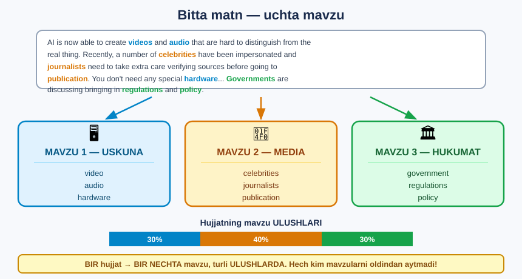
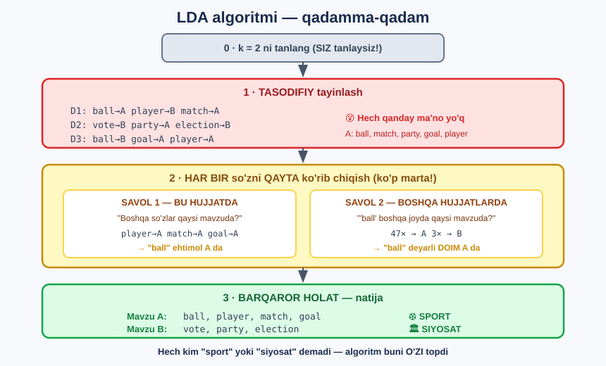
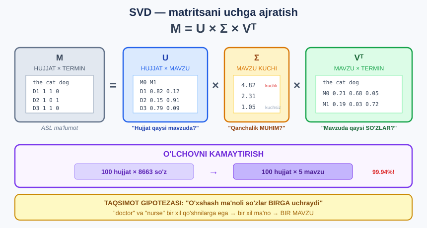

# 🧩 25-modul. Mavzu modellashtirish

> **Topic Modelling** — hujjatlardagi **yashirin mavzularni** avtomatik topish.
> **Yorliqlar KERAK EMAS** — bu **nazoratsiz** o'qitish.

24-modulda matnni **raqamga** aylantirdik. Endi u bilan **birinchi haqiqiy ishni** qilamiz.

---

## 🎯 Bir qarashda



---

## 📚 Darslar

| # | Dars | Nima o'rganasiz |
|---|---|---|
| 1 | [Mavzu modellashtirish nima?](01-What-is-Topic-Modelling.md) | Asosiy g'oya, nazoratsiz o'qitish |
| 2 | [Qachon ishlatiladi](02-When-to-Use-Topic-Modelling.md) | Amaliy holatlar va **cheklovlar** |
| 3 | [LDA nazariyasi](03-Latent-Dirichlet-Allocation.md) ⭐ | Algoritm qadamma-qadam |
| 4 | [LDA Python'da](04-LDA-in-Python.md) ⭐ | **100 ta yangilik maqolasi** |
| 5 | [LSA nazariyasi](05-Latent-Semantic-Analysis.md) | SVD va taqsimot gipotezasi |
| 6 | [LSA Python'da](06-LSA-in-Python.md) | `TruncatedSVD` |
| 7 | [Nechta mavzu?](07-How-Many-Topics.md) ⭐ | Koherentlik ballari |

---

## 📝 Amaliyot

| | |
|---|---|
| 📝 [**42 ta mashq**](MASHQLAR.md) | 🟢 Oson · 🟡 O'rta · 🔴 Qiyin |
| 🚀 [**6 ta mini-loyiha**](LOYIHALAR.md) | Mavzu topuvchi · Nom berish · Optimal k · Semantik qidiruv · O'xshash maqolalar · LDA vs LSA |

---

## ⚠️ Paket haqida MUHIM eslatma

Kurs **`gensim`** dan foydalanadi. Lekin `gensim` **C++ kompilyatsiyasini** talab qiladi va **Python 3.13+** da tayyor wheel yo'q.

| | **gensim** *(kurs)* | **scikit-learn** *(bu darslik)* |
|---|---|---|
| LDA | `LdaModel` | `LatentDirichletAllocation` |
| LSA | `LsiModel` | `TruncatedSVD` |
| Koherentlik | `CoherenceModel` | qo'lda yozamiz *(UMass)* |
| Python 3.14 | ❌ | ✅ |

> ## 💡 **Bu darslikda IKKALASI ham berilgan.** `gensim` kodi — kursni kuzatish uchun. `sklearn` kodi — **ishga tushirilgan va tekshirilgan** *(barcha raqamlar undan)*.

```bash
pip install scikit-learn pandas numpy nltk matplotlib
```

📁 **Ma'lumot:** [`data/news_articles.csv`](data/news_articles.csv) — **100 ta** haqiqiy yangilik maqolasi *(o'rtacha **1112 so'z**)*.

---

## 🔬 Ikkita algoritm





---

## ⭐⭐ Bu modulning ASOSIY SABOG'I

Kurs **k=2** bilan boshlaydi va natija **foydasiz** chiqadi:

```
❌ M0: mr · said · trump · would · one · year
❌ M1: said · mr · state · polic · offic · one
        ↑ ikkalasi deyarli BIR XIL, hech narsa aytmaydi
```

**Ikki qatorlik o'zgarish** — va hammasi o'zgaradi:

```python
CountVectorizer(max_df=0.5, min_df=5)      # 8663 → 1853 ustun
LatentDirichletAllocation(n_components=5)   # 2 → 5 mavzu
```

```
✅ M0: show · play · song · book · stori      🎭 madaniyat   (28 hujjat)
✅ M1: rate · compani · account · percent     💰 biznes      (13 hujjat)
✅ M2: trump · republican · parti · obama     🏛️ siyosat     (24 hujjat)
✅ M3: polic · offic · fire · man             🚔 jinoyat     (15 hujjat)
✅ M4: govern · dr · research · world         🌍 hukumat/ilm (20 hujjat)
```

> ## 🔑 **Nima uchun `mr` va `said` muammo?** Ular NLTK to'xtatish so'zlari ro'yxatida **yo'q** — lekin **yangilik maqolalari** uchun ular **aynan shunday**. `mr` **1200 marta**, `said` **1038 marta** uchraydi.
>
> **`max_df=0.5`** = *"50% dan ko'p hujjatda uchrasa — tashla"*. Bu **korpusga xos** to'xtatish so'zlarini **avtomatik** topadi.

---

## 🎯 Semantik qidiruv — LSA'ning super kuchi

```python
semantik_qidir("car company")
```

```
0.9598  Tesla Model S Suspension Failures Under Scrutiny by Safety...
0.9161  Tesla Hits a New Milestone, Passing G.M. in Valuation...
```

> ## 💡 **Maqolada `"car"` so'zi YO'Q!** Lekin `Tesla`, `vehicl`, `model` bir **mavzuda** — shuning uchun topildi. Bu — **24-moduldagi OOV muammosining** yechimi.

---

## 📖 Asosiy sintaksis

```python
# ===== LDA (Bag of Words) =====
from sklearn.decomposition import LatentDirichletAllocation
X = CountVectorizer(max_df=0.5, min_df=5).fit_transform(matn)
lda = LatentDirichletAllocation(n_components=5, random_state=42,
                                max_iter=20).fit(X)
lda.components_        # mavzu → so'z vaznlari
lda.transform(X)       # hujjat → mavzu ehtimollari

# ===== LSA (TF-IDF) =====
from sklearn.decomposition import TruncatedSVD
Xt = TfidfVectorizer(max_df=0.5, min_df=5).fit_transform(matn)
lsa = TruncatedSVD(n_components=5, random_state=42).fit(Xt)
lsa.components_                  # mavzu → so'z
lsa.explained_variance_ratio_    # mavzu kuchi (Σ)
lsa.singular_values_             # singular qiymatlar

# ===== TOP SO'ZLAR =====
[names[j] for j in lda.components_[i].argsort()[::-1][:8]]
```

---

## ⚠️ Bu modulning 6 ta TUZOG'I

| № | Tuzoq | Yechim |
|---|---|---|
| 1 | **Tozalashsiz ishga tushirish** | `max_df=0.5, min_df=5` — **birinchi qadam!** |
| 2 | **`random_state` qo'ymaslik** | LDA **tasodifiy** — natija takrorlanmaydi |
| 3 | **Koherentlikka ko'r-ko'rona ishonish** | k=2 "eng yaxshi" chiqdi, lekin **foydasiz** |
| 4 | **Mavzuni tasniflagich deb o'ylash** | Bu — **kashfiyot** vositasi, xatolar **normal** |
| 5 | **Qisqa matnda ishlatish** | Tvit — 10 so'z, naqsh **yetarli emas** |
| 6 | **LSA'ning 0-mavzusini talqin qilish** | U — **korpus o'rtachasi**, **e'tiborsiz** qoldiring |

---

## 🏆 Koherentlik natijasi

```
TOZALASHSIZ:              TOZALANGAN:
k= 2   -0.4014  ⭐        k= 2   -0.9414
k= 3   -0.5901           k= 3   -1.0417
k= 5   -0.6873           k= 4   -0.8804  ⭐
k= 8   -0.8386           k= 5   -1.0195
k=11   -0.9133           k=11   -1.1401
```

> ## 🔑 **Tozalash JAVOBNI o'zgartirdi** — `k=2` dan `k=4` ga. Chunki iflos ma'lumotda koherentlik `mr`+`said` juftligini *"ajoyib mavzu"* deb o'ylagan edi.
>
> 💡 **O'qituvchidan:** *"Matematik eng aniq son har doim biznes uchun eng qimmatli emas."*

---

## ✅ O'zingizni tekshiring

- [ ] Mavzu modellashtirish nazorat ostidami?
- [ ] `latent` va `Dirichlet` nimani anglatadi?
- [ ] LDA algoritmining 3 qadami?
- [ ] LDA va LSA farqi nimada?
- [ ] SVD formulasidagi `U`, `Σ`, `Vᵀ` nima?
- [ ] Nima uchun `max_df` kerak?
- [ ] Koherentlik nimani o'lchaydi — va nimani **o'lchamaydi**?
- [ ] "Oltin qoida" nima?

---

## ➡️ Keyingi qadam

**26-modul — O'z matn tasniflagichingizni qurish**: mavzu modeli bizga **yorliqlarni topib berdi**. Endi ularni **ishlatamiz** — yangi hujjatni avtomatik to'g'ri turkumga joylaydigan **model quramiz**. Bu — **nazorat ostida** o'qitish.

---

⬅️ [24-modul — Matnni vektorlashtirish](../24-Vectorizing-Text/README.md) · 🏠 [Bosh sahifa](../README.md)
