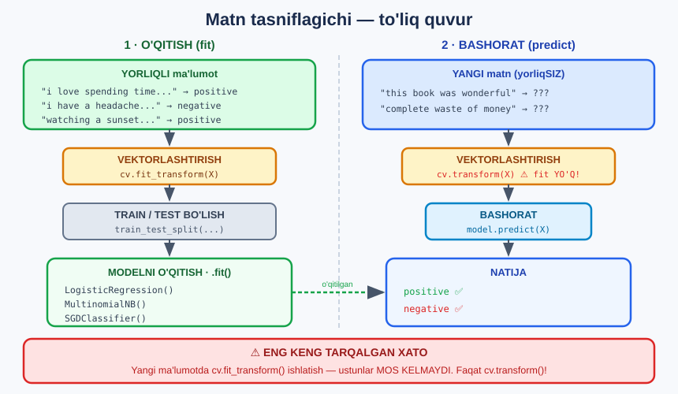

# 🎯 26-modul. O'z matn tasniflagichingiz

> **Building Your Own Text Classifier** — o'z **yorliqlaringiz** bilan matnni tasniflash.
> Bu — **nazorat ostida** o'qitish.

25-modulda mavzu modeli bizga **yorliqlarni topib berdi**. Endi ularni **ishlatamiz**.

---

## 🎯 To'liq quvur



---

## 📚 Darslar

| # | Dars | Nima o'rganasiz |
|---|---|---|
| 1 | [Kirish](01-Building-a-Custom-Classifier.md) | Nazorat ostida o'qitish, uchta algoritm |
| 2 | [Logistik regressiya](02-Logistic-Regression.md) ⭐ | Bazaviy model, `train_test_split` |
| 3 | [Naive Bayes](03-Naive-Bayes.md) | Ehtimollik, `classification_report` |
| 4 | [Chiziqli SVM](04-Linear-SVM.md) ⭐⭐ | **Va muammoni HAL QILAMIZ** |

---

## 📝 Amaliyot

| | |
|---|---|
| 📝 [**40 ta mashq**](MASHQLAR.md) | 🟢 Oson · 🟡 O'rta · 🔴 Qiyin |
| 🚀 [**6 ta mini-loyiha**](LOYIHALAR.md) | Universal tasniflagich · Model paneli · Xato tahlili · 3 sinf · GridSearch · O'quv egri chizig'i |

---

## 🔧 O'rnatish

```bash
pip install scikit-learn pandas numpy
```

```python
from sklearn.feature_extraction.text import CountVectorizer
from sklearn.model_selection import train_test_split
from sklearn.linear_model import LogisticRegression, SGDClassifier
from sklearn.naive_bayes import MultinomialNB
from sklearn.metrics import accuracy_score, classification_report

X_train, X_test, y_train, y_test = train_test_split(
    bag_of_words, y, test_size=0.3, random_state=42)

model = SGDClassifier(random_state=0).fit(X_train, y_train)
y_pred = model.predict(X_test)
print(accuracy_score(y_pred, y_test))
```

### 📁 Ma'lumotlar

| Fayl | Nima |
|---|---|
| [`data/sentences.txt`](data/sentences.txt) | **20 ta** jumla *(kursdagi — muammoli!)* |
| [`data/book_reviews_sample.csv`](data/book_reviews_sample.csv) | **100 ta** kitob sharhi *(yechim)* |

---

## ⭐⭐ Bu modulning ASOSIY SABOG'I

Kurs **20 ta jumla** bilan ishlaydi. Natija **falokat**:

```
Logistik regressiya   0.333       ┐
Naive Bayes           0.500       ├──  TANGA TASHLASH = 50%
Chiziqli SVM          0.333       ┘
```

**Cross-validation** ham tasdiqlaydi:

```
LR   [0.25 0.75 0.25 0.5  0.75]  →  0.500
NB   [0.25 0.5  0.25 0.75 0.75]  →  0.500
SVM  [0.5  0.75 0.25 0.5  0.75]  →  0.550
```

### 🔍 Uchta tashxis belgisi

```
① 20 ta misol, 118 ta ustun  →  6 ta xususiyat/misol
② Sinov = ATIGI 6 ta misol   →  har xato = 16.7%
③ 20 marta boshqa bo'linish  →  MIN 0.17,  MAX 0.83  (!!)
```

> ## 🔑 **Uchta algoritm sinaldi — hammasi ≈50%. Muammo ALGORITMDA emas.**

### ✅ Yechim — KO'PROQ MA'LUMOT

```
20 ta jumla  →  83 ta kitob sharhi

              20 ta      83 ta
LR           0.500  →   0.832    ⬆ +33 foiz
NB           0.500  →   0.845    ⬆ +35 foiz
SVM          0.550  →   0.869    ⬆ +32 foiz   🏆

Bitta bo'linishda: 0.96!   (25 tadan 24 tasi to'g'ri)
```

> ## 💡 **Algoritm O'ZGARMADI.** Bir xil `SGDClassifier`, bir xil `CountVectorizer`. Faqat **ma'lumot** ko'paydi.
>
> ## 🏆 **Mashinali o'qitishning eng muhim qoidasi:**
> ```
> Ko'proq MA'LUMOT  >  aqlliroq ALGORITM
> ```

---

## 🔬 Model nimani o'rgandi?

**20 ta jumlada** *(shovqin)*:

```
IJOBIY: in · life · of · am · me · work        ❌ ma'nosiz!
SALBIY: and · the · terrible · headache        ⚠️ yarim to'g'ri
```

**83 ta sharhda** *(haqiqiy o'rganish)*:

```
IJOBIY: love · loved · enjoyed · great         ✅
SALBIY: not · short · waste                    ✅
```

> ## 🎯 **Mana farq.** Kichik ma'lumotda model `"in"` va `"of"` ni **ijobiy** deb o'yladi. Katta ma'lumotda — `love`, `loved`, `enjoyed`.

---

## ⚠️ Bu modulning 7 ta TUZOG'I

| № | Tuzoq | Yechim |
|---|---|---|
| 1 | **Kichik ma'lumotda ishonchli natija kutish** | Kamida **bir necha yuz** misol |
| 2 | **Faqat aniqlikka qarash** | `classification_report` ni **doim** o'qing |
| 3 | **`DummyClassifier` bilan solishtirmaslik** | *"Aqlsiz"* modeldan yaxshimi? |
| 4 | **Bitta `train_test_split` ga ishonish** | **Cross-validation** ishlating |
| 5 | **Yangi ma'lumotda `fit_transform`** | ## Faqat **`transform`**! |
| 6 | **`stop_words='english'` ni avtomatik qo'shish** | Sentiment uchun **`not` kerak** — bizda **0.869 → 0.784** yomonlashdi |
| 7 | **TF-IDF doim yaxshiroq deb o'ylash** | Bizda **BOW g'olib** *(0.869 vs 0.857)* |

---

## 🧭 Uchta algoritm — qachon qaysi?

| | **Logistik regressiya** | **Naive Bayes** | **Chiziqli SVM** |
|---|---|---|---|
| **Tezlik** | O'rtacha | ⚡ **Eng tez** | Tez |
| **Kam ma'lumot** | Yomon | ✅ **Yaxshi** | O'rtacha |
| **Ko'p ma'lumot** | Yaxshi | Yaxshi | ✅ **Eng yaxshi** |
| **Tushuntirish** | ✅ **Eng oson** *(`coef_`)* | O'rtacha | O'rtacha |
| **Deterministik** | Ha *(`random_state` bilan)* | ✅ **Doim** | Ha *(`random_state` bilan)* |
| **Bizning natija** | 0.832 | 0.845 | ## **0.869** 🏆 |

> ## 💡 **Amaliy tavsiya:** **logistik regressiyadan** boshlang *(bazaviy va tushunarli)*, keyin **SVM** ni sinang. `DummyClassifier` bilan **har doim** solishtiring.

---

## ✅ O'zingizni tekshiring

- [ ] Bu nazorat ostidami yoki nazoratsizmi?
- [ ] `fit` va `predict` nima qiladi?
- [ ] Nima uchun ma'lumot aralashtiriladi?
- [ ] `precision` va `recall` farqi nimada?
- [ ] Nima uchun kursdagi natija yomon chiqdi?
- [ ] Cross-validation nima uchun kerak?
- [ ] `DummyClassifier` nima uchun kerak?
- [ ] Ko'proq ma'lumot qancha yordam berdi?

---

## ➡️ Keyingi qadam

**27-modul — Soxta yangiliklarni aniqlash (keys)**: endi bizda **ishlaydigan** tasniflagich bor. Uni **haqiqiy va katta** masalaga qo'llaymiz — soxta yangiliklarni aniqlash.

---

⬅️ [25-modul — Mavzu modellashtirish](../25-Topic-Modelling/README.md) · 🏠 [Bosh sahifa](../README.md)
