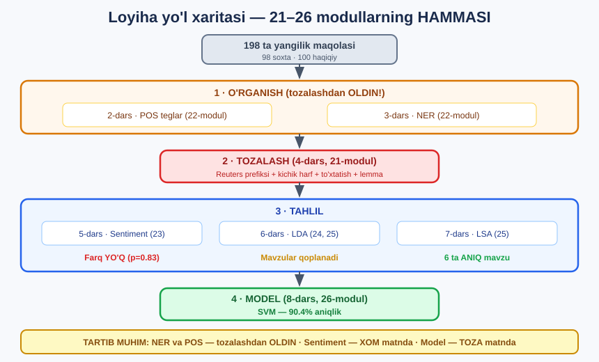

# 1-dars. Loyihani tanishtirish

## 🎬 Boshlashdan oldin

> ## **"Kursning bu bo'limida biz AMALIY MISOLDAN o'tamiz — BITTA ma'lumot to'plamini olib, bu kursda ko'rib chiqqan BARCHA QADAMLARDAN HAQIQIY BIZNES SHAROITIDA o'tamiz."**

---

## 1. 🎬 Vaziyat

> ## **"Keling, sahnani tayyorlaylik. Tasavvur qiling, siz IJTIMOIY TARMOQ KOMPANIYASIDA ishlaysiz, va kompaniya o'z platformasida tarqalayotgan SOXTA YANGILIKLARNING O'SIB BORAYOTGAN HAJMIDAN xavotirda."**
>
> ## **"Ular sizni MA'LUMOT OLIMI sifatida tayinlashdi — soxta yangiliklarni QANDAY TANIB OLISH mumkinligini tekshirish va uni ANIQLASH USULINI yaratish uchun."**

```
┌────────────────────────────────────────────────────────┐
│  📱 IJTIMOIY TARMOQ KOMPANIYASI                        │
│                                                        │
│  Muammo:  platformada SOXTA YANGILIKLAR ko'paymoqda    │
│  Sizning vazifangiz:                                   │
│     ① Soxta yangilikni QANDAY tanib olish mumkin?     │
│     ② Uni ANIQLASH USULINI yarating                   │
└────────────────────────────────────────────────────────┘
```

> **"Keling, bu muammoni birga hal qilaylik — avval ma'lumotni O'RGANIB va TOZALAB, keyin soxta va haqiqiy yangiliklarni TASNIFLAB."**
>
> **"Biz shuningdek natijalarimizning GRAFIKLARINI yaratamiz va topilmalarimizni MANFAATDOR TOMONLARGA qanday yetkazishni muhokama qilamiz."**

---

## 2. 🗺️ Loyiha yo'l xaritasi

Bu modul — **21–26-modullarning HAMMASINI** bitta loyihada birlashtiradi.



| Dars | Qadam | Qaysi modul |
|---|---|---|
| **1** | Loyihani tanishtirish | — |
| **2** | POS teglar bilan o'rganish | **22** |
| **3** | Nomlangan ob'ektlarni ajratish | **22** |
| **4** | Matnni qayta ishlash | **21** |
| **5** | Sentiment farq qiladimi? | **23** |
| **6** | Qanday mavzular bor? *(LDA)* | **24, 25** |
| **7** | Mavzular — 2-qism *(LSA)* | **25** |
| **8** | Tasniflagich qurish | **26** |

> ## 💡 **Bu — sizning PORTFOLIO loyihangiz.** Oxirida sizda **to'liq NLP loyihasi** bo'ladi — ma'lumotni o'rganishdan tortib ishlaydigan modelgacha.

---

## 3. Kerakli paketlar

> **"Demak, birinchi qilishimiz kerak bo'lgan narsa — kerakli paketlarni import qilish. Siz ularni oldingi darslarimizdan tanib olasiz."**

```python
import pandas as pd
import numpy as np
import re
import matplotlib.pyplot as plt
import seaborn as sns
import spacy
import nltk
from nltk.corpus import stopwords
from nltk.tokenize import word_tokenize
from nltk.stem import WordNetLemmatizer
from vaderSentiment.vaderSentiment import SentimentIntensityAnalyzer
from sklearn.feature_extraction.text import CountVectorizer, TfidfVectorizer
from sklearn.decomposition import LatentDirichletAllocation, TruncatedSVD
from sklearn.model_selection import train_test_split, cross_val_score, StratifiedKFold
from sklearn.linear_model import LogisticRegression, SGDClassifier
from sklearn.metrics import accuracy_score, classification_report, confusion_matrix
```

> **"Biz ma'lumotni boshqarish uchun pandas, chizish uchun matplotlib va seaborn, va bugun qilmoqchi bo'lgan barcha turli tahlillar uchun spaCy, NLTK, gensim va sklearn dan foydalanamiz."**

### Grafik sozlamalari

> **"Biz shuningdek boshlash uchun ba'zi grafik sozlamalarini o'rnatamiz. Barcha diagrammalarimiz chiroyli o'lchamda chop etilishiga ishonch hosil qilish uchun rasm o'lchamini o'rnatamiz, va shuningdek foydalanish uchun standart grafik rangini ko'rsatamiz."**

```python
plt.rcParams["figure.figsize"] = [12.8, 6.4]
DEFAULT_PLOT_COLOUR = "#00918e"
```

> 💡 **`gensim` haqida:** kurs uni ishlatadi, lekin u **Python 3.13+** da o'rnatilmaydi. Bu darslikda **`scikit-learn`** ekvivalenti ishlatiladi *(25-modulni eslang)*.

---

## 4. Ma'lumotni yuklash

> **"Endi hammasi sozlangach, ma'lumotimizni import qilaylik."**

```python
data = pd.read_csv("data/fake_news_data.csv")
print(data.shape)
print(data.columns.tolist())
```

```
(198, 4)
['title', 'text', 'date', 'fake_or_factual']
```

> **"Bizda yangilik maqolasining SARLAVHASI, maqola ichidagi MATN, NASHR SANASI, va bu soxta yangilikmi yoki haqiqiy yangilikmi degan TEG bor."**

| Ustun | Nima |
|---|---|
| `title` | Maqola sarlavhasi |
| `text` | Maqolaning **to'liq matni** ⭐ |
| `date` | Nashr sanasi |
| `fake_or_factual` | ## **Yorliq** — `Fake News` yoki `Factual News` |

---

## 5. Ma'lumotni tekshirish

> **"Keyin bu ma'lumot to'plami haqida ko'proq ma'lumot olish uchun `data.info()` dan foydalanishimiz mumkin. Ko'rishingiz mumkinki, bizda 198 ta yozuv bor — ya'ni ma'lumotimizda 198 ta qator. Va bizda NULL QIYMATLAR YO'Q."**

```python
print(data["fake_or_factual"].value_counts())
print("Null qiymatlar:", data.isna().sum().sum())
```

```
fake_or_factual
Factual News    100
Fake News        98
Null qiymatlar: 0
```

### 🔑 Uchta yaxshi xabar

```
① 198 ta maqola      →  26-moduldagi 20 tadan ANCHA yaxshi!
② MUVOZANATLI        →  100 va 98 — deyarli TENG  ⭐
③ NULL yo'q          →  tozalash kerak emas
```

> ## 💡 **Muvozanat MUHIM.** 26-modulda ko'rdik: agar bir sinf ustun bo'lsa, model shunchaki *"hammasi shu sinf"* deb aytishi mumkin. Bu yerda `DummyClassifier` atigi **~50%** beradi — ya'ni modelimiz **haqiqatan o'rganishi** kerak.

---

## 6. Matnga qaraymiz

```python
print(data["text"][0][:200])
```

```
There are two small problems with your analogy Susan  Jesus was NOT a Muslim and Joseph traveled to Bethlehem with Mary. For anyone who s not paying attention there don t appear to be many female refu
```

> 🔍 **Bu — SOXTA yangilik.** E'tibor bering: **shaxsiy murojaat** *("your analogy Susan")*, **BOSH HARFLI** urg'u *("was NOT a Muslim")* — bu **maqola** emas, **bahs**.

```python
print(data["text"][196][:90])
```

```
WASHINGTON (Reuters) - Former FBI Director James Comey had requested additional funding an
```

> 🔍 **Bu — HAQIQIY yangilik.** E'tibor bering: **`WASHINGTON (Reuters) -`** — bu **agentlik prefiksi**.

### ⚠️ MANA BIRINCHI MUAMMO

```
Haqiqiy yangiliklar:  "WASHINGTON (Reuters) - ..."
                       "BELFAST (Reuters) - ..."
                            ↑
              Soxta yangiliklarda bu YO'Q!
```

> ## ❌ **Agar buni tozalamasak, model ALDANADI.** U *"`Reuters` bor → haqiqiy"* deb o'rganadi — bu **matnni tushunish emas**, bu **format hiylasini** topish.
>
> ## 💡 **4-darsda buni regex bilan olib tashlaymiz.** Bu — **ma'lumotni ko'z bilan tekshirishning** eng yaxshi namunasi.

---

## 7. 🎯 Uchta savol

Loyiha oxirida biz **uchta savolga** javob beramiz:

```
❓ 1 · Soxta va haqiqiy yangiliklar TILDA farq qiladimi?
       → POS teglar va NER (2-3 darslar)

❓ 2 · Ularning SENTIMENTI farq qiladimi?
       → VADER (5-dars)

❓ 3 · Soxta yangiliklarda qanday MAVZULAR bor?
       → LDA va LSA (6-7 darslar)

🎯 4 · Va nihoyat: MODEL qura olamizmi?
       → Tasniflagich (8-dars)
```

---

## 8. ⚡ Mashqlar

### 🟢 Oson

**M1.** Ma'lumotni yuklang va shaklini chiqaring.

**M2.** Yorliqlar muvozanatlimi?

**M3.** Matnlarning o'rtacha uzunligi qancha?

<details>
<summary>✅ Yechimlar</summary>

```python
# M1
data = pd.read_csv("data/fake_news_data.csv")
print(data.shape)                       # (198, 4)
print(data.columns.tolist())            # ['title','text','date','fake_or_factual']

# M2
print(data["fake_or_factual"].value_counts())
# Factual News    100
# Fake News        98
# ✅ Deyarli MUKAMMAL muvozanat (50.5% / 49.5%)

# M3
uz = data["text"].str.split().str.len()
print("O'rtacha:", int(uz.mean()))
print(data.groupby("fake_or_factual")["text"].apply(
    lambda s: int(s.str.split().str.len().mean())))
```

</details>

### 🟡 O'rta

**M4.** Bir necha soxta va haqiqiy maqolani **o'qing** va farqni sezing.

**M5.** `Reuters` so'zi qaysi turdagi maqolalarda uchraydi?

<details>
<summary>✅ Yechimlar</summary>

```python
# M4
for t in ["Fake News", "Factual News"]:
    print(f"\n=== {t} ===")
    for x in data[data["fake_or_factual"] == t]["text"].head(2):
        print(" ", x[:110], "...")
#
# 💡 Qo'l bilan o'qish — ENG YAXSHI birinchi qadam.
#    Modelni qurishdan OLDIN ma'lumotni TUSHUNING.

# M5 — ⚠️ MUHIM TEKSHIRUV
for t in ["Fake News", "Factual News"]:
    n = data[data["fake_or_factual"] == t]["text"].str.contains("Reuters").sum()
    jami = (data["fake_or_factual"] == t).sum()
    print(f"{t}: {n}/{jami} maqolada 'Reuters' bor")
#
# 🔑 Agar "Reuters" faqat HAQIQIY yangiliklarda bo'lsa —
#    bu MODEL UCHUN "SHIPCHA" (shortcut) bo'ladi.
#    Model matnni tushunmasdan 100% aniqlik berardi!
#
# ⚠️ Bu — "ma'lumot sizib chiqishi" ning yana bir turi.
#    4-darsda buni TOZALAYMIZ.
```

</details>

---

## 🧠 O'zini tekshirish savollari

1. Loyihaning maqsadi nima?
2. Ma'lumot to'plamida nechta maqola bor?
3. Yorliqlar muvozanatlimi va nima uchun bu muhim?
4. `text` va `title` ustunlaridan qaysi biri ishlatiladi?
5. Haqiqiy yangiliklardagi qanday muammo topildi?
6. Nima uchun bu muammo?

<details>
<summary>✅ Javoblar</summary>

1. Soxta yangiliklarni **qanday tanib olish** mumkinligini o'rganish va **aniqlash usulini** yaratish.
2. **198 ta** *(98 soxta, 100 haqiqiy)*.
3. **Ha** — 50.5% / 49.5%. Muhim, chunki muvozanatsiz bo'lsa model shunchaki **ko'p uchraydigan sinfni** aytishi mumkin *(26-modul)*.
4. ## **`text`** — maqolaning to'liq matni.
5. Ular **`WASHINGTON (Reuters) -`** kabi **agentlik prefiksi** bilan boshlanadi.
6. Chunki model *"`Reuters` bor → haqiqiy"* deb **o'rganib qolishi** mumkin — bu **matnni tushunish emas**, **format hiylasi**.

</details>

---

## 📌 Xulosa

```
🎬 VAZIYAT
   Ijtimoiy tarmoq kompaniyasi · soxta yangiliklar muammosi
   Siz — ma'lumot olimi

   ① Soxta yangilikni QANDAY tanib olish mumkin?
   ② Uni ANIQLASH USULINI yarating


📊 MA'LUMOT
   198 ta maqola  ·  4 ta ustun
   Fake News     98
   Factual News 100     ✅ MUVOZANATLI
   Null          0      ✅ toza


🗺️ YO'L XARITASI (21-26 modullarning HAMMASI!)
   2 · POS teglar          ← 22-modul
   3 · NER                 ← 22-modul
   4 · Matnni tozalash     ← 21-modul
   5 · Sentiment           ← 23-modul
   6 · Mavzular (LDA)      ← 24, 25-modullar
   7 · Mavzular (LSA)      ← 25-modul
   8 · Tasniflagich        ← 26-modul


⚠️ BIRINCHI TOPILMA — ko'z bilan tekshiruvdan

   HAQIQIY:  "WASHINGTON (Reuters) - Former FBI Director..."
   SOXTA  :  "There are two small problems with your analogy Susan..."
                    ↑
   Haqiqiy yangiliklarda AGENTLIK PREFIKSI bor!

   ❌ Tozalamasak, model "Reuters bor → haqiqiy" deb o'rganadi
      → matnni tushunmaydi, FORMAT HIYLASINI topadi
   ✅ 4-darsda regex bilan olib tashlaymiz
```

---

## 🔖 Atamalar

| Atama | Inglizcha | Izoh |
|---|---|---|
| Keys / amaliy misol | *case study* | Haqiqiy loyiha namunasi |
| Manfaatdor tomon | *stakeholder* | Natijani ko'radigan odam |
| Muvozanat | *class balance* | Sinflar teng taqsimlanganmi |
| Shipcha | *shortcut* | Model topgan "yengil" belgi |
| Portfolio | *portfolio* | Ish namunalari to'plami |

---

🏠 [Modul boshiga](README.md) · ➡️ [Keyingi: POS teglar bilan o'rganish](02-Exploring-with-POS-Tags.md)
