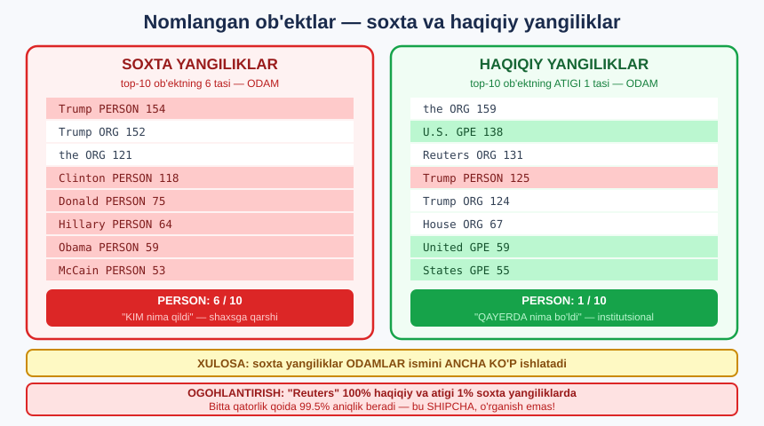

# 3-dars. Nomlangan ob'ektlarni ajratish

## 🎬 Boshlashdan oldin

> ## **"Oldingi darslarimizdan eslaysizki, buni HAR QANDAY MATN OLDINDAN QAYTA ISHLASHDAN OLDIN qilish YAXSHIROQ. Shuning uchun biz buni HOZIR qilyapmiz — modellarimizga o'sha qiziqarli nomlangan ob'ektlarni tortib olish uchun ENG YAXSHI IMKONIYAT berish uchun."**

> ## 💡 **22-modulning asosiy sabog'i amalda.** U yerda ko'rgan edik: tozalashdan keyin ob'ektlarning **46%** yo'qoladi.

---

## 1. Ish allaqachon bajarilgan

> **"Biz o'tgan darsda POS teglash qilganimizda nomlangan ob'ekt teglarini ALLAQACHON tortib olganimiz uchun, bu qadamni QAYTA QILISHIMIZ SHART EMAS."**

```python
# 2-darsda:
def extract_token_tags(doc):
    return [(t.text, t.ent_type_, t.pos_) for t in doc]
#                    ↑ MANA SHU
```

> 💡 **Bu — yaxshi rejalashtirishning natijasi.** 198 ta maqolani spaCy'dan **ikki marta** o'tkazish **kerak emas**.

---

## 2. Top ob'ektlarni ajratamiz

> **"Biz soxta yangiliklar ma'lumot to'plamidagi TOP OB'EKTLARNI tortib olishdan boshlaymiz. Bu bizning soxta ma'lumot to'plamimiz bo'lib, NER teg ustuni BO'SH BO'LMAGAN joyga filtrlangan."**

```python
def top_entities(df):
    x = df[df["ner_tag"] != ""]
    return (x.groupby(["token", "ner_tag"]).size()
              .reset_index(name="counts")
              .sort_values(by="counts", ascending=False))

top_entities_fake = top_entities(fake_tags_df)
top_entities_fact = top_entities(fact_tags_df)
```

---

## 3. Natija — SOXTA yangiliklar

```python
print(top_entities_fake.head(10).to_string(index=False))
```

```
  token ner_tag  counts
  Trump  PERSON     154
  Trump     ORG     152
    the     ORG     121
Clinton  PERSON     118
 Donald  PERSON      75
Hillary  PERSON      64
  Obama  PERSON      59
 McCain  PERSON      53
   year    DATE      44
  Syria     GPE      42
```

### 🎯 SANANG: 10 tadan 6 tasi — ODAM!

```
Trump   PERSON   154
Clinton PERSON   118
Donald  PERSON    75
Hillary PERSON    64
Obama   PERSON    59
McCain  PERSON    53
                  ↑
        HAMMASI SIYOSATCHILAR ISMLARI
```

> ## **"Bu yerda tortib olingan eng ko'p uchraydigan nomlangan ob'ektlar — ODAMLAR."**

---

## 4. Natija — HAQIQIY yangiliklar

```python
print(top_entities_fact.head(10).to_string(index=False))
```

```
  token ner_tag  counts
    the     ORG     159
   U.S.     GPE     138
Reuters     ORG     131
  Trump  PERSON     125
  Trump     ORG     124
  House     ORG      67
   year    DATE      63
    the     GPE      59
 United     GPE      59
 States     GPE      55
```

### 🎯 ENDI SANANG: 10 tadan ATIGI 1 tasi — ODAM!

> ## **"Bu yerda odamlarning ismlari ANCHA KAM UCHRAYDI. Aslida, haqiqiy yangiliklar ma'lumot to'plamimizdan tortib olingan top o'nta ob'ektga qaraganimizda, `Trump` — YAGONA ism."**
>
> ## **"Bu yerda TASHKILOTLAR va JOY NOMLARI ancha keng tarqalgan ko'rinadi, va ODAMLARGA e'tibor KAMROQ."**

| | **SOXTA** | **HAQIQIY** |
|---|---|---|
| `PERSON` | ## **6 / 10** | ## **1 / 10** |
| `ORG` | 2 / 10 | 3 / 10 |
| `GPE` | 1 / 10 | 4 / 10 |
| `DATE` | 1 / 10 | 1 / 10 |

---

## 5. ⭐ ASOSIY XULOSA

> ## **"Agar bu muammoni qo'yganimizni eslasangiz, maqsadlardan biri SOXTA YANGILIKNI QANDAY TANIB OLISH mumkinligini tekshirish edi."**
>
> ## **"Demak, siz bundan shuni olishingiz mumkin: SOXTA ma'lumot to'plamlarida KO'PROQ ISMLAR ishlatilishi mumkin, HAQIQIY yangiliklarda esa KAMROQ."**



```
   SOXTA YANGILIK                 HAQIQIY YANGILIK
   ───────────────                ────────────────
   👤 ODAMLAR                     🏛️ TASHKILOTLAR
   Trump · Clinton · Donald       U.S. · Reuters · House
   Hillary · Obama · McCain       United States

   "KIM nima qildi"               "QAYERDA nima bo'ldi"
   shaxsiy · hissiyotli           institutsional · rasmiy
```

> ## 💡 **Nima uchun bunday?** Soxta yangiliklar **shaxsga qarshi** yo'naltirilgan — ular **odamlarni** ayblaydi. Haqiqiy yangiliklar **voqealar** haqida xabar beradi va **institutlarga** murojaat qiladi.

### ⚠️ Diqqat — `Reuters` yana ko'rindi

```
Reuters  ORG  131   ← faqat HAQIQIY yangiliklarda!
```

> ## ❌ **Bu — 1-darsda topgan muammomiz.** Keling, uni **o'lchaymiz**:

```python
for t in ["Fake News", "Factual News"]:
    sub = data[data["fake_or_factual"] == t]
    n = sub["text"].str.contains("Reuters").sum()
    print(f"{t}: {n}/{len(sub)} = {n/len(sub):.0%}")
```

```
Fake News: 1/98 = 1%
Factual News: 100/100 = 100%
```

### 💥 100% VA 1%!

```python
import numpy as np
bashorat = np.where(data["text"].str.contains("Reuters"),
                    "Factual News", "Fake News")
print("Faqat 'Reuters' qoidasi:", f"{(bashorat == data['fake_or_factual']).mean():.1%}")
```

```
Faqat 'Reuters' qoidasi: 99.5%
```

> ## 💥💥 **BITTA QATORLIK QOIDA — 99.5% ANIQLIK!**
>
> ```python
> if "Reuters" in matn:  return "Factual News"
> else:                  return "Fake News"
> ```
>
> ## ❌ **Bu — MASHINALI O'QITISH EMAS.** Bu — ma'lumot to'plamidagi **nuqsonni** topish.

### 🔑 Nima uchun bu FALOKAT?

```
Bizning ma'lumot:  haqiqiy yangiliklar Reuters'dan olingan
                   soxta yangiliklar boshqa manbadan

Model o'rganadi:   "Reuters" → haqiqiy

HAQIQIY HAYOTDA:   AP, BBC, Kun.uz dan kelgan haqiqiy yangilik
                        ↓
                   "Reuters" YO'Q  →  model "SOXTA" deydi  ❌❌
```

> ## 💡 **Bu — "shortcut learning" (shipcha o'rganish).** Model **oson yo'lni** topadi va **haqiqiy vazifani** o'rganmaydi. **Keyingi darsda buni olib tashlaymiz.**

---

## 6. Grafik chizamiz

> **"Keyin men tortib olingan nomlangan ob'ektlarning chiroyli GRAFIKLARINI yaratmoqchiman — buni taqdimotlarda ishlatishimiz yoki manfaatdor tomonlarga olib borishimiz uchun."**
>
> ## **"Birinchi qilishimiz kerak bo'lgan narsa — RANG PALITRASINI yaratish, ikkala grafik ham turli nomlangan ob'ekt teglari uchun BIR XIL RANGDA bo'lishiga ishonch hosil qilish uchun."**

```python
import seaborn as sns
import matplotlib.pyplot as plt

# ⭐ IKKALA grafikda BIR XIL rang bo'lishi uchun
barcha_teglar = sorted(set(top_entities_fake["ner_tag"]) |
                       set(top_entities_fact["ner_tag"]))
ner_palette = dict(zip(barcha_teglar,
                       sns.color_palette("tab20", len(barcha_teglar))))

fig, axes = plt.subplots(1, 2, figsize=(16, 6))
for ax, dfx, nom in [(axes[0], top_entities_fake, "SOXTA yangiliklar"),
                     (axes[1], top_entities_fact, "HAQIQIY yangiliklar")]:
    sns.barplot(x="counts", y="token", hue="ner_tag", palette=ner_palette,
                data=dfx.head(10), orient="h", dodge=False, ax=ax)
    ax.set_title(f"Eng ko'p uchraydigan ob'ektlar — {nom}")

plt.tight_layout()
plt.savefig("ner_comparison.png", dpi=100, bbox_inches="tight")
```

### 🔑 Nima uchun BIR XIL palitra muhim?

```
❌ Har grafik o'z ranglarini tanlasa:
   Chap grafikda PERSON = ko'k
   O'ng grafikda PERSON = qizil
   → SOLISHTIRIB BO'LMAYDI!

✅ Umumiy palitra:
   PERSON DOIM bir xil rangda
   → farq DARHOL ko'rinadi
```

> ## 💡 **Bu — taqdimot uchun MUHIM detal.** Manfaatdor tomon grafikni **3 soniyada** tushunishi kerak.

---

## 7. 💻 To'liq kod

```python
# ===== OB'EKTLARNI AJRATISH (2-darsdagi tags_df dan) =====
def top_entities(df):
    x = df[df["ner_tag"] != ""]
    return (x.groupby(["token", "ner_tag"]).size()
              .reset_index(name="counts")
              .sort_values(by="counts", ascending=False))

top_entities_fake = top_entities(fake_tags_df)
top_entities_fact = top_entities(fact_tags_df)

print("SOXTA:");   print(top_entities_fake.head(10).to_string(index=False))
print("HAQIQIY:"); print(top_entities_fact.head(10).to_string(index=False))

# ===== PERSON ULUSHINI HISOBLASH =====
for nom, tt in [("SOXTA", top_entities_fake), ("HAQIQIY", top_entities_fact)]:
    top10 = tt.head(10)
    n = (top10["ner_tag"] == "PERSON").sum()
    print(f"{nom}: top-10 da {n} ta PERSON")
```

---

## 8. ⚡ Mashqlar

### 🟢 Oson

**M1.** Har bir to'plamda nechta noyob ob'ekt bor?

**M2.** `PERSON` ob'ektlarini solishtiring.

**M3.** `GPE` *(davlat/shahar)* ob'ektlarini solishtiring.

<details>
<summary>✅ Yechimlar</summary>

```python
# M1
print("Soxta noyob ob'ekt :", len(top_entities_fake))
print("Haqiqiy noyob ob'ekt:", len(top_entities_fact))

# M2
for nom, tt in [("SOXTA", top_entities_fake), ("HAQIQIY", top_entities_fact)]:
    p = tt[tt["ner_tag"] == "PERSON"].head(8)
    print(f"{nom} PERSON:", p["token"].tolist())

# M3
for nom, tt in [("SOXTA", top_entities_fake), ("HAQIQIY", top_entities_fact)]:
    g = tt[tt["ner_tag"] == "GPE"].head(8)
    print(f"{nom} GPE:", g["token"].tolist())
```

</details>

### 🟡 O'rta

**M4.** ⭐ `PERSON` ob'ektlarining **ulushini** hisoblang.

**M5.** Yorliq taqsimotini solishtiring.

<details>
<summary>✅ Yechimlar</summary>

```python
# M4 — ⭐ NORMALLASHTIRILGAN TAQQOSLASH
for nom, tt, jami in [("SOXTA", top_entities_fake, 45744),
                      ("HAQIQIY", top_entities_fact, 40393)]:
    p = tt[tt["ner_tag"] == "PERSON"]["counts"].sum()
    hammasi = tt["counts"].sum()
    print(f"{nom}: PERSON {p} / jami ob'ekt {hammasi} = {p/hammasi:.1%}")
#
# 🔑 XOM SONLARNI emas, ULUSHNI solishtiring —
#    soxta to'plamda umuman ko'proq token bor!

# M5
for nom, tt in [("SOXTA", top_entities_fake), ("HAQIQIY", top_entities_fact)]:
    g = tt.groupby("ner_tag")["counts"].sum().sort_values(ascending=False)
    print(f"\n{nom}:"); print((g / g.sum() * 100).round(1).head(6).to_string())
```

</details>

### 🔴 Qiyin

**M6.** `Reuters` muammosini o'lchang.

**M7.** Grafik chizing.

<details>
<summary>✅ Yechimlar</summary>

```python
# M6 — ⚠️ "SHIPCHA" MUAMMOSI
for t in ["Fake News", "Factual News"]:
    sub = data[data["fake_or_factual"] == t]
    n = sub["text"].str.contains("Reuters").sum()
    print(f"{t}: {n}/{len(sub)} = {n/len(sub):.0%}")
#
# 🔑 Agar "Reuters" faqat bir sinfda bo'lsa — model
#    matnni TUSHUNMASDAN yuqori aniqlik beradi.
#    Bu — "shipcha" (shortcut learning).
#
# ⚠️ 4-DARSDA BUNI TOZALAYMIZ.

# M7
import seaborn as sns, matplotlib.pyplot as plt
teglar = sorted(set(top_entities_fake["ner_tag"]) | set(top_entities_fact["ner_tag"]))
pal = dict(zip(teglar, sns.color_palette("tab20", len(teglar))))
fig, axes = plt.subplots(1, 2, figsize=(16, 6))
for ax, dfx, nom in [(axes[0], top_entities_fake, "SOXTA"),
                     (axes[1], top_entities_fact, "HAQIQIY")]:
    sns.barplot(x="counts", y="token", hue="ner_tag", palette=pal,
                data=dfx.head(10), orient="h", dodge=False, ax=ax)
    ax.set_title(nom)
plt.tight_layout(); plt.savefig("ner.png", dpi=100, bbox_inches="tight")
print("ner.png saqlandi")
```

</details>

---

## 🧠 O'zini tekshirish savollari

1. Nima uchun NER tozalashdan **oldin**?
2. Nima uchun qayta hisoblash kerak emas?
3. Soxta yangiliklar top-10 ida nechta `PERSON`?
4. Haqiqiy yangiliklarda-chi?
5. Asosiy xulosa nima?
6. Nima uchun umumiy rang palitrasi kerak?
7. `Reuters` bilan qanday muammo bor?

<details>
<summary>✅ Javoblar</summary>

1. Chunki NER **bosh harflar** va **tinish belgilariga** tayanadi *(22-modul: tozalashdan keyin **46%** yo'qoladi)*.
2. Chunki 2-darsda `extract_token_tags` **`ent_type_`** ni ham olgan edi.
3. ## **6 tasi** — `Trump`, `Clinton`, `Donald`, `Hillary`, `Obama`, `McCain`.
4. ## **Atigi 1 tasi** — `Trump`.
5. ## **Soxta yangiliklar KO'PROQ ISM ishlatadi.** Haqiqiy yangiliklar — **tashkilot** va **joy** nomlarini.
6. Toki `PERSON` **ikkala grafikda ham bir xil rangda** bo'lsin — aks holda **solishtirib bo'lmaydi**.
7. `Reuters` **faqat haqiqiy** yangiliklarda bor. Model buni **"shipcha"** sifatida ishlatishi mumkin — matnni tushunmasdan.

</details>

---

## 📌 Xulosa

```python
def top_entities(df):
    x = df[df["ner_tag"] != ""]           # ⭐ bo'sh bo'lmaganlar
    return (x.groupby(["token", "ner_tag"]).size()
              .reset_index(name="counts")
              .sort_values(by="counts", ascending=False))


⭐⭐ ASOSIY TOPILMA

  SOXTA top-10:                 HAQIQIY top-10:
    Trump   PERSON 154            the     ORG    159
    Trump   ORG    152            U.S.    GPE    138
    the     ORG    121            Reuters ORG    131
    Clinton PERSON 118            Trump   PERSON 125
    Donald  PERSON  75            Trump   ORG    124
    Hillary PERSON  64            House   ORG     67
    Obama   PERSON  59            year    DATE    63
    McCain  PERSON  53            the     GPE     59
    year    DATE    44            United  GPE     59
    Syria   GPE     42            States  GPE     55

  PERSON:  6/10  ⭐                PERSON:  1/10
  GPE   :  1/10                    GPE   :  4/10


🎯 XULOSA
  SOXTA   →  👤 ODAMLAR   ("KIM nima qildi")
  HAQIQIY →  🏛️ INSTITUTLAR ("QAYERDA nima bo'ldi")

  Soxta yangiliklar SHAXSGA qarshi yo'naltirilgan.
  Haqiqiy yangiliklar VOQEA haqida xabar beradi.


⚠️ OGOHLANTIRISH
  "Reuters" ORG 131 — faqat HAQIQIY yangiliklarda!
  → model buni "shipcha" qilib ishlatishi mumkin
  → 4-darsda TOZALAYMIZ


💡 GRAFIK MASLAHATI
  Ikkala grafikda BIR XIL rang palitrasi ishlating —
  aks holda solishtirib bo'lmaydi.
```

---

## 🔖 Atamalar

| Atama | Inglizcha | Izoh |
|---|---|---|
| Rang palitrasi | *colour palette* | Ranglar to'plami |
| `dodge=False` | *dodge* | Ustunlarni bir chiziqda saqlash |
| `orient="h"` | *orientation* | Gorizontal ustunli diagramma |
| Shipcha | *shortcut learning* | Model topgan "yengil" belgi |

---

⬅️ [Oldingi: POS teglar](02-Exploring-with-POS-Tags.md) · 🏠 [Modul boshiga](README.md) · ➡️ [Keyingi: Matnni qayta ishlash](04-Processing-the-Text.md)
