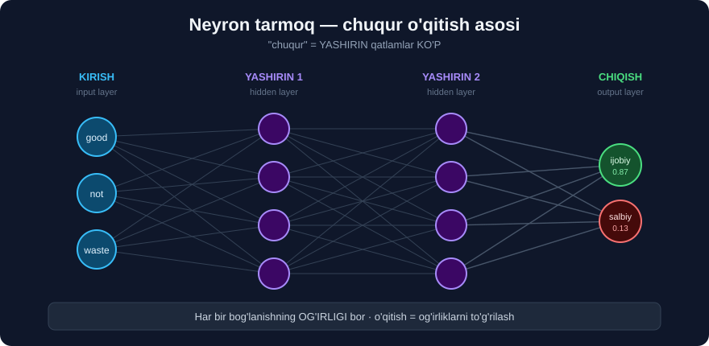

# 1-dars. Chuqur o'qitish nima?

## 🎬 Boshlashdan oldin

> **"Xush kelibsiz. Umid qilamanki, bu 'Tabiiy tilni qayta ishlashga kirish' kursidagi turli mavzular ustida ishlash sizga yoqdi."**
>
> **"Albatta, NLP sohasi JUDA KATTA va doim yangi narsalar rivojlanmoqda."**
>
> ## **"Kursning bu OXIRGI bobida biz CHUQUR O'QITISH, uning qo'llanilishi va NLP KELGUSI O'N YILLIKDA qayerga borishi mumkinligi haqida gaplashamiz."**

> 💡 **Bu bobda KOD YO'Q** — bu **nazariy** yakun. Lekin 3-darsda **o'zbek tili** uchun **haqiqiy amaliy** narsa bor.

---

## 1. Ta'rif

> **"Chuqur o'qitish NLP sohasiga qanday ta'sir qilganini muhokama qilishdan oldin, keling CHUQUR O'QITISH deganda nimani nazarda tutayotganimizni aniqlashtiraylik."**
>
> ## **"An'anaviy mashinali o'qitish algoritmlaridan farqli o'laroq, CHUQUR O'QITISH — NEYRON TARMOQLAR deb ham ataladi — INSON MIYASINI, uning tuzilishi va funksiyasini SIMULYATSIYA QILISH uchun qurilgan."**

```
      MIYA                      NEYRON TARMOQ
   ┌─────────┐                  ┌─────────┐
   │ neyron  │  ← signal →      │ neyron  │  ← son →
   └─────────┘                  └─────────┘
        ↓                            ↓
   milliardlab                  minglab/millionlab
   bog'lanish                   "vazn" (weight)
```

---

## 2. Qatlamlar

> **"Bu neyron tarmoqlar ma'lumotni tahlil qilish va naqshlarni ochish uchun MO'LJALLANGAN O'ZARO BOG'LANGAN QATLAMLARDAN iborat."**
>
> **"Neyron tarmoqlar KIRISH qatlamlari, YASHIRIN qatlamlar va CHIQISH qatlamlaridan iborat."**



```
  KIRISH          YASHIRIN qatlamlar          CHIQISH
  (input)            (hidden)                 (output)

    ○ ──────────► ○ ──────► ○ ──────────────► ○
    ○ ──────────► ○ ──────► ○ ──────────────► ○
    ○ ──────────► ○ ──────► ○
    ○ ──────────► ○ ──────► ○

  "matn"        naqshlarni topadi          "ijobiy/salbiy"
```

> **"Har bir qatlam o'z kirishini oladi, AKTIVATSIYA FUNKSIYASINI qo'llaydi va keyin uni keyingi qatlamga uzatadi."**

### 🔑 "Chuqur" so'zi qayerdan?

```
1-2 ta yashirin qatlam  →  oddiy neyron tarmoq
10+ qatlam              →  CHUQUR (deep) o'qitish
GPT-4 kabi modellar     →  100+ qatlam
```

---

## 3. Vaznlar — o'rganishning kaliti

> ## **"Har bir qatlam ALOHIDA NEYRONLARDAN iborat, va bu neyronlar orasidagi bog'lanishlarning KUCHI — VAZNLAR deb ataladi — bu neyronlarning YAKUNIY BASHORATGA ta'sirini belgilaydi."**
>
> ## **"Model o'qitish orqali bu neyronlar orasidagi vaznlarni SOZLASH bilan, neyron tarmoqlar ma'lumotdan O'RGANA oladi va bundan o'z ishlashini YAXSHILASH uchun foydalanadi."**

```
   neyron A ──── vazn 0.8 ────► neyron B
                    ↑
        Kuchli bog'lanish — A ning B ga ta'siri KATTA

   neyron C ──── vazn 0.01 ───► neyron B
                    ↑
        Kuchsiz bog'lanish — deyarli ta'sir yo'q
```

> 💡 **26-modulni eslang:** logistik regressiyada ham **`coef_`** — bu **vaznlar** edi! Neyron tarmoq — bu **millionlab** shunday vaznning **ko'p qatlamli** tizimi.

### O'qitish jarayoni

> **"NLP uchun chuqur o'qitish modelini o'qitish neyronlarning bu alohida vaznlarini OPTIMALLASHTIRISHNI o'z ichiga oladi — algoritmlarimiz beradigan BASHORAT QILINGAN natija va biz izlayotgan HAQIQIY natija orasidagi FARQNI MINIMALLASHTIRISH uchun."**

```
1 · Model bashorat qiladi        →  "ijobiy" (70% ishonch)
2 · Haqiqiy javob bilan solishtiradi  →  aslida "salbiy"  ❌
3 · XATONI hisoblaydi            →  katta xato
4 · VAZNLARNI biroz o'zgartiradi
5 · QAYTADAN boshlaydi           →  millionlab marta
                                        ↓
                               xato kichrayadi
```

---

## 4. Turli arxitekturalar

> **"Bir nechta turli chuqur o'qitish arxitekturalari bor, ularning har biri TURLI VAZIFALAR va MA'LUMOT TURLARI uchun mos."**

| Arxitektura | Nimada kuchli | Nima uchun |
|---|---|---|
| **CNN** *(Convolutional)* | 🖼️ **Rasm va video** | **Fazoviy** bog'liqlikni ishlatadi |
| **RNN** *(Recurrent)* | 📝 **Til va ketma-ketlik** | **Teskari aloqa** halqalari bor |
| **Transformer** | 📝 **Til** *(zamonaviy)* | **E'tibor** mexanizmi |

> **"Masalan, KONVOLYUTSION neyron tarmoqlar fazoviy korrelyatsiyalardan foydalanib RASM va VIDEO qayta ishlashda a'lo darajada. Boshqa tomondan, REKURRENT neyron tarmoqlar teskari aloqa halqalarini qayta ishlay oladigan bog'lanishlardan foydalanadi — shuning uchun ular TIL kabi KETMA-KET ma'lumotni qayta ishlashda a'lo."**

### 🔑 Nima uchun til uchun RNN?

```
Rasm:     pikseller BIR VAQTDA ko'riladi
          → CNN mos

Til:      so'zlar KETMA-KET keladi
          "Men kitobni ____ "
                        ↑
          Bu so'z OLDINGI so'zlarga bog'liq!
          → RNN mos
```

> ## 💡 **Lekin 2017-yildan beri TRANSFORMER RNN'ni siqib chiqardi.** Nima uchun — **30-modulda** batafsil ko'ramiz. Qisqasi: transformer **hamma so'zni bir vaqtda** ko'radi va **parallel** ishlaydi *(RNN — ketma-ket, sekin)*.

---

## 5. Nima uchun aynan HOZIR?

> **"Chuqur o'qitish so'nggi bir necha yil ichida SEZILARLI QADAMLAR qo'ydi va biz mumkin deb o'ylagan narsalarning CHEGARALARINI haqiqatan itarib yubordi."**
>
> ## **"APPARAT IMKONIYATLARINING rivojlanishi bilan chuqur o'qitish ANCHA MURAKKAB bo'lib qoldi va KATTA HAJMDAGI ma'lumotni qayta ishlay oladigan bo'ldi."**

```
1950-60 yillar:  g'oya BOR edi, kompyuter YO'Q edi
1990-yillar:     kichik tarmoqlar ishladi
2012:            GPU'lar — CNN inqilobi 🖼️
2017:            Transformer arxitekturasi 📝
2022:            ChatGPT 🌍
                     ↑
      Nima o'zgardi? APPARAT + MA'LUMOT, g'oya emas!
```

> 💡 **Neyron tarmoq g'oyasi 1943-yildan beri bor.** Faqat **GPU** va **internet ma'lumoti** paydo bo'lgach u **ishlay boshladi**.

---

## 6. An'anaviy ML va chuqur o'qitish

| | **An'anaviy ML** *(21–27 modullar)* | **Chuqur o'qitish** |
|---|---|---|
| **Xususiyatlar** | ## **SIZ** yaratasiz *(TF-IDF, n-gram)* | ## **MODEL O'ZI** topadi |
| **Ma'lumot** | Yuzlab–minglab yetadi | **Millionlab** kerak |
| **Apparat** | Oddiy noutbuk | **GPU** kerak |
| **Vaqt** | Soniyalar | Soatlar–kunlar |
| **Tushuntirish** | ✅ Mumkin *(`coef_`)* | ❌ **Qora quti** |
| **Kontekst** | ❌ Yo'qoladi | ✅ **Saqlanadi** |
| **Kichik ma'lumotda** | ✅ **Yaxshiroq** | ❌ Yomonroq |

> ## 💡 **Muhim:** chuqur o'qitish **har doim yaxshiroq EMAS.** 26-modulda ko'rdik — **83 ta sharhda** oddiy SVM **87%** berdi. Neyron tarmoq u yerda **yiqilardi** *(ma'lumot juda kam)*.

---

## 7. ⚡ Mashqlar

### 🟢 Oson

**M1.** Neyron tarmoqning uchta qatlam turini ayting.

**M2.** "Vazn" nima?

**M3.** CNN va RNN farqi nimada?

<details>
<summary>✅ Javoblar</summary>

**M1.** **Kirish** *(input)* · **Yashirin** *(hidden)* · **Chiqish** *(output)*.

**M2.** Ikki neyron orasidagi **bog'lanish kuchi**. U o'sha neyronning **yakuniy bashoratga** ta'sirini belgilaydi. O'qitish — bu **vaznlarni sozlash**.

**M3.**
```
CNN  →  FAZOVIY bog'liqlik  →  🖼️ rasm, video
RNN  →  KETMA-KET ma'lumot  →  📝 til, matn
```

</details>

### 🟡 O'rta

**M4.** Nima uchun "chuqur"?

**M5.** Nima uchun chuqur o'qitish aynan hozir gullab-yashnadi?

**M6.** Qachon an'anaviy ML **yaxshiroq**?

<details>
<summary>✅ Javoblar</summary>

**M4.** Chunki **ko'p yashirin qatlam** bor *(10, 100, hatto ming)*. 1-2 qatlam — bu **oddiy** neyron tarmoq.

**M5.** ## **APPARAT va MA'LUMOT.** G'oya **1943-yildan** beri bor edi. **GPU** *(2012)* va **internet ma'lumoti** paydo bo'lgach u ishlay boshladi.

**M6.**
```
✅ Ma'lumot KAM (yuzlab misol)      → 26-modul: 83 ta sharh, SVM 87%
✅ Natijani TUSHUNTIRISH kerak      → logistik regressiya coef_
✅ GPU YO'Q
✅ TEZ natija kerak
```

</details>

---

## 🧠 O'zini tekshirish savollari

1. Chuqur o'qitishning boshqa nomi nima?
2. Uchta qatlam turi qaysi?
3. Vaznlar nima qiladi?
4. O'qitish nimani minimallashtiradi?
5. Til uchun qaysi arxitektura mos?
6. An'anaviy ML va DL ning uchta farqi?

<details>
<summary>✅ Javoblar</summary>

1. **Neyron tarmoqlar** *(neural networks)*.
2. **Kirish**, **yashirin**, **chiqish**.
3. Neyronlar orasidagi **bog'lanish kuchini** belgilaydi. Ularni **sozlash** — bu **o'rganish**.
4. **Bashorat qilingan** va **haqiqiy** natija orasidagi **farqni** *(xatoni)*.
5. **RNN** *(ketma-ket ma'lumot uchun)*. Lekin 2017-yildan beri — ## **Transformer**.
6. Xususiyatlarni **kim yaratadi** · Qancha **ma'lumot** kerak · **Tushuntirish** mumkinmi *(istalgan 3 tasi)*.

</details>

---

## 📌 Xulosa

```
CHUQUR O'QITISH = NEYRON TARMOQLAR
  Inson miyasini SIMULYATSIYA qiladi


QATLAMLAR
  KIRISH  →  YASHIRIN (ko'p!)  →  CHIQISH
  "chuqur" = KO'P yashirin qatlam


VAZNLAR
  neyron A ─── 0.8 ──► neyron B    kuchli ta'sir
  neyron C ─── 0.01 ─► neyron B    deyarli yo'q

  O'QITISH = vaznlarni SOZLASH
  Maqsad: bashorat va haqiqat FARQINI minimallashtirish


ARXITEKTURALAR
  CNN         🖼️ rasm/video    (fazoviy bog'liqlik)
  RNN         📝 til           (ketma-ket ma'lumot)
  Transformer 📝 til (zamonaviy) → 30-modul


NIMA UCHUN HOZIR?
  1943  g'oya bor edi
  2012  GPU  →  CNN inqilobi
  2017  Transformer
  2022  ChatGPT
        ↑
  APPARAT + MA'LUMOT o'zgardi, g'oya emas


⚠️ CHUQUR O'QITISH HAR DOIM YAXSHIROQ EMAS
   Kam ma'lumot     →  an'anaviy ML yaxshiroq
   Tushuntirish     →  logistik regressiya
   GPU yo'q         →  sklearn

   (26-modul: 83 ta sharh, SVM 87% — DL u yerda YIQILARDI)
```

---

## 🔖 Atamalar

| Atama | Inglizcha | Izoh |
|---|---|---|
| Chuqur o'qitish | *deep learning* | Ko'p qatlamli neyron tarmoq |
| Neyron tarmoq | *neural network* | Miyani simulyatsiya qiluvchi model |
| Qatlam | *layer* | Neyronlar guruhi |
| Vazn | *weight* | Bog'lanish kuchi |
| Aktivatsiya funksiyasi | *activation function* | Qatlam ichidagi o'zgartirish |
| CNN | *convolutional NN* | Rasm uchun |
| RNN | *recurrent NN* | Ketma-ketlik uchun |

---

🏠 [Modul boshiga](README.md) · ➡️ [Keyingi: NLP uchun chuqur o'qitish](02-Deep-Learning-for-NLP.md)
