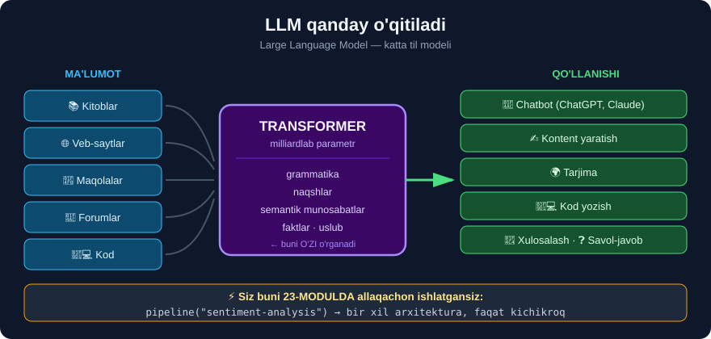

# 2-dars. NLP uchun chuqur o'qitish

## 🎬 Boshlashdan oldin

> **"Endi sizda chuqur o'qitish haqida kamida ASOSIY tushuncha bor. Keling, uning NLP uchun ba'zi qo'llanilishlarini muhokama qilaylik."**

---

## 1. ChatGPT

> ## **"Hozirgi kundagi eng mashhur misollardan biri — va ehtimol siz bu kursni qidirishga sabab bo'lgan narsa — bu CHATGPT, OpenAI tomonidan qurilgan ILG'OR TIL MODELI."**
>
> ## **"Eng asosida ChatGPT TRANSFORMER deb ataladigan neyron tarmoq arxitekturasidan foydalanadi."**

> ## 💡 **"Sentiment tahlili darsimizni eslasangiz, biz matnimizda sentimentni topish uchun AYNAN SHU oldindan o'qitilgan transformer modellaridan birini ishlatganimizni eslaysiz."**

```
23-MODULDA SIZ SHUNI YOZGANDINGIZ:

from transformers import pipeline
p = pipeline("sentiment-analysis")
p("I love this!")

        ↑
   Bu — ChatGPT bilan BIR XIL arxitektura!
   Faqat ANCHA kichikroq va bitta vazifaga o'qitilgan.
```

> ## 🔑 **Ya'ni siz ALLAQACHON transformer ishlatgansiz.** ChatGPT — bu **o'sha g'oya**, faqat **millionlab marta kattaroq**.

---

## 2. Katta til modellari (LLM)

> **"Umuman olganda, ChatGPT — bu KATTA TIL MODELIGA (large language model) misol."**
>
> ## **"Katta til modellari JUDA KATTA HAJMDAGI MA'LUMOTDAN o'rganish orqali inson kabi matnni TUSHUNISH, QAYTA ISHLASH va YARATISH uchun mo'ljallangan."**



### Nimadan o'rganadi?

> **"Bu katta til modellari JUDA KATTA VA XILMA-XIL ma'lumotda o'qitiladi — KITOBLARDAN tortib VEB-SAYTLAR, MAQOLALARGACHA. Juda ko'p turli matn ma'lumoti kiritiladi."**

```
📚 Kitoblar          ┐
🌐 Veb-saytlar       ├──►  MODEL  ──►  inson kabi matn
📰 Maqolalar         │
💬 Forumlar          ┘
🧑‍💻 Kod
```

> **"...inson tilini, NAQSHLARNI, SEMANTIK MUNOSABATLARNI va GRAMMATIKANI tushunish imkonini berish uchun — shunda inson kabi matn generatsiya qilinishi mumkin."**

### 🔑 Model AYNAN NIMANI o'rganadi?

| O'rganadi | Misol |
|---|---|
| **Grammatika** | *"The cat **sits**"* ✅ · *"The cat **sit**"* ❌ |
| **Naqshlar** | Savoldan keyin **javob** keladi |
| **Semantik munosabatlar** | `king − man + woman ≈ queen` |
| **Faktlar** | *"Toshkent — O'zbekiston poytaxti"* |
| **Uslub** | Rasmiy · norasmiy · she'riy |

---

## 3. Qanday qo'llanadi?

> **"Bu modellar NLP sohasida SEZILARLI YUTUQLARNI namoyish etdi va CHATBOTLARDA, KONTENT YARATISHDA, TIL TARJIMASIDA va shunga o'xshash JUDA KO'P turli qo'llanishlarda foydalanish holatlarini topdi."**

| Soha | Misol |
|---|---|
| 💬 **Chatbotlar** | ChatGPT, Claude, mijozlarni qo'llab-quvvatlash |
| ✍️ **Kontent yaratish** | Maqola, xat, reklama matni |
| 🌍 **Tarjima** | Google Translate *(zamonaviy versiyasi)* |
| 🧑‍💻 **Kod yozish** | GitHub Copilot, Claude Code |
| 📄 **Xulosalash** | Uzun hujjatni qisqartirish |
| ❓ **Savol-javob** | Hujjatlardan javob topish |
| 🔍 **Qidiruv** | Semantik qidiruv *(25-modulni eslang!)* |

---

## 4. 🗺️ Siz o'rgangan narsalar bilan bog'lanish

```
21-MODUL  Tozalash          →  LLM ham ma'lumotni tozalaydi (juda katta miqyosda)
22-MODUL  POS/NER           →  LLM buni O'ZI o'rganadi (aytish shart emas)
23-MODUL  Sentiment         →  ✅ SIZ TRANSFORMER ISHLATDINGIZ
24-MODUL  Vektorlashtirish  →  LLM "embedding" ishlatadi (aqlliroq TF-IDF)
25-MODUL  Mavzular          →  LLM mavzuni kontekstdan tushunadi
26-MODUL  Tasniflagich      →  LLM ni "fine-tune" qilish mumkin
27-MODUL  Keys              →  LLM bu ishning ko'pini avtomatlashtiradi
```

> ## 💡 **Savol tug'ilishi mumkin:** *"Agar LLM hammasini qila olsa, nima uchun 21–27 modullarni o'rgandim?"*

### Uchta sabab

**① LLM QIMMAT va SEKIN**

```
1 000 000 ta sharhni tasniflash:
  sklearn SVM  →  10 soniya, bepul
  GPT-4        →  soatlar, yuzlab dollar
```

**② LLM TUSHUNTIRIB BERMAYDI**

```
"Nima uchun bu sharh salbiy?"
  Logistik regressiya →  "waste (-2.1), short (-1.8)"  ✅
  LLM                 →  "chunki men shunday deb o'yladim"  ❌
```

**③ Siz LLM'ni TEKSHIRA olishingiz kerak**

```
27-modulni eslang: "Reuters" shipchasi
  LLM ham xuddi shu tuzoqqa tushadi!
  Buni FAQAT ma'lumotni tushunadigan odam topa oladi.
```

> ## 🔑 **21–27 modullar — bu LLM'ning O'RNIGA emas, uning FUNDAMENTI.** Siz endi LLM **nima qilayotganini** tushunasiz.

---

## 5. Kelajak

> **"Biz bu modellarni takomillashtirish va rivojlantirishda davom etar ekanmiz, ANCHA INTERAKTIV va ANCHA MUKAMMAL ILG'OR INSON-KOMPYUTER O'ZARO ALOQASI imkoniyati YANADA ERISHILISHI mumkin bo'lib bormoqda."**
>
> ## **"Shuning uchun NLP sohasida ish boshlash uchun bu JUDA HAYAJONLI VAQT, va men sizning sayohatingizni men bilan boshlashga qaror qilganingizdan juda xursandman."**

---

## 6. ⚡ Mashqlar

### 🟢 Oson

**M1.** ChatGPT qaysi arxitekturadan foydalanadi?

**M2.** LLM nimadan o'rganadi?

**M3.** LLM ning 4 ta qo'llanishini ayting.

<details>
<summary>✅ Javoblar</summary>

**M1.** ## **TRANSFORMER** — siz uni **23-modulda** allaqachon ishlatgansiz!

**M2.** **Katta va xilma-xil matn**: kitoblar, veb-saytlar, maqolalar, forumlar, kod.

**M3.** Chatbot · kontent yaratish · tarjima · kod yozish · xulosalash · savol-javob *(istalgan 4 tasi)*.

</details>

### 🟡 O'rta

**M4.** Nima uchun LLM bo'lsa ham an'anaviy NLP kerak?

**M5.** ⭐ 23-moduldagi kodingizni eslang — u ChatGPT bilan qanday bog'liq?

<details>
<summary>✅ Javoblar</summary>

**M4.**
```
① QIMMAT va SEKIN — 1M sharh: sklearn 10 sek vs GPT-4 soatlar
② TUSHUNTIRMAYDI — "nima uchun?" savoliga javob yo'q
③ TEKSHIRISH kerak — "Reuters" shipchasi LLM'da ham bo'ladi
```

**M5.**
```python
# 23-modulda siz yozgandingiz:
from transformers import pipeline
p = pipeline("sentiment-analysis")

# Bu model: distilbert-base-uncased-finetuned-sst-2-english
#            ↑
#    TRANSFORMER arxitekturasi — ChatGPT bilan BIR XIL!
#    Farqi: hajm (66M vs 1.7T parametr) va vazifa
```

> 🔑 **Siz allaqachon LLM oilasidan bir modelni ishlatgansiz** — faqat kichik va **bitta vazifaga** moslashtirilganini.

</details>

---

## 🧠 O'zini tekshirish savollari

1. ChatGPT arxitekturasi nima?
2. LLM nimani anglatadi?
3. LLM nimalarni o'rganadi?
4. Nima uchun an'anaviy NLP hali ham kerak?
5. Siz qaysi modulda transformer ishlatgansiz?

<details>
<summary>✅ Javoblar</summary>

1. ## **Transformer** neyron tarmoq arxitekturasi.
2. **Large Language Model** — katta til modeli.
3. **Grammatika**, **naqshlar**, **semantik munosabatlar**, **faktlar**, **uslub**.
4. **Narx/tezlik** · **tushuntirish** · **tekshirish** — LLM'ni ham **kimdir** nazorat qilishi kerak.
5. ## **23-modul** *(sentiment tahlili)* — `pipeline("sentiment-analysis")`.

</details>

---

## 📌 Xulosa

```
ChatGPT  =  TRANSFORMER arxitekturasi
              ↑
   Siz buni 23-MODULDA ALLAQACHON ishlatgansiz!

   from transformers import pipeline
   p = pipeline("sentiment-analysis")


LLM = Large Language Model (katta til modeli)

  NIMADAN O'RGANADI?
    📚 kitoblar · 🌐 veb-saytlar · 📰 maqolalar · 💬 forumlar · 🧑‍💻 kod

  NIMANI O'RGANADI?
    grammatika · naqshlar · semantik munosabatlar · faktlar · uslub


QO'LLANISHI
  💬 chatbot  ✍️ kontent  🌍 tarjima  🧑‍💻 kod
  📄 xulosa   ❓ savol-javob  🔍 qidiruv


⚠️ NIMA UCHUN 21-27 MODULLAR HALI HAM KERAK?

  ① LLM QIMMAT va SEKIN
     1M sharh:  sklearn 10 sek  vs  GPT-4 soatlar
  ② LLM TUSHUNTIRMAYDI
     "waste (-2.1)" vs "chunki men shunday o'yladim"
  ③ LLM'ni TEKSHIRISH kerak
     "Reuters" shipchasi LLM'da HAM bo'ladi

  🔑 21-27 modullar — LLM ning O'RNIGA emas, FUNDAMENTI
```

---

## 🔖 Atamalar

| Atama | Inglizcha | Izoh |
|---|---|---|
| LLM | *large language model* | Katta til modeli |
| Transformer | *transformer* | Zamonaviy NLP arxitekturasi |
| Fine-tuning | *fine-tuning* | Tayyor modelni moslashtirish |
| Embedding | *embedding* | So'zning ma'noli vektori |
| Inson-kompyuter aloqasi | *human-computer interaction* | Foydalanuvchi bilan muloqot |

---

⬅️ [Oldingi: Chuqur o'qitish nima?](01-What-is-Deep-Learning.md) · 🏠 [Modul boshiga](README.md) · ➡️ [Keyingi: Ingliz tilidan boshqa NLP](03-Non-English-NLP.md)
