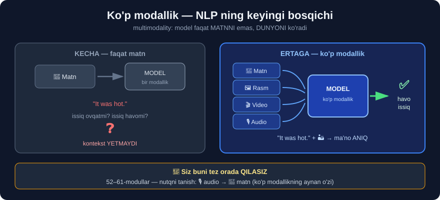

# 4-dars. NLP uchun keyingi nima?

## 🎬 Boshlashdan oldin

> **"NLP sohasi texnologik yutuqlar va o'qitish uchun KATTA MIQYOSDAGI ma'lumot to'plamlarining ortib borayotgan mavjudligi bilan TEZ RIVOJLANISHDA DAVOM ETISHI kutilmoqda."**
>
> **"Mana NLP keyingi bir necha yil ichida qanday rivojlanishi mumkinligining ba'zi yo'llari."**

> ## 🏁 **Bu — NLP bo'limining SO'NGGI darsi.** 20-moduldan beri yurgan yo'lingizga yakun yasaymiz — va oldinda nima turganini ko'ramiz.

---

## 1. 🧠 Chuqurroq kontekstual tushunish

> ## **"Birinchisi — NLP CHUQURROQ KONTEKSTUAL TUSHUNISHGA erishishi kutilmoqda."**
>
> ## **"Ya'ni SEMANTIKA va UMUMIY SO'Z BILIMINI tushunishda yaxshilanish, hatto o'z qarorlari ortida MULOHAZA YURITISH qobiliyatiga ega bo'lish."**

### Nima uchun bu MUHIM — sizning tajribangizdan

Eslang, **24-modulda** siz Bag of Words bilan ishlagansiz:

```python
CountVectorizer().fit_transform([
    "The dog bit the man",
    "The man bit the dog"
])
```

> ## ❌ **Bu ikki jumla BOG uchun MUTLAQO BIR XIL!** Bir xil so'zlar, bir xil sanoqlar. Lekin ma'nosi **butunlay boshqa**.

```
BAG OF WORDS ko'zi bilan:
   {the:2, dog:1, bit:1, man:1}     ← jumla 1
   {the:2, dog:1, bit:1, man:1}     ← jumla 2
                ↑
        FARQ YO'Q!  ❌

KONTEKSTUAL model ko'zi bilan:
   jumla 1:  it kishini tishladi     🐕→🧑
   jumla 2:  kishi itni tishladi     🧑→🐕
                ↑
        FARQ BOR!  ✅
```

### Uch pog'ona

| Pog'ona | Nima qiladi | Sizning modulingiz |
|---|---|---|
| 1️⃣ **So'zlarni sanash** | `the` 3 marta uchradi | **24-modul** *(BOW/TF-IDF)* |
| 2️⃣ **Kontekstni tushunish** | *"bank"* — daryo qirg'og'imi yoki bankmi? | **28-modul** *(transformer)* |
| 3️⃣ **Mulohaza yuritish** ⭐ | *"Nima uchun bunday deb o'yladim?"* | **KELAJAK** |

### ⭐ Uchinchi pog'ona — MULOHAZA

> **"...hatto o'z qarorlari ortida MULOHAZA YURITISH qobiliyatiga ega bo'lish."**

```
ODDIY MODEL:
  Savol :  "Bu sharh salbiymi?"
  Javob :  "Ha"                          ← nima uchun? ❓

MULOHAZA YURITUVCHI MODEL:
  Savol :  "Bu sharh salbiymi?"
  Javob :  "Ha, chunki:
            ① 'waste of time' — vaqt behuda ketgani
            ② 'would not recommend' — inkor + tavsiya
            ③ lekin 'nice cover' — muallif dizaynni maqtagan
            → umumiy baho: SALBIY (ishonch 0.85)"     ✅
```

> ## 💡 **26-modulda siz `coef_` orqali AYNAN SHUNI qilgandingiz** — qaysi so'z qarorga qancha ta'sir qilganini ko'rgandingiz. Kelajak modellari buni **o'zi**, **tabiiy tilda** tushuntirib beradi.

---

## 2. 🎨 Ko'p modallik (multimodal)

> ## **"Ikkinchisi — KO'P MODALLI TUSHUNISH."**
>
> ## **"NLP faqat MATN ma'lumoti bilan emas, balki RASMLAR, VIDEOLAR va AUDIO bilan ham oziqlantiriladi — shunda til modeli tilning qanday ishlashini va u ishlatilishi mumkin bo'lgan turli kontekstlarni YANADA YAXSHIROQ tushunadi."**



### Nima uchun rasm KERAK?

```
MATN:  "It was hot."

   Faqat matndan:  issiq ovqatmi? issiq havomi? ❓

MATN + RASM:  "It was hot."  +  🏜️ cho'l fotosurati

   Endi ANIQ:  havo issiq  ✅
```

> **"...til modeli tilning qanday ishlashini va u ishlatilishi mumkin bo'lgan TURLI KONTEKSTLARNI yanada yaxshiroq tushunishi uchun."**

### Bu bugun NIMA qila oladi?

| Kirish | Chiqish | Misol |
|---|---|---|
| 🖼️ rasm → 📝 matn | Tavsif | *"Bu rasmda nima?"* |
| 📝 matn → 🖼️ rasm | Generatsiya | *DALL·E, Midjourney* |
| 🎙️ audio → 📝 matn | Transkripsiya | ## **52–61-modullar!** |
| 📝 matn → 🎙️ audio | Ovoz | Ekran o'quvchi |
| 🎬 video → 📝 matn | Xulosa | Yig'ilish bayoni |
| 📄 hujjat → 📝 javob | Savol-javob | Skanerdan o'qish |

> ## 🎯 **Siz buni tez orada QILASIZ.** Kursning **52–61-modullari** — nutqni tanish *(speech recognition)*. Bu — **audio + matn** ko'p modalligining aynan o'zi.

---

## 3. ⚡ Tezlik va real vaqt

> ## **"Tezroq, ko'proq interaktiv NLP yechimlariga TALAB ORTGANI SARI, biz MODEL ARXITEKTURALARINI OPTIMALLASHTIRISHDA, shuningdek, REAL VAQT rejimidagi yechimlarni yetkazib berish uchun zarur texnologiyalarda ham yutuqlarni ko'ramiz."**

### Muammo

```
KATTA MODEL           KICHIK MODEL
  ✅ aqlliroq            ✅ tez
  ❌ sekin               ❌ soddaroq
  ❌ qimmat              ✅ arzon
  ❌ serverda            ✅ telefoningizda!
```

> ## 🔑 **Kelajak — HAR IKKALASI.** Kichik model, lekin aqlli.

### Optimallashtirish usullari

| Usul | G'oya | Natija |
|---|---|---|
| **Distillation** | Katta model kichikni **o'qitadi** | 10× kichik, 95% sifat |
| **Quantization** | 32-bit → **8-bit** sonlar | 4× kam xotira |
| **Pruning** | Keraksiz bog'lanishlarni **kesish** | 2–3× tez |
| **Caching** | Javobni **eslab qolish** | Takroriy so'rov — bepul |

> ## 💡 **Sizning `sklearn` modelingiz allaqachon "real vaqt":** 26-moduldagi `SGDClassifier` 1 000 000 ta sharhni **10 soniyada** tasniflaydi. LLM'lar hozir **shu tezlikka** intilmoqda.

### 📊 Amaliy taqqoslash

```
1 000 000 ta sharhni tasniflash:

sklearn SVM      │████                    │  10 soniya    ·  $0
Kichik model     │████████████            │  ~1 soat      ·  ~$5
Katta LLM        │████████████████████████│  ~10 soat     ·  ~$500

🔑 SABOQ: eng katta model DOIM ham to'g'ri tanlov EMAS.
```

---

## 4. ⚖️ Axloq, tarafkashlik, maxfiylik

> ## **"Biz shuningdek, har qanday yangi NLP ishlanmasining eng oldida ADOLAT, INKLYUZIVLIK va SHAFFOFLIKNI saqlab qolish uchun AXLOQIY MULOHAZALAR, TARAFKASHLIK va MAXFIYLIK muammolari atrofidagi suhbatlarni ko'proq eshitamiz."**

> ## ⭐⭐ **Bu — 27-modulning ASOSIY SABOG'I.** Va bu tasodif emas.

### 🔁 27-modulni eslang

```
Model 88.9% aniqlik berdi.  Ajoyib!  ✅

Keyin biz TEKSHIRDIK:

  "Reuters" so'zi:
     Soxta yangilikda   →    1/98   =    1%
     Haqiqiy yangilikda →  100/100  =  100%

  Bitta qator qoida:
     np.where(text.str.contains("Reuters"), "Haqiqiy", "Soxta")
     →  99.5% aniqlik!

  ❌ Model TILNI o'rganmagan edi.
  ❌ Model NASHRIYOT NOMINI o'rgangan edi.
```

> ## 🔑 **Bu — SHIPCHA O'RGANISH *(shortcut learning)*.** Va uni **faqat odam** topa oladi.

### Uchta xavf

**① 📉 TARAFKASHLIK *(bias)***

```
O'qitish ma'lumoti:  faqat erkak dasturchilar haqida
Model o'rganadi   :  "dasturchi" = erkak
Natija            :  ayol nomzodni past baholaydi   ❌
```

**② 🚫 INKLYUZIVLIK**

```
3-darsni eslang:
   spaCy  →  79 til, o'zbek YO'Q
   VADER  →  faqat ingliz tili

🔑 Dunyoda 7000+ til bor.
   NLP ularning ~1% ini yaxshi qo'llab-quvvatlaydi.
```

**③ 🔒 MAXFIYLIK**

```
Sizning ma'lumotingiz  →  LLM API  →  ??? 

Savollar:
  · Ma'lumot saqlanadimi?
  · Model o'qitishga ishlatiladimi?
  · Tibbiy/moliyaviy ma'lumotni yuborsak bo'ladimi?
  · GDPR / mahalliy qonunlar nima deydi?
```

### ✅ Tekshirish ro'yxati — HAR BIR NLP loyihasi uchun

```
□ Model NIMANI o'rgandi?         →  coef_ ni ko'ring (26-modul)
□ Shipcha bormi?                 →  27-modul usulini qo'llang
□ Bazaviy modeldan yaxshimi?     →  DummyClassifier
□ Ma'lumot vakillimi?            →  kim YO'Q?
□ Xato kimga zarar keltiradi?    →  yolg'on ijobiy vs salbiy
□ Ma'lumot maxfiyligi?           →  qayerga yuborilyapti?
□ Qarorni TUSHUNTIRA olasizmi?   →  yo'q bo'lsa — ishlatmang
```

> ## 💡 **Kursning 68–76-modullari — TO'LIQ AXLOQQA bag'ishlangan.** Bu — mavzuning qanchalik jiddiy ekanini ko'rsatadi.

---

## 5. 🎓 O'qituvchining xayrlashuvi

> ## **"Bu kursni o'tayotganingizda ko'rganingizdek, NLP kundalik hayotimiz uchun JUDA KO'P AJOYIB QO'LLANISHGA ega."**
>
> ## **"Men chin dildan bu kursni MEN BILAN birga o'tganingizdan zavqlangan bo'lishingizga umid qilaman."**
>
> ## **"Tabiiy tilni qayta ishlashga kirish bilan tanishib, umid qilamanki, siz endi O'ZINGIZNING NLP YECHIMLARINGIZNI QURISHNI BOSHLASHGA TAYYORSIZ."**

---

## 6. 🗺️ Siz nimalarni O'RGANDINGIZ — 20-28-modullar

```
┌─────────────────────────────────────────────────────────┐
│  20  KIRISH            NLP nima, qayerda ishlatiladi    │
│  21  TOZALASH          token · stopword · stem · lemma  │
│  22  POS / NER         so'z turkumi · nomli obyekt       │
│  23  SENTIMENT         TextBlob · VADER · transformer   │
│  24  VEKTORLASHTIRISH  BOW · TF-IDF                     │
│  25  MAVZULAR          LDA · LSA (nazoratsiz)           │
│  26  TASNIFLAGICH      LR · NB · SVM (nazorat ostida)   │
│  27  KEYS              haqiqiy loyiha + SHIPCHA topish  │
│  28  KELAJAK           chuqur o'qitish · LLM · o'zbek   │
└─────────────────────────────────────────────────────────┘
        9 modul  ·  43 dars  ·  350+ mashq
```

### 🏆 Uchta eng qimmatli saboq

| № | Saboq | Qayerdan |
|---|---|---|
| 1️⃣ | ## **Ko'proq MA'LUMOT > aqlliroq ALGORITM** | 26-modul: 0.50 → 0.87 |
| 2️⃣ | ## **Modelni DOIM tekshiring** | 27-modul: "Reuters" shipchasi |
| 3️⃣ | ## **Sodda model ko'pincha YETARLI** | 24-modul: TF-IDF hali ham ishlaydi |

---

## 7. ➡️ Oldinda nima bor?

```
SIZ SHU YERDASIZ  ──►  28-modul (NLP tugadi)
                          │
                          ▼
   ┌──────────────────────────────────────────────┐
   │  29-34  LLM                                  │
   │         Transformer · GPT · Hugging Face     │
   │         BERT · XLNet                         │
   ├──────────────────────────────────────────────┤
   │  35-42  LangChain                            │
   │         Prompt · Chain · Agent · RAG         │
   ├──────────────────────────────────────────────┤
   │  43-47  LangGraph                            │
   │         Murakkab agent oqimlari              │
   ├──────────────────────────────────────────────┤
   │  48-51  Vektor bazalar                       │
   │         Embedding · semantik qidiruv         │
   ├──────────────────────────────────────────────┤
   │  52-61  Nutqni tanish                        │
   │         Audio → matn (KO'P MODALLIK!)        │
   ├──────────────────────────────────────────────┤
   │  62-67  LLM muhandisligi                     │
   │         Ishlab chiqarishga chiqarish         │
   ├──────────────────────────────────────────────┤
   │  68-76  AI AXLOQI                            │
   │         Tarafkashlik · maxfiylik · adolat    │
   └──────────────────────────────────────────────┘
```

> ## 💡 **Diqqat qiling:** bu darsda o'qituvchi aytgan **to'rtta yo'nalish** — kontekst, ko'p modallik, tezlik, axloq — kursning **qolgan qismida AYNAN shu tartibda** ochib beriladi. Bu tasodif emas.

---

## 8. ⚡ Mashqlar

### 🟢 Oson

**M1.** O'qituvchi NLP rivojlanishining nechta yo'nalishini sanaydi? Ularni ayting.

**M2.** "Ko'p modallik" nima degani?

**M3.** Nima uchun tezlik muhim?

<details>
<summary>✅ Javoblar</summary>

**M1.** ## **To'rtta:**
```
① Chuqurroq kontekstual tushunish (semantika + mulohaza)
② Ko'p modallik (matn + rasm + video + audio)
③ Tezlik / real vaqt (arxitekturani optimallashtirish)
④ Axloq (tarafkashlik, maxfiylik, adolat, shaffoflik)
```

**M2.** Model **faqat matn** emas, balki **rasm**, **video** va **audio** bilan ham ishlaydi. Bir necha turdagi ma'lumot = *"modallik"*.

**M3.** Chunki **interaktiv** yechimlarga talab ortmoqda — foydalanuvchi javobni **darhol** kutadi, soatlab emas.

</details>

### 🟡 O'rta

**M4.** BOG ning kontekstni tushunmasligini **kodda** ko'rsating.

**M5.** 27-moduldagi "Reuters" muammosi bu darsning qaysi yo'nalishiga tegishli? Nima uchun?

<details>
<summary>✅ Javoblar</summary>

**M4.**
```python
from sklearn.feature_extraction.text import CountVectorizer
cv = CountVectorizer()
X = cv.fit_transform(["The dog bit the man", "The man bit the dog"])
print(cv.get_feature_names_out())
print(X.toarray())
```
```
['bit' 'dog' 'man' 'the']
[[1 1 1 2]
 [1 1 1 2]]
```
> ## ❌ **Ikki qator MUTLAQO bir xil!** Ma'nosi teskari bo'lsa ham. Mana nima uchun **kontekstual** modellar kerak.

**M5.** ## **To'rtinchi yo'nalish — AXLOQ va SHAFFOFLIK.**

```
Model 88.9% aniqlik berdi          →  ko'rinishidan yaxshi
Lekin TILNI o'rganmagan edi        →  nashriyot nomini o'rgangan
Yangi manbadagi yangilikda         →  BUTUNLAY ishlamaydi

🔑 Shaffoflik bo'lmasa, biz buni HECH QACHON bilmagan bo'lardik.
```

</details>

### 🔴 Qiyin

**M6.** ⭐ O'zingizning NLP loyihangiz uchun **axloqiy tekshirish skripti** yozing — ma'lumotda shipchalar bormi-yo'qligini avtomatik tekshirsin.

<details>
<summary>✅ Yechim</summary>

```python
import pandas as pd
import numpy as np
from sklearn.feature_extraction.text import CountVectorizer

def shipcha_tekshir(matnlar, yorliqlar, min_uchrash=10, chegara=0.90):
    """Bitta so'z yorliqni deyarli to'liq bashorat qila oladimi?"""
    cv = CountVectorizer(binary=True, min_df=min_uchrash)
    X = cv.fit_transform(matnlar)
    sozlar = cv.get_feature_names_out()
    y = pd.Series(list(yorliqlar))

    topilgan = []
    for i, soz in enumerate(sozlar):
        bor = np.asarray(X[:, i].todense()).ravel() == 1
        if bor.sum() < min_uchrash:
            continue
        ulush = y[bor].value_counts(normalize=True)
        if ulush.iloc[0] >= chegara:
            topilgan.append({
                "so'z": soz,
                "sinf": ulush.index[0],
                "aniqlik": round(ulush.iloc[0], 3),
                "uchraydi": int(bor.sum()),
            })
    return pd.DataFrame(topilgan).sort_values(
        ["aniqlik", "uchraydi"], ascending=False)


# --- ISHLATISH ---
data = pd.read_csv("../27-Fake-News-Case-Study/data/fake_news_data.csv")
natija = shipcha_tekshir(data["text"], data["fake_or_factual"])

print(f"⚠️  {len(natija)} ta shipcha topildi!\n")
print(natija.head(10).to_string(index=False))
```

**Haqiqiy natija** *(27-modul ma'lumotida)*:

```
⚠️  39 ta shipcha topildi!

    so'z         sinf  aniqlik  uchraydi
     via    Fake News      1.0        48
featured    Fake News      1.0        31
minister Factual News      1.0        27
   getty    Fake News      1.0        18
     gop    Fake News      1.0        18
  images    Fake News      1.0        18
    read    Fake News      1.0        17
   prime Factual News      1.0        16
     com    Fake News      1.0        15
     pic    Fake News      1.0        13
```

**Uch xil shipcha turi ko'rinib turibdi:**

| Tur | So'zlar | Nima uchun shipcha |
|---|---|---|
| 🖼️ **Rasm manbasi** | `getty` · `images` · `pic` · `featured` | Soxta saytlar **rasm izohini** matn ichida qoldiradi |
| 🔗 **Havola qoldig'i** | `via` · `com` · `read` | *"Read more via example**.com**"* — **HTML qoldig'i** |
| 🏛️ **Mavzu farqi** | `minister` · `prime` | Haqiqiy manbalar **xalqaro siyosat** haqida ko'proq yozadi |

> ## ❌ **Uchalasi ham TILGA aloqador emas.** Birinchi ikkitasi — **texnik qoldiq**, uchinchisi — **mavzu qiyshiqligi** *(topic skew)*.
>
> ## 🔑 **Bu skriptni HAR BIR loyihangizda ishlating.** Model o'qitishdan **OLDIN**. U sizni soxta 99% aniqlikdan saqlaydi.

</details>

---

## 🧠 O'zini tekshirish savollari

1. NLP rivojlanishining to'rtta yo'nalishi qaysilar?
2. "Mulohaza yuritish" oddiy bashoratdan nimasi bilan farq qiladi?
3. Ko'p modallik kursning qaysi modullarida uchraydi?
4. Nima uchun eng katta model doim to'g'ri tanlov emas?
5. Axloqiy tekshirishning kamida 3 ta bandini ayting.

<details>
<summary>✅ Javoblar</summary>

1. ## **Kontekst** · **ko'p modallik** · **tezlik** · **axloq**.
2. Model **javobni** emas, **sababni ham** beradi — qaysi dalil qarorga qanday ta'sir qilgan.
3. ## **52–61-modullar** — nutqni tanish *(audio + matn)*.
4. **Narx** va **tezlik**: `sklearn` 1M sharhni **10 soniyada bepul**, LLM — **soatlab, yuzlab dollar**.
5. Model nimani o'rgandi? · Shipcha bormi? · Bazaviydan yaxshimi? · Ma'lumot vakillimi? · Xato kimga zarar? · Maxfiylik? · Tushuntira olasizmi?

</details>

---

## 📌 Xulosa

```
NLP NING TO'RT YO'NALISHI

  ① 🧠 KONTEKST
       so'z sanash → ma'no → MULOHAZA
       "dog bit man" ≠ "man bit dog"

  ② 🎨 KO'P MODALLIK
       matn + rasm + video + audio
       →  52-61-MODULLAR (nutqni tanish)

  ③ ⚡ TEZLIK
       distillation · quantization · pruning · caching
       kichik + aqlli = telefoningizda ishlaydi

  ④ ⚖️ AXLOQ
       tarafkashlik · inklyuzivlik · maxfiylik · shaffoflik
       →  68-76-MODULLAR


20-28 MODULLARDAN UCHTA ASOSIY SABOQ

  1️⃣  Ko'proq MA'LUMOT  >  aqlliroq ALGORITM     (26-modul)
  2️⃣  Modelni DOIM tekshiring                    (27-modul)
  3️⃣  Sodda model ko'pincha YETARLI              (24-modul)


         🏁  NLP BO'LIMI TUGADI  🏁
              9 modul · 43 dars

         ➡️  KEYINGI: 29-MODUL — LLM
```

---

## 🔖 Atamalar

| Atama | Inglizcha | Izoh |
|---|---|---|
| Kontekstual tushunish | *contextual understanding* | So'zning atrofdagi ma'nosi |
| Mulohaza yuritish | *reasoning* | Qaror sababini tushuntirish |
| Ko'p modallik | *multimodality* | Matn + rasm + audio + video |
| Real vaqt | *real time* | Darhol javob |
| Distillation | *distillation* | Katta model kichigini o'qitadi |
| Quantization | *quantization* | Sonlar aniqligini kamaytirish |
| Tarafkashlik | *bias* | Modelning nohaq moyilligi |
| Inklyuzivlik | *inclusivity* | Hammani qamrab olish |
| Shaffoflik | *transparency* | Qaror qanday qabul qilingani ko'rinishi |

---

⬅️ [Oldingi: Ingliz tilidan boshqa NLP](03-Non-English-NLP.md) · 🏠 [Modul boshiga](README.md) · ➡️ **29-modul: LLM'ga kirish**
