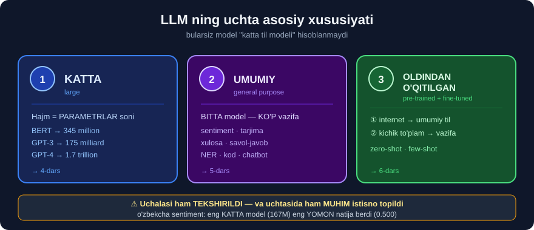

# 3-dars. LLM nima?

## 🎬 Boshlashdan oldin

> **"So'nggi yillarda katta til modellaridan qochish qiyin bo'ldi — ular butun dunyo yangiliklarini egallab oldi."**

---

## 1. Nima uchun hamma bu haqda gapiryapti?

> ## **"Bu sohadagi eng mashhur modellardan biri — OpenAI'ning CHATGPT'i. U she'r, insho, ijtimoiy tarmoq kontenti, KOD va yana ko'p narsani yoza olishi bilan yangiliklarda hukmronlik qildi."**

### Haqiqiy qo'llanishlar

> **"GPT va shunga o'xshash modellar hatto xalqaro tadbirlar davomida tillarni REAL VAQTDA tarjima qilishda va hayotiy muhim ma'lumotni bir necha tilga tez tarjima qilib, TABIIY OFATLARDA YORDAM ko'rsatishda ham qo'llanildi."**
>
> **"Katta til modellari SOG'LIQNI SAQLASH dunyosiga ham yo'l topdi — tibbiy tadqiqot va TASHXISGA yordam bermoqda."**

```
📰 Yangiliklar   →  she'r · insho · kod
🌍 Tarjima       →  xalqaro tadbirlarda REAL VAQTDA
🆘 Tabiiy ofat   →  muhim ma'lumotni tez tarjima qilish
🏥 Tibbiyot      →  tadqiqot va tashxisga yordam
```

---

## 2. ⭐ Oddiy tushuntirish

> ## **"Juda sodda qilib aytganda, tasavvur qiling: siz kompyuterga BUTUN INTERNETGA kirish huquqini berasiz va unga o'qiganining HAMMASINI o'rganishni buyurasiz — shu bilan birga bu tilning tuzilishi va grammatikasini o'rganish usuli ham bo'ladi."**
>
> ## **"Bu LLM aynan qanday ishlashi EMAS — bunga keyinroq keladik — lekin NATIJA bir xil."**

```
        🌐 BUTUN INTERNET
               ↓
      "hammasini o'qi va o'rgan"
               ↓
   ┌───────────────────────────┐
   │   UMUMIY BILIMGA EGA      │
   │   MASHINA                 │
   └───────────────────────────┘
               ↓
   ✨ VA U SIZ BILAN GAPLASHA OLADI
```

> ## **"Sizda AJOYIB UMUMIY BILIMGA ega mashina qoladi. Va nafaqat shu — mashina o'zi bilgan narsalar haqida siz bilan HAQIQATAN GAPLASHA oladi."**
>
> **"Siz unga savol berishingiz yoki tilga asoslangan vazifa topshirishingiz mumkin — mashina savolingizni TUSHUNADI va mos javob bera oladi."**

### 🔑 Ikkita qism

| | Nima | Sizning tajribangiz |
|---|---|---|
| 1️⃣ **Biladi** | Umumiy bilim | Wikipedia kabi |
| 2️⃣ **Gaplasha oladi** ⭐ | Savolni tushunadi, javob beradi | ## **Mana YANGILIK shu** |

> ## 💡 **Ikkinchisi — inqilob.** Ma'lumotlar bazasi ham ko'p narsani "biladi", lekin u bilan **gaplashib bo'lmaydi**. LLM — bilim **+ muloqot**.

---

## 3. Nima uchun bu "yorib o'tish"?

> **"Katta til modellari sun'iy intellekt va tabiiy tilni qayta ishlash sohasidagi O'ZGARTIRUVCHI YORIB O'TISHNI ifodalaydi."**
>
> **"Bu modellar mashinali o'qitishdagi ajoyib taraqqiyotning isboti — ular kompyuterlarga inson tilini MISLI KO'RILMAGAN MIQYOS va MURAKKABLIKDA tushunish va yaratish imkonini beradi."**

### Ildizi — chuqur o'qitish

> ## **"Bu katta til modellarining markazida CHUQUR O'QITISH yotadi — bu mashinali o'qitishning inson miyasining neyron tarmoqlarini taqlid qiluvchi qism sohasi."**

```
Sun'iy intellekt (AI)
  └── Mashinali o'qitish (ML)
        └── CHUQUR O'QITISH (Deep Learning)     ← 28-modul!
              └── TRANSFORMER                    ← 30-modul
                    └── LLM                      ← SHU YERDA
```

> ## **"Biroq bugun ko'rayotgan ulkan innovatsiyalarga haqiqatan olib kelgan narsa — TRANSFORMER deb nomlanuvchi model arxitekturasi turi."**
>
> **"Bu — mashina tilning murakkabligini o'rganishining YANGI usuli, va transformerlar bugungi modellarning shunday ajoyib natijalarga ega bo'lishining SABABI."**

---

## 4. ⭐⭐ LLM ning UCHTA asosiy xususiyati

> ## **"Katta til modelini o'ziga xos qiladigan UCHTA ASOSIY XUSUSIYAT bor."**



### ① KATTA *(large)*

> **"Birinchi jihat — nomidan taxmin qilganingizdek — katta til modellari, xo'sh, KATTA. Ilgari ko'rgan boshqa modellarimizga qaraganda bu modellar hajmi jihatidan ULKAN."**
>
> **"Ularning hajmi — biz ko'rgan ajoyib natijalarga imkon beruvchi jihatlardan biri."**

→ Batafsil: [4-dars](04-How-Large-is-an-LLM.md)

### ② UMUMIY MAQSADLI *(general purpose)*

> **"LLM'larning ikkinchi jihati — ular UMUMIY MAQSADLI."**

→ Batafsil: [5-dars](05-General-Purpose-Models.md)

### ③ OLDINDAN O'QITILGAN + SOZLANADIGAN *(pre-trained & fine-tuned)*

> **"Uchinchisi — ular OLDINDAN O'QITILISHI va SOZLANISHI mumkin."**

→ Batafsil: [6-dars](06-Pre-training-and-Fine-tuning.md)

---

## 5. 💻 Amaliyot — birinchi LLM'ingiz

Nazariya yetarli. **Ko'ramiz.**

```python
from transformers import pipeline

# 23-MODULDAN TANISH KOD — lekin endi biz BILAMIZ bu nima
p = pipeline("sentiment-analysis")

print("Model  :", p.model.name_or_path)
print("Parametr:", f"{sum(x.numel() for x in p.model.parameters()):,}")
print()
print(p("I love this book, it was amazing!"))
```

```
Model  : distilbert/distilbert-base-uncased-finetuned-sst-2-english
Parametr: 66,955,010

[{'label': 'POSITIVE', 'score': 0.9998767375946045}]
```

> ## 🎯 **67 MILLION parametr — va siz uni 3 qatorda ishlatdingiz.**
>
> Bu — **"katta"** ning eng kichik ko'rinishi. GPT-4 bundan **25 000 baravar** kattaroq.

### "Gaplasha oladi" ni ko'ramiz

```python
gap = pipeline("text-generation", model="distilgpt2")
print("parametr:", f"{sum(x.numel() for x in gap.model.parameters()):,}")

for savol in ["The capital of France is", "A large language model is"]:
    r = gap(savol, max_new_tokens=12, do_sample=False, pad_token_id=50256)
    print(repr(r[0]["generated_text"]))
```

```
parametr: 81,912,576

'The capital of France is the capital of the French Republic. The capital of France is'
'A large language model is a good way to understand the language and how it works.'
```

> ## 😬 **BIRINCHI JAVOB — MUVAFFAQIYATSIZLIK.**
>
> ```
> Savol : "The capital of France is..."
> Javob : "...the capital of the French Republic. The capital of France is"
>              ↑
>    ❌ "PARIS" so'zini AYTMADI
>    ❌ O'ZINI TAKRORLAB, aylanib qoldi
> ```
>
> ## ✅ **Ikkinchi javob esa MA'NOLI** — grammatik to'g'ri, mazmunan o'rinli.

### 🔑 Bu — kamchilik emas, DALIL

```
distilgpt2   →     81,912,576 parametr   ≈ 82 MILLION
GPT-4        →  1,700,000,000,000        ≈ 1.7 TRILLION
                        ↑
                20 000 BARAVAR farq
```

> ## 💡 **Model GRAMMATIKANI o'rgangan, lekin FAKTLARNI yetarlicha o'rganmagan.**
>
> Grammatika — **naqsh**, uni kichik modelda ham o'rganish mumkin. Faktlar esa **hajm** talab qiladi: har bir fakt parametrlarda **joy** egallaydi.
>
> Buni [4-darsda](04-How-Large-is-an-LLM.md) raqamlar bilan ko'ramiz.

---

## 6. ⚠️ "Butun internetni o'qidi" — nima uchun bu OGOHLANTIRISH ham?

O'qituvchi buni **ijobiy** tomondan aytadi. Lekin 27-modulni eslang:

```
27-MODUL SABOG'I:
   Ma'lumotda nima bo'lsa — MODEL SHUNI o'rganadi

   "Reuters" so'zi ma'lumotda edi  →  model SHUNI o'rgandi
```

### Endi buni internetga qo'llang

```
🌐 INTERNETDA NIMA BOR?

   ✅ Wikipedia · ilmiy maqolalar · kitoblar
   ⚠️ forum janjallari · noto'g'ri faktlar
   ❌ TARAFKASHLIK · stereotiplar · nafrat

           ↓  MODEL HAMMASINI O'RGANADI  ↓

   🔑 LLM — internetning KO'ZGUSI.
      Yaxshi tomoni ham, yomon tomoni ham.
```

> ## 💡 **Shuning uchun 68–76-modullar AI axloqiga bag'ishlangan.** Va shuning uchun 27-moduldagi **shipcha detektoringiz** LLM davrida ham **kerak** — hatto **ko'proq** kerak.

---

## 7. ⚡ Mashqlar

### 🟢 Oson

**M1.** LLM ni "juda sodda qilib" qanday tushuntirish mumkin?

**M2.** LLM ning uchta asosiy xususiyati qaysilar?

**M3.** LLM markazida qaysi texnologiya yotadi?

<details>
<summary>✅ Javoblar</summary>

**M1.** Kompyuterga **butun internetga** kirish berib, *"o'qiganingning hammasini o'rgan"* deyish. Natijada — **umumiy bilimga ega** va **gaplasha oladigan** mashina.

**M2.** ## ① **KATTA** · ② **UMUMIY MAQSADLI** · ③ **oldindan o'qitilgan + sozlanadigan**

**M3.** ## **CHUQUR O'QITISH** *(deep learning)* — va uning ustida **TRANSFORMER** arxitekturasi.

</details>

### 🟡 O'rta

**M4.** Ma'lumotlar bazasi ham "ko'p narsani biladi". LLM undan nimasi bilan farq qiladi?

**M5.** ⭐ 23-modulda ishlatgan modelingiz nechta parametrga ega? Tekshiring.

<details>
<summary>✅ Javoblar</summary>

**M4.**
```
MA'LUMOTLAR BAZASI          LLM
  ✅ biladi                   ✅ biladi
  ❌ gaplasha olmaydi         ✅ GAPLASHA OLADI
  ❌ savolni tushunmaydi      ✅ savolni TUSHUNADI
  ✅ aniq javob               ⚠️ ba'zan xato ("gallyutsinatsiya")
```
> 🔑 Farq — **tabiiy tildagi muloqot**.

**M5.**
```python
from transformers import pipeline
p = pipeline("sentiment-analysis")
print(f"{sum(x.numel() for x in p.model.parameters()):,}")
```
```
66,955,010
```

</details>

### 🔴 Qiyin

**M6.** ⭐⭐ "LLM butun internetni o'qidi" — bu **qanday xavflar** keltiradi? 27-modul saboqi bilan bog'lang.

<details>
<summary>✅ Javob</summary>

```
27-MODULDA:
  Ma'lumot: 198 ta yangilik
  Shipcha : "Reuters" so'zi
  Natija  : model TILNI emas, NASHRIYOTNI o'rgandi

LLM'DA:
  Ma'lumot: butun internet
  Shipcha : ???  ← BILMAYMIZ, chunki ma'lumotni KO'RA OLMAYMIZ
  Natija  : ???
```

> ## ⚠️ **ENG KATTA FARQ: 27-modulda siz ma'lumotni KO'RGANSIZ va shipchani TOPGANSIZ.**
> ## **LLM'ning o'quv ma'lumotini siz ko'ra OLMAYSIZ.**

**Uchta aniq xavf:**

| Xavf | Misol |
|---|---|
| 📉 **Tarafkashlik** | Internetda kam vakillik qilingan guruhlar → model ularni yomon biladi |
| ❌ **Noto'g'ri faktlar** | Internetdagi xato → modelda xato |
| 🎭 **Gallyutsinatsiya** | Model **ishonch bilan** o'ylab topadi |

**Amaliy yechim:**
```
✅ LLM javobini DOIM tekshiring (ayniqsa faktlarni)
✅ Muhim qarorlarda LLM'ga YAKKA ishonmang
✅ O'z ma'lumotingiz bilan ishlang → LangChain (35-42-modullar)
✅ Tushuntirish kerak bo'lsa → sodda model (26-modul) yaxshiroq
```

</details>

---

## 🧠 O'zini tekshirish savollari

1. ChatGPT nima qila oladi? *(kamida 4 ta)*
2. LLM ni bir jumlada qanday tushuntirasiz?
3. Uchta asosiy xususiyat qaysilar?
4. Transformer nima uchun muhim?
5. "Internetni o'qidi" nima uchun ogohlantirish ham?

<details>
<summary>✅ Javoblar</summary>

1. She'r · insho · ijtimoiy tarmoq kontenti · **kod** · real vaqtda tarjima · tibbiy tadqiqotga yordam.
2. **Butun internetni o'qib**, umumiy bilim olgan va **siz bilan gaplasha oladigan** mashina.
3. **Katta** · **umumiy maqsadli** · **oldindan o'qitilgan + sozlanadigan**.
4. Bu — tilning murakkabligini o'rganishning **yangi usuli**; bugungi natijalarning **sababi**.
5. Chunki internetda **tarafkashlik**, **xato faktlar** va **zararli kontent** ham bor — **model hammasini o'rganadi**.

</details>

---

## 📌 Xulosa

```
LLM NIMA?

  "Butun internetni o'qigan va SIZ BILAN GAPLASHA OLADIGAN mashina"

  ┌──────────────────────────────────────┐
  │  ① BILADI      →  umumiy bilim       │
  │  ② GAPLASHADI  →  ⭐ MANA YANGILIK   │
  └──────────────────────────────────────┘


IERARXIYA
  AI  →  ML  →  CHUQUR O'QITISH  →  TRANSFORMER  →  LLM
                  (28-modul)        (30-modul)     (bu yerda)


UCHTA ASOSIY XUSUSIYAT
  ① KATTA               →  4-dars
  ② UMUMIY MAQSADLI     →  5-dars
  ③ OLDINDAN O'QITILGAN →  6-dars
     + SOZLANADIGAN


AMALIYOT
  pipeline("sentiment-analysis")  →  66,955,010 parametr
                                     3 QATOR KODDA


⚠️ OGOHLANTIRISH
  Internetni o'qigan = internetning KO'ZGUSI
  tarafkashlik · xato faktlar · gallyutsinatsiya
       ↑
  27-modul shipcha saboqi — LLM davrida HAM kerak
```

---

## 🔖 Atamalar

| Atama | Inglizcha | Izoh |
|---|---|---|
| Katta til modeli | *large language model* | Ulkan matn modeli |
| Transformer | *transformer* | LLM asosidagi arxitektura |
| Chuqur o'qitish | *deep learning* | Ko'p qatlamli neyron tarmoq |
| Parametr | *parameter* | Model "o'rgangan" son |
| Gallyutsinatsiya | *hallucination* | Model ishonch bilan noto'g'ri gapirishi |
| Umumiy bilim | *general knowledge* | Keng doiradagi bilim |

---

⬅️ [Oldingi: Kurs materiallari](02-Course-Materials.md) · 🏠 [Modul boshiga](README.md) · ➡️ [Keyingi: LLM qanchalik katta?](04-How-Large-is-an-LLM.md)
