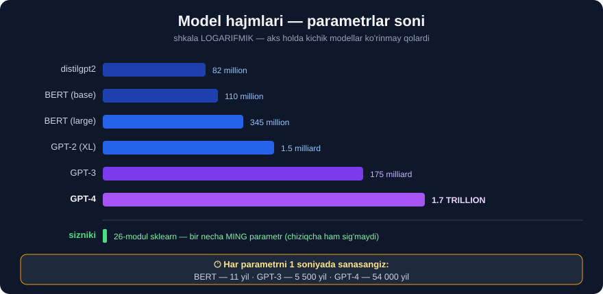

# 4-dars. LLM qanchalik katta?

## 🎬 Boshlashdan oldin

> **"O'tgan darsda aytganimdek, katta til modellari o'zlarining ULKAN HAJMI bilan tavsiflanadi."**
>
> ## **"Hajm deganda biz JISMONIY JOY haqida gapirmayapmiz. LLM ning hajmi uning PARAMETRLARI SONI bilan o'lchanadi."**

---

## 1. Parametr nima?

> **"Lekin ko'p sonli parametrga ega bo'lish nimani anglatadi?"**

### 🤖 O'qituvchining o'xshatishi

> ## **"Tasavvur qiling, siz robotga JUDA MURAKKAB O'YINNI o'ynashni o'rgatyapsiz. Buning uchun unga o'yinni qanday o'ynash haqida JUDA KO'P KO'RSATMA va QOIDA berishingiz kerak."**
>
> **"Bu qoidalarning har biri — robot eslab qolishi kerak bo'lgan bir bo'lak ma'lumot."**
>
> ## **"Endi katta til modelidagi parametrlarni ana shu ko'rsatma va qoidalar deb tasavvur qiling. Ular — modelga tilni tushunish va yaratishga yordam beradigan G'ISHTCHALAR kabi mayda ma'lumot bo'laklari."**

```
🎮 ROBOT + O'YIN                🧠 MODEL + TIL

  qoida 1: "shohni himoyala"      parametr 1: 0.0342
  qoida 2: "markazni egalla"      parametr 2: -0.891
  qoida 3: ...                    parametr 3: 1.204
      ...                              ...
  1000 ta qoida                   67 000 000 ta parametr
```

> **"Lekin gap shundaki: katta til modellarida bu mayda g'ishtchalar JUDA KO'P — millionlab yoki hatto MILLIARDLAB."**

---

## 2. Ko'proq parametr = yaxshiroqmi?

> ## **"Model qancha ko'p parametrga ega bo'lsa, u tilni shuncha yaxshi tushunadi va u bilan ishlaydi. Bu — til vazifalari uchun KATTAROQ va KUCHLIROQ MIYAGA ega bo'lish kabi."**
>
> **"Shunday qilib, model ko'p parametrga ega deganimizda, uni tilni tushunish va ishlatishda AQLLI qiladigan mayda ma'lumot bo'laklarining ulkan to'plami borligini nazarda tutamiz."**

> ## ⚠️ **Bu — kursning eng muhim da'vosi. Va u ODATDA to'g'ri.**
> ## **Lekin biz uni 6-bo'limda TEKSHIRAMIZ — va MUHIM ISTISNO topamiz.**

---

## 3. Haqiqiy raqamlar

> **"Eng mashhur LLM'lar millionlardan milliardlargacha parametrni o'z ichiga oladi."**
>
> ## **"Masalan, Google tomonidan ishlab chiqilgan BERT — 345 MILLION parametrga ega, GPT-4 esa yanada kattaroq: 1.7 TRILLION parametr."**



### 📊 Miqyosni his qilish

```
distilgpt2       │▏                        │        82 million
BERT (base)      │▏                        │       110 million
BERT (large)     │▎                        │       345 million
GPT-2 (XL)       │█                        │     1 500 million
GPT-3            │████████████             │   175 000 million
GPT-4            │█████████████████████████│ 1 700 000 million
                                                      ↑
                                             = 1.7 TRILLION
```

### Buni tasavvur qilish

```
Agar HAR BIR PARAMETRNI 1 soniyada sanasangiz:

  BERT (345M)      →       11 yil
  GPT-3 (175B)     →    5 500 yil
  GPT-4 (1.7T)     →   54 000 yil
                            ↑
                 Insoniyat tarixidan UZUNROQ
```

---

## 4. 💻 O'zingiz o'lchang

Har qanday modelning parametrini **sanash mumkin**:

```python
from transformers import AutoModel

def parametr_sana(nom):
    m = AutoModel.from_pretrained(nom)
    return sum(p.numel() for p in m.parameters())

modellar = [
    "distilbert-base-uncased-finetuned-sst-2-english",
    "cardiffnlp/twitter-roberta-base-sentiment-latest",
    "nlptown/bert-base-multilingual-uncased-sentiment",
]
for m in modellar:
    print(f"{parametr_sana(m):>13,}  {m}")
```

```
   66,362,880  distilbert-base-uncased-finetuned-sst-2-english
  124,645,632  cardiffnlp/twitter-roberta-base-sentiment-latest
  167,356,416  nlptown/bert-base-multilingual-uncased-sentiment
```

> 💡 **Nima uchun ko'p tilli model eng katta?** Chunki unga **104 tilning** lug'ati sig'ishi kerak. Lug'at kattalashsa — **embedding qatlami** ham kattalashadi.

---

## 5. Model nimadan o'qitiladi?

> **"Katta til modellari, shuningdek, ULKAN HAJMDAGI matn ma'lumotida o'qitiladi. Mashinaga qancha ko'p matn berilsa, u tilning murakkabligini o'rganishda shuncha muvaffaqiyatli bo'ladi."**
>
> ## **"LLM'lar internetdan olingan MASSIV hajmdagi matn ma'lumotida o'qitiladi. Ular xuddi butun internetning o'zini o'qigandek — faqat JUDA-JUDA tez."**

### Manbalar ro'yxati

| Manba | O'qituvchining izohi |
|---|---|
| 📚 **Kitoblar** | *"sarguzasht hikoyalaridan ilmiy darsliklargacha"* |
| 🌐 **Veb-saytlar** | *"yangilik maqolalari, bloglar"* |
| 💬 **Ijtimoiy tarmoq** | *"odamlar onlayn qanday gaplashishini ko'rish uchun"* |
| 📖 **Wikipedia** | *"faktlar, tarix va umumiy bilim"* |
| 💭 **Chatlar** | *"kundalik muloqotda til qanday ishlatilishini tushunish"* |
| 🍳 **Retseptlar** | — |
| 🎬 **Film sharhlari** | — |
| 🔬 **Ilmiy maqolalar** | — |

> **"Bu barcha matn ma'lumotini qabul qilish orqali katta til modellari inson tilining NAQSHLARI, GRAMMATIKASI va LUG'ATINI o'rganadi."**
>
> ## **"Bu — bizning boshqalarni tinglash va kitob o'qish orqali gapirishni o'rganishimiz kabi. Faqat katta til modellari buni ANCHA KATTA MIQYOSDA va ANCHA-ANCHA TEZROQ qiladi."**

---

## 6. ⚠️⚠️ TEKSHIRAMIZ: "ko'proq parametr = yaxshiroq"MI?

O'qituvchi aytadi: *"Model qancha ko'p parametrga ega bo'lsa, u tilni shuncha yaxshi tushunadi."*

**Bu da'voni sinab ko'ramiz.** Bir xil vazifa — **o'zbekcha sentiment** — uch xil model bilan.

```python
import warnings; warnings.filterwarnings("ignore")
from nltk.corpus import stopwords
from sklearn.feature_extraction.text import TfidfVectorizer
from sklearn.linear_model import LogisticRegression
from sklearn.pipeline import make_pipeline
from sklearn.model_selection import cross_val_score
from transformers import pipeline

UZ = r"[\w'ʻ’]+"
uz_stop = stopwords.words("uzbek")

IJOBIY = ["Bu kitob juda ajoyib va qiziqarli",
          "Zo'r asar, hammaga tavsiya qilaman",
          "Menga judayam yoqdi, ajoyib chiqibdi",
          "Mazmuni chuqur, tili ravon",
          "Ajoyib kitob, bir o'tirishda o'qib chiqdim",
          "Muallifga rahmat, juda foydali",
          "Sifati yaxshi, narxi arzon",
          "Qiziqarli syujet, kutilmagan yakun"]
SALBIY = ["Juda zerikarli va sifatsiz kitob",
          "Vaqtimni behuda sarfladim, yomon",
          "Umuman yoqmadi, zerikarli asar",
          "Tili og'ir, tushunish qiyin",
          "Puliga arzimaydi, afsus",
          "Yarmida tashlab qo'ydim, zerikarli",
          "Sifati past, sahifalari yirtilgan",
          "Kutganimdek chiqmadi, tavsiya qilmayman"]
X = IJOBIY + SALBIY
y = ["ijobiy"] * 8 + ["salbiy"] * 8

# ① KICHIK sklearn modeli (28-modul) — halol baho uchun CV
sk = make_pipeline(TfidfVectorizer(token_pattern=UZ, stop_words=uz_stop),
                   LogisticRegression(random_state=0))
print(f"sklearn         CV aniqlik = {cross_val_score(sk, X, y, cv=4).mean():.3f}")

# ② INGLIZ distilbert — 66.4M
p_en = pipeline("sentiment-analysis",
                model="distilbert-base-uncased-finetuned-sst-2-english")
pred = ["ijobiy" if r["label"] == "POSITIVE" else "salbiy" for r in p_en(X)]
print(f"distilbert EN   aniqlik    = {sum(a==b for a,b in zip(pred,y))/len(y):.3f}")

# ③ KO'P TILLI bert — 167.4M
p_ml = pipeline("sentiment-analysis",
                model="nlptown/bert-base-multilingual-uncased-sentiment")
def yulduz(l):
    n = int(l.split()[0])
    return "ijobiy" if n >= 4 else ("salbiy" if n <= 2 else "?")
pred2 = [yulduz(r["label"]) for r in p_ml(X)]
print(f"bert KO'P TILLI aniqlik    = {sum(a==b for a,b in zip(pred2,y))/len(y):.3f}")
```

### 😲 NATIJA

```
model                    parametr        aniqlik
─────────────────────────────────────────────────
sklearn (16 jumla)          kichik        0.625     🏆
distilbert INGLIZ       66,955,010        0.562
bert KO'P TILLI        167,356,416        0.500     📉
                              ↑                ↑
                   2.5 BARAVAR KATTA      ENG YOMON
```

> ## ❌ **"Ko'proq parametr = yaxshiroq" — BU YERDA ISHLAMADI.**
>
> ## **Eng KATTA model eng YOMON natija berdi. Eng KICHIGI esa g'olib chiqdi.**

### 🔬 Nima uchun? Xatolarni ko'ramiz

**② INGLIZ modeli — 8 ta ijobiy jumladan 7 tasini SALBIY dedi:**

```
salbiy  (to'g'risi ijobiy) | Bu kitob juda ajoyib va qiziqarli
salbiy  (to'g'risi ijobiy) | Zo'r asar, hammaga tavsiya qilaman
salbiy  (to'g'risi ijobiy) | Menga judayam yoqdi, ajoyib chiqibdi
salbiy  (to'g'risi ijobiy) | Mazmuni chuqur, tili ravon
salbiy  (to'g'risi ijobiy) | Ajoyib kitob, bir o'tirishda o'qib chiqdim
salbiy  (to'g'risi ijobiy) | Muallifga rahmat, juda foydali
salbiy  (to'g'risi ijobiy) | Qiziqarli syujet, kutilmagan yakun
```

> ## 🔑 **Model o'zbekchani TUSHUNMAYDI — shuning uchun deyarli hammasiga "salbiy" deydi.**
>
> Uning 0.562 balli — **o'rganish emas, TASODIF**. Salbiy jumlalarni "to'g'ri" topdi, chunki u **hammaga** salbiy deydi.

**③ KO'P TILLI model — javoblari TESKARI:**

```
5 stars (0.46)  →  ijobiy  (to'g'risi salbiy) | Juda zerikarli va sifatsiz kitob
4 stars (0.30)  →  ijobiy  (to'g'risi salbiy) | Tili og'ir, tushunish qiyin
1 star  (0.34)  →  salbiy  (to'g'risi ijobiy) | Menga judayam yoqdi, ajoyib chiqibdi
2 stars (0.28)  →  salbiy  (to'g'risi ijobiy) | Mazmuni chuqur, tili ravon
3 stars (0.29)  →  ?       (to'g'risi ijobiy) | Bu kitob juda ajoyib va qiziqarli
```

> ## 😱 **"Juda ZERIKARLI va SIFATSIZ kitob" → 5 YULDUZ!**
>
> Modelning **ishonchi ham past** — barcha ballari **0.24–0.46** oralig'ida. U o'zi ham **bilmayapti**.

### ⚠️ "Ko'p tilli" ≠ "sizning tilingiz"

```
nlptown/bert-base-multilingual-uncased-sentiment

  ASOSI (mBERT)  →  104 til (o'zbek ham BOR)
  SOZLANGANI     →  atigi 6 til:
                    🇬🇧 ingliz · 🇳🇱 golland · 🇩🇪 nemis
                    🇫🇷 fransuz · 🇮🇹 italyan · 🇪🇸 ispan
                            ↑
                    O'ZBEK ULAR ORASIDA YO'Q
```

> ## 🔑 **Model o'zbek SO'ZLARINI ko'radi, lekin ularning SENTIMENTINI hech qachon o'rganmagan.**

---

## 7. 🏆 TO'G'RI XULOSA

O'qituvchining da'vosi **noto'g'ri emas** — u **to'liqmas**:

```
❌ NOTO'G'RI TALQIN
   "Ko'proq parametr  →  DOIM yaxshiroq"

✅ TO'G'RI TALQIN
   "Ko'proq parametr  →  MODEL O'RGANGAN vazifa va TILDA yaxshiroq"
                                    ↑
                    Sizning vazifangiz va tilingiz
                    ma'lumotda BO'LMASA — hajm YORDAM BERMAYDI
```

### 📋 Amaliy qaror jadvali

| Sizning holatingiz | To'g'ri tanlov |
|---|---|
| Ingliz tili + keng tarqalgan vazifa | ✅ **Katta tayyor model** |
| 🇺🇿 **O'zbek tili + yorliqli ma'lumot bor** | ## ✅ **O'z `sklearn` modelingiz** |
| 🇺🇿 O'zbek tili + ma'lumot yo'q | ⚠️ **LLM'ga so'rov** *(GPT/Claude)* — lekin **tekshiring** |
| Tushuntirish kerak | ✅ **Sodda model** *(`coef_` bor)* |
| Tezlik/narx muhim | ✅ **Kichik model** |

> ## 💡 **28-moduldagi 6 jumlalik modelingiz — 167 millionlik transformerdan YAXSHIROQ ishladi.** Chunki u **sizning tilingizda**, **sizning ma'lumotingizda** o'qitilgan.
>
> ## 🏆 **26-modul saboqi yana tasdiqlandi: TO'G'RI ma'lumot > katta algoritm.**

⚠️ **Halol qayd:** bizning sinovimiz **16 ta jumlada** — bu **kam**. Aniq raqamlarga *(0.625 vs 0.562)* emas, **naqshga** ishoning: ingliz modeli **7/8 ijobiyni** yanglish topdi, ko'p tilli model esa javoblarni **teskari** berdi. Bu — tasodif emas, **tizimli xato**.

---

## 8. ⚡ Mashqlar

### 🟢 Oson

**M1.** LLM ning hajmi nima bilan o'lchanadi?

**M2.** BERT va GPT-4 nechta parametrga ega?

**M3.** LLM qanday manbalardan o'qiydi? *(kamida 5 ta)*

<details>
<summary>✅ Javoblar</summary>

**M1.** ## **PARAMETRLAR SONI** bilan — jismoniy joy bilan **emas**.

**M2.** BERT — **345 million** *(large versiyasi)* · GPT-4 — **1.7 trillion**.

**M3.** Kitoblar · veb-saytlar · Wikipedia · ijtimoiy tarmoq · chatlar · retseptlar · film sharhlari · ilmiy maqolalar.

</details>

### 🟡 O'rta

**M4.** Keshingizdagi modellarning parametrini sanang va tartiblang.

**M5.** ⭐ Nima uchun ko'p tilli model ingliz modelidan **kattaroq**?

<details>
<summary>✅ Javoblar</summary>

**M4.**
```python
from transformers import AutoModel
for m in ["distilbert-base-uncased-finetuned-sst-2-english",
          "cardiffnlp/twitter-roberta-base-sentiment-latest",
          "nlptown/bert-base-multilingual-uncased-sentiment"]:
    n = sum(p.numel() for p in AutoModel.from_pretrained(m).parameters())
    print(f"{n:>13,}  {m}")
```
```
   66,362,880  distilbert-base-uncased-finetuned-sst-2-english
  124,645,632  cardiffnlp/twitter-roberta-base-sentiment-latest
  167,356,416  nlptown/bert-base-multilingual-uncased-sentiment
```

**M5.** ## **LUG'AT hajmi tufayli.**
```
Ingliz modeli   →  ~30 000 token       →  kichik embedding qatlami
Ko'p tilli      →  ~105 000 token      →  3.5 BARAVAR katta embedding
                        ↑
              104 tilning so'zlari sig'ishi kerak
```
> 💡 Ya'ni qo'shimcha parametrlar **aql** uchun emas, **lug'at** uchun ketgan. Bu — nima uchun katta hajm **avtomatik ravishda** aqlni anglatmasligining yana bir sababi.

</details>

### 🔴 Qiyin

**M6.** ⭐⭐ Uch modelni o'z ma'lumotingizda solishtiring va **halol** hisobot yozing.

<details>
<summary>✅ Yechim</summary>

6-bo'limdagi to'liq kodni ishga tushiring, keyin **xatolarni** ham chiqaring:

```python
for t, pr, tr in zip(X, pred, y):
    if pr != tr:
        print(f"XATO: {pr:7s} (to'g'risi {tr:7s}) | {t}")
```

**Hisobotda MAJBURIY bo'lgan narsalar:**

```
□ Har bir modelning PARAMETR soni
□ Har bir modelning ANIQLIGI
□ ⭐ XATOLAR RO'YXATI — faqat raqam emas!
□ ⭐ Model qaysi TILDA/VAZIFADA o'qitilgani
□ ⭐ Namuna HAJMI va uning cheklovi
□ Bazaviy (Dummy) natija bilan taqqoslash
```

> ## ⚠️ **Faqat "0.562" deb yozish — YETARLI EMAS.**
>
> Xatolarni ko'rmasangiz, modelning **hammaga "salbiy" deyayotganini** bilmaysiz — va uni *"biroz zaif"* deb hisoblab yuborasiz. Aslida u **umuman ishlamayapti**.
>
> 🔑 **27-modul saboqi:** raqamga emas, **modelning nima qilayotganiga** qarang.

</details>

---

## 🧠 O'zini tekshirish savollari

1. Parametr nima?
2. Hajm nima bilan o'lchanadi?
3. GPT-4 BERT'dan necha baravar katta?
4. "Ko'proq parametr = yaxshiroq" — bu qachon **ishlamaydi**?
5. "Ko'p tilli" model o'zbek tilida ishlaydimi?

<details>
<summary>✅ Javoblar</summary>

1. Model **o'rgangan** mayda ma'lumot bo'lagi — *"g'ishtcha"*. Texnik jihatdan — o'qitish paytida sozlanadigan **son**.
2. **Parametrlar soni** bilan.
3. `1.7T / 345M ≈` ## **4 900 baravar**.
4. Model **sizning tilingizda** yoki **sizning vazifangizda** o'qitilmagan bo'lsa.
5. ## ❌ **Yo'q** — `nlptown` modeli **6 tilda** sozlangan, o'zbek ular orasida yo'q. Bizning sinovda u javoblarni **teskari** berdi.

</details>

---

## 📌 Xulosa

```
HAJM = PARAMETRLAR SONI  (jismoniy joy EMAS)

  Parametr = modelning "g'ishtchasi"


HAQIQIY RAQAMLAR
  distilgpt2        82 million
  BERT (base)      110 million
  BERT (large)     345 million
  GPT-3        175 000 million
  GPT-4      1 700 000 million  = 1.7 TRILLION


O'QUV MANBALARI
  📚 kitob · 🌐 sayt · 📖 Wikipedia · 💬 tarmoq
  💭 chat · 🍳 retsept · 🎬 sharh · 🔬 ilmiy maqola


⚠️⚠️ TEKSHIRILGAN ISTISNO — o'zbekcha sentiment

  sklearn (16 jumla)        0.625   🏆 ENG KICHIK, ENG YAXSHI
  distilbert EN  (66.9M)    0.562      8 ta ijobiydan 7 tasini SALBIY dedi
  bert KO'P TILLI (167M)    0.500   📉 ENG KATTA, ENG YOMON
                                       "zerikarli kitob" -> 5 YULDUZ

  🔑 "Ko'p tilli" ≠ "sizning tilingiz"
     mBERT asosi: 104 til (o'zbek BOR)
     Sozlangani : 6 til   (o'zbek YO'Q)


✅ TO'G'RI XULOSA
   Ko'proq parametr  →  MODEL O'RGANGAN til va vazifada yaxshiroq

   Sizning tilingiz ma'lumotda YO'Q bo'lsa —
   HAJM YORDAM BERMAYDI
```

---

## 🔖 Atamalar

| Atama | Inglizcha | Izoh |
|---|---|---|
| Parametr | *parameter* | Model o'rgangan son |
| Embedding qatlami | *embedding layer* | So'zlarni vektorga o'giruvchi qatlam |
| Lug'at | *vocabulary* | Model biladigan tokenlar to'plami |
| Ko'p tilli model | *multilingual model* | Bir necha tilda o'qitilgan model |
| Bazaviy model | *baseline* | Taqqoslash uchun eng sodda model |

---

⬅️ [Oldingi: LLM nima?](03-What-are-LLMs.md) · 🏠 [Modul boshiga](README.md) · ➡️ [Keyingi: Umumiy maqsadli modellar](05-General-Purpose-Models.md)
