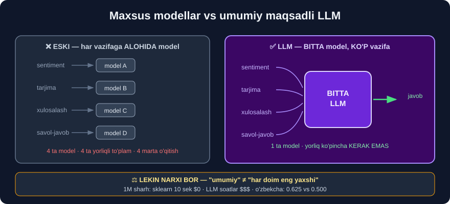

# 5-dars. Umumiy maqsadli modellar

## 🎬 Boshlashdan oldin

> **"Katta til modelining ikkinchi jihati — u UMUMIY MAQSADLI."**

---

## 1. "Umumiy maqsadli" nima degani?

> ## **"LLM umumiy maqsadli deganimizda, model internetdan olingan KENG XILMA-XIL matn ma'lumotida o'qitilganini va inson tilini KENG va KO'P QIRRALI tarzda tushunish va yaratish uchun mo'ljallanganini nazarda tutamiz."**
>
> ## **"U FAQAT BITTA NARSAGA ixtisoslashgan emas. Bu — so'z va muloqot bilan bog'liq KO'P TURLI ISHDA yordam bera oladigan KO'P QIRRALI til vositasi."**

```
❌ ESKI YONDASHUV — har vazifaga ALOHIDA model

   sentiment    →  model A     (faqat sentiment biladi)
   tarjima      →  model B     (faqat tarjima biladi)
   xulosalash   →  model C     (faqat xulosa biladi)
   savol-javob  →  model D     (faqat javob biladi)


✅ LLM YONDASHUVI — BITTA model, KO'P vazifa

              ┌──────────────┐
   sentiment  │              │
   tarjima    │  BITTA LLM   │
   xulosalash │              │
   savol-javob│              │
              └──────────────┘
```

---

## 2. ⭐ Bu sizning tajribangizdan qanchalik farq qiladi?

> ## **"Agar ilgari mashinali o'qitish bilan ko'p ishlagan bo'lsangiz, modelni MA'LUM BIR VAZIFA uchun o'qitishga — masalan, tasniflash yoki klasterlashtirishga — ko'nikkan bo'lasiz."**

### 🔁 26-modulni eslang

```python
# SIZ AYNAN SHUNDAY QILGANDINGIZ:
model = SGDClassifier()
model.fit(X_train, y_train)      # ← FAQAT sentiment uchun
```

```
Bu model NIMA QILA OLADI?
   ✅ sentiment aniqlash
   ❌ tarjima          →  bilmaydi
   ❌ xulosalash       →  bilmaydi
   ❌ savol-javob      →  bilmaydi
   ❌ hatto BOSHQA sentiment vazifasi ham  →  qayta o'qitish kerak
```

> ## **"Lekin LLM'larda DASTLABKI MAQSAD — modelga bilim va tilning qanday ishlashi haqida UMUMIY TUSHUNCHA berish, shunda uni keyinroq ANIQROQ vazifalarga qo'llash mumkin bo'ladi."**

---

## 3. Ikki bosqichli falsafa

> ## **"Biz modelni umumiy tilni tushunishi va ko'plab umumiy maqsadli muammolarni yechishi uchun OLDINDAN O'QITAMIZ. Keyin uni ma'lum vazifalar yoki sohalarda ishlashi uchun SOZLASHIMIZ mumkin."**



```
① OLDINDAN O'QITISH (pre-training)
      "tilni umuman tushun"
      → juda katta ma'lumot, juda qimmat
      → buni KATTA KOMPANIYALAR qiladi
                  ↓
② SOZLASH (fine-tuning)
      "aniq vazifani bajar"
      → kichik ma'lumot, arzon
      → buni SIZ qilasiz
```

> Batafsil: [6-dars](06-Pre-training-and-Fine-tuning.md)

---

## 4. 💻 Amaliyot — bitta paket, ko'p vazifa

`transformers` paketining `pipeline` funksiyasi — *"umumiy maqsad"* ning amaliy ko'rinishi:

```python
from transformers import pipeline

# BIR XIL sintaksis — TURLI vazifalar
vazifalar = [
    "sentiment-analysis",       # sentiment
    "text-generation",          # matn yaratish
    "summarization",            # xulosalash
    "translation_en_to_fr",     # tarjima
    "question-answering",       # savol-javob
    "fill-mask",                # bo'sh joyni to'ldirish
    "ner",                      # nomli obyekt (22-modul!)
    "zero-shot-classification", # yorliqsiz tasniflash
]
for v in vazifalar:
    print("pipeline(\"" + v + "\")")
```

> ## 💡 **Diqqat qiling: `ner` ham bor.** 22-modulda buni `spaCy` bilan qilgandingiz. Endi **bir xil vazifa**, **boshqa vosita** — va bu **umumiy** modelning shunchaki bir imkoniyati.

### Ishlab ko'ramiz

```python
p = pipeline("sentiment-analysis")
print(p("I love this book"))
print(p("This movie was terrible"))
print(p("The service at the restaurant was excellent"))
```

```
[{'label': 'POSITIVE', 'score': 0.9998767375946045}]
[{'label': 'NEGATIVE', 'score': 0.9998006224632263}]
[{'label': 'POSITIVE', 'score': 0.9998682737350464}]
```

> ## 🔑 **DIQQAT — bu model KINO sharhlarida sozlangan** *(SST-2 — Stanford Sentiment Treebank)*.
>
> Lekin u **kitob** sharhida ham, **restoran** sharhida ham ishlaydi. Mana **"umumiy maqsadli"** ning kuchi — [6-darsda](06-Pre-training-and-Fine-tuning.md) buni **raqamlar bilan** o'lchaymiz.

---

## 5. ⚖️ Umumiy maqsad — narxi bormi?

Kurs faqat **afzalliklarini** aytadi. Halol bo'lsak, **narxi** ham bor:

| | ✅ Umumiy model | ✅ Maxsus model *(26-modul)* |
|---|---|---|
| **Ko'p vazifa** | ✅ Ha | ❌ Bitta |
| **Ma'lumot kerakmi** | ❌ Ko'pincha yo'q | ✅ Ha, yorliqli |
| **Tezlik** | ⚠️ Sekin | ## ✅ **Juda tez** |
| **Narx** | ⚠️ Qimmat | ## ✅ **Bepul** |
| **Xotira** | ⚠️ 250 MB – 100 GB | ## ✅ **Bir necha KB** |
| **Tushuntirish** | ❌ Qiyin | ## ✅ **`coef_` bor** |
| **Sizning tilingiz** | ⚠️ **Balki yo'q** | ## ✅ **Siz tanlaysiz** |

```
1 000 000 ta sharhni tasniflash:

  sklearn SGDClassifier   →   ~10 soniya   ·  $0
  distilbert (66M)        →   ~soatlar     ·  elektr energiyasi
  GPT-4 API               →   ~kunlar      ·  yuzlab dollar
```

> ## 🔑 **"Umumiy maqsadli" — "har doim eng yaxshi" degani EMAS.**
>
> Bu — **moslashuvchanlik** va **samaradorlik** o'rtasidagi **almashuv**.
>
> 4-darsda ko'rganimizdek: **o'zbek tilida** kichik maxsus model **167 millionlik umumiy modelni yengdi**.

---

## 6. ⚡ Mashqlar

### 🟢 Oson

**M1.** "Umumiy maqsadli" nima degani?

**M2.** An'anaviy ML modeli bilan LLM ning asosiy farqi nimada?

**M3.** LLM'ning dastlabki maqsadi nima?

<details>
<summary>✅ Javoblar</summary>

**M1.** Model **bitta narsaga** ixtisoslashgan emas — **keng va ko'p qirrali** tarzda tilni tushunadi va yaratadi.

**M2.**
```
An'anaviy ML  →  BITTA vazifa uchun o'qitiladi (tasniflash, klasterlash)
LLM           →  avval UMUMIY tushuncha, keyin aniq vazifaga sozlanadi
```

**M3.** ## **Umumiy bilim va tilning qanday ishlashi haqida TUSHUNCHA berish** — keyinroq aniq vazifalarga qo'llash uchun.

</details>

### 🟡 O'rta

**M4.** `pipeline` qaysi vazifalarni qo'llaydi? Kamida 6 tasini ayting va har biri **qaysi modulda** ko'rganingizni belgilang.

**M5.** ⭐ Umumiy modelning **uchta kamchiligini** ayting.

<details>
<summary>✅ Javoblar</summary>

**M4.**
| Vazifa | Qaysi modulda ko'rgansiz |
|---|---|
| `sentiment-analysis` | ## **23-modul** ✅ |
| `ner` | ## **22-modul** *(spaCy bilan)* ✅ |
| `text-generation` | 29-modul *(bu yerda)* |
| `summarization` | — |
| `translation_en_to_fr` | — |
| `question-answering` | ## **33-modul** *(BERT)* |
| `zero-shot-classification` | 29-modul *(6-dars)* |
| `fill-mask` | 30-modul |

**M5.**
```
① SEKIN va QIMMAT     →  1M sharh: 10 sek vs soatlar
② TUSHUNTIRMAYDI      →  coef_ yo'q
③ SIZNING TILINGIZDA  →  ishlamasligi mumkin (4-dars: 0.500!)
```

</details>

### 🔴 Qiyin

**M6.** ⭐⭐ Bir xil vazifani **ikki yo'l** bilan bajaring — `sklearn` va `transformers` — va **vaqtini** o'lchang.

<details>
<summary>✅ Yechim</summary>

```python
import time
import pandas as pd
from sklearn.feature_extraction.text import TfidfVectorizer
from sklearn.linear_model import LogisticRegression
from sklearn.pipeline import make_pipeline
from transformers import pipeline

d = pd.read_csv("../26-Text-Classifier/data/book_reviews_sample.csv")
d = d[d.rating != 3].copy()
d["y"] = (d.rating > 3).map({True: "ijobiy", False: "salbiy"})

# ① sklearn
t0 = time.time()
sk = make_pipeline(TfidfVectorizer(), LogisticRegression(max_iter=1000))
sk.fit(d.reviewText, d.y)
sk_pred = sk.predict(d.reviewText)
sk_vaqt = time.time() - t0

# ② transformers
t0 = time.time()
tr = pipeline("sentiment-analysis", truncation=True)
tr_pred = ["ijobiy" if r["label"] == "POSITIVE" else "salbiy"
           for r in tr(d.reviewText.tolist())]
tr_vaqt = time.time() - t0

print(f"sklearn      : {sk_vaqt:6.2f} sek")
print(f"transformers : {tr_vaqt:6.2f} sek")
print(f"nisbat       : {tr_vaqt / sk_vaqt:.1f}x sekinroq")
```

> ⚠️ **Aniq raqamlar kompyuteringizga bog'liq.** Muhimi — **nisbat**: transformer **o'nlab-yuzlab baravar** sekin bo'ladi.
>
> 💡 **Halol eslatma:** `sklearn` bu yerda **o'z o'quv ma'lumotida** bashorat qilyapti *(shuning uchun aniqligi soxta yuqori bo'ladi)* — bu mashqda biz faqat **VAQTNI** o'lchayapmiz, aniqlikni emas. Aniqlikni [6-darsda](06-Pre-training-and-Fine-tuning.md) **halol** solishtiramiz.

</details>

---

## 🧠 O'zini tekshirish savollari

1. "Umumiy maqsadli" nima?
2. 26-moduldagi modelingiz umumiy maqsadlimi?
3. Ikki bosqich qaysilar?
4. `pipeline` ning uchta vazifasini ayting.
5. Umumiy modelning narxi nimada?

<details>
<summary>✅ Javoblar</summary>

1. Bitta narsaga **ixtisoslashmagan**, **ko'p qirrali** til vositasi.
2. ## ❌ **Yo'q** — u **faqat** sentiment tasniflay oladi.
3. ## **Oldindan o'qitish** *(pre-training)* → **sozlash** *(fine-tuning)*.
4. `sentiment-analysis` · `text-generation` · `summarization` · `translation` · `question-answering` · `ner` · `zero-shot-classification`.
5. **Tezlik** · **narx** · **xotira** · **tushuntirib bo'lmasligi** · **tilingizda ishlamasligi mumkin**.

</details>

---

## 📌 Xulosa

```
UMUMIY MAQSADLI = bitta model, KO'P vazifa

  ESKI:  sentiment→A  tarjima→B  xulosa→C  (uchta model)
  LLM :  hammasi     →  BITTA model


26-MODUL vs LLM

  SGDClassifier        →  FAQAT sentiment
  LLM                  →  sentiment + tarjima + xulosa + ...


IKKI BOSQICH
  ① OLDINDAN O'QITISH  →  "tilni umuman tushun"   (kompaniyalar)
  ② SOZLASH            →  "aniq vazifani bajar"   (SIZ)


pipeline() VAZIFALARI
  sentiment-analysis · text-generation · summarization
  translation · question-answering · ner · fill-mask
  zero-shot-classification


⚖️ NARXI BOR
                    UMUMIY        MAXSUS (26-modul)
  ko'p vazifa         ✅              ❌
  tezlik              ⚠️ sekin        ✅ 10 sek/1M
  narx                ⚠️ qimmat       ✅ bepul
  tushuntirish        ❌              ✅ coef_
  o'zbek tili         ⚠️ 0.500        ✅ 0.625

  🔑 "Umumiy" ≠ "har doim eng yaxshi"
```

---

## 🔖 Atamalar

| Atama | Inglizcha | Izoh |
|---|---|---|
| Umumiy maqsadli | *general purpose* | Ko'p vazifaga yaroqli |
| Ko'p qirrali | *versatile* | Turli ishga mos |
| Ixtisoslashgan | *specialized* | Bitta vazifaga qaratilgan |
| Quvur | *pipeline* | Tayyor vazifa oqimi |
| Almashuv | *trade-off* | Bir narsani boshqasiga almashtirish |

---

⬅️ [Oldingi: LLM qanchalik katta?](04-How-Large-is-an-LLM.md) · 🏠 [Modul boshiga](README.md) · ➡️ [Keyingi: Oldindan o'qitish va sozlash](06-Pre-training-and-Fine-tuning.md)
