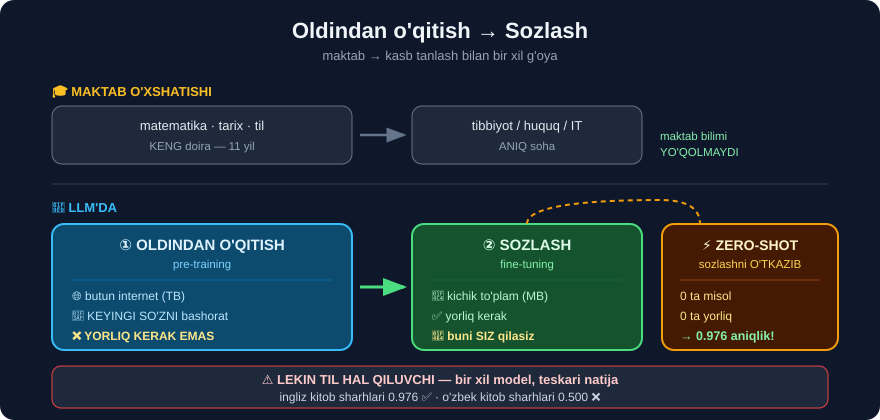

# 6-dars. Oldindan o'qitish va sozlash

## 🎬 Boshlashdan oldin

> **"Xo'sh, katta til modelini OLDINDAN O'QITAMIZ va SOZLAYMIZ deganimda aynan nimani nazarda tutaman?"**

> ## ⭐⭐ **Bu — LLM'lardagi ENG MUHIM tushuncha.** Uni tushunsangiz — nima uchun 3 qator kod bilan 67 millionlik modelni ishlatish mumkinligini bilasiz.

---

## 1. 🎓 O'qituvchining o'xshatishi — maktab

> ## **"Maktabda o'qigan paytingizni eslang. Boshida siz ATROFINGIZDAGI DUNYO haqida bazaviy tushuncha olish uchun KENG DOIRADAGI fan va mavzularni o'rganasiz."**
>
> ## **"Biroq keyinroq kasbingizni tanlaganingizda, e'tiboringizni o'sha kasbga qaratilgan ANIQROQ fanlarga jamlaysiz."**
>
> **"Siz hali ham o'sha dastlabki yillarda o'rgangan narsalaringizga murojaat qilasiz va o'z sohangizga oid yangi bilimni tushunish uchun uning USTIGA QURASIZ."**



```
👶 MAKTAB                        🧠 LLM

  matematika, tarix, biologiya    →   ① OLDINDAN O'QITISH
  til, geografiya, fizika              butun internet
  (KENG doira)                         (KENG doira)
         ↓                                    ↓
  🎓 KASB TANLASH                 →   ② SOZLASH
  tibbiyot / huquq / IT                tibbiyot / huquq / moliya
  (ANIQ soha)                          (ANIQ soha)
         ↓                                    ↓
  🔑 Maktabdagi bilim             🔑 Umumiy til bilimi
     YO'QOLMAYDI — ustiga             YO'QOLMAYDI — ustiga
     yangi bilim quriladi              yangi bilim quriladi
```

> **"LLM'larda ham xuddi shu tushuncha. Ular turli til muammolarini yechish uchun OLDINDAN O'QITILADI, keyin esa MEDIA, MOLIYA, TRANSPORT kabi aniq sohalarda ishlash uchun SOZLANISHI mumkin."**

---

## 2. ① Oldindan o'qitish bosqichi

> ## **"Oldindan o'qitish bosqichida katta til modeli internetdan olingan MASSIV hajmdagi matn ma'lumotiga duch keladi."**
>
> ## **"U GAPLARDA KEYINGI QAYSI SO'ZLAR KELISHINI BASHORAT QILISH orqali grammatika, lug'at va sog'lom fikr kabi til asoslarini o'rganadi."**

### 🔑 "Keyingi so'zni bashorat qilish" — butun sir shunda

```
Model MILLIARDLAB marta shu o'yinni o'ynaydi:

   "Osmon rangi ___"           →  model taxmin qiladi
   To'g'ri javob: "ko'k"       →  xato bo'lsa, parametrlarni TUZATADI

   "Toshkent — O'zbekiston ___"→  "poytaxti"
   "Mushuk sut ___"            →  "ichadi"
   "2 + 2 = ___"               →  "4"
```

> ## 💡 **DIQQAT — bunda YORLIQ KERAK EMAS!**
>
> 26-modulda siz har bir jumlaga **qo'lda** `ijobiy`/`salbiy` yozgandingiz. Bu yerda esa **matnning o'zi** javobni beradi: keyingi so'z **allaqachon matnda bor**.
>
> ## 🔑 **Mana nima uchun butun internetni ishlatish MUMKIN** — hech kim uni qo'lda belgilamagan.

> **"Bu — sizning maktabning dastlabki yillarida gapirishni, yozishni o'rganib, biroz umumiy bilim olishingizga o'xshaydi."**

---

## 3. ② Sozlash bosqichi

> **"Model asoslarni yaxshi egallagach, uni ANIQ VAZIFALAR uchun moslashtirish mumkin."**
>
> **"Masalan, uning TIBBIY SAVOLLARGA javob berishda yoki MIJOZLARGA XIZMAT KO'RSATISH so'rovlarida juda yaxshi bo'lishini xohlashingiz mumkin."**
>
> ## **"Sozlash bosqichida LLM siz xohlagan aniq vazifa bilan bog'liq KICHIKROQ, IXTISOSLASHGAN ma'lumot to'plamida o'qitiladi."**
>
> **"U oldindan o'qitish davomida o'rgangan ko'nikmalarini oladi va siz xohlagan aniq vazifada YAXSHIROQ bo'ladi."**

### 📊 Ikki bosqich taqqoslamasi

| | ① Oldindan o'qitish | ② Sozlash |
|---|---|---|
| **Ma'lumot hajmi** | 🌐 Butun internet *(TB)* | 📄 Kichik to'plam *(MB)* |
| **Yorliq kerakmi** | ## ❌ **Yo'q** | ✅ Ha |
| **Vaqt** | Oylar | Soatlar |
| **Narx** | 💸 Millionlab dollar | 💵 O'nlab dollar |
| **Kim qiladi** | Google, OpenAI, Meta | ## **SIZ** |
| **Natija** | Umumiy til bilimi | Aniq vazifa ustasi |

> ## **"Siz buni hozir shu kursni o'tayotganingizga ham qiyoslashingiz mumkin. Siz hali ham maktabda o'rgangan juda erta narsalarga murojaat qilasiz — lekin biz hozir bu kurs bilan ko'nikmalaringizni HAQIQATAN IXTISOSLASHTIRYAPMIZ."**

---

## 4. ⭐⭐ Zero-shot va few-shot

> ## **"Katta til modellari SHUNCHA KATTA hajmdagi ma'lumotda oldindan o'qitilgani uchun, ular ko'pincha HECH QANDAY QO'SHIMCHA soha ma'lumotisiz ham vazifalarda YAXSHI ishlay oladi."**
>
> ## **"Ular FEW-SHOT yoki ZERO-SHOT deb ataladigan senariylarda ishlatilishi mumkin."**
>
> ## **"FEW-SHOT senariysi — modelni o'qitish uchun MINIMAL ma'lumot ishlatganimiz. ZERO-SHOT esa — model ilgari o'qitishda unga ANIQ O'RGATILMAGAN narsalarni tanib olishi."**
>
> **"Ya'ni ba'zi hollarda siz LLM'ni QUTIDAN CHIQQANIDEK, hech qanday qo'shimcha ma'lumotsiz ishlata olasiz."**

```
┌──────────────┬────────────────┬─────────────────────────┐
│  ZERO-SHOT   │  0 ta misol    │  "shunchaki so'ra"      │
│  FEW-SHOT    │  2-10 ta misol │  "bir nechta ko'rsat"   │
│  FINE-TUNING │  100+ ta misol │  "modelni qayta o'qit"  │
└──────────────┴────────────────┴─────────────────────────┘
```

---

## 5. 💻 ZERO-SHOT ni O'LCHAYMIZ

Nazariyani **sinab ko'ramiz**. Model **KINO** sharhlarida sozlangan. Biz unga **KITOB** sharhlarini beramiz — u bularni **hech qachon ko'rmagan**.

```python
import warnings; warnings.filterwarnings("ignore")
import pandas as pd
from transformers import pipeline

# 26-MODULDAGI ma'lumot — model buni HECH QACHON ko'rmagan
d = pd.read_csv("../26-Text-Classifier/data/book_reviews_sample.csv")
d = d[d.rating != 3].copy()                     # 3 yulduz — noaniq, chiqaramiz
d["haqiqiy"] = (d.rating > 3).map({True: "ijobiy", False: "salbiy"})

p = pipeline("sentiment-analysis",
             model="distilbert-base-uncased-finetuned-sst-2-english",
             truncation=True)
d["bashorat"] = ["ijobiy" if r["label"] == "POSITIVE" else "salbiy"
                 for r in p(d.reviewText.tolist())]

print("sharhlar          :", len(d))
print("taqsimot          :", d.haqiqiy.value_counts().to_dict())
print(f"ZERO-SHOT aniqlik : {(d.bashorat == d.haqiqiy).mean():.3f}")
print(f"bazaviy (Dummy)   : {(d.haqiqiy == 'ijobiy').mean():.3f}")
```

```
sharhlar          : 83
taqsimot          : {'ijobiy': 46, 'salbiy': 37}
ZERO-SHOT aniqlik : 0.976
bazaviy (Dummy)   : 0.554
```

### 🏆 97.6% — HECH QANDAY O'QITISHSIZ

```
26-MODULDA (o'z modelingizni QURDINGIZ):
   Logistik regressiya     0.832
   Naive Bayes             0.845
   Chiziqli SVM            0.869    ← eng yaxshisi edi
                                     · yorliqli ma'lumot kerak
                                     · o'qitish kerak
                                     · sozlash kerak

BU YERDA (HECH NARSA QILMADINGIZ):
   distilbert zero-shot    0.976    🏆
                                     · yorliq KERAK EMAS
                                     · o'qitish KERAK EMAS
                                     · 3 qator kod
```

> ## 🎯 **+10.7 foiz punkt — va SIFR mehnat.**
>
> Model **kino** sharhlarida o'qitilgan, **kitob** sharhlarini ko'rmagan. Lekin u *"terrible"*, *"waste of time"*, *"loved it"* ni **umuman** tushunadi — soha muhim emas.

### 🔬 Qolgan 2 ta xatoni ko'ramiz

```python
for _, x in d[d.bashorat != d.haqiqiy].iterrows():
    print(f"{x.rating} yulduz | haqiqiy={x.haqiqiy} bashorat={x.bashorat}")
    print(f"   {x.reviewText[:95]}")
```

```
1 yulduz | haqiqiy=salbiy bashorat=ijobiy
   I read books to make me happy, laugh and generally make my day - I don't like books that make m...

2 yulduz | haqiqiy=salbiy bashorat=ijobiy
   Just like i said it was okay and entertaining to read it at least so popular papa Philip die da...
```

> ## 💡 **Ikkala xato ham ADOLATLI.**
>
> ```
> ① "make me happy, laugh, make my day"  →  ijobiy so'zlar KO'P
>    Salbiylik esa gapning DAVOMIDA yashiringan
>
> ② "it was okay and entertaining"       →  matnda IJOBIY yozilgan
>    Lekin foydalanuvchi 2 yulduz qo'ygan
> ```
>
> 🔑 Ikkinchi holda **model xato emas** — foydalanuvchining **matni va bahosi mos kelmaydi**. Bu — **ma'lumot shovqini**, model kamchiligi emas.

---

## 6. ⚠️ LEKIN — 4-DARSNI ESLANG

Bu ajoyib natija **bitta shartga** bog'liq:

```
✅ INGLIZ TILI + keng tarqalgan vazifa

   book reviews (ingliz)   →   0.976   🏆 LLM YUTDI
                                        (sklearn: 0.869)

❌ O'ZBEK TILI

   kitob sharhlari (o'zbek)→   0.500   📉 LLM YUTQAZDI
                                        (sklearn: 0.625)
```

> ## 🔑 **BIR XIL MODEL. BIR XIL VAZIFA. TESKARI NATIJA.**
>
> ## **Yagona farq — TIL.**

### 📋 Qaror daraxti

```
Vazifangiz INGLIZ tilidami?
│
├── ✅ HA  →  Avval ZERO-SHOT ni sinang!
│            │
│            ├── Yetarli aniqlikmi?  →  ✅ TAYYOR. Hech narsa qilmang.
│            └── Yetarli emasmi?     →  fine-tuning (34-modul)
│
└── ❌ YO'Q (o'zbek va h.k.)
             │
             ├── Yorliqli ma'lumot bormi?
             │    ├── ✅ HA  →  o'z sklearn modelingiz (26, 28-modul)
             │    └── ❌ YO'Q →  LLM'ga so'rov (GPT/Claude) + TEKSHIRISH
             │
             └── ⚠️ Tayyor transformerga ISHONMANG — avval O'LCHANG
```

> ## 💡 **ENG MUHIM AMALIY MASLAHAT:** yangi loyihada **birinchi** zero-shot ni sinang. **10 daqiqa** vaqt oladi. Ishlasa — **haftalab** ish tejaysiz. Ishlamasa — **kamida bilib olasiz**.

---

## 7. ⚡ Mashqlar

### 🟢 Oson

**M1.** Ikki bosqich qaysilar?

**M2.** Zero-shot va few-shot farqi nimada?

**M3.** Oldindan o'qitishda model nima qiladi?

<details>
<summary>✅ Javoblar</summary>

**M1.** ## ① **Oldindan o'qitish** *(pre-training)* → ② **Sozlash** *(fine-tuning)*.

**M2.**
```
ZERO-SHOT  →  0 ta misol   ("model ilgari O'RGATILMAGAN narsani tanib oladi")
FEW-SHOT   →  bir nechta misol ("MINIMAL ma'lumot bilan o'qitamiz")
```

**M3.** ## **Gaplarda KEYINGI SO'ZNI bashorat qiladi** — shu orqali grammatika, lug'at va sog'lom fikrni o'rganadi.

</details>

### 🟡 O'rta

**M4.** ⭐ Oldindan o'qitish nima uchun **yorliq talab qilmaydi**? Bu nima uchun juda muhim?

**M5.** Zero-shot ni o'z ma'lumotingizda sinang.

<details>
<summary>✅ Javoblar</summary>

**M4.**
```
26-MODUL (nazorat ostida):
   "Bu kitob ajoyib"  →  siz QO'LDA "ijobiy" deb yozdingiz
                             ↑
                     ODAM MEHNATI kerak

OLDINDAN O'QITISH (o'zini nazorat qiluvchi):
   "Osmon rangi ___"  →  javob MATNNING O'ZIDA bor: "ko'k"
                             ↑
                     ODAM MEHNATI KERAK EMAS
```

> ## 🔑 **Mana nima uchun BUTUN INTERNETNI ishlatish mumkin.**
>
> Agar yorliq kerak bo'lganda, milliardlab jumlani belgilash uchun **millionlab odam-yil** ketardi. Bu — LLM'larni **umuman mumkin qilgan** g'oya.

**M5.**
```python
matnlar = ["sizning matnlaringiz..."]
p = pipeline("sentiment-analysis", truncation=True)
for t, r in zip(matnlar, p(matnlar)):
    print(f"{r['label']:8s} {r['score']:.3f} | {t[:60]}")
```
⚠️ **Ball 0.9 dan past bo'lsa** — model **ishonchsiz**. O'zbekcha matnda bu tez-tez uchraydi.

</details>

### 🔴 Qiyin

**M6.** ⭐⭐ Zero-shot'ni 26-moduldagi **eng yaxshi modelingiz** bilan **halol** solishtiring.

<details>
<summary>✅ Yechim</summary>

```python
import warnings; warnings.filterwarnings("ignore")
import pandas as pd
from sklearn.feature_extraction.text import CountVectorizer
from sklearn.linear_model import SGDClassifier
from sklearn.pipeline import make_pipeline
from sklearn.model_selection import cross_val_score
from transformers import pipeline

d = pd.read_csv("../26-Text-Classifier/data/book_reviews_sample.csv")
d = d[d.rating != 3].copy()
d["y"] = (d.rating > 3).map({True: "ijobiy", False: "salbiy"})

# ① sklearn — CROSS-VALIDATION (halol: ko'rmagan ma'lumotda)
sk = make_pipeline(CountVectorizer(), SGDClassifier(random_state=0))
print(f"sklearn SVM (CV) : {cross_val_score(sk, d.reviewText, d.y, cv=5).mean():.3f}")

# ② zero-shot — ham ko'rmagan ma'lumotda (model buni hech qachon ko'rmagan)
p = pipeline("sentiment-analysis", truncation=True)
pred = ["ijobiy" if r["label"] == "POSITIVE" else "salbiy"
        for r in p(d.reviewText.tolist())]
print(f"zero-shot        : {sum(a==b for a,b in zip(pred, d.y))/len(d):.3f}")
```

> ## ⚖️ **Nima uchun `cross_val_score` SHART?**
>
> `sklearn` modelini **o'z o'quv ma'lumotida** sinasangiz, u **~1.0** ko'rsatadi va *"sklearn yutdi!"* degan **soxta** xulosa chiqadi.
>
> Zero-shot esa **tabiatan** halol — model bu ma'lumotni **hech qachon ko'rmagan**.
>
> ## 🔑 **Halol taqqoslash uchun IKKALASI ham KO'RMAGAN ma'lumotda sinalishi kerak.** 26-modulning 5-tuzog'i aynan shu haqda edi.

</details>

---

## 🧠 O'zini tekshirish savollari

1. Maktab o'xshatishini tushuntiring.
2. Oldindan o'qitishda model qanday o'rganadi?
3. Nima uchun yorliq kerak emas?
4. Zero-shot nima?
5. Zero-shot qachon **ishlamaydi**?

<details>
<summary>✅ Javoblar</summary>

1. Maktabda **keng** fanlar → kasbda **aniq** soha. LLM'da: internet → aniq vazifa. **Dastlabki bilim yo'qolmaydi**, ustiga quriladi.
2. ## **Keyingi so'zni bashorat qilish** orqali.
3. Chunki **javob matnning o'zida** bor — keyingi so'z allaqachon yozilgan. Odam mehnati **kerak emas**.
4. Modelni **hech qanday misolsiz**, to'g'ridan-to'g'ri ishlatish.
5. Vazifa/til model **ko'rmagan** bo'lsa. Bizning sinov: ingliz **0.976** ✅ · o'zbek **0.500** ❌.

</details>

---

## 📌 Xulosa

```
🎓 MAKTAB O'XSHATISHI
   keng fanlar  →  kasb tanlash
   internet     →  aniq vazifa


① OLDINDAN O'QITISH (pre-training)
   · butun internet (TB)
   · KEYINGI SO'ZNI bashorat qilish
   · ❌ YORLIQ KERAK EMAS  ← MANA SIR SHUNDA
   · millionlab dollar  →  kompaniyalar qiladi

② SOZLASH (fine-tuning)
   · kichik ixtisoslashgan to'plam (MB)
   · ✅ yorliq kerak
   · o'nlab dollar  →  SIZ qilasiz


ZERO-SHOT / FEW-SHOT
   zero-shot     0 misol
   few-shot      2-10 misol
   fine-tuning   100+ misol


💻 O'LCHANGAN NATIJA — ingliz kitob sharhlari (83 ta)

   26-modul SVM (o'qitilgan)   0.869
   distilbert ZERO-SHOT        0.976   🏆  +10.7 punkt
                                            0 ta yorliq, 3 qator kod
   Atigi 2 ta xato — ikkalasi ham adolatli


⚠️ LEKIN — TIL HAL QILUVCHI

   ingliz sharhlar   →  0.976  🏆 LLM yutdi
   o'zbek sharhlar   →  0.500  📉 LLM yutqazdi (sklearn 0.625)

   BIR XIL model, BIR XIL vazifa, TESKARI natija


✅ AMALIY QOIDA
   Ingliz tili?  →  AVVAL zero-shot ni sinang (10 daqiqa)
   Boshqa til?   →  AVVAL o'lchang, keyin ishoning
```

---

## 🔖 Atamalar

| Atama | Inglizcha | Izoh |
|---|---|---|
| Oldindan o'qitish | *pre-training* | Umumiy til bilimini olish |
| Sozlash | *fine-tuning* | Aniq vazifaga moslashtirish |
| Zero-shot | *zero-shot* | Misolsiz ishlatish |
| Few-shot | *few-shot* | Bir necha misol bilan |
| O'zini nazorat qiluvchi | *self-supervised* | Yorliqni matnning o'zi beradi |
| Uzatish o'qitishi | *transfer learning* | Bir sohadagi bilimni boshqasiga ko'chirish |

---

⬅️ [Oldingi: Umumiy maqsadli modellar](05-General-Purpose-Models.md) · 🏠 [Modul boshiga](README.md) · ➡️ [Keyingi: LLM nima uchun ishlatiladi?](07-What-can-LLMs-be-used-for.md)
