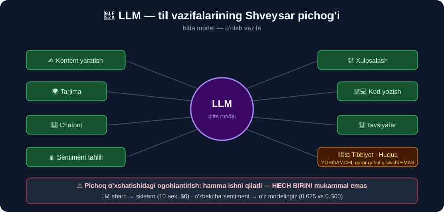

# 7-dars. LLM nima uchun ishlatiladi?

## 🎬 Boshlashdan oldin

> ## **"Katta til modellarining ajoyib tomoni shundaki, BITTA MODEL turli xil vazifalar uchun ishlatilishi mumkin. Ular shunday katta ma'lumot to'plamlarida, shuncha ko'p parametr bilan o'qitilgani uchun KO'P NARSANI o'rgana oladilar."**
>
> **"Katta til modellari ustunlik qiladigan ishlarning ba'zi misollarini ko'rib chiqaylik."**

---

## 1. ✍️ Kontent yaratish

> **"Birinchisi — KONTENT YARATISH. Katta til modellari maqolalar, blog postlari yoki hatto IJODIY HIKOYALAR yoza oladi."**
>
> **"Ular INSON MUALLIF yozgandek o'qiladigan matn generatsiya qiladi — bu ularni kontent yaratuvchilar uchun qulay vositaga aylantiradi."**

```python
from transformers import pipeline
gap = pipeline("text-generation", model="distilgpt2")
print(gap("Once upon a time in a small village",
          max_new_tokens=25, do_sample=False, pad_token_id=50256)[0]["generated_text"])
```

```
'Once upon a time in a small village, a man in a white robe, a man in a
black robe, a man in a black robe, a man in'
```

> ## 😅 **YANA TAKRORLANISH.**
>
> ```
> "a man in a white robe, a man in a black robe, a man in a black robe, a man in"
>                              ↑
>            Model AYLANIB QOLDI — hikoya RIVOJLANMAYAPTI
> ```
>
> ## 🔑 **3-darsdagi bilan BIR XIL kamchilik.** `distilgpt2` — **82 million** parametrli o'yinchoq model: grammatikani biladi, **hikoya qurishni** bilmaydi.
>
> Hikoya qurish uchun model **uzoq kontekstni** ushlab turishi kerak — bu **hajm** talab qiladi. Haqiqiy kontent uchun **GPT-4** *(1.7 trillion — 20 000 baravar kattaroq)* kabi modellar ishlatiladi.

> 💡 **Halol eslatma:** `do_sample=True` qo'ysangiz takrorlanish kamayadi *(model tasodifiy tanlaydi)*, lekin **mazmun yaxshilanmaydi** — faqat **xilma-xilroq** bo'ladi. Kamchilik **hajmda**, sozlamada emas.

---

## 2. 🌍 Tarjima

> **"LLM'lar matnni bir tildan boshqasiga TARJIMA qila oladi. Siz bir tilda jumla kiritasiz, model esa xohlagan tilingizda tarjima beradi."**
>
> **"Telefoningizdagi ko'plab tarjima ilovalari — siz sayohat qilganingizda yoki boshqa tilda gapiruvchilar bilan muloqot qilganingizda REAL VAQTDA tarjima berish uchun ORQA FONDA katta til modelidan foydalanadi."**

```python
tr = pipeline("translation_en_to_fr", model="t5-small")
print(tr("The book was very interesting")[0]["translation_text"])
```

> ## 🇺🇿 **O'zbek tili haqida:** tarjima — o'zbek tilida **eng yaxshi ishlaydigan** LLM vazifasi. Chunki tarjima uchun **parallel matnlar** *(bir xil matn ikki tilda)* bor, sentiment lug'ati esa **yo'q**.

---

## 3. ❓ Savol-javob

> **"LLM'lar siz uchun savollarga javob berishda ham zo'r. Siz modelga turli mavzularda — TARIXIY FAKTLARDAN tortib MATEMATIK masalalarni yechishgacha — savol berishingiz mumkin, va ular o'zlarining keng bilimlari asosida ANIQ javob berishga harakat qiladilar."**

> ## ⚠️ **DIQQAT — "HARAKAT QILADILAR" so'ziga e'tibor bering.**
>
> 3-darsda ko'rgandik: `distilgpt2` *"The capital of France is"* savoliga **Parij** demadi. LLM javobi — **kafolat emas, TAXMIN**.

→ Batafsil: **33-modul** *(BERT bilan savol-javob)*

---

## 4. 💬 Chatbotlar va virtual yordamchilar

> **"Siz LLM'lardan foydalanuvchi va mijozlar bilan SUHBAT quradigan, keng tarqalgan savollarga javob beradigan va ESLATMA O'RNATISH yoki onlayn MA'LUMOT TOPISH kabi vazifalarda yordam beradigan chatbotlar va virtual yordamchilar yaratishingiz mumkin."**

→ Batafsil: **35–47-modullar** *(LangChain va LangGraph)*

---

## 5. 📊 Matn tahlili

> **"LLM'lar matnni TAHLIL ham qila oladi — masalan, ular matnning SENTIMENTINI ajratib olishlari, yozuvning ohangi ijobiy, salbiy yoki neytralligini aniqlashlari mumkin."**
>
> **"Bu — bizneslar uchun mijozlar fikrini baholash yoki ijtimoiy tarmoqlarda jamoatchilik kayfiyatini kuzatish uchun foydali ko'nikma."**

> ## ✅ **SIZ BUNI ALLAQACHON QILGANSIZ.** 23-modul, 26-modul, 27-modul — va bu modulning 6-darsi *(zero-shot **0.976**)*.

---

## 6. 📄 Xulosalash

> **"Bundan tashqari, katta til modellari uzun maqolalar yoki hujjatlarni olib, QISQA XULOSALAR yarata oladi — bu butun matnni o'qimasdan asosiy fikrlarni tushunishni osonlashtiradi."**

```python
xul = pipeline("summarization", model="sshleifer/distilbart-cnn-12-6")
matn = "..."   # uzun maqola
print(xul(matn, max_length=60, min_length=20)[0]["summary_text"])
```

> ## 💡 **25-modulni eslang** — u yerda siz **LDA** bilan mavzularni topgandingiz. Xulosalash — bu ishning **keyingi bosqichi**: mavzuni topish emas, uni **odam tilida yozib berish**.

---

## 7. 🎯 Tavsiyalar

> **"LLM'lar qila oladigan yana bir narsa — KONTENT TAVSIYALARI. Ular tavsiya tizimlarini quvvatlantiradi — sizning afzalliklaringiz va o'tgan o'zaro ta'sirlaringiz asosida FILM, KITOB, MAQOLA yoki MAHSULOT tavsiya qiladi."**

---

## 8. 🧑‍💻 Kod yozish

> ## **"Biz kabi DASTURCHILAR uchun katta til modellari aniq vazifalar uchun KOD PARCHALARINI generatsiya qilish, NOSOZLIKLARNI TUZATISHDA yordam berish yoki murakkab dasturlash tushunchalarini TUSHUNTIRISH orqali ham yordam bera oladi."**

```
🧑‍💻 KOD BILAN BOG'LIQ VAZIFALAR
   · kod parchasini yozish
   · xatoni topish (debugging)
   · tushuntirish
   · testlar yozish
   · bir tildan boshqasiga o'girish
```

---

## 9. 🏥 Tibbiyot · ⚖️ Huquq · 📈 Marketing

> **"SOG'LIQNI SAQLASHDA bu modellar shifokorlarga TIBBIY YOZUVLARNI tahlil qilish, mumkin bo'lgan TASHXISLARNI taklif qilish va hatto so'nggi tibbiy tadqiqotlardan xabardor bo'lib turish orqali yordam bera oladi."**
>
> **"HUQUQ sohasida bu modellar hujjatlar, shartnomalar va ish tarixini ko'rib chiqib, yuristlarga tez tushuncha berishi va tegishli ma'lumotni aniqlashga yordam berishi mumkin."**
>
> **"Agar siz MARKETINGDA ishlasangiz, LLM'lar mijoz ma'lumotlarini tahlil qilib, bizneslarga SHAXSIYLASHTIRILGAN marketing kampaniyalarini yaratishga yordam beradi."**

> ## ⚠️ **BU UCH SOHADA XATO NARXI JUDA QIMMAT.**
>
> ```
> 🏥 Noto'g'ri tashxis      →  hayotga xavf
> ⚖️ O'tkazib yuborilgan band →  sud yutqazish
> 📈 Tarafkash kampaniya    →  kamsitish
> ```
>
> ## 🔑 **Bu sohalarda LLM — YORDAMCHI, QAROR QABUL QILUVCHI EMAS.** O'qituvchi ham *"yordam bera oladi"* deydi, *"o'rniga bosadi"* demaydi.

---

## 10. 🔪 Swiss Army pichog'i

> ## **"Bu misollar katta til modellarining aql bovar qilmas KO'P QIRRALILIGINI namoyish etadi. Ular — til bilan bog'liq vazifalar uchun SHVEYSAR ARMIYA PICHOG'I kabi: kontent yaratishdan tortib mijozlarga xizmat ko'rsatish, sog'liqni saqlash va undan narigacha keng doiradagi sohalarda yordam bera oladi."**



> ## 💡 **Shveysar pichog'i o'xshatishi juda aniq — VA UNDA OGOHLANTIRISH HAM BOR.**
>
> ```
> 🔪 Shveysar pichog'i:  hamma ishni qiladi — HECH BIRINI MUKAMMAL EMAS
>
>    Yog'och kesish kerakmi?  →  ARRA yaxshiroq
>    1M sharh tasniflashmi?   →  sklearn yaxshiroq (10 sek, $0)
>    O'zbekcha sentimentmi?   →  o'z modelingiz yaxshiroq (0.625 vs 0.500)
> ```

---

## 11. 📋 To'liq jadval — va SIZNING holatingiz

| Vazifa | LLM | Siz o'rgangan muqobil | 🇺🇿 O'zbekcha |
|---|---|---|---|
| ✍️ **Kontent yaratish** | ✅ Zo'r | — | ⚠️ O'rtacha |
| 🌍 **Tarjima** | ✅ Zo'r | — | ## ✅ **Yaxshi** |
| ❓ **Savol-javob** | ⚠️ Ehtiyot bo'ling | — | ⚠️ O'rtacha |
| 💬 **Chatbot** | ✅ Zo'r | — | ⚠️ O'rtacha |
| 📊 **Sentiment** | ✅ 0.976 *(ingliz)* | ## **26-modul** | ## ❌ **0.500 → o'z modelingiz** |
| 📄 **Xulosalash** | ✅ Zo'r | 25-modul *(mavzular)* | ⚠️ O'rtacha |
| 🏷️ **NER** | ✅ Ha | ## **22-modul** *(spaCy)* | ❌ Yo'q |
| 🎯 **Tavsiyalar** | ✅ Ha | — | ✅ Ishlaydi |
| 🧑‍💻 **Kod** | ✅ Zo'r | — | ✅ *(kod tildan mustaqil)* |
| 🏥 **Tibbiyot** | ⚠️ Yordamchi | — | ⚠️ Ehtiyot bo'ling |
| ⚖️ **Huquq** | ⚠️ Yordamchi | — | ⚠️ Ehtiyot bo'ling |

---

## 12. ⚡ Mashqlar

### 🟢 Oson

**M1.** LLM ning 6 ta qo'llanishini ayting.

**M2.** Nima uchun "Shveysar armiya pichog'i" deyiladi?

**M3.** Qaysi uchta soha alohida ehtiyotkorlik talab qiladi?

<details>
<summary>✅ Javoblar</summary>

**M1.** Kontent yaratish · tarjima · savol-javob · chatbot · matn tahlili *(sentiment)* · xulosalash · tavsiyalar · kod yozish · tibbiyot · huquq · marketing.

**M2.** Chunki **bitta model** juda ko'p turli vazifani bajara oladi.

**M3.** ## 🏥 **Tibbiyot** · ⚖️ **Huquq** · 📈 **Marketing** — xato narxi **odamlarga ta'sir qiladi**.

</details>

### 🟡 O'rta

**M4.** Bu ro'yxatdagi qaysi vazifalarni siz **allaqachon** boshqa vosita bilan qilgansiz?

**M5.** ⭐ "Shveysar pichog'i" o'xshatishida qanday **ogohlantirish** yashiringan?

<details>
<summary>✅ Javoblar</summary>

**M4.**
```
📊 Sentiment  →  23-modul (VADER/TextBlob) · 26-modul (sklearn) · 27-modul
🏷️ NER        →  22-modul (spaCy)
📄 Mavzular   →  25-modul (LDA/LSA)
```
> 🔑 Ya'ni LLM **yangi imkoniyat emas** — u **yangi USUL**. Va u **har doim ham yaxshiroq emas**.

**M5.**
```
Shveysar pichog'i  =  hamma ishni qiladi
                   =  LEKIN HECH BIRINI MUKAMMAL EMAS

Maxsus vosita DOIM yaxshiroq:
   yog'och kesish  →  arra
   1M sharh        →  sklearn (10 sek, $0)
   o'zbekcha       →  o'z modelingiz
```

</details>

### 🔴 Qiyin

**M6.** ⭐⭐ **Vosita tanlash yordamchisi** yozing — vazifa, til va cheklovlarga qarab qaysi yondashuvni tavsiya qilsin.

<details>
<summary>✅ Yechim</summary>

```python
def vosita_tanla(vazifa, til="ingliz", yorliqli_malumot=False,
                 hajm=1000, tushuntirish_kerak=False, byudjet="past"):
    """Vazifaga mos yondashuvni tavsiya qiladi."""
    sabab = []

    if tushuntirish_kerak:
        return ("sklearn (26-modul)",
                ["Qarorni TUSHUNTIRISH kerak → coef_ bo'lishi shart",
                 "LLM 'nima uchun' savoliga javob bermaydi"])

    if hajm > 100_000 and byudjet == "past":
        return ("sklearn (26-modul)",
                [f"{hajm:,} ta hujjat + past byudjet",
                 "sklearn: ~10 sek, $0 | LLM: soatlar, $$$"])

    if til.lower() not in ("ingliz", "english", "en"):
        if yorliqli_malumot:
            return ("O'z sklearn modelingiz (28-modul uznlp)",
                    [f"{til} tili tayyor modellarda zaif qo'llanadi",
                     "O'lchangan: o'zbekcha sklearn 0.625 vs LLM 0.500",
                     "Sizda yorliqli ma'lumot BOR → foydalaning"])
        return ("LLM'ga so'rov (GPT/Claude) + MAJBURIY tekshirish",
                [f"{til} tilida yorliqli ma'lumot yo'q",
                 "Tayyor transformer ISHLAMAYDI (o'lchangan)",
                 "⚠️ Natijani QO'LDA tekshiring"])

    if vazifa in ("sentiment", "tasniflash", "ner", "savol-javob"):
        return ("AVVAL zero-shot pipeline() ni sinang",
                ["Ingliz tili + keng tarqalgan vazifa",
                 "O'lchangan: zero-shot 0.976 vs sklearn 0.869",
                 "10 daqiqa vaqt oladi — yetarli bo'lsa, TAYYOR"])

    return ("LLM (generativ)",
            ["Bu vazifa uchun klassik ML muqobili yo'q"])


# --- SINOV ---
holatlar = [
    ("sentiment", "ingliz", False, 1000, False, "o'rta"),
    ("sentiment", "o'zbek", True, 500, False, "past"),
    ("sentiment", "o'zbek", False, 500, False, "past"),
    ("tasniflash", "ingliz", True, 2_000_000, False, "past"),
    ("sentiment", "ingliz", True, 1000, True, "yuqori"),
]
for h in holatlar:
    tavsiya, sabab = vosita_tanla(*h)
    print(f"\n{h[0]} | {h[1]} | yorliq={h[2]} | {h[3]:,} ta | tushuntirish={h[4]}")
    print(f"  → {tavsiya}")
    for s in sabab:
        print(f"     · {s}")
```

**Chiqish:**

```
sentiment | ingliz | yorliq=False | 1,000 ta | tushuntirish=False
  → AVVAL zero-shot pipeline() ni sinang
     · Ingliz tili + keng tarqalgan vazifa
     · O'lchangan: zero-shot 0.976 vs sklearn 0.869
     · 10 daqiqa vaqt oladi — yetarli bo'lsa, TAYYOR

sentiment | o'zbek | yorliq=True | 500 ta | tushuntirish=False
  → O'z sklearn modelingiz (28-modul uznlp)
     · o'zbek tili tayyor modellarda zaif qo'llanadi
     · O'lchangan: o'zbekcha sklearn 0.625 vs LLM 0.500
     · Sizda yorliqli ma'lumot BOR → foydalaning

sentiment | o'zbek | yorliq=False | 500 ta | tushuntirish=False
  → LLM'ga so'rov (GPT/Claude) + MAJBURIY tekshirish
     · o'zbek tilida yorliqli ma'lumot yo'q
     · Tayyor transformer ISHLAMAYDI (o'lchangan)
     · ⚠️ Natijani QO'LDA tekshiring

tasniflash | ingliz | yorliq=True | 2,000,000 ta | tushuntirish=False
  → sklearn (26-modul)
     · 2,000,000 ta hujjat + past byudjet
     · sklearn: ~10 sek, $0 | LLM: soatlar, $$$

sentiment | ingliz | yorliq=True | 1,000 ta | tushuntirish=True
  → sklearn (26-modul)
     · Qarorni TUSHUNTIRISH kerak → coef_ bo'lishi shart
     · LLM 'nima uchun' savoliga javob bermaydi
```

> ## 🎯 **Diqqat qiling: 5 ta holatdan FAQAT BITTASIDA zero-shot tavsiya etildi.**
>
> Bu — LLM'ga qarshi emas. Bu — **to'g'ri vosita tanlash**. Va bu tanlovni **siz** qila olasiz, chunki **20–28-modullarni** o'tgansiz.

</details>

---

## 🧠 O'zini tekshirish savollari

1. LLM ning 8 ta qo'llanishini ayting.
2. Qaysi vazifani siz 22-modulda boshqa vosita bilan qilgansiz?
3. Nima uchun tibbiyot va huquqda ehtiyot bo'lish kerak?
4. Shveysar pichog'i o'xshatishining ijobiy va salbiy tomoni nimada?
5. O'zbek tilida LLM qaysi vazifada eng yaxshi ishlaydi?

<details>
<summary>✅ Javoblar</summary>

1. Kontent · tarjima · savol-javob · chatbot · sentiment · xulosa · tavsiya · kod · tibbiyot · huquq · marketing.
2. ## **NER** *(nomli obyektlarni aniqlash)* — `spaCy` bilan.
3. Xato **odamlarga** zarar keltiradi *(tashxis, sud qarori)*. LLM — **yordamchi**, qaror qabul qiluvchi emas.
4. ✅ **Ko'p qirrali** · ❌ **hech bir ishni mukammal qilmaydi** — maxsus vosita doim yaxshiroq.
5. ## **TARJIMA** — chunki parallel matnlar mavjud. Sentiment lug'ati esa yo'q.

</details>

---

## 📌 Xulosa

```
LLM = 🔪 SHVEYSAR ARMIYA PICHOG'I

  ✍️ kontent      🌍 tarjima       ❓ savol-javob
  💬 chatbot      📊 sentiment     📄 xulosalash
  🎯 tavsiya      🧑‍💻 kod          🏥 tibbiyot
  ⚖️ huquq        📈 marketing


⚠️ PICHOQ O'XSHATISHIDAGI OGOHLANTIRISH
   hamma ishni qiladi — HECH BIRINI MUKAMMAL EMAS


SIZ ALLAQACHON BOSHQA YO'L BILAN QILGANSIZ
   📊 sentiment  →  23, 26, 27-modullar
   🏷️ NER        →  22-modul (spaCy)
   📄 mavzular   →  25-modul (LDA/LSA)

   🔑 LLM — yangi IMKONIYAT emas, yangi USUL


🏥⚖️📈 UCH SOHADA EHTIYOT
   LLM = YORDAMCHI, qaror qabul qiluvchi EMAS


🇺🇿 O'ZBEK TILIDA
   ✅ tarjima · kod · tavsiya
   ⚠️ kontent · chatbot · xulosa
   ❌ sentiment (0.500!) · NER  →  O'Z MODELINGIZ
```

---

## 🔖 Atamalar

| Atama | Inglizcha | Izoh |
|---|---|---|
| Kontent yaratish | *content creation* | Matn generatsiyasi |
| Virtual yordamchi | *virtual assistant* | Suhbatlashuvchi dastur |
| Xulosalash | *summarization* | Qisqartirish |
| Tavsiya tizimi | *recommendation system* | Mos mahsulot taklifi |
| Nosozlikni tuzatish | *debugging* | Koddagi xatoni topish |
| Ko'p qirralilik | *versatility* | Turli ishga yaroqlilik |

---

⬅️ [Oldingi: Oldindan o'qitish va sozlash](06-Pre-training-and-Fine-tuning.md) · 🏠 [Modul boshiga](README.md) · ➡️ [30-modul: Transformer arxitekturasi](../30-Transformer-Architecture/README.md)
